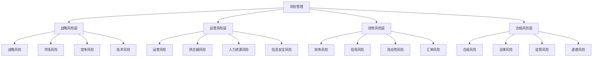
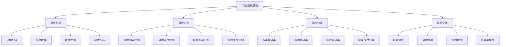

# 风险识别与评估

## ⚠️ 风险管理概述

### 基本定义
**风险管理**是指企业识别、评估、控制和应对各种风险，确保企业目标实现的管理活动。

### 核心特征
- **系统性**：系统管理各种风险
- **前瞻性**：前瞻性识别风险
- **动态性**：动态管理风险
- **综合性**：综合应对风险

## 📊 风险管理框架

### 1. 风险管理层次

#### 风险管理结构

#### 层次关系
- **战略风险层**：影响企业战略目标
- **运营风险层**：影响企业运营效率
- **财务风险层**：影响企业财务状况
- **合规风险层**：影响企业合规经营

### 2. 风险管理要素

#### 核心要素
- **风险识别**：识别各种风险
- **风险评估**：评估风险程度
- **风险控制**：控制风险影响
- **风险应对**：应对风险事件

#### 支撑要素
- **风险管理组织**：风险管理组织
- **风险管理制度**：风险管理制度
- **风险管理流程**：风险管理流程
- **风险管理文化**：风险管理文化

## 🔍 风险识别

### 1. 风险识别方法

#### 定性方法
- **专家判断法**：专家经验判断
- **德尔菲法**：专家预测法
- **头脑风暴法**：集体讨论法
- **情景分析法**：情景分析预测

#### 定量方法
- **统计分析**：统计分析
- **趋势分析**：趋势分析
- **回归分析**：回归分析
- **预测分析**：预测分析

### 2. 风险识别过程

#### 识别过程

#### 识别内容
- **风险因素**：导致风险的因素
- **风险事件**：可能发生的风险事件
- **风险影响**：风险可能造成的影响
- **风险关系**：风险之间的关系

### 3. 风险分类

#### 按风险类型分类
- **战略风险**：战略决策风险
- **运营风险**：运营活动风险
- **财务风险**：财务活动风险
- **合规风险**：合规经营风险

#### 按风险程度分类
- **高风险**：风险程度高
- **中风险**：风险程度中等
- **低风险**：风险程度低
- **极低风险**：风险程度极低

#### 按风险时间分类
- **短期风险**：短期风险
- **中期风险**：中期风险
- **长期风险**：长期风险
- **持续风险**：持续风险

## 📈 风险评估

### 1. 评估维度

#### 风险概率
- **发生概率**：风险发生概率
- **频率分析**：风险发生频率
- **历史数据**：历史发生数据
- **专家判断**：专家概率判断

#### 风险影响
- **财务影响**：财务损失影响
- **运营影响**：运营中断影响
- **声誉影响**：声誉损失影响
- **战略影响**：战略目标影响

#### 风险可控性
- **可控程度**：风险可控程度
- **控制措施**：风险控制措施
- **控制成本**：控制成本分析
- **控制效果**：控制效果评估

### 2. 评估方法

#### 定性评估
- **专家评估**：专家评估意见
- **德尔菲法**：专家预测法
- **情景分析**：情景分析评估
- **影响分析**：影响分析评估

#### 定量评估
- **概率分析**：概率统计分析
- **影响分析**：影响量化分析
- **敏感性分析**：敏感性分析
- **蒙特卡洛模拟**：蒙特卡洛模拟

### 3. 评估工具

#### 评估工具
- **风险矩阵**：风险概率影响矩阵
- **风险地图**：风险可视化地图
- **风险仪表板**：风险监控仪表板
- **风险模型**：风险量化模型

#### 评估指标
- **风险指标**：风险量化指标
- **预警指标**：风险预警指标
- **监控指标**：风险监控指标
- **绩效指标**：风险管理绩效指标

## 🎯 风险评估应用

### 1. 风险排序

#### 排序方法
- **风险等级**：按风险等级排序
- **风险指数**：按风险指数排序
- **风险优先级**：按风险优先级排序
- **风险重要性**：按风险重要性排序

#### 排序应用
- **资源分配**：资源分配决策
- **控制重点**：控制重点确定
- **应对策略**：应对策略制定
- **监控重点**：监控重点确定

### 2. 风险决策

#### 决策支持
- **风险接受**：风险接受决策
- **风险规避**：风险规避决策
- **风险转移**：风险转移决策
- **风险减轻**：风险减轻决策

#### 决策依据
- **风险程度**：风险程度评估
- **控制成本**：控制成本分析
- **控制效果**：控制效果评估
- **企业承受能力**：企业承受能力

## 📊 风险评估案例

### 1. 企业风险评估

#### 案例背景
某企业面临多种风险，需要进行风险评估。

#### 评估过程
**风险识别**：
- 战略风险：市场竞争加剧
- 运营风险：供应链中断
- 财务风险：资金链紧张
- 合规风险：法规变化

**风险评估**：
- 战略风险：概率中等，影响大
- 运营风险：概率低，影响中等
- 财务风险：概率高，影响大
- 合规风险：概率中等，影响中等

**风险排序**：
1. 财务风险（优先级最高）
2. 战略风险（优先级高）
3. 合规风险（优先级中等）
4. 运营风险（优先级低）

#### 评估结论
- 重点关注财务风险和战略风险
- 制定相应的风险控制措施
- 建立风险监控机制
- 定期评估风险变化

### 2. 项目风险评估

#### 案例背景
某项目面临多种风险，需要进行风险评估。

#### 评估过程
**风险识别**：
- 技术风险：技术实现困难
- 进度风险：项目延期风险
- 成本风险：成本超支风险
- 质量风险：质量不达标风险

**风险评估**：
- 技术风险：概率中等，影响大
- 进度风险：概率高，影响中等
- 成本风险：概率中等，影响大
- 质量风险：概率低，影响大

**风险排序**：
1. 技术风险（优先级最高）
2. 成本风险（优先级高）
3. 进度风险（优先级中等）
4. 质量风险（优先级低）

#### 评估结论
- 重点关注技术风险和成本风险
- 制定相应的风险控制措施
- 建立风险监控机制
- 定期评估风险变化

## 🔍 风险评估局限性

### 1. 主要局限性

#### 评估局限性
- **信息不完整**：信息收集不完整
- **评估主观性**：评估主观性影响
- **预测困难**：风险预测困难
- **变化快速**：风险变化快速

#### 应用局限性
- **决策滞后**：决策滞后于风险变化
- **实施困难**：实施过程困难
- **效果不确定**：效果不确定
- **成本较高**：评估成本较高

### 2. 改进方法

#### 评估方法改进
- **信息收集**：完善信息收集
- **评估方法**：改进评估方法
- **预测技术**：提高预测技术
- **动态评估**：加强动态评估

#### 应用方法改进
- **快速响应**：提高响应速度
- **灵活实施**：灵活实施策略
- **效果评估**：加强效果评估
- **成本控制**：控制评估成本

## 🎯 学习要点总结

### 核心概念
1. **风险管理**：识别、评估、控制、应对风险的过程
2. **风险识别**：识别各种风险的方法和过程
3. **风险评估**：评估风险程度的方法和工具
4. **风险分类**：按类型、程度、时间分类
5. **风险排序**：风险优先级排序
6. **风险决策**：基于评估的风险决策

### 关键理解
- 风险管理是企业发展的重要保障
- 风险识别需要全面、系统、动态
- 风险评估需要科学、客观、准确
- 风险决策需要综合考虑各种因素

### 实践应用
- 运用风险管理理论指导实践
- 使用识别方法识别风险
- 运用评估方法评估风险
- 基于评估结果进行决策

## 🔗 相关链接

- [[风险管理体系]] - 风险管理体系
- [[风险控制策略]] - 风险控制策略
- [[风险预警机制]] - 风险预警机制
- [[知识卡片-风险管理]] - 风险管理知识卡片

## 📚 延伸阅读

- [[企业文化]] - 企业文化理论
- [[企业创新]] - 企业创新理论
- [[可持续发展]] - 可持续发展理论
- [[战略管理]] - 战略管理理论

---
*更新时间：2024年*
*内容将根据学习反馈持续优化*
