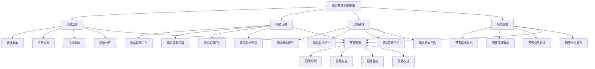

# 风险预警机制

## ⚠️ 风险预警机制概述

### 基本定义
**风险预警机制**是指企业通过建立系统性的风险监测、识别、评估和预警体系，及时发现潜在风险信号，提前采取预防措施，有效防范和控制风险的管理机制。

### 核心特征
- **预警性**：提前预警风险信号
- **系统性**：系统性的预警体系
- **实时性**：实时性的风险监测
- **准确性**：准确性的风险识别
- **及时性**：及时性的风险响应
- **有效性**：有效性的风险控制

## 🎯 风险预警机制框架

### 1. 预警体系

#### 风险预警机制框架

#### 预警要素
- **风险监测**：数据收集、信息监测、指标监控、趋势分析
- **风险识别**：风险信号识别、类型识别、来源识别、影响识别
- **风险评估**：风险概率评估、影响评估、等级评估、趋势评估
- **风险预警**：预警信号发出、等级确定、信息传递、响应启动
- **预警管理**：预警规划、实施、监控、改进

### 2. 预警层次

#### 预警层次框架
- **战略预警**：战略层面风险预警
- **运营预警**：运营层面风险预警
- **财务预警**：财务层面风险预警
- **合规预警**：合规层面风险预警

## 📊 风险监测

### 1. 数据收集

#### 收集要素
- **内部数据**：内部经营数据
- **外部数据**：外部环境数据
- **市场数据**：市场变化数据
- **行业数据**：行业发展数据

#### 收集方法
- **内部收集**：收集内部数据
- **外部收集**：收集外部数据
- **市场收集**：收集市场数据
- **行业收集**：收集行业数据

### 2. 信息监测

#### 监测要素
- **信息源识别**：信息源识别管理
- **信息收集**：信息收集管理
- **信息处理**：信息处理管理
- **信息分析**：信息分析管理

#### 监测方法
- **源识别**：识别信息源
- **信息收集**：收集信息
- **信息处理**：处理信息
- **信息分析**：分析信息

### 3. 指标监控

#### 监控要素
- **关键指标**：关键风险指标
- **预警指标**：预警风险指标
- **监控频率**：监控频率设定
- **监控方法**：监控方法选择

#### 监控方法
- **关键指标**：监控关键指标
- **预警指标**：监控预警指标
- **频率设定**：设定监控频率
- **方法选择**：选择监控方法

### 4. 趋势分析

#### 分析要素
- **趋势识别**：趋势识别分析
- **趋势预测**：趋势预测分析
- **趋势影响**：趋势影响分析
- **趋势应对**：趋势应对分析

#### 分析方法
- **趋势识别**：识别趋势变化
- **趋势预测**：预测趋势发展
- **趋势影响**：分析趋势影响
- **趋势应对**：制定趋势应对

## 🔍 风险识别

### 1. 风险信号识别

#### 识别要素
- **信号类型**：风险信号类型
- **信号特征**：风险信号特征
- **信号强度**：风险信号强度
- **信号频率**：风险信号频率

#### 识别方法
- **类型识别**：识别信号类型
- **特征识别**：识别信号特征
- **强度识别**：识别信号强度
- **频率识别**：识别信号频率

### 2. 风险类型识别

#### 识别要素
- **市场风险**：市场风险识别
- **信用风险**：信用风险识别
- **操作风险**：操作风险识别
- **流动性风险**：流动性风险识别

#### 识别方法
- **市场风险**：识别市场风险
- **信用风险**：识别信用风险
- **操作风险**：识别操作风险
- **流动性风险**：识别流动性风险

### 3. 风险来源识别

#### 识别要素
- **内部来源**：内部风险来源
- **外部来源**：外部风险来源
- **系统来源**：系统风险来源
- **人为来源**：人为风险来源

#### 识别方法
- **内部来源**：识别内部来源
- **外部来源**：识别外部来源
- **系统来源**：识别系统来源
- **人为来源**：识别人为来源

### 4. 风险影响识别

#### 识别要素
- **财务影响**：财务影响识别
- **运营影响**：运营影响识别
- **声誉影响**：声誉影响识别
- **战略影响**：战略影响识别

#### 识别方法
- **财务影响**：识别财务影响
- **运营影响**：识别运营影响
- **声誉影响**：识别声誉影响
- **战略影响**：识别战略影响

## 📈 风险评估

### 1. 风险概率评估

#### 评估要素
- **概率计算**：风险概率计算
- **概率分析**：风险概率分析
- **概率预测**：风险概率预测
- **概率验证**：风险概率验证

#### 评估方法
- **概率计算**：计算风险概率
- **概率分析**：分析风险概率
- **概率预测**：预测风险概率
- **概率验证**：验证风险概率

### 2. 风险影响评估

#### 评估要素
- **影响程度**：风险影响程度
- **影响范围**：风险影响范围
- **影响时间**：风险影响时间
- **影响成本**：风险影响成本

#### 评估方法
- **影响程度**：评估影响程度
- **影响范围**：评估影响范围
- **影响时间**：评估影响时间
- **影响成本**：评估影响成本

### 3. 风险等级评估

#### 评估要素
- **风险等级**：风险等级划分
- **等级标准**：等级标准设定
- **等级评估**：等级评估方法
- **等级调整**：等级调整机制

#### 评估方法
- **风险等级**：划分风险等级
- **等级标准**：设定等级标准
- **等级评估**：评估风险等级
- **等级调整**：调整风险等级

### 4. 风险趋势评估

#### 评估要素
- **趋势方向**：风险趋势方向
- **趋势强度**：风险趋势强度
- **趋势速度**：风险趋势速度
- **趋势持续性**：风险趋势持续性

#### 评估方法
- **趋势方向**：评估趋势方向
- **趋势强度**：评估趋势强度
- **趋势速度**：评估趋势速度
- **趋势持续性**：评估趋势持续性

## 🚨 风险预警

### 1. 预警信号发出

#### 发出要素
- **信号触发**：预警信号触发
- **信号生成**：预警信号生成
- **信号验证**：预警信号验证
- **信号发出**：预警信号发出

#### 发出方法
- **信号触发**：触发预警信号
- **信号生成**：生成预警信号
- **信号验证**：验证预警信号
- **信号发出**：发出预警信号

### 2. 预警等级确定

#### 确定要素
- **等级标准**：预警等级标准
- **等级划分**：预警等级划分
- **等级确定**：预警等级确定
- **等级调整**：预警等级调整

#### 确定方法
- **等级标准**：设定等级标准
- **等级划分**：划分预警等级
- **等级确定**：确定预警等级
- **等级调整**：调整预警等级

### 3. 预警信息传递

#### 传递要素
- **传递对象**：预警信息传递对象
- **传递方式**：预警信息传递方式
- **传递内容**：预警信息传递内容
- **传递时效**：预警信息传递时效

#### 传递方法
- **传递对象**：确定传递对象
- **传递方式**：选择传递方式
- **传递内容**：确定传递内容
- **传递时效**：设定传递时效

### 4. 预警响应启动

#### 启动要素
- **响应机制**：预警响应机制
- **响应流程**：预警响应流程
- **响应措施**：预警响应措施
- **响应效果**：预警响应效果

#### 启动方法
- **响应机制**：建立响应机制
- **响应流程**：设计响应流程
- **响应措施**：制定响应措施
- **响应效果**：评估响应效果

## 🎯 预警层次管理

### 1. 战略预警

#### 预警要素
- **战略风险**：战略风险预警
- **市场风险**：市场风险预警
- **竞争风险**：竞争风险预警
- **政策风险**：政策风险预警

#### 预警管理
- **战略风险**：管理战略风险预警
- **市场风险**：管理市场风险预警
- **竞争风险**：管理竞争风险预警
- **政策风险**：管理政策风险预警

### 2. 运营预警

#### 预警要素
- **生产风险**：生产风险预警
- **质量风险**：质量风险预警
- **供应链风险**：供应链风险预警
- **技术风险**：技术风险预警

#### 预警管理
- **生产风险**：管理生产风险预警
- **质量风险**：管理质量风险预警
- **供应链风险**：管理供应链风险预警
- **技术风险**：管理技术风险预警

### 3. 财务预警

#### 预警要素
- **流动性风险**：流动性风险预警
- **信用风险**：信用风险预警
- **汇率风险**：汇率风险预警
- **利率风险**：利率风险预警

#### 预警管理
- **流动性风险**：管理流动性风险预警
- **信用风险**：管理信用风险预警
- **汇率风险**：管理汇率风险预警
- **利率风险**：管理利率风险预警

### 4. 合规预警

#### 预警要素
- **法律风险**：法律风险预警
- **监管风险**：监管风险预警
- **合规风险**：合规风险预警
- **道德风险**：道德风险预警

#### 预警管理
- **法律风险**：管理法律风险预警
- **监管风险**：管理监管风险预警
- **合规风险**：管理合规风险预警
- **道德风险**：管理道德风险预警

## 🔍 风险预警方法

### 1. 预警方法

#### 方法类型
- **定量预警**：定量预警方法
- **定性预警**：定性预警方法
- **混合预警**：混合预警方法
- **智能预警**：智能预警方法

#### 方法应用
- **定量应用**：应用定量预警
- **定性应用**：应用定性预警
- **混合应用**：应用混合预警
- **智能应用**：应用智能预警

### 2. 预警工具

#### 工具类型
- **监测工具**：风险监测工具
- **分析工具**：风险分析工具
- **预警工具**：风险预警工具
- **响应工具**：风险响应工具

#### 工具应用
- **监测应用**：应用监测工具
- **分析应用**：应用分析工具
- **预警应用**：应用预警工具
- **响应应用**：应用响应工具

### 3. 预警技术

#### 技术类型
- **信息技术**：信息技术应用
- **人工智能**：人工智能技术
- **大数据**：大数据技术
- **机器学习**：机器学习技术

#### 技术应用
- **信息应用**：应用信息技术
- **智能应用**：应用人工智能
- **数据应用**：应用大数据技术
- **学习应用**：应用机器学习

### 4. 预警系统

#### 系统类型
- **监测系统**：风险监测系统
- **分析系统**：风险分析系统
- **预警系统**：风险预警系统
- **响应系统**：风险响应系统

#### 系统应用
- **监测应用**：应用监测系统
- **分析应用**：应用分析系统
- **预警应用**：应用预警系统
- **响应应用**：应用响应系统

## 📊 风险预警机制案例

### 案例1：某银行风险预警机制

#### 案例背景
某银行建立风险预警机制，有效防范和控制各类金融风险。

#### 预警过程
- **风险监测**：实时监测市场数据、客户数据
- **风险识别**：识别信用风险、市场风险、操作风险
- **风险评估**：评估风险概率、影响程度、风险等级
- **风险预警**：发出预警信号、确定预警等级、启动响应

#### 预警结果
- **风险识别**：风险识别准确率提升30%
- **预警时效**：预警时效缩短50%
- **风险控制**：风险损失减少40%
- **系统稳定**：系统稳定性显著提升

#### 成功因素
- **系统建设**：完善的风险预警系统
- **数据支撑**：充足的数据支撑
- **人员培训**：专业的人员培训
- **持续改进**：持续的机制改进

### 案例2：某制造企业风险预警机制

#### 案例背景
某制造企业建立风险预警机制，防范生产运营风险。

#### 预警过程
- **风险监测**：监测生产数据、质量数据、供应链数据
- **风险识别**：识别生产风险、质量风险、供应链风险
- **风险评估**：评估风险概率、影响程度、风险等级
- **风险预警**：发出预警信号、确定预警等级、启动响应

#### 预警结果
- **生产稳定**：生产稳定性提升25%
- **质量改善**：产品质量改善20%
- **成本控制**：运营成本降低15%
- **风险减少**：风险事件减少60%

#### 成功因素
- **技术支撑**：先进的技术支撑
- **流程优化**：优化的预警流程
- **人员配置**：合理的人员配置
- **效果评估**：有效的效果评估

## 🎯 风险预警机制最佳实践

### 1. 机制原则

#### 基本原则
- **预警性原则**：提前预警风险
- **系统性原则**：系统建立预警机制
- **实时性原则**：实时监测风险
- **准确性原则**：准确识别风险

#### 应用原则
- **目标导向**：以目标为导向
- **风险导向**：以风险为导向
- **数据导向**：以数据为导向
- **效果导向**：以效果为导向

### 2. 机制方法

#### 机制方法
- **系统预警**：系统建立预警机制
- **实时预警**：实时进行风险预警
- **准确预警**：准确进行风险预警
- **有效预警**：有效进行风险预警

#### 方法应用
- **系统应用**：应用系统预警方法
- **实时应用**：应用实时预警方法
- **准确应用**：应用准确预警方法
- **有效应用**：应用有效预警方法

### 3. 实施要点

#### 实施要点
- **系统建设**：建设预警系统
- **数据支撑**：提供数据支撑
- **人员培训**：培训预警人员
- **持续改进**：持续改进机制

#### 注意事项
- **避免滞后**：避免预警滞后
- **避免误报**：避免误报风险
- **避免漏报**：避免漏报风险
- **避免过度**：避免过度预警

## 📚 学习要点总结

### 核心概念
1. **风险预警机制**：风险预警机制的管理活动
2. **风险监测**：数据收集、信息监测、指标监控、趋势分析
3. **风险识别**：风险信号识别、类型识别、来源识别、影响识别
4. **风险评估**：风险概率评估、影响评估、等级评估、趋势评估
5. **风险预警**：预警信号发出、等级确定、信息传递、响应启动
6. **预警层次**：战略预警、运营预警、财务预警、合规预警
7. **预警方法**：定量预警、定性预警、混合预警、智能预警
8. **预警工具**：监测工具、分析工具、预警工具、响应工具

### 关键理解
- 风险预警机制是风险管理的重要组成部分
- 风险预警机制具有预警性和系统性特征
- 风险预警机制需要实时性和准确性
- 风险预警机制需要及时性和有效性
- 风险预警机制需要监测性和识别性
- 风险预警机制需要评估性和预警性
- 风险预警机制需要工具性和技术性
- 风险预警机制需要应用性和实用性

### 实践应用
- 运用风险预警机制提前识别风险
- 运用风险预警机制有效控制风险
- 运用风险预警机制减少风险损失
- 运用风险预警机制提升风险管理水平
- 运用风险预警机制增强风险防范能力
- 运用风险预警机制优化风险管控
- 运用风险预警机制实现风险管理目标
- 运用风险预警机制促进企业稳定发展

## 🔗 相关链接

- [[风险识别与评估]] - 风险识别与评估
- [[风险管理体系]] - 风险管理体系
- [[风险控制策略]] - 风险控制策略
- [[工具实操指南-风险管理]] - 工具实操指南-风险管理

## 📚 延伸阅读

- [[风险管理学]] - 风险管理学理论
- [[预警管理学]] - 预警管理学理论
- [[系统管理学]] - 系统管理学理论
- [[数据分析学]] - 数据分析学理论

---
*更新时间：2024年*
*内容将根据学习反馈持续优化*
