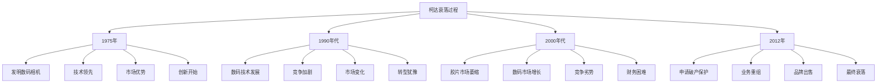

# 柯达公司衰落

## 📸 柯达公司概述

### 公司简介
**柯达公司**（Eastman Kodak Company）是一家美国跨国公司，成立于1888年，总部位于纽约州罗切斯特。公司以摄影胶片和相机业务闻名，曾是全球最大的胶片制造商。

### 发展历程
- **1888-1970年**：胶片时代，快速发展
- **1970-1990年**：巅峰时期，全球领先
- **1990-2000年**：数码时代，开始衰落
- **2000-2012年**：破产重组，最终衰落

## 📉 衰落过程分析

### 1. 衰落时间线

#### 关键节点

#### 衰落阶段
- **1975-1990年**：技术领先但未商业化
- **1990-2000年**：市场变化但转型缓慢
- **2000-2010年**：竞争劣势但应对不力
- **2010-2012年**：财务危机最终破产

### 2. 衰落原因

#### 技术原因
- **技术保守**：过度依赖胶片技术
- **创新不足**：缺乏持续创新
- **技术滞后**：数码技术发展滞后
- **技术转化**：技术转化能力不足

#### 市场原因
- **市场变化**：市场需求快速变化
- **竞争加剧**：数码相机竞争加剧
- **用户习惯**：用户习惯改变
- **市场定位**：市场定位失误

#### 管理原因
- **战略失误**：战略决策失误
- **转型缓慢**：业务转型缓慢
- **组织僵化**：组织结构僵化
- **文化保守**：企业文化保守

## 🔍 失败案例分析

### 1. 技术创新失败

#### 技术发明
- **1975年**：发明第一台数码相机
- **技术领先**：在数码技术方面领先
- **专利优势**：拥有大量数码技术专利
- **技术储备**：技术储备丰富

#### 技术转化失败
- **商业化失败**：未能及时商业化
- **市场推广**：市场推广不力
- **技术保护**：过度保护现有技术
- **创新阻碍**：创新被内部阻碍

### 2. 市场转型失败

#### 市场变化
- **胶片市场**：胶片市场快速萎缩
- **数码市场**：数码市场快速增长
- **用户需求**：用户需求根本改变
- **竞争格局**：竞争格局完全改变

#### 转型失败
- **转型犹豫**：转型决策犹豫不决
- **转型缓慢**：转型过程过于缓慢
- **转型不彻底**：转型不够彻底
- **转型时机**：错过最佳转型时机

### 3. 管理决策失败

#### 战略决策
- **战略保守**：战略过于保守
- **决策失误**：关键决策失误
- **资源分配**：资源分配不当
- **优先级错误**：优先级设置错误

#### 组织管理
- **组织僵化**：组织结构僵化
- **文化保守**：企业文化保守
- **激励机制**：激励机制失效
- **人才流失**：优秀人才流失

## 📊 对比分析

### 1. 与成功企业对比

#### 苹果公司对比
| 方面 | 柯达公司 | 苹果公司 |
|------|----------|----------|
| 技术创新 | 发明数码相机但未商业化 | 持续产品创新 |
| 市场转型 | 转型缓慢犹豫 | 快速市场转型 |
| 用户导向 | 技术导向 | 用户需求导向 |
| 企业文化 | 保守文化 | 创新文化 |

#### 索尼公司对比
| 方面 | 柯达公司 | 索尼公司 |
|------|----------|----------|
| 技术发展 | 技术保护 | 技术开放 |
| 市场策略 | 市场保守 | 市场激进 |
| 产品创新 | 创新不足 | 持续创新 |
| 竞争策略 | 防御策略 | 进攻策略 |

### 2. 行业对比分析

#### 胶片行业
- **行业衰落**：整个胶片行业衰落
- **企业应对**：不同企业应对不同
- **转型成功**：部分企业转型成功
- **转型失败**：部分企业转型失败

#### 数码行业
- **行业兴起**：数码行业快速兴起
- **企业进入**：新企业大量进入
- **竞争激烈**：竞争异常激烈
- **技术发展**：技术快速发展

## 🎯 失败教训

### 1. 技术创新教训

#### 技术管理
- **技术保护**：不能过度保护现有技术
- **技术转化**：及时将技术转化为产品
- **技术创新**：持续技术创新
- **技术开放**：适度技术开放

#### 创新管理
- **创新文化**：营造创新文化
- **创新激励**：建立创新激励机制
- **创新投入**：持续创新投入
- **创新风险**：承担创新风险

### 2. 市场转型教训

#### 转型策略
- **转型时机**：把握转型时机
- **转型速度**：快速转型
- **转型彻底**：彻底转型
- **转型资源**：投入足够资源

#### 市场策略
- **市场敏感**：保持市场敏感度
- **用户需求**：深度理解用户需求
- **竞争分析**：持续竞争分析
- **市场定位**：准确市场定位

### 3. 管理决策教训

#### 战略管理
- **战略前瞻**：战略要有前瞻性
- **战略灵活**：战略要有灵活性
- **战略执行**：有效执行战略
- **战略调整**：及时调整战略

#### 组织管理
- **组织灵活**：保持组织灵活性
- **文化创新**：营造创新文化
- **人才管理**：有效管理人才
- **激励机制**：建立有效激励机制

## 🔄 复兴尝试

### 1. 破产重组

#### 重组过程
- **2012年**：申请破产保护
- **业务重组**：业务重组
- **债务重组**：债务重组
- **资产出售**：出售非核心资产

#### 重组结果
- **业务聚焦**：聚焦核心业务
- **成本控制**：严格控制成本
- **市场重新定位**：重新市场定位
- **品牌价值**：保持品牌价值

### 2. 新业务发展

#### 新业务方向
- **商业印刷**：商业印刷业务
- **包装印刷**：包装印刷业务
- **功能材料**：功能材料业务
- **数字技术**：数字技术服务

#### 发展策略
- **技术转型**：向新技术转型
- **市场拓展**：拓展新市场
- **合作发展**：寻求合作发展
- **品牌重塑**：重塑品牌形象

## 📚 学习要点总结

### 核心教训
1. **技术创新**：技术创新需要及时商业化
2. **市场转型**：市场转型需要快速彻底
3. **战略决策**：战略决策要有前瞻性
4. **组织管理**：组织管理要保持灵活性
5. **企业文化**：企业文化要鼓励创新
6. **竞争策略**：竞争策略要积极主动

### 关键理解
- 技术创新不等于商业成功
- 市场变化需要快速响应
- 战略决策影响企业命运
- 组织文化决定企业行为

### 实践启示
- 建立技术创新管理体系
- 保持市场敏感度和快速响应能力
- 制定前瞻性战略并有效执行
- 营造创新文化氛围

## 🔗 相关链接

- [[诺基亚转型失败]] - 诺基亚转型失败案例
- [[乐视生态危机]] - 乐视生态危机案例
- [[共享单车泡沫]] - 共享单车泡沫案例
- [[失败案例反思]] - 失败案例反思

## 📚 延伸阅读

- [[企业创新]] - 企业创新理论
- [[战略管理]] - 战略管理理论
- [[组织管理]] - 组织管理理论
- [[风险管理]] - 风险管理理论

---
*更新时间：2024年*
*内容将根据学习反馈持续优化*
