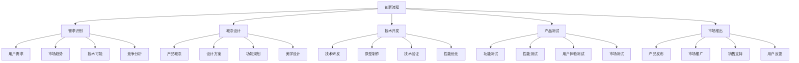

# 苹果公司创新管理

## 🍎 苹果公司概述

### 公司简介
**苹果公司**（Apple Inc.）是一家美国跨国科技公司，成立于1976年，总部位于加利福尼亚州库比蒂诺。公司以设计、开发和销售消费电子产品、计算机软件和在线服务而闻名。

### 发展历程
- **1976-1985年**：公司成立，Apple II成功
- **1985-1997年**：乔布斯离开，公司陷入困境
- **1997-2011年**：乔布斯回归，重新崛起
- **2011年至今**：库克时代，持续创新

## 💡 创新管理特色

### 1. 创新理念

#### 设计驱动创新
- **简约设计**：简约而不简单的设计理念
- **用户体验**：以用户体验为中心
- **美学追求**：追求极致的美学体验
- **功能整合**：功能与美学的完美结合

#### 技术驱动创新
- **核心技术**：掌握核心技术
- **技术整合**：技术整合能力
- **技术前瞻**：技术前瞻性
- **技术突破**：技术突破能力

### 2. 创新组织

#### 创新团队
- **设计团队**：强大的设计团队
- **技术团队**：优秀的技术团队
- **产品团队**：专业的产品团队
- **营销团队**：创新的营销团队

#### 创新文化
- **创新氛围**：浓厚的创新氛围
- **创新激励**：有效的创新激励
- **创新容忍**：容忍创新失败
- **创新学习**：持续学习创新

## 📱 创新产品案例

### 1. iPhone创新

#### 产品创新
- **触摸屏技术**：革命性触摸屏技术
- **iOS系统**：独特的操作系统
- **App Store**：创新的应用商店
- **设计美学**：极致的设计美学

#### 市场影响
- **市场颠覆**：颠覆手机市场
- **行业变革**：推动行业变革
- **用户改变**：改变用户习惯
- **竞争格局**：改变竞争格局

### 2. iPad创新

#### 产品创新
- **平板电脑**：开创平板电脑市场
- **触摸体验**：优秀的触摸体验
- **内容消费**：内容消费平台
- **移动办公**：移动办公工具

#### 市场表现
- **市场成功**：市场成功表现
- **用户接受**：用户高度接受
- **应用生态**：丰富的应用生态
- **持续创新**：持续产品创新

### 3. MacBook创新

#### 产品创新
- **轻薄设计**：轻薄便携设计
- **性能提升**：持续性能提升
- **电池续航**：优秀电池续航
- **生态系统**：完整生态系统

#### 竞争优势
- **设计优势**：设计竞争优势
- **技术优势**：技术竞争优势
- **生态优势**：生态系统优势
- **品牌优势**：品牌竞争优势

## 🎯 创新管理策略

### 1. 创新战略

#### 战略重点
- **产品创新**：持续产品创新
- **技术创新**：核心技术突破
- **服务创新**：服务模式创新
- **生态创新**：生态系统创新

#### 战略实施
- **资源投入**：大量资源投入
- **人才引进**：优秀人才引进
- **技术研发**：持续技术研发
- **市场推广**：创新市场推广

### 2. 创新流程

#### 创新过程

#### 流程特点
- **用户导向**：以用户需求为导向
- **设计优先**：设计优先原则
- **技术支撑**：技术强力支撑
- **市场验证**：市场充分验证

### 3. 创新管理

#### 管理机制
- **决策机制**：高效的决策机制
- **协调机制**：有效的协调机制
- **激励机制**：创新的激励机制
- **控制机制**：严格的质量控制

#### 管理特点
- **扁平化**：扁平化管理
- **项目化**：项目化管理
- **团队化**：团队化管理
- **文化化**：文化化管理

## 📊 创新绩效分析

### 1. 财务绩效

#### 收入增长
- **收入增长**：持续收入增长
- **利润率**：高利润率
- **市值增长**：市值大幅增长
- **现金流**：强劲现金流

#### 市场表现
- **市场份额**：重要市场份额
- **品牌价值**：高品牌价值
- **用户忠诚度**：高用户忠诚度
- **竞争优势**：持续竞争优势

### 2. 创新绩效

#### 创新成果
- **专利数量**：大量专利申请
- **产品创新**：持续产品创新
- **技术突破**：重要技术突破
- **市场影响**：重大市场影响

#### 创新影响
- **行业影响**：推动行业发展
- **社会影响**：改变社会生活方式
- **技术影响**：推动技术进步
- **文化影响**：影响文化发展

## 🔍 创新管理启示

### 1. 成功因素

#### 关键因素
- **领导力**：强大的领导力
- **创新文化**：浓厚的创新文化
- **技术能力**：强大的技术能力
- **设计能力**：卓越的设计能力

#### 成功要素
- **用户导向**：以用户为中心
- **设计驱动**：设计驱动创新
- **技术支撑**：技术强力支撑
- **生态建设**：生态系统建设

### 2. 管理启示

#### 创新管理启示
- **创新战略**：制定清晰的创新战略
- **创新组织**：建立有效的创新组织
- **创新文化**：营造浓厚的创新文化
- **创新激励**：建立有效的创新激励

#### 实践启示
- **用户需求**：深度理解用户需求
- **设计优先**：坚持设计优先原则
- **技术突破**：持续技术突破
- **市场验证**：充分市场验证

## ⚠️ 挑战与风险

### 1. 主要挑战

#### 外部挑战
- **竞争加剧**：市场竞争加剧
- **技术变化**：技术快速变化
- **用户需求**：用户需求变化
- **监管环境**：监管环境变化

#### 内部挑战
- **创新压力**：持续创新压力
- **人才竞争**：人才竞争激烈
- **成本控制**：成本控制压力
- **质量要求**：质量要求提高

### 2. 风险应对

#### 风险识别
- **市场风险**：市场变化风险
- **技术风险**：技术落后风险
- **竞争风险**：竞争加剧风险
- **监管风险**：监管变化风险

#### 应对策略
- **持续创新**：持续产品创新
- **技术投入**：加大技术投入
- **市场拓展**：拓展新市场
- **合规管理**：加强合规管理

## 🎯 学习要点总结

### 核心启示
1. **创新驱动**：创新是企业发展的核心驱动力
2. **用户导向**：以用户需求为导向的创新
3. **设计优先**：设计驱动创新的重要性
4. **技术支撑**：技术能力是创新的基础
5. **生态建设**：生态系统建设的重要性
6. **文化营造**：创新文化的重要作用

### 关键理解
- 创新管理需要系统性和战略性
- 用户需求是创新的根本出发点
- 设计和技术是创新的两大支柱
- 创新文化是创新的重要保障

### 实践应用
- 运用创新管理理论指导实践
- 建立有效的创新管理体系
- 营造浓厚的创新文化氛围
- 持续投入创新资源

## 🔗 相关链接

- [[谷歌企业文化]] - 谷歌企业文化案例
- [[亚马逊客户导向]] - 亚马逊客户导向案例
- [[丰田生产方式]] - 丰田生产方式案例
- [[案例分析方法]] - 案例分析方法

## 📚 延伸阅读

- [[企业创新]] - 企业创新理论
- [[企业文化]] - 企业文化理论
- [[战略管理]] - 战略管理理论
- [[组织管理]] - 组织管理理论

---
*更新时间：2024年*
*内容将根据学习反馈持续优化*
