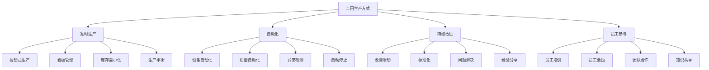

# 制造业管理案例

## 🏭 制造业概述

### 行业特点
**制造业**是指通过物理或化学变化，将原材料转化为产品的行业。制造业是国民经济的基础产业，具有技术密集、资本密集、劳动密集的特点。

### 管理挑战
- **成本控制**：成本控制压力
- **质量提升**：质量要求提高
- **效率优化**：效率优化需求
- **技术创新**：技术创新要求

## 📊 制造业管理案例

### 1. 丰田生产方式

#### 案例背景
**丰田汽车公司**是日本最大的汽车制造商，以其独特的生产方式闻名于世。丰田生产方式（TPS）被认为是制造业管理的典范。

#### 核心理念
- **精益生产**：消除浪费，追求效率
- **持续改进**：持续改进生产过程
- **员工参与**：员工积极参与改进
- **客户导向**：以客户需求为导向

#### 管理方法

#### 管理效果
- **效率提升**：生产效率大幅提升
- **质量改善**：产品质量显著改善
- **成本降低**：生产成本有效降低
- **员工满意**：员工满意度提高

### 2. 通用电气六西格玛

#### 案例背景
**通用电气公司**（GE）是美国最大的工业公司之一，在杰克·韦尔奇领导下，成功实施了六西格玛质量管理方法。

#### 实施过程
- **1995年**：开始实施六西格玛
- **全员培训**：全员六西格玛培训
- **项目推进**：六西格玛项目推进
- **文化变革**：质量管理文化变革

#### 管理方法
- **DMAIC方法**：定义、测量、分析、改进、控制
- **统计工具**：统计质量控制工具
- **项目管理**：六西格玛项目管理
- **绩效评估**：六西格玛绩效评估

#### 管理效果
- **质量提升**：产品质量显著提升
- **成本节约**：成本节约数十亿美元
- **效率改善**：运营效率大幅改善
- **文化变革**：质量管理文化变革

### 3. 海尔人单合一

#### 案例背景
**海尔集团**是中国最大的家电制造商之一，在张瑞敏领导下，创新实施了"人单合一"管理模式。

#### 核心理念
- **人单合一**：员工与用户需求合一
- **自主经营**：员工自主经营
- **用户导向**：以用户需求为导向
- **平台化**：平台化组织架构

#### 管理方法
- **小微组织**：建立小微组织
- **自主经营**：员工自主经营
- **用户交互**：与用户直接交互
- **价值分享**：价值创造与分享

#### 管理效果
- **创新活力**：激发员工创新活力
- **市场响应**：快速响应市场需求
- **效率提升**：运营效率显著提升
- **文化变革**：企业文化根本变革

## 🔍 案例分析

### 1. 成功因素分析

#### 共同成功因素
- **领导力**：强大的领导力
- **文化变革**：企业文化变革
- **员工参与**：员工积极参与
- **持续改进**：持续改进机制

#### 差异化因素
- **丰田**：精益生产、持续改进
- **通用电气**：六西格玛、质量管理
- **海尔**：人单合一、平台化

### 2. 管理方法对比

#### 管理方法对比
| 企业 | 管理方法 | 核心理念 | 主要特点 |
|------|----------|----------|----------|
| 丰田 | 丰田生产方式 | 精益生产 | 消除浪费、持续改进 |
| 通用电气 | 六西格玛 | 质量管理 | 统计控制、项目管理 |
| 海尔 | 人单合一 | 用户导向 | 自主经营、平台化 |

#### 适用条件
- **丰田方式**：适用于制造业、追求效率
- **六西格玛**：适用于质量要求高的行业
- **人单合一**：适用于创新要求高的行业

### 3. 实施效果分析

#### 财务效果
- **成本降低**：生产成本有效降低
- **质量提升**：产品质量显著提升
- **效率改善**：运营效率大幅改善
- **收入增长**：收入持续增长

#### 非财务效果
- **员工满意**：员工满意度提高
- **客户满意**：客户满意度提升
- **创新能力**：创新能力增强
- **竞争优势**：竞争优势明显

## 📈 制造业发展趋势

### 1. 技术发展趋势

#### 智能制造
- **工业4.0**：智能制造发展
- **物联网**：物联网技术应用
- **大数据**：大数据分析应用
- **人工智能**：人工智能技术应用

#### 绿色制造
- **环保要求**：环保要求提高
- **资源节约**：资源节约利用
- **清洁生产**：清洁生产技术
- **循环经济**：循环经济发展

### 2. 管理发展趋势

#### 数字化管理
- **数字化工厂**：数字化工厂建设
- **智能制造**：智能制造系统
- **数据驱动**：数据驱动决策
- **平台化管理**：平台化管理模式

#### 可持续发展
- **绿色管理**：绿色管理体系
- **社会责任**：社会责任管理
- **可持续发展**：可持续发展战略
- **ESG管理**：ESG管理体系

## 🎯 管理启示

### 1. 成功启示

#### 管理启示
- **文化变革**：企业文化变革的重要性
- **员工参与**：员工积极参与的重要性
- **持续改进**：持续改进机制的重要性
- **用户导向**：以用户为导向的重要性

#### 实践启示
- **因地制宜**：根据企业实际情况选择管理方法
- **循序渐进**：管理变革要循序渐进
- **全员参与**：全员参与管理变革
- **持续学习**：持续学习先进管理经验

### 2. 挑战应对

#### 主要挑战
- **技术变革**：技术快速变革
- **市场变化**：市场需求变化
- **竞争加剧**：市场竞争加剧
- **成本压力**：成本控制压力

#### 应对策略
- **技术创新**：持续技术创新
- **市场适应**：快速适应市场变化
- **竞争策略**：制定有效竞争策略
- **成本控制**：有效控制成本

## 📚 学习要点总结

### 核心启示
1. **管理创新**：管理创新是企业发展的重要驱动力
2. **文化变革**：企业文化变革是管理成功的关键
3. **员工参与**：员工积极参与是管理成功的基础
4. **持续改进**：持续改进是管理成功的重要机制
5. **用户导向**：以用户为导向是管理成功的方向
6. **因地制宜**：根据实际情况选择管理方法

### 关键理解
- 制造业管理需要系统性和创新性
- 企业文化是管理成功的重要保障
- 员工参与是管理成功的关键因素
- 持续改进是管理成功的重要机制

### 实践应用
- 运用先进管理方法指导实践
- 建立有效的管理体系
- 营造良好的企业文化
- 持续改进管理方法

## 🔗 相关链接

- [[服务业管理案例]] - 服务业管理案例
- [[科技业管理案例]] - 科技业管理案例
- [[金融业管理案例]] - 金融业管理案例
- [[行业案例分析框架]] - 行业案例分析框架

## 📚 延伸阅读

- [[运营管理]] - 运营管理理论
- [[质量管理]] - 质量管理理论
- [[生产管理]] - 生产管理理论
- [[供应链管理]] - 供应链管理理论

---
*更新时间：2024年*
*内容将根据学习反馈持续优化*
