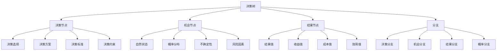
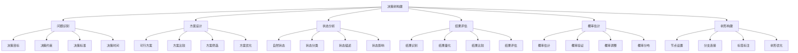
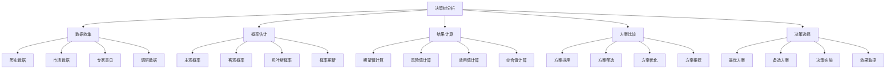

# 决策树分析

## 🌳 决策树概述

### 基本定义
**决策树分析**是一种决策支持工具，通过构建树状结构，系统分析决策问题，帮助决策者选择最优方案。

### 核心特征
- **系统性**：系统分析决策问题
- **可视化**：直观展示决策过程
- **结构化**：结构化决策分析
- **量化性**：量化决策结果

## 📊 决策树结构

### 1. 决策树构成

#### 决策树要素

#### 节点类型
- **决策节点**：决策者可以控制的节点
- **机会节点**：自然状态不确定的节点
- **结果节点**：决策结果的终端节点
- **分支**：连接各节点的路径

### 2. 决策树构建

#### 构建步骤

#### 构建原则
- **完整性**：包含所有可能情况
- **互斥性**：各分支互斥
- **穷尽性**：穷尽所有可能
- **层次性**：层次结构清晰

## 🔍 决策树分析

### 1. 分析方法

#### 期望值分析
- **期望收益**：计算期望收益
- **期望成本**：计算期望成本
- **期望效用**：计算期望效用
- **期望值比较**：比较期望值

#### 风险分析
- **风险识别**：识别决策风险
- **风险评估**：评估风险程度
- **风险偏好**：考虑风险偏好
- **风险承受**：评估风险承受能力

#### 敏感性分析
- **参数变化**：分析参数变化影响
- **敏感性测试**：敏感性测试
- **临界点分析**：临界点分析
- **稳定性分析**：稳定性分析

### 2. 分析步骤

#### 分析过程

#### 分析技巧
- **数据验证**：验证数据准确性
- **概率校准**：校准概率估计
- **结果检验**：检验结果合理性
- **决策验证**：验证决策正确性

## 📈 决策树应用

### 1. 投资决策

#### 投资分析
- **项目投资**：项目投资决策
- **证券投资**：证券投资决策
- **实物投资**：实物投资决策
- **风险投资**：风险投资决策

#### 投资案例
**案例背景**：某公司考虑投资新项目
**决策方案**：
- 方案A：投资1000万，成功概率60%，收益2000万
- 方案B：投资500万，成功概率80%，收益800万
- 方案C：不投资，收益0

**决策树分析**：
- 方案A期望收益：2000×0.6-1000×0.4=800万
- 方案B期望收益：800×0.8-500×0.2=540万
- 方案C期望收益：0

**决策结果**：选择方案A

### 2. 生产决策

#### 生产分析
- **产能决策**：产能扩张决策
- **产品决策**：产品开发决策
- **工艺决策**：工艺选择决策
- **质量决策**：质量控制决策

#### 生产案例
**案例背景**：某制造企业考虑生产线升级
**决策方案**：
- 方案A：升级现有生产线，投资200万，成功概率70%，年收益100万
- 方案B：新建生产线，投资500万，成功概率50%，年收益200万
- 方案C：维持现状，年收益50万

**决策树分析**：
- 方案A期望年收益：100×0.7-200×0.3=10万
- 方案B期望年收益：200×0.5-500×0.5=-150万
- 方案C期望年收益：50万

**决策结果**：选择方案C

### 3. 营销决策

#### 营销分析
- **市场进入**：市场进入决策
- **产品定价**：产品定价决策
- **渠道选择**：渠道选择决策
- **促销策略**：促销策略决策

#### 营销案例
**案例背景**：某公司考虑进入新市场
**决策方案**：
- 方案A：直接进入，投资300万，成功概率40%，年收益500万
- 方案B：合作进入，投资100万，成功概率60%，年收益200万
- 方案C：暂不进入，收益0

**决策树分析**：
- 方案A期望年收益：500×0.4-300×0.6=20万
- 方案B期望年收益：200×0.6-100×0.4=80万
- 方案C期望年收益：0

**决策结果**：选择方案B

## 🎯 决策树工具

### 1. 分析工具

#### 软件工具
- **Excel**：Excel决策树分析
- **TreePlan**：TreePlan决策树软件
- **PrecisionTree**：PrecisionTree软件
- **DecisionTools**：DecisionTools套件

#### 手工工具
- **决策树图**：手工绘制决策树
- **计算表格**：手工计算表格
- **概率表**：概率估计表
- **结果表**：结果计算表

### 2. 分析技巧

#### 分析技巧
- **概率估计**：准确估计概率
- **结果量化**：量化决策结果
- **敏感性分析**：敏感性分析
- **风险分析**：风险分析

#### 注意事项
- **数据质量**：确保数据质量
- **概率校准**：校准概率估计
- **结果验证**：验证结果合理性
- **决策实施**：有效实施决策

## 🔍 决策树局限性

### 1. 主要局限性

#### 模型局限
- **简化假设**：简化现实情况
- **线性关系**：假设线性关系
- **静态分析**：静态分析局限
- **独立性假设**：独立性假设

#### 数据局限
- **数据不足**：数据不足问题
- **数据质量**：数据质量问题
- **概率估计**：概率估计困难
- **结果量化**：结果量化困难

#### 应用局限
- **复杂问题**：复杂问题处理困难
- **动态环境**：动态环境适应困难
- **多目标决策**：多目标决策困难
- **群体决策**：群体决策困难

### 2. 改进方法

#### 模型改进
- **复杂模型**：使用复杂模型
- **动态模型**：使用动态模型
- **多目标模型**：使用多目标模型
- **群体决策模型**：使用群体决策模型

#### 数据改进
- **数据收集**：完善数据收集
- **数据质量**：提高数据质量
- **概率估计**：改进概率估计
- **结果量化**：改进结果量化

#### 应用改进
- **问题分解**：分解复杂问题
- **环境适应**：适应动态环境
- **多目标处理**：处理多目标决策
- **群体参与**：群体参与决策

## 🎯 学习要点总结

### 核心概念
1. **决策树分析**：构建树状结构分析决策问题
2. **决策树结构**：决策节点、机会节点、结果节点
3. **分析方法**：期望值分析、风险分析、敏感性分析
4. **应用领域**：投资决策、生产决策、营销决策
5. **分析工具**：软件工具、手工工具
6. **局限性**：模型局限、数据局限、应用局限

### 关键理解
- 决策树分析是结构化决策的重要工具
- 分析需要准确的数据和概率估计
- 结果需要验证和敏感性分析
- 应用需要考虑局限性和改进方法

### 实践应用
- 运用决策树分析进行决策
- 使用分析工具提高分析质量
- 注意分析局限性和改进方法
- 结合实际情况应用分析结果

## 🔗 相关链接

- [[层次分析法]] - 层次分析法
- [[德尔菲法]] - 德尔菲法
- [[头脑风暴法]] - 头脑风暴法
- [[决策工具使用指南]] - 决策工具使用指南

## 📚 延伸阅读

- [[战略管理]] - 战略管理理论
- [[投资决策]] - 投资决策理论
- [[风险管理]] - 风险管理理论
- [[决策理论]] - 决策理论

---
*更新时间：2024年*
*内容将根据学习反馈持续优化*
