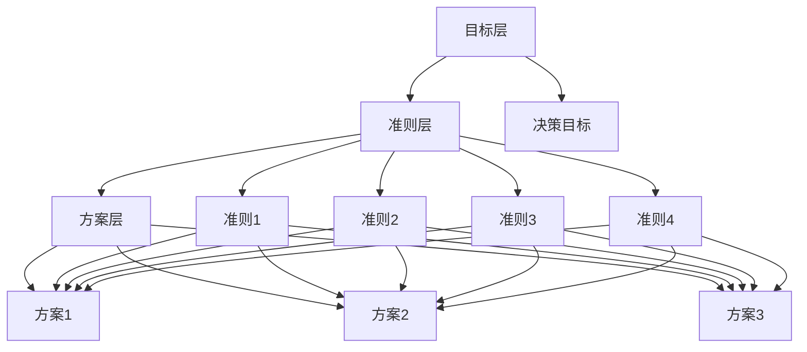

# 层次分析法

## 🏗️ 层次分析法概述

### 基本定义
**层次分析法**（Analytic Hierarchy Process，AHP）是由托马斯·萨蒂提出的多准则决策方法，通过构建层次结构，进行两两比较，计算权重，为复杂决策问题提供量化解决方案。

### 核心特征
- **层次结构**：构建层次决策结构
- **两两比较**：进行两两比较判断
- **权重计算**：计算各要素权重
- **一致性检验**：检验判断一致性

## 📊 层次分析法结构

### 1. 层次结构

#### AHP层次结构


#### 层次特点
- **目标层**：决策的总体目标
- **准则层**：评价准则和标准
- **方案层**：备选方案
- **层次关系**：上下层次关系

### 2. 判断矩阵

#### 判断矩阵结构
```mermaid
graph TB
    A[判断矩阵] --> B[两两比较]
    A --> C[重要性标度]
    A --> D[一致性检验]
    
    B --> B1[准则间比较"]
    B --> B2[方案间比较"]
    B --> B3[专家判断"]
    B --> B4[数据收集"]
    
    C --> C1[1-9标度"]
    C --> C2[重要性程度"]
    C --> C3[判断标准"]
    C --> C4[标度含义"]
    
    D --> D1[一致性指标"]
    D --> D2[随机一致性"]
    D --> D3[一致性比率"]
    D --> D4[一致性判断"]
```

#### 标度含义
- **1**：同等重要
- **3**：稍微重要
- **5**：明显重要
- **7**：强烈重要
- **9**：极端重要
- **2,4,6,8**：中间值

## 🔍 层次分析法步骤

### 1. 构建层次结构

#### 构建过程
```mermaid
graph TB
    A[构建层次结构] --> B[目标确定"]
    A --> C[准则识别"]
    A --> D[方案确定"]
    A --> E[层次关系"]
    
    B --> B1[明确决策目标"]
    B --> B2[目标分解"]
    B --> B3[目标验证"]
    B --> B4[目标确认"]
    
    C --> C1[识别评价准则"]
    C --> C2[准则分类"]
    C --> C3[准则细化"]
    C --> C4[准则验证"]
    
    D --> D1[确定备选方案"]
    D --> D2[方案描述"]
    D --> D3[方案比较"]
    D --> D4[方案筛选"]
    
    E --> E1[层次关系建立"]
    E --> E2[关系验证"]
    E --> E3[关系调整"]
    E --> E4[关系确认"]
```

#### 构建原则
- **完整性**：层次结构完整
- **独立性**：各要素独立
- **层次性**：层次关系清晰
- **可操作性**：具有可操作性

### 2. 构造判断矩阵

#### 构造过程
- **准则层判断矩阵**：构造准则间判断矩阵
- **方案层判断矩阵**：构造方案间判断矩阵
- **专家判断**：专家进行两两比较
- **数据收集**：收集判断数据

#### 判断矩阵示例
| 准则 | 准则1 | 准则2 | 准则3 | 准则4 |
|------|-------|-------|-------|-------|
| 准则1 | 1 | 3 | 5 | 2 |
| 准则2 | 1/3 | 1 | 3 | 1/2 |
| 准则3 | 1/5 | 1/3 | 1 | 1/4 |
| 准则4 | 1/2 | 2 | 4 | 1 |

### 3. 计算权重

#### 计算方法
- **特征向量法**：计算特征向量
- **几何平均法**：计算几何平均数
- **算术平均法**：计算算术平均数
- **最小二乘法**：最小二乘估计

#### 权重计算步骤
1. **计算判断矩阵**：计算判断矩阵
2. **计算特征向量**：计算特征向量
3. **归一化处理**：归一化处理
4. **权重确定**：确定最终权重

### 4. 一致性检验

#### 检验指标
- **一致性指标CI**：CI = (λmax - n) / (n - 1)
- **随机一致性指标RI**：查表获得
- **一致性比率CR**：CR = CI / RI
- **一致性判断**：CR < 0.1 认为一致

#### 检验步骤
1. **计算最大特征值**：计算λmax
2. **计算一致性指标**：计算CI
3. **查随机一致性指标**：查RI
4. **计算一致性比率**：计算CR
5. **判断一致性**：判断是否一致

## 📈 层次分析法应用

### 1. 决策应用

#### 投资决策
- **项目选择**：选择投资项目
- **投资时机**：选择投资时机
- **投资规模**：确定投资规模
- **投资组合**：构建投资组合

#### 供应商选择
- **供应商评价**：评价供应商
- **供应商选择**：选择供应商
- **供应商管理**：管理供应商
- **供应商优化**：优化供应商

#### 技术选择
- **技术路线**：选择技术路线
- **技术标准**：制定技术标准
- **技术合作**：选择技术合作
- **技术投资**：技术投资决策

### 2. 评价应用

#### 绩效评价
- **员工绩效**：评价员工绩效
- **部门绩效**：评价部门绩效
- **项目绩效**：评价项目绩效
- **企业绩效**：评价企业绩效

#### 质量评价
- **产品质量**：评价产品质量
- **服务质量**：评价服务质量
- **管理质量**：评价管理质量
- **环境质量**：评价环境质量

#### 风险评价
- **投资风险**：评价投资风险
- **经营风险**：评价经营风险
- **技术风险**：评价技术风险
- **市场风险**：评价市场风险

### 3. 规划应用

#### 战略规划
- **战略目标**：确定战略目标
- **战略重点**：确定战略重点
- **战略路径**：规划战略路径
- **战略资源**：配置战略资源

#### 资源配置
- **资源分配**：分配各种资源
- **资源优化**：优化资源配置
- **资源效率**：提高资源效率
- **资源平衡**：平衡资源配置

## 📊 层次分析法案例

### 1. 投资决策案例

#### 案例背景
某企业选择投资项目，有三个备选项目。

#### 层次结构
**目标层**：选择最佳投资项目
**准则层**：
- 投资回报率
- 风险程度
- 市场前景
- 技术可行性

**方案层**：
- 项目A：新能源项目
- 项目B：智能制造项目
- 项目C：生物医药项目

#### 判断矩阵
**准则层判断矩阵**：
| 准则 | 投资回报率 | 风险程度 | 市场前景 | 技术可行性 |
|------|------------|----------|----------|------------|
| 投资回报率 | 1 | 2 | 3 | 4 |
| 风险程度 | 1/2 | 1 | 2 | 3 |
| 市场前景 | 1/3 | 1/2 | 1 | 2 |
| 技术可行性 | 1/4 | 1/3 | 1/2 | 1 |

#### 权重计算
**准则层权重**：
- 投资回报率：0.467
- 风险程度：0.277
- 市场前景：0.160
- 技术可行性：0.096

#### 一致性检验
- CI = 0.018
- RI = 0.90
- CR = 0.020 < 0.1，一致性良好

#### 最终结果
**方案综合得分**：
- 项目A：0.356
- 项目B：0.389
- 项目C：0.255

**决策结果**：选择项目B（智能制造项目）

### 2. 供应商选择案例

#### 案例背景
某制造企业选择供应商，有三个备选供应商。

#### 层次结构
**目标层**：选择最佳供应商
**准则层**：
- 产品质量
- 价格水平
- 交货能力
- 服务水平

**方案层**：
- 供应商A：大型供应商
- 供应商B：中型供应商
- 供应商C：小型供应商

#### 判断矩阵
**准则层判断矩阵**：
| 准则 | 产品质量 | 价格水平 | 交货能力 | 服务水平 |
|------|----------|----------|----------|----------|
| 产品质量 | 1 | 3 | 2 | 4 |
| 价格水平 | 1/3 | 1 | 1/2 | 2 |
| 交货能力 | 1/2 | 2 | 1 | 3 |
| 服务水平 | 1/4 | 1/2 | 1/3 | 1 |

#### 权重计算
**准则层权重**：
- 产品质量：0.467
- 价格水平：0.160
- 交货能力：0.277
- 服务水平：0.096

#### 一致性检验
- CI = 0.018
- RI = 0.90
- CR = 0.020 < 0.1，一致性良好

#### 最终结果
**方案综合得分**：
- 供应商A：0.389
- 供应商B：0.356
- 供应商C：0.255

**决策结果**：选择供应商A（大型供应商）

## 🎯 层次分析法工具

### 1. 分析工具

#### 工具类型
- **AHP软件**：专业AHP分析软件
- **Excel模板**：AHP分析Excel模板
- **在线工具**：在线AHP分析工具
- **手工计算**：手工计算方法

#### 工具特点
- **易用性**：操作简单易用
- **准确性**：计算结果准确
- **效率性**：提高计算效率
- **可视化**：结果清晰直观

### 2. 分析技巧

#### 分析技巧
- **层次构建**：合理构建层次结构
- **判断矩阵**：准确构造判断矩阵
- **权重计算**：科学计算权重
- **一致性检验**：严格一致性检验

#### 注意事项
- **层次合理**：层次结构合理
- **判断客观**：判断客观准确
- **计算正确**：计算过程正确
- **结果验证**：验证结果合理性

## 🔍 层次分析法局限性

### 1. 主要局限性

#### 方法局限
- **主观性强**：存在主观判断
- **标度限制**：标度范围有限
- **计算复杂**：计算过程复杂
- **一致性要求**：一致性要求严格

#### 应用局限
- **问题复杂**：复杂问题处理困难
- **专家依赖**：过度依赖专家判断
- **数据要求**：数据要求较高
- **结果解释**：结果解释困难

### 2. 改进方法

#### 方法改进
- **混合方法**：结合其他方法
- **标度改进**：改进标度系统
- **计算简化**：简化计算过程
- **一致性放宽**：适当放宽一致性要求

#### 应用改进
- **问题简化**：简化复杂问题
- **专家培训**：培训专家技能
- **数据完善**：完善数据收集
- **结果验证**：加强结果验证

## 📚 学习要点总结

### 核心概念
1. **层次分析法**：多准则决策方法
2. **层次结构**：目标层、准则层、方案层
3. **判断矩阵**：两两比较判断矩阵
4. **权重计算**：计算各要素权重
5. **一致性检验**：检验判断一致性
6. **应用领域**：决策、评价、规划应用

### 关键理解
- 层次分析法是结构化决策方法
- 判断矩阵需要客观准确
- 一致性检验确保结果可靠
- 应用需要科学性和客观性

### 实践应用
- 运用层次分析法进行决策
- 使用分析工具提高效率
- 注意局限性和改进方法
- 结合实际情况应用结果

## 🔗 相关链接

- [[决策树分析]] - 决策树分析
- [[德尔菲法]] - 德尔菲法
- [[头脑风暴法]] - 头脑风暴法
- [[决策工具使用指南]] - 决策工具使用指南

## 📚 延伸阅读

- [[战略管理]] - 战略管理理论
- [[投资决策]] - 投资决策理论
- [[风险管理]] - 风险管理理论
- [[决策理论]] - 决策理论

---
*更新时间：2024年*
*内容将根据学习反馈持续优化*
