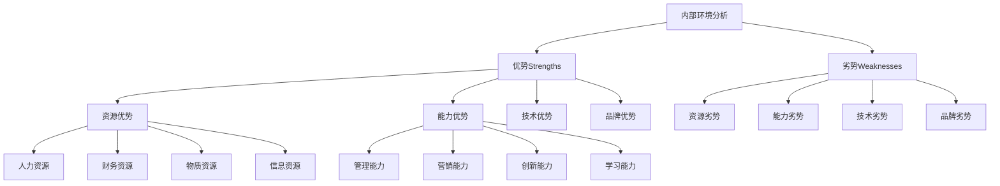
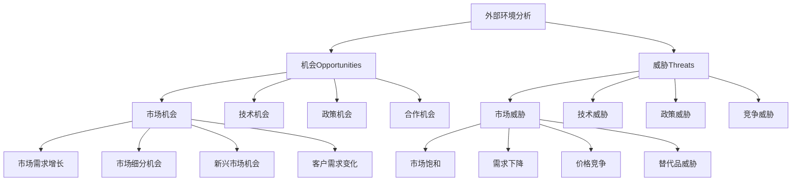

# SWOT分析工具

## 🎯 SWOT分析概述

### 基本定义
**SWOT分析**是一种战略分析工具，通过分析组织的优势（Strengths）、劣势（Weaknesses）、机会（Opportunities）和威胁（Threats），为战略制定提供依据。

### 核心特征
- **全面性**：全面分析内外部环境
- **对比性**：对比分析优势劣势
- **前瞻性**：识别机会和威胁
- **实用性**：为战略决策提供依据

## 📊 SWOT分析框架

### 1. 分析维度

#### 内部环境分析

#### 外部环境分析

### 2. 分析矩阵

#### SWOT矩阵
| 内部因素 | 优势(S) | 劣势(W) |
|----------|---------|---------|
| 外部因素 | | |
| 机会(O) | SO策略 | WO策略 |
| 威胁(T) | ST策略 | WT策略 |

#### 策略类型
- **SO策略**：利用优势抓住机会
- **WO策略**：克服劣势抓住机会
- **ST策略**：利用优势应对威胁
- **WT策略**：克服劣势应对威胁

## 🔍 SWOT分析步骤

### 1. 分析步骤

#### 第一步：环境扫描
- **内部扫描**：扫描内部环境
- **外部扫描**：扫描外部环境
- **信息收集**：收集相关信息
- **数据整理**：整理分析数据

#### 第二步：因素识别
- **优势识别**：识别内部优势
- **劣势识别**：识别内部劣势
- **机会识别**：识别外部机会
- **威胁识别**：识别外部威胁

#### 第三步：因素分析
- **重要性分析**：分析因素重要性
- **影响程度分析**：分析影响程度
- **持续时间分析**：分析持续时间
- **可控性分析**：分析可控性

#### 第四步：策略制定
- **SO策略**：制定SO策略
- **WO策略**：制定WO策略
- **ST策略**：制定ST策略
- **WT策略**：制定WT策略

#### 第五步：策略评估
- **可行性评估**：评估策略可行性
- **效果评估**：评估策略效果
- **风险评估**：评估策略风险
- **资源评估**：评估资源需求

### 2. 分析方法

#### 定性分析
- **专家判断**：专家判断分析
- **头脑风暴**：头脑风暴分析
- **德尔菲法**：德尔菲法分析
- **情景分析**：情景分析

#### 定量分析
- **统计分析**：统计分析
- **趋势分析**：趋势分析
- **对比分析**：对比分析
- **回归分析**：回归分析

## 📈 SWOT分析应用

### 1. 战略制定

#### 战略选择
- **发展战略**：基于SO策略的发展战略
- **扭转型战略**：基于WO策略的扭转型战略
- **多元化战略**：基于ST策略的多元化战略
- **防御型战略**：基于WT策略的防御型战略

#### 战略重点
- **优势强化**：强化核心优势
- **劣势改进**：改进关键劣势
- **机会把握**：把握重要机会
- **威胁应对**：应对主要威胁

### 2. 资源配置

#### 资源分配
- **优势资源**：向优势领域分配资源
- **机会资源**：向机会领域分配资源
- **劣势资源**：向劣势改进分配资源
- **威胁资源**：向威胁应对分配资源

#### 资源优化
- **资源整合**：整合各种资源
- **资源协调**：协调资源配置
- **资源效率**：提高资源效率
- **资源创新**：创新资源利用

### 3. 风险管理

#### 风险识别
- **内部风险**：识别内部风险
- **外部风险**：识别外部风险
- **组合风险**：识别组合风险
- **系统风险**：识别系统风险

#### 风险应对
- **风险规避**：规避高风险
- **风险减轻**：减轻风险影响
- **风险转移**：转移风险责任
- **风险接受**：接受风险后果

## 🎯 SWOT分析工具

### 1. 分析工具

#### 分析表格
| 因素类型 | 具体因素 | 重要性 | 影响程度 | 持续时间 | 可控性 |
|----------|----------|--------|----------|----------|--------|
| 优势(S) | | | | | |
| 劣势(W) | | | | | |
| 机会(O) | | | | | |
| 威胁(T) | | | | | |

#### 分析图表
- **雷达图**：多维度分析图
- **矩阵图**：二维分析图
- **趋势图**：趋势分析图
- **对比图**：对比分析图

### 2. 分析技巧

#### 分析原则
- **客观性原则**：客观分析
- **全面性原则**：全面分析
- **重点性原则**：重点分析
- **动态性原则**：动态分析

#### 分析技巧
- **对比分析**：对比分析
- **层次分析**：层次分析
- **关联分析**：关联分析
- **综合分析**：综合分析

## 📊 SWOT分析案例

### 1. 企业案例

#### 案例背景
某科技公司面临市场竞争加剧，需要进行战略分析。

#### 分析过程
**优势(S)**：
- 技术领先，产品创新
- 品牌知名度高
- 研发团队强大
- 客户关系良好

**劣势(W)**：
- 成本控制不足
- 市场渠道有限
- 人才流失严重
- 资金压力大

**机会(O)**：
- 市场需求增长
- 政策支持力度大
- 技术发展迅速
- 国际合作机会

**威胁(T)**：
- 竞争加剧
- 技术更新快
- 成本上升
- 人才竞争激烈

#### 策略制定
**SO策略**：利用技术优势抓住市场机会
**WO策略**：改进成本控制，拓展市场渠道
**ST策略**：利用品牌优势应对竞争威胁
**WT策略**：加强人才管理，控制成本

### 2. 行业案例

#### 案例背景
某行业面临转型升级，需要进行行业分析。

#### 分析过程
**优势(S)**：
- 产业基础雄厚
- 技术积累丰富
- 人才储备充足
- 政策支持有力

**劣势(W)**：
- 结构不合理
- 创新能力不足
- 环保压力大
- 国际竞争力弱

**机会(O)**：
- 市场需求升级
- 技术发展机遇
- 政策支持加强
- 国际合作深化

**威胁(T)**：
- 国际竞争加剧
- 技术更新加快
- 环保要求提高
- 人才竞争激烈

## 🔍 SWOT分析局限性

### 1. 主要局限性

#### 静态性局限
- **静态分析**：缺乏动态分析
- **时间局限**：时间因素考虑不足
- **变化局限**：环境变化考虑不足
- **趋势局限**：趋势分析不足

#### 主观性局限
- **主观判断**：主观判断影响
- **偏见影响**：个人偏见影响
- **经验局限**：经验局限影响
- **认知局限**：认知局限影响

#### 复杂性局限
- **因素复杂**：因素关系复杂
- **权重困难**：权重确定困难
- **量化困难**：量化分析困难
- **综合困难**：综合分析困难

### 2. 改进方法

#### 动态分析
- **时间序列**：时间序列分析
- **趋势分析**：趋势变化分析
- **情景分析**：多种情景分析
- **敏感性分析**：敏感性分析

#### 客观分析
- **数据支撑**：数据支撑分析
- **多角度分析**：多角度分析
- **专家咨询**：专家咨询意见
- **对比验证**：对比验证结果

#### 综合分析
- **系统分析**：系统分析
- **层次分析**：层次分析
- **关联分析**：关联分析
- **权重分析**：权重分析

## 🎯 学习要点总结

### 核心概念
1. **SWOT分析**：分析优势、劣势、机会、威胁的战略工具
2. **分析框架**：内部环境、外部环境分析框架
3. **分析步骤**：环境扫描、因素识别、因素分析、策略制定、策略评估
4. **策略类型**：SO、WO、ST、WT四种策略
5. **分析工具**：分析表格、分析图表
6. **应用领域**：战略制定、资源配置、风险管理

### 关键理解
- SWOT分析是战略分析的重要工具
- 分析需要客观、全面、重点、动态
- 策略制定需要综合考虑各种因素
- 分析结果需要验证和调整

### 实践应用
- 运用SWOT分析进行战略分析
- 制定基于SWOT分析的策略
- 运用分析工具提高分析质量
- 注意分析局限性和改进方法

## 🔗 相关链接

- [[波特五力模型]] - 波特五力模型
- [[价值链分析]] - 价值链分析
- [[BCG矩阵]] - BCG矩阵
- [[分析工具使用指南]] - 分析工具使用指南

## 📚 延伸阅读

- [[商业管理学/03-应用实践层/战略管理/战略制定/战略规划]] - 战略规划方法
- [[战略选择]] - 战略选择理论
- [[战略实施]] - 战略实施理论
- [[战略评估]] - 战略评估方法

---
*更新时间：2024年*
*内容将根据学习反馈持续优化*
