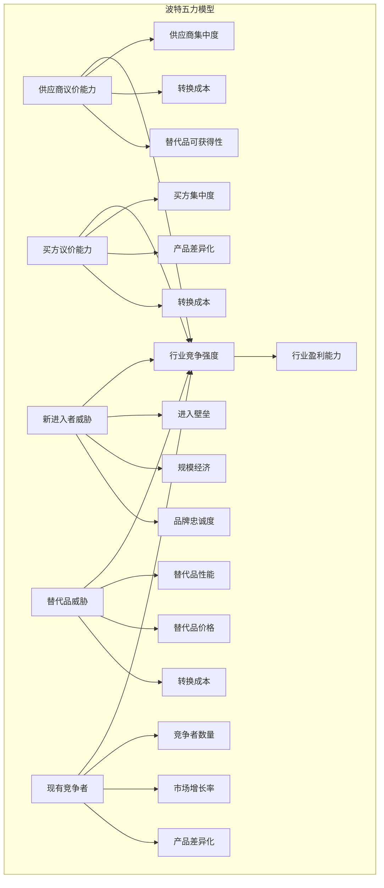
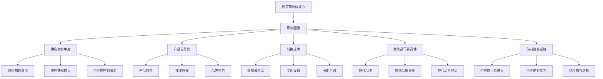

# 波特五力模型

## ⚡ 波特五力模型概述

### 基本定义
**波特五力模型**（Porter's Five Forces Model）是由迈克尔·波特提出的战略分析工具，通过分析五种竞争力量，评估行业竞争强度和盈利能力，为战略制定提供依据。

### 核心特征
- **五力分析**：五种竞争力量分析
- **行业视角**：从行业角度分析竞争
- **战略指导**：指导战略制定
- **竞争评估**：评估竞争强度

## 📊 五力模型结构

### 1. 五种竞争力量

#### 五力模型框架


#### 力量关系
- **供应商议价能力**：影响成本结构
- **买方议价能力**：影响价格水平
- **新进入者威胁**：影响竞争强度
- **替代品威胁**：影响需求结构
- **现有竞争者**：直接影响竞争

### 2. 竞争力量分析

#### 供应商议价能力


#### 买方议价能力
```mermaid
graph TB
    A[买方议价能力] --> B[影响因素]
    
    B --> B1[买方集中度]
    B --> B2[产品差异化]
    B --> B3[转换成本]
    B --> B4[信息透明度]
    B --> B5[后向整合威胁]
    
    B1 --> C1[买方数量少]
    B1 --> C2[买方申请大]
    B1 --> C3[买方控制渠道]
    
    B2 --> D1[产品同质化]
    B2 --> D2[品牌差异小]
    B2 --> D3[技术差异小"]
    
    B3 --> E1[转换成本低]
    B3 --> E2[标准化产品"]
    B3 --> E3[通用设备"]
    
    B4 --> F1[价格信息透明"]
    B4 --> F2[质量信息透明"]
    B4 --> F3[供应商信息透明"]
    
    B5 --> G1[买方可能进入"]
    B5 --> G2[买方有实力"]
    B5 --> G3[买方有动机"]
```

#### 新进入者威胁
```mermaid
graph TB
    A[新进入者威胁] --> B[进入壁垒]
    
    B --> B1[规模经济]
    B --> B2[产品差异化]
    B --> B3[资本需求]
    B --> B4[转换成本]
    B --> B5[分销渠道]
    B --> B6[政府政策]
    
    B1 --> C1[大规模生产优势"]
    B1 --> C2[成本优势"]
    B1 --> C3[技术优势"]
    
    B2 --> D1[品牌忠诚度"]
    B2 --> D2[产品独特性"]
    B2 --> D3[技术领先性"]
    
    B3 --> E1[初始投资大"]
    B3 --> E2[研发投入大"]
    B3 --> E3[市场推广大"]
    
    B4 --> F1[客户转换成本高"]
    B4 --> F2[供应商转换成本高"]
    B4 --> F3[员工转换成本高"]
    
    B5 --> G1[分销渠道有限"]
    B5 --> G2[渠道关系重要"]
    B5 --> G3[渠道控制强"]
    
    B6 --> H1[行业准入限制"]
    B6 --> H2[环保要求严格"]
    B6 --> H3[安全标准高"]
```

#### 替代品威胁
```mermaid
graph TB
    A[替代品威胁] --> B[影响因素]
    
    B --> B1[替代品性能]
    B --> B2[替代品价格]
    B --> B3[转换成本]
    B --> B4[替代品可获得性]
    B --> B5[替代品发展趋势]
    
    B1 --> C1[性能优于原产品"]
    B1 --> C2[性能相当原产品"]
    B1 --> C3[性能略差但可接受"]
    
    B2 --> D1[价格低于原产品"]
    B2 --> D2[价格相当原产品"]
    B2 --> D3[价格略高但可接受"]
    
    B3 --> E1[转换成本低"]
    B3 --> E2[转换成本中等"]
    B3 --> E3[转换成本高"]
    
    B4 --> F1[替代品容易获得"]
    B4 --> F2[替代品渠道多"]
    B4 --> F3[替代品供应稳定"]
    
    B5 --> G1[替代品技术发展快"]
    B5 --> G2[替代品市场增长快"]
    B5 --> G3[替代品成本下降快"]
```

#### 现有竞争者
```mermaid
graph TB
    A[现有竞争者] --> B[竞争强度]
    
    B --> B1[竞争者数量]
    B --> B2[市场增长率]
    B --> B3[产品差异化]
    B --> B4[固定成本]
    B --> B5[退出壁垒]
    
    B1 --> C1[竞争者数量多"]
    B1 --> C2[竞争者实力相当"]
    B1 --> C3[竞争者策略相似"]
    
    B2 --> D1[市场增长缓慢"]
    B2 --> D2[市场增长停滞"]
    B2 --> D3[市场增长下降"]
    
    B3 --> E1[产品同质化"]
    B3 --> E2[品牌差异小"]
    B3 --> E3[技术差异小"]
    
    B4 --> F1[固定成本高"]
    F1 --> F2[产能利用率低"]
    F1 --> F3[价格竞争激烈"]
    
    B5 --> G1[退出成本高"]
    G1 --> G2[专用资产多"]
    G1 --> G3[员工安置难"]
```

## 🔍 五力模型分析

### 1. 分析步骤

#### 分析过程
```mermaid
graph TB
    A[五力模型分析] --> B[行业界定]
    A --> C[数据收集]
    A --> D[力量分析]
    A --> E[强度评估]
    A --> F[战略制定]
    
    B --> B1[行业定义"]
    B --> B2[市场范围"]
    B --> B3[产品范围"]
    B --> B4[地理范围"]
    
    C --> C1[供应商数据"]
    C --> C2[买方数据"]
    C --> C3[竞争者数据"]
    C --> C4[替代品数据"]
    
    D --> D1[供应商分析"]
    D --> D2[买方分析"]
    D --> D3[竞争者分析"]
    D --> D4[替代品分析"]
    
    E --> E1[力量强度评估"]
    E --> E2[竞争强度评估"]
    E --> E3[盈利能力评估"]
    E --> E4[风险程度评估"]
    
    F --> F1[竞争策略"]
    F --> F2[合作策略"]
    F --> F3[差异化策略"]
    F --> F4[成本策略"]
```

#### 分析要点
- **行业界定**：明确分析范围
- **数据收集**：全面收集相关数据
- **力量分析**：深入分析各种力量
- **强度评估**：客观评估竞争强度
- **战略制定**：制定针对性战略

### 2. 分析方法

#### 定性分析
- **专家判断**：专家判断分析
- **行业调研**：行业调研分析
- **竞争分析**：竞争分析
- **趋势分析**：趋势分析

#### 定量分析
- **市场份额**：市场份额分析
- **价格分析**：价格分析
- **成本分析**：成本分析
- **财务分析**：财务分析

## 📈 五力模型应用

### 1. 战略制定

#### 竞争策略
- **成本领先**：降低成本，提高效率
- **差异化**：产品差异化，品牌建设
- **集中化**：专注细分市场
- **合作策略**：与供应商、买方合作

#### 战略选择
```mermaid
graph TB
    A[战略选择] --> B[竞争强度低"]
    A --> C[竞争强度中等"]
    A --> D[竞争强度高"]
    
    B --> B1[成本领先策略"]
    B --> B2[差异化策略"]
    B --> B3[集中化策略"]
    
    C --> C1[平衡策略"]
    C --> C2[合作策略"]
    C --> C3[创新策略"]
    
    D --> D1[退出策略"]
    D --> D2[转型策略"]
    D --> D3[合作策略"]
```

### 2. 投资决策

#### 投资评估
- **行业吸引力**：评估行业吸引力
- **竞争地位**：评估竞争地位
- **投资风险**：评估投资风险
- **投资回报**：评估投资回报

#### 投资策略
- **进入策略**：进入新行业
- **退出策略**：退出现有行业
- **扩张策略**：扩张现有业务
- **收缩策略**：收缩现有业务

### 3. 风险管理

#### 风险识别
- **竞争风险**：竞争加剧风险
- **市场风险**：市场需求变化风险
- **技术风险**：技术替代风险
- **政策风险**：政策变化风险

#### 风险应对
- **风险规避**：规避高风险
- **风险减轻**：减轻风险影响
- **风险转移**：转移风险责任
- **风险接受**：接受风险后果

## 📊 五力模型案例

### 1. 行业案例

#### 案例背景
某智能手机行业企业进行五力模型分析。

#### 五力分析
**供应商议价能力（中等）**：
- 芯片供应商集中度高，议价能力强
- 屏幕供应商技术领先，议价能力强
- 其他零部件供应商议价能力一般

**买方议价能力（强）**：
- 消费者对价格敏感，议价能力强
- 运营商集中采购，议价能力强
- 产品同质化严重，议价能力强

**新进入者威胁（中等）**：
- 技术壁垒较高，进入困难
- 品牌建设需要大量投入
- 渠道建设需要时间

**替代品威胁（强）**：
- 平板电脑、智能手表等替代品
- 替代品技术发展迅速
- 消费者需求多样化

**现有竞争者（强）**：
- 竞争者数量多，实力相当
- 市场增长放缓，竞争激烈
- 产品差异化程度低

#### 战略建议
- **差异化策略**：加强产品差异化
- **成本控制**：控制成本，提高效率
- **技术创新**：加大技术创新投入
- **市场细分**：专注细分市场

### 2. 企业案例

#### 案例背景
某制造企业进入新行业，需要进行五力分析。

#### 五力分析
**供应商议价能力（弱）**：
- 供应商数量多，竞争激烈
- 产品标准化，转换成本低
- 替代品可获得性好

**买方议价能力（中等）**：
- 买方数量多，集中度不高
- 产品有一定差异化
- 转换成本中等

**新进入者威胁（中等）**：
- 技术壁垒中等
- 资本需求中等
- 品牌建设需要时间

**替代品威胁（弱）**：
- 替代品性能较差
- 替代品价格较高
- 转换成本较高

**现有竞争者（中等）**：
- 竞争者数量适中
- 市场增长稳定
- 产品差异化程度中等

#### 战略建议
- **进入策略**：可以进入该行业
- **竞争策略**：采用差异化策略
- **投资策略**：适度投资，控制风险
- **发展策略**：稳步发展，建立优势

## 🎯 五力模型工具

### 1. 分析工具

#### 工具类型
- **分析模板**：五力模型分析模板
- **评估量表**：五力评估量表
- **分析软件**：专业分析软件
- **在线工具**：在线分析工具

#### 工具特点
- **易用性**：操作简单易用
- **准确性**：分析结果准确
- **可视化**：图表清晰直观
- **灵活性**：灵活调整参数

### 2. 分析技巧

#### 分析技巧
- **数据收集**：全面收集相关数据
- **力量分析**：深入分析各种力量
- **强度评估**：客观评估竞争强度
- **战略制定**：制定针对性战略

#### 注意事项
- **行业界定**：明确分析范围
- **数据质量**：确保数据质量
- **分析客观**：保持分析客观
- **战略执行**：有效执行战略

## 🔍 五力模型局限性

### 1. 主要局限性

#### 理论局限
- **静态分析**：缺乏动态分析
- **行业视角**：忽略企业视角
- **简化假设**：简化现实情况
- **环境变化**：环境变化影响

#### 实践局限
- **数据要求**：数据要求较高
- **主观判断**：存在主观判断
- **行业差异**：行业差异较大
- **执行困难**：战略执行困难

### 2. 改进方法

#### 理论改进
- **动态分析**：进行动态分析
- **企业视角**：增加企业视角
- **复杂模型**：使用复杂模型
- **环境适应**：适应环境变化

#### 实践改进
- **数据完善**：完善数据收集
- **方法改进**：改进分析方法
- **工具升级**：升级分析工具
- **执行优化**：优化战略执行

## 📚 学习要点总结

### 核心概念
1. **波特五力模型**：五种竞争力量分析工具
2. **五种力量**：供应商、买方、新进入者、替代品、现有竞争者
3. **分析步骤**：行业界定、数据收集、力量分析、强度评估
4. **战略应用**：竞争策略、投资决策、风险管理
5. **分析工具**：分析模板、评估量表、专业软件
6. **局限性**：理论局限、实践局限

### 关键理解
- 五力模型是行业竞争分析的重要工具
- 五种力量影响行业盈利能力
- 分析需要客观性和全面性
- 应用需要考虑局限性和改进方法

### 实践应用
- 运用五力模型分析行业竞争
- 制定基于五力分析的策略
- 使用分析工具提高分析质量
- 注意分析局限性和改进方法

## 🔗 相关链接

- [[SWOT分析工具]] - SWOT分析工具
- [[BCG矩阵]] - BCG矩阵
- [[价值链分析]] - 价值链分析
- [[分析工具使用指南]] - 分析工具使用指南

## 📚 延伸阅读

- [[商业管理学/03-应用实践层/战略管理/战略制定/战略规划]] - 战略规划方法
- [[战略选择]] - 战略选择理论
- [[战略实施]] - 战略实施理论
- [[战略评估]] - 战略评估方法

---
*更新时间：2024年*
*内容将根据学习反馈持续优化*
