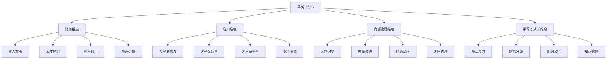
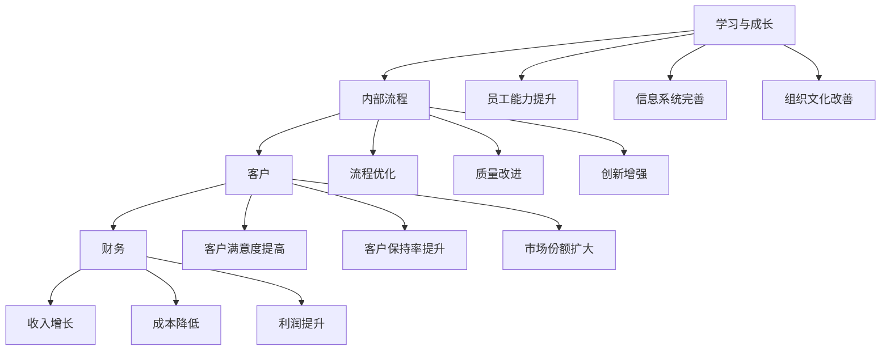
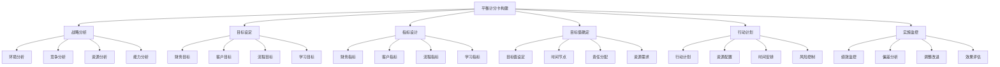

# 平衡计分卡

## ⚖️ 平衡计分卡概述

### 基本定义
**平衡计分卡**（Balanced Scorecard，BSC）是一种战略管理工具，通过财务、客户、内部流程、学习与成长四个维度，平衡短期与长期目标，为战略实施提供框架。

### 核心特征
- **平衡性**：平衡多个目标
- **战略性**：与战略紧密结合
- **系统性**：系统管理绩效
- **动态性**：动态调整目标

## 📊 平衡计分卡框架

### 1. 四个维度

#### 平衡计分卡结构

#### 维度关系
- **财务维度**：最终目标，衡量财务绩效
- **客户维度**：价值主张，满足客户需求
- **内部流程维度**：价值创造，优化内部流程
- **学习与成长维度**：能力建设，提升组织能力

### 2. 因果关系

#### 因果关系链

#### 因果关系特点
- **逻辑性**：因果关系逻辑清晰
- **递进性**：目标递进关系
- **支撑性**：下层支撑上层
- **反馈性**：反馈调整机制

## 🔍 平衡计分卡构建

### 1. 构建步骤

#### 构建过程

#### 构建原则
- **战略导向**：以战略为导向
- **平衡协调**：平衡各维度
- **因果关系**：明确因果关系
- **可操作性**：具有可操作性

### 2. 指标设计

#### 指标类型
- **结果指标**：衡量最终结果
- **驱动指标**：驱动结果的因素
- **滞后指标**：滞后性指标
- **领先指标**：领先性指标

#### 指标特点
- **量化性**：可以量化测量
- **可操作性**：具有可操作性
- **相关性**：与目标相关
- **平衡性**：平衡各维度

## 📈 平衡计分卡应用

### 1. 战略管理

#### 战略制定
- **战略分析**：分析战略环境
- **战略选择**：选择战略方案
- **战略目标**：设定战略目标
- **战略实施**：实施战略计划

#### 战略实施
- **目标分解**：分解战略目标
- **资源配置**：配置战略资源
- **组织保障**：建立组织保障
- **文化支撑**：营造文化氛围

### 2. 绩效管理

#### 绩效评估
- **绩效指标**：设定绩效指标
- **绩效测量**：测量绩效水平
- **绩效分析**：分析绩效结果
- **绩效改进**：改进绩效水平

#### 绩效激励
- **目标激励**：目标导向激励
- **绩效激励**：绩效导向激励
- **团队激励**：团队协作激励
- **个人激励**：个人发展激励

### 3. 组织管理

#### 组织设计
- **结构设计**：设计组织结构
- **流程设计**：设计业务流程
- **制度设计**：设计管理制度
- **文化设计**：设计组织文化

#### 组织发展
- **能力建设**：建设组织能力
- **文化建设**：建设组织文化
- **系统建设**：建设管理系统
- **人才建设**：建设人才队伍

## 📊 平衡计分卡案例

### 1. 企业案例

#### 案例背景
某制造企业实施平衡计分卡，提升企业绩效。

#### 四个维度设计
**财务维度**：
- 目标：提高盈利能力
- 指标：净利润增长率、ROE、现金流
- 目标值：净利润增长15%，ROE达到12%

**客户维度**：
- 目标：提高客户满意度
- 指标：客户满意度、客户保持率、市场份额
- 目标值：客户满意度90%，客户保持率85%

**内部流程维度**：
- 目标：优化内部流程
- 指标：生产效率、质量合格率、交付及时率
- 目标值：生产效率提升10%，质量合格率99%

**学习与成长维度**：
- 目标：提升员工能力
- 指标：员工培训率、员工满意度、创新能力
- 目标值：员工培训率100%，员工满意度85%

#### 实施效果
- **财务绩效**：净利润增长18%，ROE达到13%
- **客户绩效**：客户满意度92%，客户保持率87%
- **流程绩效**：生产效率提升12%，质量合格率99.5%
- **学习绩效**：员工培训率100%，员工满意度88%

### 2. 行业案例

#### 案例背景
某服务行业企业实施平衡计分卡，改善服务质量。

#### 四个维度设计
**财务维度**：
- 目标：提高收入增长
- 指标：收入增长率、利润率、成本控制
- 目标值：收入增长20%，利润率提升5%

**客户维度**：
- 目标：提升服务质量
- 指标：服务质量评分、客户投诉率、客户推荐率
- 目标值：服务质量评分4.5分，客户投诉率<2%

**内部流程维度**：
- 目标：优化服务流程
- 指标：服务响应时间、服务完成率、流程效率
- 目标值：服务响应时间<2小时，服务完成率95%

**学习与成长维度**：
- 目标：提升服务能力
- 指标：员工技能水平、培训覆盖率、创新能力
- 目标值：员工技能水平提升20%，培训覆盖率100%

## 🎯 平衡计分卡工具

### 1. 分析工具

#### 软件工具
- **BSC Designer**：平衡计分卡设计软件
- **Strategy Map**：战略地图软件
- **Performance Dashboard**：绩效仪表板
- **Excel模板**：Excel平衡计分卡模板

#### 分析工具
- **战略地图**：战略地图分析
- **因果关系图**：因果关系分析
- **绩效仪表板**：绩效监控仪表板
- **趋势分析图**：趋势分析图表

### 2. 实施工具

#### 实施工具
- **实施计划**：平衡计分卡实施计划
- **培训材料**：平衡计分卡培训材料
- **评估工具**：平衡计分卡评估工具
- **改进工具**：平衡计分卡改进工具

#### 管理工具
- **目标管理**：目标管理工具
- **绩效管理**：绩效管理工具
- **激励机制**：激励机制工具
- **沟通工具**：沟通工具

## 🔍 平衡计分卡局限性

### 1. 主要局限性

#### 理论局限
- **简化假设**：简化现实情况
- **因果关系**：因果关系复杂
- **指标选择**：指标选择困难
- **权重确定**：权重确定困难

#### 实践局限
- **实施复杂**：实施过程复杂
- **数据要求**：数据要求较高
- **文化适应**：文化适应困难
- **成本较高**：实施成本较高

#### 应用局限
- **行业差异**：行业差异较大
- **规模差异**：规模差异较大
- **文化差异**：文化差异较大
- **环境差异**：环境差异较大

### 2. 改进方法

#### 理论改进
- **复杂模型**：使用复杂模型
- **动态调整**：动态调整模型
- **个性化设计**：个性化设计
- **文化适应**：适应文化差异

#### 实践改进
- **简化实施**：简化实施过程
- **分步实施**：分步实施
- **培训支持**：提供培训支持
- **技术支持**：提供技术支持

#### 应用改进
- **行业定制**：行业定制化
- **规模适应**：适应不同规模
- **文化融合**：融合文化差异
- **环境适应**：适应环境变化

## 🎯 学习要点总结

### 核心概念
1. **平衡计分卡**：平衡四个维度的战略管理工具
2. **四个维度**：财务、客户、内部流程、学习与成长
3. **因果关系**：各维度间的因果关系
4. **构建步骤**：战略分析、目标设定、指标设计、目标值确定
5. **应用领域**：战略管理、绩效管理、组织管理
6. **局限性**：理论局限、实践局限、应用局限

### 关键理解
- 平衡计分卡是战略管理的重要工具
- 四个维度需要平衡协调
- 因果关系是平衡计分卡的核心
- 实施需要考虑局限性和改进方法

### 实践应用
- 运用平衡计分卡进行战略管理
- 设计平衡的绩效指标体系
- 建立有效的实施机制
- 持续改进平衡计分卡

## 🔗 相关链接

- [[KPI指标体系]] - KPI指标体系
- [[360度评估]] - 360度评估
- [[绩效评估矩阵]] - 绩效评估矩阵
- [[评估工具使用指南]] - 评估工具使用指南

## 📚 延伸阅读

- [[战略管理]] - 战略管理理论
- [[绩效管理]] - 绩效管理理论
- [[组织管理]] - 组织管理理论
- [[人力资源管理]] - 人力资源管理理论

---
*更新时间：2024年*
*内容将根据学习反馈持续优化*
