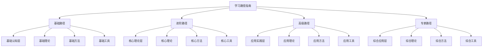

# 学习路径指南

## 🛤️ 学习路径概述

### 基本定义
**学习路径指南**是指根据企业管理学知识体系的特点和学习者的需求，制定系统性的学习路径，指导学习者有序、高效地掌握企业管理学知识的过程。

### 核心特征
- **系统性**：系统规划学习路径
- **层次性**：层次递进学习
- **个性化**：个性化学习路径
- **实用性**：注重实际应用

## 📊 学习路径框架

### 1. 路径层次

#### 学习路径结构


#### 路径特点
- **基础路径**：建立基础认知
- **进阶路径**：掌握核心理论
- **高级路径**：应用实践技能
- **专家路径**：综合应用能力

### 2. 路径类型

#### 按学习者分类
- **初学者路径**：零基础学习者
- **有基础者路径**：有一定基础学习者
- **专业人员路径**：专业人员学习
- **管理者路径**：管理者学习

#### 按目标分类
- **理论学习路径**：侧重理论学习
- **实践应用路径**：侧重实践应用
- **综合发展路径**：理论与实践并重
- **专业深化路径**：专业领域深化

## 🔍 学习路径设计

### 1. 初学者路径

#### 路径目标
- **学习目标**：建立企业管理学基础认知
- **时间安排**：6-12个月
- **学习重点**：基础概念、基本理论
- **能力目标**：掌握基本概念和理论

#### 学习内容
**第1-2个月：基础认知**
- 企业管理学概述
- 管理基本概念
- 管理者角色与技能
- 管理环境分析

**第3-4个月：基础理论**
- 管理职能理论
- 管理层次理论
- 管理方法理论
- 管理伦理与社会责任

**第5-6个月：基础应用**
- 基础案例分析
- 基础工具应用
- 基础实践练习
- 基础效果评估

#### 学习方法
- **系统学习**：系统学习基础知识
- **重点突破**：重点突破关键概念
- **实践结合**：理论与实践结合
- **持续巩固**：持续巩固学习成果

### 2. 有基础者路径

#### 路径目标
- **学习目标**：深化企业管理学理解
- **时间安排**：12-18个月
- **学习重点**：核心理论、应用方法
- **能力目标**：掌握核心理论和应用方法

#### 学习内容
**第1-3个月：核心理论**
- 战略管理理论
- 组织管理理论
- 人力资源管理理论
- 营销管理理论

**第4-6个月：应用理论**
- 财务管理理论
- 运营管理理论
- 信息管理理论
- 管理工具理论

**第7-9个月：实践应用**
- 战略管理实践
- 组织管理实践
- 人力资源管理实践
- 营销管理实践

**第10-12个月：综合应用**
- 财务管理实践
- 运营管理实践
- 信息管理实践
- 综合案例分析

#### 学习方法
- **深度学习**：深入学习核心理论
- **对比学习**：对比学习不同理论
- **案例学习**：案例学习理论应用
- **实践学习**：实践学习技能应用

### 3. 专业人员路径

#### 路径目标
- **学习目标**：掌握专业领域知识
- **时间安排**：18-24个月
- **学习重点**：专业理论、专业技能
- **能力目标**：掌握专业理论和技能

#### 学习内容
**第1-6个月：专业基础**
- 专业理论基础
- 专业方法理论
- 专业工具理论
- 专业实践理论

**第7-12个月：专业深化**
- 专业领域深化
- 专业技能提升
- 专业工具应用
- 专业实践应用

**第13-18个月：专业应用**
- 专业案例分析
- 专业项目实践
- 专业工具应用
- 专业效果评估

**第19-24个月：专业创新**
- 专业理论创新
- 专业方法创新
- 专业工具创新
- 专业实践创新

#### 学习方法
- **专业学习**：专业领域深入学习
- **技能学习**：专业技能系统学习
- **创新学习**：创新思维和方法学习
- **引领学习**：引领专业发展学习

### 4. 管理者路径

#### 路径目标
- **学习目标**：提升管理实践能力
- **时间安排**：12-18个月
- **学习重点**：管理实践、领导能力
- **能力目标**：提升管理实践和领导能力

#### 学习内容
**第1-3个月：管理基础**
- 管理理论基础
- 领导理论基础
- 决策理论基础
- 沟通理论基础

**第4-6个月：管理技能**
- 战略管理技能
- 组织管理技能
- 人员管理技能
- 绩效管理技能

**第7-9个月：管理实践**
- 管理案例分析
- 管理工具应用
- 管理方法实践
- 管理效果评估

**第10-12个月：管理创新**
- 管理思维创新
- 管理方法创新
- 管理工具创新
- 管理实践创新

#### 学习方法
- **实践学习**：管理实践学习
- **案例学习**：管理案例学习
- **工具学习**：管理工具学习
- **创新学习**：管理创新学习

## 📈 学习路径实施

### 1. 实施步骤

#### 实施过程
```mermaid
graph TB
    A[学习路径实施] --> B[路径选择]
    A --> C[计划制定]
    A --> D[资源准备]
    A --> E[学习执行]
    A --> F[进度跟踪]
    A --> G[效果评估]
    A --> H[路径调整]
    
    B --> B1[学习者分析]
    B --> B2[目标确定]
    B --> B3[路径选择]
    B --> B4[路径确认]
    
    C --> C1[学习计划]
    C --> C2[时间安排]
    C --> C3[内容安排]
    C --> C4[方法安排]
    
    D --> D1[学习资源]
    D --> D2[学习工具]
    D --> D3[学习环境]
    D --> D4[学习支持]
    
    E --> E1[理论学习]
    E --> E2[实践学习]
    E --> E3[案例学习]
    E --> E4[工具学习"]
    
    F --> F1[进度记录]
    F --> F2[进度监控]
    F --> F3[进度分析]
    F --> F4[进度报告]
    
    G --> G1[效果测量]
    G --> G2[效果分析]
    G --> G3[效果评估]
    G --> G4[效果反馈]
    
    H --> H1[问题识别]
    H --> H2[调整方案]
    H --> H3[调整实施]
    H --> H4[调整效果]
```

#### 实施原则
- **系统性原则**：系统实施学习路径
- **个性化原则**：个性化学习路径
- **实用性原则**：注重实际应用
- **灵活性原则**：灵活调整路径

### 2. 实施方法

#### 实施方法
- **自主学习**：自主学习实施
- **指导学习**：指导学习实施
- **合作学习**：合作学习实施
- **实践学习**：实践学习实施

#### 实施技巧
- **时间管理**：有效管理学习时间
- **资源利用**：充分利用学习资源
- **方法选择**：选择合适学习方法
- **效果评估**：及时评估学习效果

## 🎯 学习路径优化

### 1. 优化方法

#### 优化维度
- **内容优化**：优化学习内容
- **方法优化**：优化学习方法
- **时间优化**：优化时间安排
- **效果优化**：优化学习效果

#### 优化策略
- **持续优化**：持续优化学习路径
- **重点优化**：重点优化关键环节
- **全面优化**：全面优化学习过程
- **创新优化**：创新优化学习方式

### 2. 优化工具

#### 优化工具
- **学习分析工具**：分析学习效果
- **进度跟踪工具**：跟踪学习进度
- **效果评估工具**：评估学习效果
- **改进建议工具**：提供改进建议

#### 优化方法
- **数据分析**：数据分析优化
- **对比分析**：对比分析优化
- **趋势分析**：趋势分析优化
- **综合分析**：综合分析优化

## 📊 学习路径案例

### 1. 初学者案例

#### 案例背景
某大学毕业生，准备进入企业管理领域工作。

#### 学习路径
**第1-3个月：基础认知**
- 学习企业管理学概述
- 掌握管理基本概念
- 了解管理者角色
- 分析管理环境

**第4-6个月：基础理论**
- 学习管理职能理论
- 掌握管理层次理论
- 了解管理方法理论
- 学习管理伦理

**第7-9个月：基础应用**
- 分析基础案例
- 应用基础工具
- 进行基础实践
- 评估学习效果

#### 学习效果
- **基础扎实**：基础知识扎实
- **理论清晰**：理论理解清晰
- **应用初步**：初步应用能力
- **持续发展**：持续发展潜力

### 2. 管理者案例

#### 案例背景
某企业中层管理者，希望提升管理能力。

#### 学习路径
**第1-3个月：管理基础**
- 学习管理理论
- 掌握领导理论
- 了解决策理论
- 学习沟通理论

**第4-6个月：管理技能**
- 提升战略管理技能
- 增强组织管理技能
- 改善人员管理技能
- 优化绩效管理技能

**第7-9个月：管理实践**
- 分析管理案例
- 应用管理工具
- 实践管理方法
- 评估管理效果

#### 学习效果
- **能力提升**：管理能力显著提升
- **实践改善**：管理实践明显改善
- **效果显著**：管理效果显著改善
- **持续改进**：持续改进管理

## 🔍 学习路径评估

### 1. 评估维度

#### 评估维度
- **学习效果**：学习效果评估
- **学习效率**：学习效率评估
- **学习质量**：学习质量评估
- **学习满意度**：学习满意度评估

#### 评估指标
- **知识掌握**：知识掌握程度
- **技能提升**：技能提升程度
- **应用能力**：应用能力程度
- **创新能力**：创新能力程度

### 2. 评估方法

#### 评估方法
- **自我评估**：自我评估学习效果
- **他人评估**：他人评估学习效果
- **实践评估**：实践评估学习效果
- **综合评估**：综合评估学习效果

#### 评估工具
- **评估量表**：学习效果评估量表
- **评估标准**：学习效果评估标准
- **评估方法**：学习效果评估方法
- **评估报告**：学习效果评估报告

## 📚 学习要点总结

### 核心概念
1. **学习路径指南**：系统规划学习路径
2. **路径层次**：基础、进阶、高级、专家路径
3. **路径类型**：按学习者、目标分类
4. **路径设计**：个性化路径设计
5. **路径实施**：系统实施学习路径
6. **路径优化**：持续优化学习路径

### 关键理解
- 学习路径需要系统性和个性化
- 路径设计需要考虑学习者特点
- 路径实施需要灵活调整
- 路径优化需要持续进行

### 实践应用
- 制定个人学习路径
- 按照路径系统学习
- 跟踪学习进度调整路径
- 评估学习效果优化路径

## 🔗 相关链接

- [[管理实践指南]] - 管理实践指南
- [[案例分析指南]] - 案例分析指南
- [[工具应用指南]] - 工具应用指南
- [[实践项目建议]] - 实践项目建议

## 📚 延伸阅读

- [[管理经典著作推荐]] - 管理经典著作推荐
- [[阅读计划制定]] - 阅读计划制定
- [[人工智能与管理]] - 人工智能与管理
- [[数字化转型研究]] - 数字化转型研究

---
*更新时间：2024年*
*内容将根据学习反馈持续优化*
