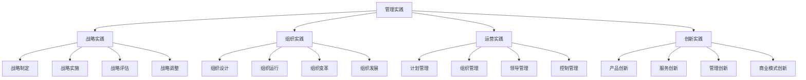

# 管理实践指南

## 🎯 管理实践概述

### 基本定义
**管理实践**是指将管理理论应用于实际工作，通过系统性的管理活动，实现组织目标的过程。管理实践是理论联系实际的重要桥梁。

### 核心特征
- **实用性**：注重实际应用
- **系统性**：系统管理活动
- **动态性**：动态调整改进
- **创新性**：持续创新实践

## 📊 管理实践框架

### 1. 实践层次

#### 管理实践结构

#### 实践关系
- **战略实践**：指导其他实践
- **组织实践**：支撑其他实践
- **运营实践**：执行其他实践
- **创新实践**：推动其他实践

### 2. 实践要素

#### 核心要素
- **实践目标**：明确实践目标
- **实践方法**：选择实践方法
- **实践工具**：运用实践工具
- **实践评估**：评估实践效果

#### 支撑要素
- **实践环境**：营造实践环境
- **实践资源**：配置实践资源
- **实践团队**：组建实践团队
- **实践文化**：建设实践文化

## 🔍 管理实践方法

### 1. 战略管理实践

#### 战略制定实践
- **环境分析**：分析内外部环境
- **战略选择**：选择战略方案
- **战略规划**：制定战略规划
- **战略沟通**：沟通战略目标

#### 战略实施实践
- **目标分解**：分解战略目标
- **资源配置**：配置战略资源
- **组织保障**：建立组织保障
- **文化支撑**：营造文化氛围

#### 战略评估实践
- **绩效评估**：评估战略绩效
- **偏差分析**：分析实施偏差
- **调整改进**：调整改进战略
- **经验总结**：总结实践经验

### 2. 组织管理实践

#### 组织设计实践
- **结构设计**：设计组织结构
- **流程设计**：设计业务流程
- **制度设计**：设计管理制度
- **文化设计**：设计组织文化

#### 组织运行实践
- **协调机制**：建立协调机制
- **沟通机制**：建立沟通机制
- **激励机制**：建立激励机制
- **控制机制**：建立控制机制

#### 组织变革实践
- **变革诊断**：诊断变革需求
- **变革设计**：设计变革方案
- **变革实施**：实施变革计划
- **变革巩固**：巩固变革成果

### 3. 运营管理实践

#### 计划管理实践
- **计划制定**：制定工作计划
- **计划执行**：执行工作计划
- **计划监控**：监控计划执行
- **计划调整**：调整计划内容

#### 组织管理实践
- **任务分配**：分配工作任务
- **资源调配**：调配各种资源
- **协调配合**：协调配合工作
- **冲突处理**：处理工作冲突

#### 领导管理实践
- **目标设定**：设定工作目标
- **激励员工**：激励员工工作
- **指导工作**：指导员工工作
- **团队建设**：建设工作团队

#### 控制管理实践
- **标准制定**：制定工作标准
- **绩效监控**：监控工作绩效
- **偏差纠正**：纠正工作偏差
- **持续改进**：持续改进工作

## 📈 管理实践工具

### 1. 分析工具

#### 战略分析工具
- **SWOT分析**：优势劣势机会威胁分析
- **波特五力模型**：行业竞争分析
- **价值链分析**：价值创造分析
- **BCG矩阵**：业务组合分析

#### 组织分析工具
- **组织架构图**：组织架构分析
- **流程图**：业务流程分析
- **职责矩阵**：职责分工分析
- **沟通图**：沟通关系分析

#### 运营分析工具
- **甘特图**：项目进度分析
- **鱼骨图**：问题原因分析
- **帕累托图**：问题重要性分析
- **控制图**：质量控制分析

### 2. 管理工具

#### 计划管理工具
- **目标管理**：目标管理工具
- **项目管理**：项目管理工具
- **时间管理**：时间管理工具
- **资源管理**：资源管理工具

#### 组织管理工具
- **组织设计**：组织设计工具
- **流程管理**：流程管理工具
- **制度管理**：制度管理工具
- **文化管理**：文化管理工具

#### 领导管理工具
- **激励管理**：激励管理工具
- **沟通管理**：沟通管理工具
- **团队管理**：团队管理工具
- **冲突管理**：冲突管理工具

#### 控制管理工具
- **绩效管理**：绩效管理工具
- **质量管理**：质量管理工具
- **成本管理**：成本管理工具
- **风险管理**：风险管理工具

## 🎯 管理实践技能

### 1. 核心技能

#### 分析技能
- **环境分析**：分析内外部环境
- **问题分析**：分析问题原因
- **数据分析**：分析各种数据
- **趋势分析**：分析发展趋势

#### 决策技能
- **决策制定**：制定决策方案
- **决策评估**：评估决策方案
- **决策实施**：实施决策方案
- **决策调整**：调整决策方案

#### 沟通技能
- **口头沟通**：口头沟通技能
- **书面沟通**：书面沟通技能
- **非语言沟通**：非语言沟通技能
- **跨文化沟通**：跨文化沟通技能

#### 领导技能
- **目标设定**：设定工作目标
- **激励员工**：激励员工工作
- **团队建设**：建设工作团队
- **变革领导**：领导组织变革

### 2. 专业技能

#### 技术技能
- **专业技术**：专业技术技能
- **信息技术**：信息技术技能
- **数据分析**：数据分析技能
- **项目管理**：项目管理技能

#### 管理技能
- **战略管理**：战略管理技能
- **组织管理**：组织管理技能
- **运营管理**：运营管理技能
- **创新管理**：创新管理技能

## 📊 管理实践案例

### 1. 企业实践案例

#### 案例背景
某制造企业通过管理实践，提升企业绩效。

#### 实践内容
- **战略实践**：制定实施发展战略
- **组织实践**：优化组织结构流程
- **运营实践**：提升运营效率质量
- **创新实践**：推动产品服务创新

#### 实践效果
- **财务绩效**：收入增长20%，利润提升15%
- **运营绩效**：效率提升25%，质量改善30%
- **客户绩效**：客户满意度提升，市场份额扩大
- **员工绩效**：员工满意度提升，离职率降低

### 2. 行业实践案例

#### 案例背景
某服务行业通过管理实践，改善服务质量。

#### 实践内容
- **服务标准化**：建立服务标准体系
- **流程优化**：优化服务流程
- **人员培训**：加强人员培训
- **技术应用**：应用新技术改善服务

#### 实践效果
- **服务质量**：服务质量显著提升
- **服务效率**：服务效率大幅改善
- **客户满意**：客户满意度明显提高
- **市场竞争力**：市场竞争力显著增强

## 🔍 管理实践挑战

### 1. 主要挑战

#### 环境挑战
- **环境变化**：外部环境快速变化
- **竞争加剧**：市场竞争日益加剧
- **技术发展**：技术快速发展
- **需求变化**：客户需求不断变化

#### 内部挑战
- **资源约束**：资源约束限制
- **能力不足**：管理能力不足
- **文化障碍**：企业文化障碍
- **变革阻力**：组织变革阻力

### 2. 应对策略

#### 环境应对
- **环境适应**：适应环境变化
- **竞争应对**：应对竞争挑战
- **技术应用**：应用新技术
- **需求满足**：满足客户需求

#### 内部应对
- **资源优化**：优化资源配置
- **能力提升**：提升管理能力
- **文化建设**：建设企业文化
- **变革推动**：推动组织变革

## 🎯 管理实践建议

### 1. 实践原则

#### 基本原则
- **理论指导**：理论指导实践
- **实践验证**：实践验证理论
- **持续改进**：持续改进实践
- **创新发展**：创新发展实践

#### 实践原则
- **系统性原则**：系统管理实践
- **动态性原则**：动态调整实践
- **创新性原则**：创新实践方法
- **效益性原则**：注重实践效益

### 2. 实践建议

#### 实践方法
- **循序渐进**：循序渐进实践
- **重点突破**：重点突破实践
- **全面推广**：全面推广实践
- **持续改进**：持续改进实践

#### 实践技巧
- **学习借鉴**：学习借鉴经验
- **因地制宜**：因地制宜实践
- **团队协作**：团队协作实践
- **创新思维**：创新思维实践

## 📚 学习要点总结

### 核心概念
1. **管理实践**：将管理理论应用于实际工作
2. **实践框架**：战略、组织、运营、创新实践
3. **实践方法**：各种管理实践方法
4. **实践工具**：分析工具、管理工具
5. **实践技能**：核心技能、专业技能
6. **实践挑战**：环境挑战、内部挑战

### 关键理解
- 管理实践是理论联系实际的重要桥梁
- 实践需要系统性和创新性
- 实践面临各种挑战需要应对
- 实践需要持续学习和改进

### 实践应用
- 运用管理理论指导实践
- 使用管理工具提升实践效果
- 培养管理技能支撑实践
- 持续改进管理实践

## 🔗 相关链接

- [[学习路径指南]] - 学习路径指南
- [[工具应用指南]] - 工具应用指南
- [[案例分析指南]] - 案例分析指南
- [[实践项目建议]] - 实践项目建议

## 📚 延伸阅读

- [[管理经典著作推荐]] - 管理经典著作推荐
- [[人工智能与管理]] - 人工智能与管理
- [[数字化转型研究]] - 数字化转型研究
- [[可持续发展研究]] - 可持续发展研究

---
*更新时间：2024年*
*内容将根据学习反馈持续优化*
