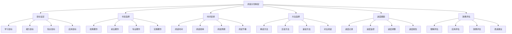
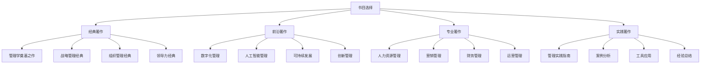

# 阅读计划制定

## 📚 阅读计划概述

### 基本定义
**阅读计划制定**是指根据学习目标、时间安排和个人情况，系统规划企业管理学经典著作的阅读顺序、阅读重点和阅读方法的过程。

### 核心特征
- **系统性**：系统规划阅读
- **针对性**：针对个人需求
- **实用性**：注重实际效果
- **灵活性**：灵活调整计划

## 📊 阅读计划框架

### 1. 计划要素

#### 阅读计划结构

#### 计划层次
- **总体计划**：整体阅读规划
- **阶段计划**：分阶段阅读计划
- **月度计划**：月度阅读安排
- **周度计划**：周度阅读安排

### 2. 计划类型

#### 按时间分类
- **长期计划**：1-3年阅读计划
- **中期计划**：6个月-1年计划
- **短期计划**：1-6个月计划
- **日常计划**：每日阅读安排

#### 按内容分类
- **基础阅读**：基础理论阅读
- **专业阅读**：专业领域阅读
- **前沿阅读**：前沿理论阅读
- **实践阅读**：实践应用阅读

## 🔍 计划制定步骤

### 1. 目标设定

#### 学习目标
- **知识目标**：掌握管理理论知识
- **能力目标**：提升管理实践能力
- **思维目标**：培养管理思维方式
- **应用目标**：提高知识应用水平

#### 目标设定原则
- **SMART原则**：具体、可测量、可达成、相关、有时限
- **层次性原则**：分层次设定目标
- **平衡性原则**：平衡各项目标
- **发展性原则**：考虑目标发展

### 2. 书目选择

#### 选择标准
- **经典性**：选择经典著作
- **权威性**：选择权威著作
- **实用性**：选择实用著作
- **前沿性**：选择前沿著作

#### 选择方法

### 3. 时间安排

#### 时间分配
- **每日阅读**：每日1-2小时
- **每周阅读**：每周10-15小时
- **每月阅读**：每月2-3本书
- **每年阅读**：每年20-30本书

#### 时间安排原则
- **规律性**：保持阅读规律
- **灵活性**：灵活调整时间
- **效率性**：提高阅读效率
- **持续性**：持续坚持阅读

### 4. 方法选择

#### 阅读方法
- **精读**：深入阅读重要著作
- **泛读**：广泛阅读相关著作
- **速读**：快速阅读信息著作
- **对比阅读**：对比阅读不同观点

#### 方法选择原则
- **目的性**：根据目的选择方法
- **效率性**：选择高效方法
- **适应性**：适应个人特点
- **发展性**：考虑方法发展

## 📈 阅读计划示例

### 1. 初学者计划

#### 计划目标
- **学习目标**：建立管理理论基础
- **时间安排**：6个月完成
- **阅读数量**：12本经典著作
- **阅读重点**：基础理论和管理职能

#### 阅读书目
**第1-2个月：管理学基础**
1. 《科学管理原理》- 弗雷德里克·泰勒
2. 《工业管理与一般管理》- 亨利·法约尔
3. 《管理实践》- 彼得·德鲁克

**第3-4个月：管理职能**
4. 《管理行为》- 赫伯特·西蒙
5. 《企业的人性面》- 道格拉斯·麦格雷戈
6. 《第五项修炼》- 彼得·圣吉

**第5-6个月：现代管理**
7. 《竞争战略》- 迈克尔·波特
8. 《追求卓越》- 汤姆·彼得斯
9. 《创新与企业家精神》- 彼得·德鲁克

#### 阅读方法
- **精读**：重点著作精读
- **笔记**：做好读书笔记
- **思考**：深入思考理解
- **应用**：结合实际应用

### 2. 进阶者计划

#### 计划目标
- **学习目标**：深化管理理论理解
- **时间安排**：1年完成
- **阅读数量**：24本著作
- **阅读重点**：专业领域和前沿理论

#### 阅读书目
**第1-3个月：战略管理**
1. 《竞争优势》- 迈克尔·波特
2. 《蓝海战略》- W.钱·金
3. 《创新者的窘境》- 克莱顿·克里斯坦森

**第4-6个月：组织管理**
4. 《组织与管理》- 切斯特·巴纳德
5. 《组织行为学》- 斯蒂芬·罗宾斯
6. 《领导力》- 詹姆斯·库泽斯

**第7-9个月：专业管理**
7. 《营销管理》- 菲利普·科特勒
8. 《财务管理》- 罗斯
9. 《运营管理》- 杰伊·海泽

**第10-12个月：前沿理论**
10. 《数字化企业》- 托马斯·达文波特
11. 《平台革命》- 杰弗里·帕克
12. 《可持续发展企业》- 约翰·埃尔金顿

#### 阅读方法
- **对比阅读**：对比不同观点
- **批判阅读**：批判性思考
- **整合阅读**：整合相关知识
- **创新阅读**：创新理解应用

### 3. 专家计划

#### 计划目标
- **学习目标**：掌握前沿理论
- **时间安排**：2年完成
- **阅读数量**：48本著作
- **阅读重点**：前沿理论和跨学科知识

#### 阅读书目
**第1-6个月：前沿理论**
1. 《人工智能与管理》- 相关著作
2. 《数字化转型》- 相关著作
3. 《可持续发展》- 相关著作

**第7-12个月：跨学科知识**
4. 《管理经济学》- 相关著作
5. 《管理心理学》- 相关著作
6. 《管理社会学》- 相关著作

**第13-18个月：实践应用**
7. 《管理实践指南》- 相关著作
8. 《案例分析》- 相关著作
9. 《工具应用》- 相关著作

**第19-24个月：创新发展**
10. 《管理创新》- 相关著作
11. 《未来管理》- 相关著作
12. 《管理趋势》- 相关著作

#### 阅读方法
- **研究阅读**：研究性阅读
- **创新阅读**：创新性思考
- **实践阅读**：实践性应用
- **引领阅读**：引领性发展

## 🎯 阅读方法指导

### 1. 精读方法

#### 精读步骤
1. **预读**：快速浏览全书
2. **细读**：仔细阅读重点章节
3. **思考**：深入思考理解
4. **笔记**：做好读书笔记
5. **总结**：总结核心观点

#### 精读技巧
- **重点标记**：标记重点内容
- **问题思考**：思考相关问题
- **联系实际**：联系实际应用
- **批判思维**：批判性思考

### 2. 泛读方法

#### 泛读步骤
1. **快速浏览**：快速浏览全书
2. **重点阅读**：阅读重点章节
3. **概要总结**：总结主要内容
4. **知识连接**：连接相关知识

#### 泛读技巧
- **速度技巧**：提高阅读速度
- **理解技巧**：快速理解内容
- **记忆技巧**：有效记忆要点
- **应用技巧**：快速应用知识

### 3. 对比阅读

#### 对比阅读步骤
1. **选择对比**：选择对比著作
2. **并行阅读**：并行阅读对比
3. **差异分析**：分析差异观点
4. **综合理解**：综合理解观点

#### 对比阅读技巧
- **观点对比**：对比不同观点
- **方法对比**：对比不同方法
- **案例对比**：对比不同案例
- **效果对比**：对比不同效果

## 📊 进度跟踪

### 1. 跟踪工具

#### 跟踪表格
| 书名 | 作者 | 开始日期 | 结束日期 | 阅读状态 | 理解程度 | 应用程度 | 备注 |
|------|------|----------|----------|----------|----------|----------|------|
| | | | | | | | |

#### 跟踪图表
- **进度图**：阅读进度图表
- **效果图**：阅读效果图表
- **趋势图**：阅读趋势图表
- **对比图**：阅读对比图表

### 2. 跟踪方法

#### 跟踪方法
- **日常记录**：每日记录阅读
- **周度总结**：每周总结进度
- **月度评估**：每月评估效果
- **季度调整**：每季度调整计划

#### 跟踪指标
- **阅读量**：阅读数量指标
- **阅读质量**：阅读质量指标
- **理解程度**：理解程度指标
- **应用程度**：应用程度指标

## 🔍 效果评估

### 1. 评估维度

#### 评估维度
- **知识掌握**：知识掌握程度
- **理解深度**：理解深度程度
- **应用能力**：应用能力程度
- **创新思维**：创新思维程度

#### 评估方法
- **自我评估**：自我评估效果
- **他人评估**：他人评估效果
- **实践评估**：实践评估效果
- **综合评估**：综合评估效果

### 2. 改进建议

#### 改进方向
- **方法改进**：改进阅读方法
- **计划改进**：改进阅读计划
- **时间改进**：改进时间安排
- **效果改进**：改进阅读效果

#### 改进措施
- **调整计划**：调整阅读计划
- **优化方法**：优化阅读方法
- **增加实践**：增加实践应用
- **持续学习**：持续学习提升

## 📚 学习要点总结

### 核心概念
1. **阅读计划制定**：系统规划阅读活动
2. **计划要素**：目标、书目、时间、方法
3. **计划类型**：按时间、内容分类
4. **制定步骤**：目标设定、书目选择、时间安排
5. **阅读方法**：精读、泛读、对比阅读
6. **进度跟踪**：跟踪工具、跟踪方法

### 关键理解
- 阅读计划需要系统性和针对性
- 计划制定需要考虑个人情况
- 阅读方法需要灵活运用
- 进度跟踪需要持续进行

### 实践应用
- 制定个人阅读计划
- 运用阅读方法提升效果
- 跟踪阅读进度调整计划
- 评估阅读效果持续改进

## 🔗 相关链接

- [[管理经典著作推荐]] - 管理经典著作推荐
- [[组织行为学著作]] - 组织行为学著作
- [[现代管理理论著作]] - 现代管理理论著作
- [[战略管理著作]] - 战略管理著作

## 📚 延伸阅读

- [[管理实践指南]] - 管理实践指南
- [[人工智能与管理]] - 人工智能与管理
- [[数字化转型研究]] - 数字化转型研究
- [[可持续发展研究]] - 可持续发展研究

---
*更新时间：2024年*
*内容将根据学习反馈持续优化*
