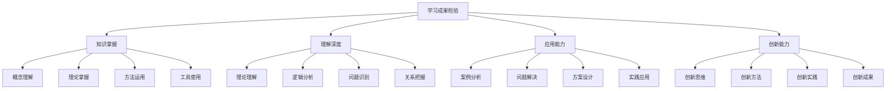
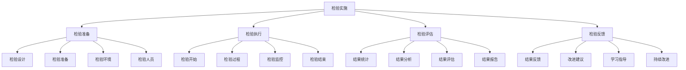

# 学习成果检验

## 🎯 学习成果检验概述

### 基本定义
**学习成果检验**是指通过系统性的评估方法，检验学习者对企业管理学知识的掌握程度、理解深度和应用能力的过程。

### 核心特征
- **系统性**：系统检验学习成果
- **全面性**：全面评估学习效果
- **客观性**：客观评估学习水平
- **发展性**：促进学习发展

## 📊 检验框架

### 1. 检验维度

#### 检验维度结构

#### 维度关系
- **知识掌握**：基础层，掌握基本知识
- **理解深度**：理解层，深入理解知识
- **应用能力**：应用层，应用知识解决问题
- **创新能力**：创新层，创新应用知识

### 2. 检验层次

#### 检验层次
- **基础层次**：基础知识和技能
- **理解层次**：理解和分析能力
- **应用层次**：应用和解决问题能力
- **创新层次**：创新和创造能力

#### 层次要求
- **基础层次**：掌握基本概念和理论
- **理解层次**：理解理论内涵和关系
- **应用层次**：应用理论解决实际问题
- **创新层次**：创新应用理论

## 🔍 检验方法

### 1. 检验类型

#### 按检验方式分类
- **笔试检验**：书面考试检验
- **实践检验**：实践操作检验
- **案例检验**：案例分析检验
- **项目检验**：项目实践检验

#### 按检验时间分类
- **过程检验**：学习过程检验
- **阶段检验**：学习阶段检验
- **期末检验**：学期末检验
- **综合检验**：综合学习检验

### 2. 检验工具

#### 检验工具
- **考试试卷**：标准化考试试卷
- **案例分析**：案例分析题目
- **实践项目**：实践项目任务
- **评估量表**：评估量表工具

#### 检验标准
- **评分标准**：评分标准体系
- **等级标准**：等级评定标准
- **能力标准**：能力评估标准
- **成果标准**：成果评估标准

## 📈 检验内容

### 1. 知识掌握检验

#### 基础概念
- **概念定义**：准确理解概念定义
- **概念关系**：理解概念间关系
- **概念应用**：正确应用概念
- **概念创新**：创新理解概念

#### 理论体系
- **理论内容**：掌握理论内容
- **理论逻辑**：理解理论逻辑
- **理论应用**：应用理论分析
- **理论发展**：了解理论发展

#### 方法工具
- **方法掌握**：掌握分析方法
- **工具使用**：熟练使用工具
- **方法应用**：正确应用方法
- **方法创新**：创新应用方法

### 2. 理解深度检验

#### 理论理解
- **理论内涵**：理解理论内涵
- **理论外延**：理解理论外延
- **理论关系**：理解理论关系
- **理论发展**：理解理论发展

#### 逻辑分析
- **逻辑思维**：逻辑思维能力
- **分析能力**：分析问题能力
- **综合能力**：综合思考能力
- **判断能力**：判断决策能力

#### 问题识别
- **问题敏感**：问题敏感度
- **问题分析**：问题分析能力
- **问题分类**：问题分类能力
- **问题解决**：问题解决能力

### 3. 应用能力检验

#### 案例分析
- **案例理解**：理解案例内容
- **问题识别**：识别案例问题
- **理论应用**：应用理论分析
- **方案设计**：设计解决方案

#### 问题解决
- **问题分析**：分析问题原因
- **方案设计**：设计解决方案
- **方案评估**：评估方案效果
- **方案实施**：实施解决方案

#### 实践应用
- **实践能力**：实践操作能力
- **应用能力**：知识应用能力
- **创新能力**：创新应用能力
- **改进能力**：持续改进能力

### 4. 创新能力检验

#### 创新思维
- **创新意识**：创新意识培养
- **创新思维**：创新思维方式
- **创新方法**：创新方法应用
- **创新实践**：创新实践活动

#### 创新成果
- **创新方案**：创新方案设计
- **创新产品**：创新产品开发
- **创新服务**：创新服务提供
- **创新管理**：创新管理实践

## 🎯 检验标准

### 1. 评分标准

#### 评分等级
- **优秀（90-100分）**：全面掌握，深入理解，熟练应用
- **良好（80-89分）**：较好掌握，较好理解，较好应用
- **中等（70-79分）**：基本掌握，基本理解，基本应用
- **及格（60-69分）**：初步掌握，初步理解，初步应用
- **不及格（60分以下）**：未掌握，未理解，未应用

#### 评分标准
- **知识掌握**：知识掌握程度
- **理解深度**：理解深度程度
- **应用能力**：应用能力程度
- **创新能力**：创新能力程度

### 2. 能力标准

#### 能力等级
- **初级**：基础知识和技能
- **中级**：理解和应用能力
- **高级**：分析和综合能力
- **专家**：创新和领导能力

#### 能力要求
- **初级要求**：掌握基本概念和理论
- **中级要求**：理解理论内涵和关系
- **高级要求**：应用理论解决复杂问题
- **专家要求**：创新应用理论

## 📊 检验实施

### 1. 实施流程

#### 实施步骤

#### 实施要求
- **公平性**：检验过程公平
- **客观性**：检验结果客观
- **准确性**：检验结果准确
- **有效性**：检验结果有效

### 2. 质量控制

#### 质量控制
- **检验设计**：检验设计质量
- **检验实施**：检验实施质量
- **检验评估**：检验评估质量
- **检验反馈**：检验反馈质量

#### 质量保证
- **标准统一**：检验标准统一
- **过程规范**：检验过程规范
- **结果可靠**：检验结果可靠
- **反馈及时**：检验反馈及时

## 🔍 检验案例

### 1. 综合检验案例

#### 案例背景
某企业管理学课程期末综合检验，检验学生综合学习成果。

#### 检验内容
**知识掌握检验**：
- 基础概念理解（20分）
- 理论体系掌握（30分）
- 方法工具使用（20分）

**理解深度检验**：
- 理论理解分析（30分）
- 逻辑思维分析（20分）
- 问题识别分析（20分）

**应用能力检验**：
- 案例分析应用（40分）
- 问题解决应用（30分）
- 实践应用能力（30分）

**创新能力检验**：
- 创新思维体现（20分）
- 创新方案设计（30分）
- 创新实践应用（20分）

#### 检验结果
- **优秀**：15%（90分以上）
- **良好**：35%（80-89分）
- **中等**：30%（70-79分）
- **及格**：15%（60-69分）
- **不及格**：5%（60分以下）

### 2. 实践检验案例

#### 案例背景
某企业管理实践项目检验，检验学生实践应用能力。

#### 检验内容
**项目设计**：
- 项目方案设计（30分）
- 项目实施计划（20分）
- 项目风险评估（20分）

**项目实施**：
- 项目实施过程（30分）
- 项目质量控制（20分）
- 项目团队协作（20分）

**项目成果**：
- 项目成果质量（40分）
- 项目创新程度（30分）
- 项目应用价值（30分）

#### 检验结果
- **优秀**：20%（90分以上）
- **良好**：40%（80-89分）
- **中等**：25%（70-79分）
- **及格**：10%（60-69分）
- **不及格**：5%（60分以下）

## 🎯 改进建议

### 1. 检验改进

#### 检验方法改进
- **方法创新**：创新检验方法
- **工具改进**：改进检验工具
- **标准完善**：完善检验标准
- **流程优化**：优化检验流程

#### 检验质量改进
- **质量控制**：加强质量控制
- **质量评估**：定期质量评估
- **质量改进**：持续质量改进
- **质量保证**：建立质量保证

### 2. 学习改进

#### 学习方法改进
- **方法优化**：优化学习方法
- **策略调整**：调整学习策略
- **资源利用**：充分利用资源
- **时间管理**：有效时间管理

#### 学习效果改进
- **目标明确**：明确学习目标
- **计划制定**：制定学习计划
- **过程监控**：监控学习过程
- **效果评估**：评估学习效果

## 📚 学习要点总结

### 核心概念
1. **学习成果检验**：系统性评估学习成果
2. **检验维度**：知识掌握、理解深度、应用能力、创新能力
3. **检验方法**：笔试、实践、案例、项目检验
4. **检验标准**：评分标准、能力标准
5. **检验实施**：实施流程、质量控制
6. **改进建议**：检验改进、学习改进

### 关键理解
- 学习成果检验需要系统性和全面性
- 检验需要客观性和准确性
- 检验结果需要及时反馈和改进
- 检验需要促进学习发展

### 实践应用
- 运用检验框架评估学习成果
- 使用检验方法提高检验质量
- 按照检验标准进行检验
- 根据检验结果改进学习

## 🔗 相关链接

- [[知识体系总结]] - 知识体系总结
- [[综合案例分析]] - 综合案例分析
- [[知识应用指导]] - 知识应用指导
- [[跨模块知识连接]] - 跨模块知识连接

## 📚 延伸阅读

- [[管理经典著作推荐]] - 管理经典著作推荐
- [[管理实践指南]] - 管理实践指南
- [[人工智能与管理]] - 人工智能与管理
- [[数字化转型研究]] - 数字化转型研究

---
*更新时间：2024年*
*内容将根据学习反馈持续优化*
