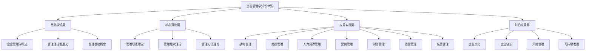
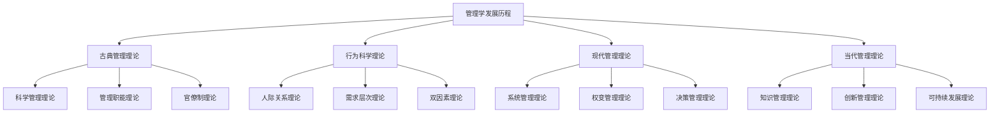

# 知识体系总结

## 🎯 知识体系概述

### 体系结构
**企业管理学知识体系**是一个系统性的知识框架，通过四个层次的知识组织，构建了完整的企业管理学学习体系。

### 核心特征
- **层次性**：四个层次递进
- **系统性**：系统组织知识
- **关联性**：知识相互关联
- **实用性**：注重实际应用

## 📊 知识体系架构

### 1. 四层知识架构

#### 知识层次结构

#### 层次关系
- **基础认知层**：奠定理论基础
- **核心理论层**：构建理论框架
- **应用实践层**：指导实践应用
- **综合应用层**：综合应用提升

### 2. 知识模块

#### 基础认知层模块
- **企业管理学概述**：学科定义、特征、体系
- **管理理论发展史**：理论发展历程
- **管理基础概念**：基本概念、角色、环境

#### 核心理论层模块
- **管理职能理论**：计划、组织、领导、控制
- **管理层次理论**：战略、战术、作业层
- **管理方法理论**：系统、权变、科学、人本

#### 应用实践层模块
- **战略管理**：战略分析、制定、实施
- **组织管理**：组织设计、行为、发展
- **人力资源管理**：规划、招聘、培训、绩效
- **营销管理**：市场分析、策略、组合
- **财务管理**：财务分析、投资、融资
- **运营管理**：生产、质量、供应链
- **信息管理**：信息系统、数据、知识

#### 综合应用层模块
- **企业文化**：文化内涵、建设、管理
- **企业创新**：创新理论、过程、绩效
- **风险管理**：风险识别、评估、控制
- **可持续发展**：理念、战略、实践

## 🔍 知识关联网络

### 1. 内部关联

#### 层次间关联
- **基础→核心**：基础认知支撑核心理论
- **核心→应用**：核心理论指导应用实践
- **应用→综合**：应用实践支撑综合应用
- **综合→基础**：综合应用反馈基础认知

#### 模块间关联
- **职能关联**：管理职能相互关联
- **层次关联**：管理层次相互支撑
- **方法关联**：管理方法相互补充
- **领域关联**：管理领域相互影响

### 2. 外部关联

#### 学科关联
- **经济学**：经济学理论基础
- **心理学**：心理学理论支撑
- **社会学**：社会学理论影响
- **数学**：数学工具应用

#### 实践关联
- **企业实践**：企业实际应用
- **行业实践**：行业特定应用
- **国际实践**：国际比较应用
- **历史实践**：历史经验借鉴

## 📈 知识发展脉络

### 1. 历史发展

#### 发展历程

#### 发展趋势
- **理论深化**：理论不断深化
- **方法创新**：方法持续创新
- **应用拓展**：应用领域拓展
- **跨学科融合**：跨学科融合发展

### 2. 未来趋势

#### 发展趋势
- **数字化管理**：数字化管理发展
- **智能化管理**：智能化管理发展
- **可持续发展**：可持续发展管理
- **全球化管理**：全球化管理发展

#### 新兴领域
- **人工智能管理**：AI在管理中的应用
- **平台经济管理**：平台经济管理
- **共享经济管理**：共享经济管理
- **循环经济管理**：循环经济管理

## 🎯 知识应用指导

### 1. 学习路径

#### 学习顺序
1. **基础认知层**：建立基础认知
2. **核心理论层**：掌握核心理论
3. **应用实践层**：学习应用实践
4. **综合应用层**：提升综合应用

#### 学习方法
- **系统学习**：系统学习知识
- **重点突破**：重点突破难点
- **实践结合**：理论与实践结合
- **持续改进**：持续改进学习

### 2. 应用策略

#### 应用原则
- **理论指导**：理论指导实践
- **实践验证**：实践验证理论
- **创新应用**：创新应用方法
- **持续改进**：持续改进应用

#### 应用方法
- **案例分析**：案例分析应用
- **项目实践**：项目实践应用
- **工具应用**：工具方法应用
- **经验总结**：经验总结应用

## 📊 知识体系价值

### 1. 理论价值

#### 理论贡献
- **理论体系**：构建完整理论体系
- **理论创新**：推动理论创新
- **理论应用**：指导理论应用
- **理论发展**：促进理论发展

#### 理论意义
- **学科发展**：推动学科发展
- **知识积累**：积累知识财富
- **理论指导**：提供理论指导
- **理论创新**：促进理论创新

### 2. 实践价值

#### 实践指导
- **管理实践**：指导管理实践
- **决策支持**：支持管理决策
- **问题解决**：解决管理问题
- **绩效提升**：提升管理绩效

#### 实践意义
- **管理提升**：提升管理水平
- **效率改善**：改善管理效率
- **质量提升**：提升管理质量
- **创新发展**：促进管理创新

## 🔍 知识体系特点

### 1. 体系特点

#### 结构特点
- **层次清晰**：层次结构清晰
- **逻辑严密**：逻辑关系严密
- **内容完整**：内容体系完整
- **关联性强**：知识关联性强

#### 功能特点
- **指导性强**：实践指导性强
- **应用性强**：实际应用性强
- **创新性强**：理论创新性强
- **发展性强**：持续发展性强

### 2. 优势特点

#### 理论优势
- **理论完整**：理论体系完整
- **理论先进**：理论内容先进
- **理论实用**：理论实用性强
- **理论创新**：理论创新性强

#### 实践优势
- **实践指导**：实践指导性强
- **实践应用**：实践应用广泛
- **实践效果**：实践效果显著
- **实践创新**：实践创新性强

## 🎯 学习建议

### 1. 学习策略

#### 学习原则
- **系统学习**：系统学习知识
- **重点突破**：重点突破难点
- **实践结合**：理论与实践结合
- **持续改进**：持续改进学习

#### 学习方法
- **阅读学习**：阅读相关文献
- **案例分析**：分析管理案例
- **实践应用**：实际应用知识
- **经验总结**：总结学习经验

### 2. 应用建议

#### 应用原则
- **理论指导**：理论指导实践
- **实践验证**：实践验证理论
- **创新应用**：创新应用方法
- **持续改进**：持续改进应用

#### 应用方法
- **案例分析**：案例分析应用
- **项目实践**：项目实践应用
- **工具应用**：工具方法应用
- **经验总结**：经验总结应用

## 📚 学习要点总结

### 核心概念
1. **知识体系**：系统性的知识框架
2. **四层架构**：基础、核心、应用、综合
3. **知识关联**：内部关联、外部关联
4. **发展脉络**：历史发展、未来趋势
5. **应用指导**：学习路径、应用策略
6. **体系价值**：理论价值、实践价值

### 关键理解
- 知识体系是学习的重要框架
- 四层架构递进发展
- 知识关联形成网络
- 应用指导实践

### 实践应用
- 运用知识体系指导学习
- 按照学习路径系统学习
- 运用应用策略指导实践
- 持续改进学习应用

## 🔗 相关链接

- [[学习成果检验]] - 学习成果检验
- [[综合案例分析]] - 综合案例分析
- [[知识应用指导]] - 知识应用指导
- [[跨模块知识连接]] - 跨模块知识连接

## 📚 延伸阅读

- [[管理经典著作推荐]] - 管理经典著作推荐
- [[管理实践指南]] - 管理实践指南
- [[人工智能与管理]] - 人工智能与管理
- [[数字化转型研究]] - 数字化转型研究

---
*更新时间：2024年*
*内容将根据学习反馈持续优化*
