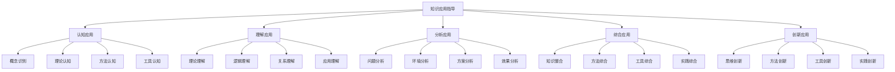
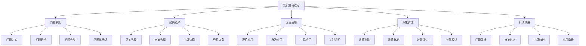

# 知识应用指导

## 🎯 知识应用概述

### 基本定义
**知识应用指导**是指将企业管理学理论知识转化为实践能力，指导学习者如何在实际工作中有效运用管理知识解决问题、提升绩效的过程。

### 核心特征
- **实用性**：注重实际应用
- **系统性**：系统应用知识
- **创新性**：创新应用方法
- **有效性**：确保应用效果

## 📊 应用框架

### 1. 应用层次

#### 知识应用结构

#### 应用递进
- **认知应用**：基础认知应用
- **理解应用**：深入理解应用
- **分析应用**：分析问题应用
- **综合应用**：综合知识应用
- **创新应用**：创新方法应用

### 2. 应用领域

#### 应用领域
- **战略应用**：战略管理应用
- **组织应用**：组织管理应用
- **人力应用**：人力资源管理应用
- **营销应用**：营销管理应用
- **财务应用**：财务管理应用
- **运营应用**：运营管理应用

#### 应用场景
- **决策场景**：管理决策应用
- **问题场景**：问题解决应用
- **改进场景**：持续改进应用
- **创新场景**：管理创新应用

## 🔍 应用方法

### 1. 应用步骤

#### 应用过程

#### 应用原则
- **问题导向**：以问题为导向
- **理论指导**：理论指导实践
- **方法科学**：方法科学有效
- **效果导向**：注重应用效果

### 2. 应用技巧

#### 应用技巧
- **问题识别技巧**：准确识别问题
- **知识选择技巧**：恰当选择知识
- **方法应用技巧**：有效应用方法
- **效果评估技巧**：客观评估效果

#### 应用策略
- **系统策略**：系统应用知识
- **重点策略**：重点应用关键知识
- **创新策略**：创新应用方法
- **持续策略**：持续改进应用

## 📈 应用实践

### 1. 战略管理应用

#### 应用场景
- **战略制定**：制定企业战略
- **战略实施**：实施战略计划
- **战略评估**：评估战略效果
- **战略调整**：调整战略方向

#### 应用方法
**战略分析应用**：
- 运用SWOT分析分析内外部环境
- 运用波特五力模型分析行业竞争
- 运用价值链分析分析价值创造
- 运用BCG矩阵分析业务组合

**战略制定应用**：
- 运用战略理论制定战略目标
- 运用战略方法制定战略方案
- 运用战略工具评估战略方案
- 运用战略经验优化战略选择

**战略实施应用**：
- 运用组织理论设计组织结构
- 运用领导理论建立领导团队
- 运用控制理论建立控制机制
- 运用激励理论建立激励机制

#### 应用案例
**案例背景**：某制造企业制定数字化转型战略
**应用过程**：
1. **问题识别**：识别数字化转型需求
2. **知识选择**：选择战略管理理论
3. **方法应用**：应用SWOT分析、价值链分析
4. **效果评估**：评估战略制定效果
5. **持续改进**：持续改进战略实施

**应用效果**：
- **战略清晰**：战略目标清晰明确
- **方案可行**：战略方案切实可行
- **实施有效**：战略实施效果显著
- **持续改进**：持续改进战略管理

### 2. 组织管理应用

#### 应用场景
- **组织设计**：设计组织结构
- **组织变革**：推动组织变革
- **组织发展**：促进组织发展
- **组织文化**：建设组织文化

#### 应用方法
**组织设计应用**：
- 运用组织理论设计组织结构
- 运用组织方法优化组织流程
- 运用组织工具评估组织效果
- 运用组织经验改进组织管理

**组织变革应用**：
- 运用变革理论分析变革需求
- 运用变革方法制定变革方案
- 运用变革工具实施变革计划
- 运用变革经验优化变革效果

**组织发展应用**：
- 运用发展理论制定发展计划
- 运用发展方法实施发展措施
- 运用发展工具评估发展效果
- 运用发展经验持续改进发展

#### 应用案例
**案例背景**：某服务企业进行组织变革
**应用过程**：
1. **问题识别**：识别组织变革需求
2. **知识选择**：选择组织管理理论
3. **方法应用**：应用组织设计、变革管理
4. **效果评估**：评估变革实施效果
5. **持续改进**：持续改进组织管理

**应用效果**：
- **结构优化**：组织结构优化改善
- **效率提升**：组织效率显著提升
- **文化改善**：组织文化明显改善
- **持续发展**：组织持续健康发展

### 3. 人力资源管理应用

#### 应用场景
- **人才规划**：制定人才规划
- **人才招聘**：实施人才招聘
- **人才培训**：开展人才培训
- **绩效管理**：实施绩效管理

#### 应用方法
**人才规划应用**：
- 运用人力资源理论分析人才需求
- 运用规划方法制定人才规划
- 运用规划工具评估规划效果
- 运用规划经验优化人才管理

**人才招聘应用**：
- 运用招聘理论设计招聘流程
- 运用招聘方法实施招聘活动
- 运用招聘工具评估招聘效果
- 运用招聘经验改进招聘管理

**人才培训应用**：
- 运用培训理论设计培训体系
- 运用培训方法实施培训计划
- 运用培训工具评估培训效果
- 运用培训经验优化培训管理

#### 应用案例
**案例背景**：某科技企业实施人才战略
**应用过程**：
1. **问题识别**：识别人才发展需求
2. **知识选择**：选择人力资源管理理论
3. **方法应用**：应用人才规划、培训管理
4. **效果评估**：评估人才管理效果
5. **持续改进**：持续改进人才管理

**应用效果**：
- **人才结构**：人才结构优化改善
- **能力提升**：人才能力显著提升
- **绩效改善**：人才绩效明显改善
- **持续发展**：人才持续健康发展

## 🎯 应用工具

### 1. 分析工具

#### 分析工具
- **SWOT分析**：优势劣势机会威胁分析
- **波特五力模型**：行业竞争分析
- **价值链分析**：价值创造分析
- **BCG矩阵**：业务组合分析

#### 工具应用
- **工具选择**：根据问题选择工具
- **工具使用**：正确使用分析工具
- **结果分析**：分析工具结果
- **效果评估**：评估工具效果

### 2. 决策工具

#### 决策工具
- **决策树**：决策分析工具
- **德尔菲法**：专家决策工具
- **层次分析法**：多准则决策工具
- **头脑风暴法**：创意决策工具

#### 工具应用
- **问题分析**：分析决策问题
- **方案设计**：设计决策方案
- **方案评估**：评估决策方案
- **方案选择**：选择最优方案

### 3. 评估工具

#### 评估工具
- **平衡计分卡**：绩效评估工具
- **KPI指标**：关键绩效指标
- **360度评估**：全方位评估工具
- **绩效矩阵**：绩效评估矩阵

#### 工具应用
- **指标设定**：设定评估指标
- **数据收集**：收集评估数据
- **结果分析**：分析评估结果
- **改进建议**：提出改进建议

## 🔍 应用评估

### 1. 评估维度

#### 评估维度
- **应用效果**：应用效果评估
- **应用效率**：应用效率评估
- **应用质量**：应用质量评估
- **应用创新**：应用创新评估

#### 评估指标
- **效果指标**：应用效果指标
- **效率指标**：应用效率指标
- **质量指标**：应用质量指标
- **创新指标**：应用创新指标

### 2. 评估方法

#### 评估方法
- **定量评估**：定量评估方法
- **定性评估**：定性评估方法
- **综合评估**：综合评估方法
- **对比评估**：对比评估方法

#### 评估工具
- **评估量表**：评估量表工具
- **评估标准**：评估标准工具
- **评估方法**：评估方法工具
- **评估报告**：评估报告工具

## 📚 学习要点总结

### 核心概念
1. **知识应用指导**：将理论知识转化为实践能力
2. **应用层次**：认知、理解、分析、综合、创新应用
3. **应用方法**：问题识别、知识选择、方法应用、效果评估
4. **应用实践**：战略、组织、人力资源等管理应用
5. **应用工具**：分析工具、决策工具、评估工具
6. **应用评估**：效果、效率、质量、创新评估

### 关键理解
- 知识应用需要系统性和创新性
- 应用需要理论指导和方法支撑
- 应用效果需要评估和改进
- 应用需要持续学习和提升

### 实践应用
- 运用应用框架指导实践
- 使用应用方法提升效果
- 运用应用工具支持分析
- 按照评估标准改进应用

## 🔗 相关链接

- [[知识体系总结]] - 知识体系总结
- [[综合案例分析]] - 综合案例分析
- [[学习成果检验]] - 学习成果检验
- [[跨模块知识连接]] - 跨模块知识连接

## 📚 延伸阅读

- [[管理经典著作推荐]] - 管理经典著作推荐
- [[管理实践指南]] - 管理实践指南
- [[人工智能与管理]] - 人工智能与管理
- [[数字化转型研究]] - 数字化转型研究

---
*更新时间：2024年*
*内容将根据学习反馈持续优化*
