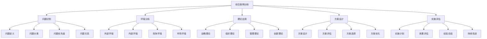

# 综合案例分析

## 🎯 综合案例分析概述

### 基本定义
**综合案例分析**是指运用企业管理学的综合知识，对复杂的企业管理问题进行系统分析，提出解决方案的过程。

### 核心特征
- **综合性**：综合运用多种知识
- **系统性**：系统分析问题
- **实践性**：注重实际应用
- **创新性**：创新解决方案

## 📊 案例分析框架

### 1. 分析框架

#### 综合分析框架

#### 分析维度
- **战略维度**：战略层面分析
- **组织维度**：组织层面分析
- **运营维度**：运营层面分析
- **创新维度**：创新层面分析

### 2. 分析方法

#### 分析方法
- **系统分析法**：系统分析问题
- **对比分析法**：对比分析方案
- **因果分析法**：因果分析问题
- **综合分析法**：综合分析问题

#### 分析工具
- **SWOT分析**：优势劣势机会威胁
- **波特五力模型**：行业竞争分析
- **价值链分析**：价值创造分析
- **平衡计分卡**：绩效管理分析

## 🔍 案例分析方法

### 1. 分析步骤

#### 分析过程

```mermaid
graph TB
    A[案例分析过程] --> B[案例阅读]
    A --> C[问题识别]
    A --> D[信息收集]
    A --> E[理论应用]
    A --> F[方案设计]
    A --> G[方案评估]
    A --> H[结论建议]
    
    B --> B1[案例背景]
    B --> B2[案例内容]
    B --> B3[案例数据]
    B --> B4[案例问题]
    
    C --> C1[主要问题]
    C --> C2[次要问题]
    C --> C3[问题关系]
    C --> C4[问题优先级]
    
    D --> D1[内部信息]
    D --> D2[外部信息]
    D --> D3[历史信息]
    D --> D4[对比信息]
    
    E --> E1[理论选择]
    E --> E2[理论应用]
    E --> E3[理论验证]
    E --> E4[理论创新]
    
    F --> F1[方案构思]
    F --> F2[方案设计]
    F --> F3[方案比较]
    F --> F4[方案优化]
    
    G --> G1[可行性评估]
    G --> G2[效果评估]
    G --> G3[风险评估]
    G --> G4[资源评估]
    
    H --> H1[分析结论]
    H --> H2[解决方案]
    H --> H3[实施建议]
    H --> H4[风险提示]
```

#### 分析技巧
- **问题导向**：以问题为导向
- **理论支撑**：理论支撑分析
- **数据验证**：数据验证结论
- **创新思维**：创新思维分析

### 2. 分析质量

#### 质量要求
- **准确性**：分析准确可靠
- **完整性**：分析完整全面
- **逻辑性**：逻辑清晰严密
- **创新性**：创新解决方案

#### 质量保证
- **多角度分析**：多角度分析问题
- **理论验证**：理论验证结论
- **实践检验**：实践检验方案
- **持续改进**：持续改进分析

## 📈 综合案例示例

### 1. 企业转型案例

#### 案例背景
某传统制造企业面临市场变化，需要进行数字化转型。

#### 问题识别
- **市场问题**：市场需求变化，竞争加剧
- **技术问题**：技术落后，效率低下
- **管理问题**：管理方式落后，决策缓慢
- **人才问题**：人才结构不合理，技能不足

#### 环境分析
**外部环境**：
- 市场需求个性化、多样化
- 技术发展迅速，数字化趋势明显
- 竞争加剧，成本压力增大
- 政策支持数字化转型

**内部环境**：
- 传统制造优势明显
- 技术积累丰富
- 管理经验丰富
- 资金实力较强

#### 理论应用
- **战略理论**：制定数字化转型战略
- **组织理论**：优化组织结构
- **创新理论**：推动技术创新
- **变革理论**：管理组织变革

#### 方案设计
**战略方案**：
- 制定数字化转型战略
- 明确转型目标和路径
- 配置转型资源
- 建立转型保障

**组织方案**：
- 优化组织结构
- 建立数字化团队
- 完善管理制度
- 建设数字化文化

**技术方案**：
- 引入先进技术
- 建设数字化平台
- 优化生产流程
- 提升技术水平

**人才方案**：
- 引进数字化人才
- 培训现有员工
- 建立激励机制
- 提升人才素质

#### 方案评估
- **可行性评估**：方案可行性高
- **效果评估**：预期效果显著
- **风险评估**：风险可控
- **资源评估**：资源需求合理

#### 实施建议
- **分步实施**：分步实施转型
- **重点突破**：重点突破关键环节
- **持续改进**：持续改进转型
- **风险控制**：控制转型风险

### 2. 行业创新案例

#### 案例背景
某服务行业面临创新挑战，需要推动行业创新发展。

#### 问题识别
- **服务问题**：服务质量不高，效率低下
- **技术问题**：技术应用不足，创新不够
- **管理问题**：管理方式落后，缺乏创新
- **竞争问题**：竞争激烈，差异化不足

#### 环境分析
**外部环境**：
- 服务需求升级，个性化要求提高
- 技术发展迅速，应用前景广阔
- 竞争加剧，差异化要求提高
- 政策支持创新发展

**内部环境**：
- 服务经验丰富
- 客户基础良好
- 技术基础薄弱
- 创新能力不足

#### 理论应用
- **创新理论**：推动服务创新
- **服务理论**：提升服务质量
- **技术理论**：应用新技术
- **竞争理论**：建立竞争优势

#### 方案设计
**创新方案**：
- 制定创新发展战略
- 建立创新管理体系
- 推动服务模式创新
- 建设创新文化

**服务方案**：
- 提升服务质量
- 优化服务流程
- 个性化服务
- 客户体验改善

**技术方案**：
- 引入先进技术
- 建设技术平台
- 技术应用推广
- 技术能力提升

**竞争方案**：
- 差异化竞争策略
- 品牌建设
- 市场拓展
- 竞争优势建立

#### 方案评估
- **可行性评估**：方案可行性较高
- **效果评估**：预期效果良好
- **风险评估**：风险可控
- **资源评估**：资源需求适中

#### 实施建议
- **创新驱动**：以创新驱动发展
- **技术支撑**：以技术支撑创新
- **服务提升**：以服务提升竞争力
- **持续改进**：持续改进创新

## 🎯 案例分析技巧

### 1. 分析技巧

#### 分析技巧
- **问题导向**：以问题为导向分析
- **理论支撑**：理论支撑分析
- **数据验证**：数据验证结论
- **创新思维**：创新思维分析

#### 分析质量
- **准确性**：分析准确可靠
- **完整性**：分析完整全面
- **逻辑性**：逻辑清晰严密
- **创新性**：创新解决方案

### 2. 写作技巧

#### 写作结构
- **案例背景**：介绍案例背景
- **问题分析**：分析主要问题
- **理论应用**：应用相关理论
- **方案设计**：设计解决方案
- **实施建议**：提出实施建议

#### 写作要求
- **结构清晰**：结构清晰明了
- **逻辑严密**：逻辑严密合理
- **内容充实**：内容充实具体
- **表达准确**：表达准确清晰

## 📊 案例分析评估

### 1. 评估标准

#### 评估维度
- **分析深度**：分析深度评估
- **理论应用**：理论应用评估
- **方案设计**：方案设计评估
- **创新程度**：创新程度评估

#### 评估指标
- **问题识别**：问题识别准确性
- **理论应用**：理论应用恰当性
- **方案设计**：方案设计合理性
- **实施建议**：实施建议可行性

### 2. 评估方法

#### 评估方法
- **专家评估**：专家评估意见
- **同行评估**：同行评估意见
- **自我评估**：自我评估反思
- **综合评估**：综合评估结果

#### 评估工具
- **评估量表**：评估量表工具
- **评估标准**：评估标准工具
- **评估方法**：评估方法工具
- **评估报告**：评估报告工具

## 🎯 学习要点总结

### 核心概念
1. **综合案例分析**：运用综合知识分析复杂问题
2. **分析框架**：问题识别、环境分析、理论应用、方案设计
3. **分析方法**：系统分析、对比分析、因果分析
4. **分析工具**：SWOT分析、波特五力模型、价值链分析
5. **分析技巧**：问题导向、理论支撑、数据验证
6. **评估标准**：分析深度、理论应用、方案设计、创新程度

### 关键理解
- 综合案例分析需要系统性和创新性
- 分析需要理论支撑和实践验证
- 方案设计需要可行性和创新性
- 实施建议需要可操作性和有效性

### 实践应用
- 运用综合分析框架分析问题
- 使用分析工具提高分析质量
- 运用分析技巧提升分析水平
- 按照评估标准改进分析

## 🔗 相关链接

- [[知识体系总结]] - 知识体系总结
- [[学习成果检验]] - 学习成果检验
- [[知识应用指导]] - 知识应用指导
- [[跨模块知识连接]] - 跨模块知识连接

## 📚 延伸阅读

- [[管理经典著作推荐]] - 管理经典著作推荐
- [[管理实践指南]] - 管理实践指南
- [[人工智能与管理]] - 人工智能与管理
- [[数字化转型研究]] - 数字化转型研究

---
*更新时间：2024年*
*内容将根据学习反馈持续优化*
