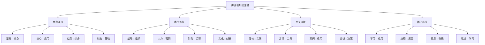
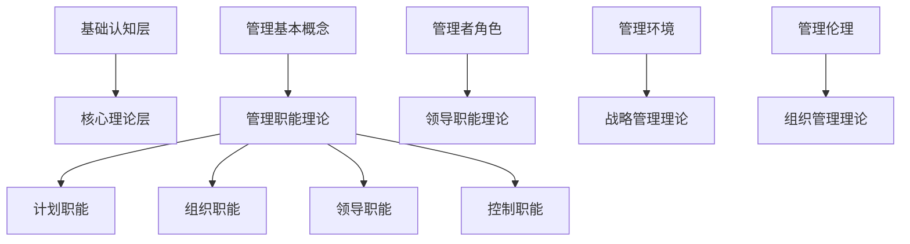
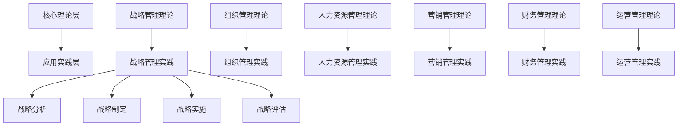
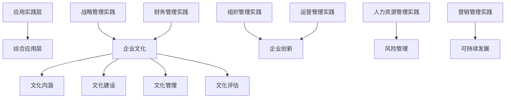
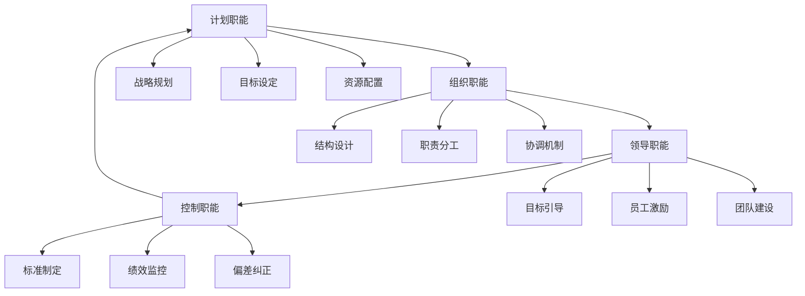
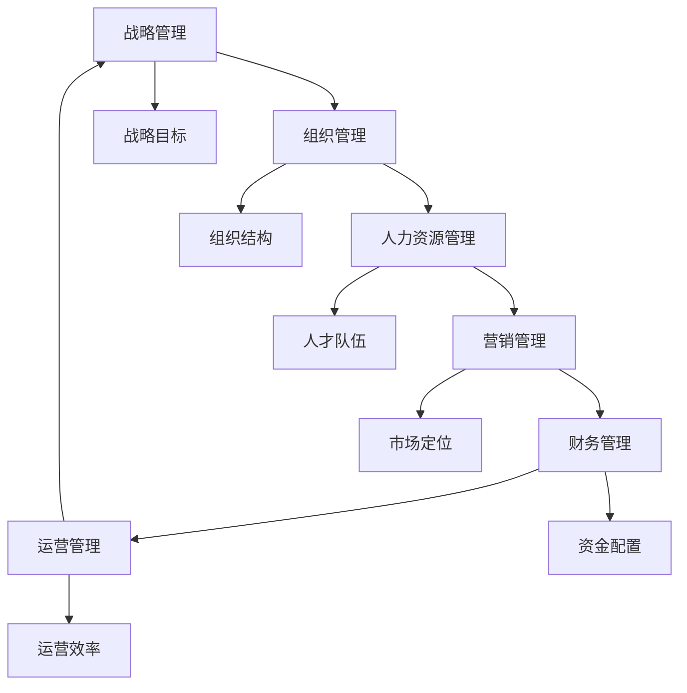
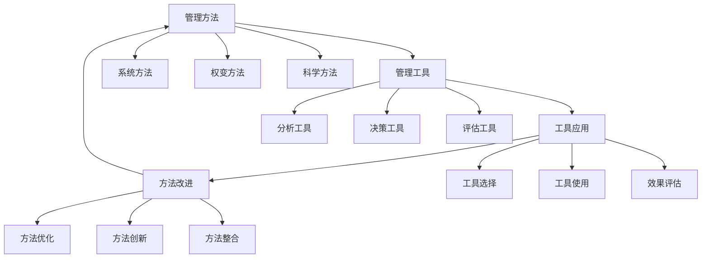

# 跨模块知识连接

## 🔗 知识连接概述

### 基本定义
**跨模块知识连接**是指将企业管理学知识体系中不同模块、不同层次的知识点进行有机连接，形成知识网络，实现知识的系统整合和综合应用。

### 核心特征
- **系统性**：系统连接知识
- **关联性**：建立知识关联
- **层次性**：跨层次连接
- **实用性**：指导实践应用

## 📊 知识连接框架

### 1. 连接类型

#### 知识连接结构

#### 连接关系
- **垂直连接**：层次间知识连接
- **水平连接**：同层次知识连接
- **交叉连接**：跨领域知识连接
- **循环连接**：循环反馈连接

### 2. 连接维度

#### 连接维度
- **理论维度**：理论间连接
- **方法维度**：方法间连接
- **工具维度**：工具间连接
- **实践维度**：实践间连接

#### 连接强度
- **强连接**：直接相关，紧密联系
- **中连接**：间接相关，一般联系
- **弱连接**：潜在相关，松散联系

## 🔍 知识连接模式

### 1. 垂直连接模式

#### 基础认知层→核心理论层

#### 核心理论层→应用实践层

#### 应用实践层→综合应用层

### 2. 水平连接模式

#### 管理职能间连接

#### 管理领域间连接

### 3. 交叉连接模式

#### 理论↔实践连接

#### 方法↔工具连接

## 📈 知识连接应用

### 1. 学习应用

#### 学习路径优化
- **系统学习**：按连接关系系统学习
- **重点突破**：重点突破关键连接点
- **循环巩固**：循环巩固知识连接
- **综合应用**：综合应用知识网络

#### 学习方法
- **关联学习**：关联学习相关知识
- **对比学习**：对比学习不同理论
- **案例学习**：案例学习理论应用
- **实践学习**：实践学习知识应用

### 2. 研究应用

#### 研究思路
- **跨领域研究**：跨领域研究问题
- **综合研究**：综合研究复杂问题
- **比较研究**：比较研究不同理论
- **实证研究**：实证研究理论应用

#### 研究方法
- **系统分析法**：系统分析知识连接
- **网络分析法**：网络分析知识关系
- **案例研究法**：案例研究知识应用
- **实证研究法**：实证研究知识效果

### 3. 实践应用

#### 问题解决
- **系统思维**：系统思维解决问题
- **综合应用**：综合应用知识网络
- **创新应用**：创新应用知识连接
- **持续改进**：持续改进知识应用

#### 决策支持
- **多角度分析**：多角度分析问题
- **综合评估**：综合评估方案
- **风险控制**：风险控制决策
- **效果优化**：效果优化决策

## 🎯 知识连接案例

### 1. 战略管理连接案例

#### 案例背景
某企业制定发展战略，需要运用跨模块知识。

#### 知识连接
**基础认知层**：
- 管理基本概念 → 战略管理概念
- 管理环境分析 → 战略环境分析
- 管理者角色 → 战略管理者角色

**核心理论层**：
- 战略管理理论 → 战略分析理论
- 组织管理理论 → 组织结构理论
- 人力资源管理理论 → 人才战略理论

**应用实践层**：
- 战略分析 → SWOT分析
- 战略制定 → 战略规划
- 战略实施 → 战略执行

**综合应用层**：
- 企业文化 → 战略文化
- 企业创新 → 战略创新
- 风险管理 → 战略风险

#### 连接效果
- **理论支撑**：理论支撑实践
- **方法指导**：方法指导应用
- **工具支持**：工具支持分析
- **效果提升**：效果显著提升

### 2. 组织管理连接案例

#### 案例背景
某企业进行组织变革，需要运用跨模块知识。

#### 知识连接
**基础认知层**：
- 管理基本概念 → 组织管理概念
- 管理环境分析 → 组织环境分析
- 管理伦理 → 组织伦理

**核心理论层**：
- 组织管理理论 → 组织结构理论
- 人力资源管理理论 → 组织行为理论
- 领导职能理论 → 组织领导理论

**应用实践层**：
- 组织结构设计 → 组织变革设计
- 组织行为分析 → 变革行为分析
- 组织发展 → 变革发展

**综合应用层**：
- 企业文化 → 变革文化
- 企业创新 → 组织创新
- 风险管理 → 变革风险

#### 连接效果
- **变革成功**：变革成功实施
- **效果显著**：效果显著改善
- **风险控制**：风险有效控制
- **持续改进**：持续改进提升

## 🔍 知识连接技巧

### 1. 连接技巧

#### 连接方法
- **概念连接**：概念间连接
- **理论连接**：理论间连接
- **方法连接**：方法间连接
- **工具连接**：工具间连接

#### 连接策略
- **系统连接**：系统连接知识
- **重点连接**：重点连接关键知识
- **动态连接**：动态调整连接
- **创新连接**：创新连接方式

### 2. 连接质量

#### 质量要求
- **准确性**：连接准确可靠
- **完整性**：连接完整全面
- **逻辑性**：连接逻辑清晰
- **实用性**：连接实用有效

#### 质量保证
- **连接验证**：验证连接正确性
- **效果评估**：评估连接效果
- **持续改进**：持续改进连接
- **质量监控**：监控连接质量

## 📚 学习要点总结

### 核心概念
1. **跨模块知识连接**：不同模块知识有机连接
2. **连接类型**：垂直、水平、交叉、循环连接
3. **连接模式**：基础→核心→应用→综合
4. **连接应用**：学习、研究、实践应用
5. **连接技巧**：连接方法、连接策略
6. **连接质量**：准确性、完整性、逻辑性

### 关键理解
- 知识连接形成知识网络
- 连接促进知识整合应用
- 连接需要系统性和逻辑性
- 连接质量影响应用效果

### 实践应用
- 运用连接框架整合知识
- 使用连接模式指导学习
- 运用连接技巧提升效果
- 保证连接质量优化应用

## 🔗 相关链接

- [[知识体系总结]] - 知识体系总结
- [[综合案例分析]] - 综合案例分析
- [[学习成果检验]] - 学习成果检验
- [[知识应用指导]] - 知识应用指导

## 📚 延伸阅读

- [[管理经典著作推荐]] - 管理经典著作推荐
- [[管理实践指南]] - 管理实践指南
- [[人工智能与管理]] - 人工智能与管理
- [[数字化转型研究]] - 数字化转型研究

---
*更新时间：2024年*
*内容将根据学习反馈持续优化*
