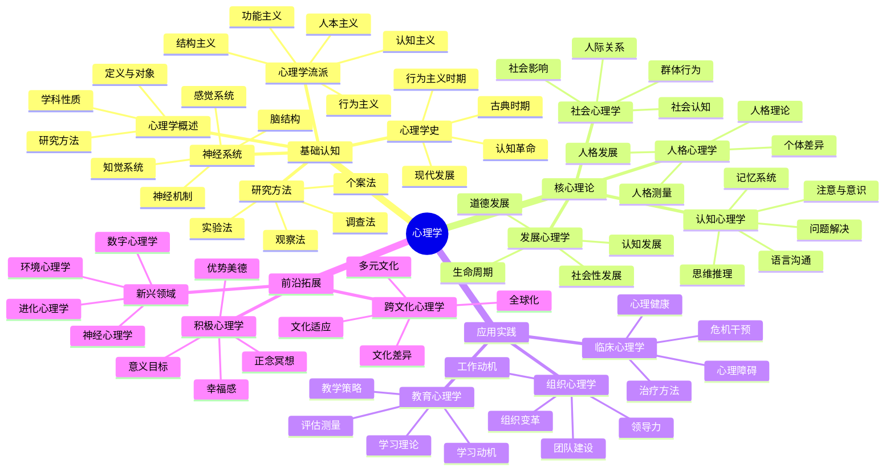
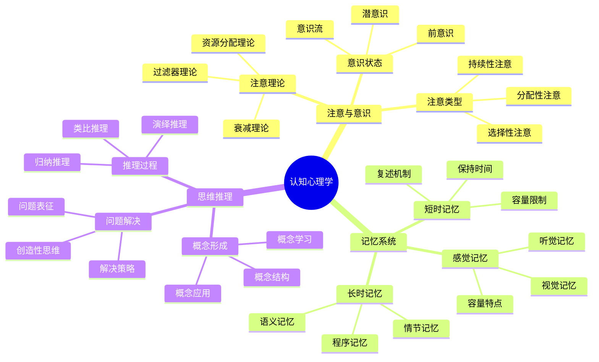
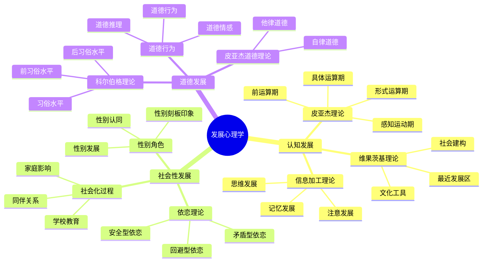
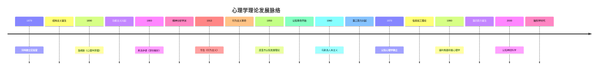
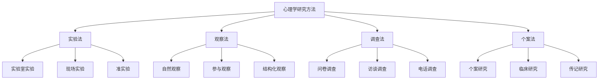
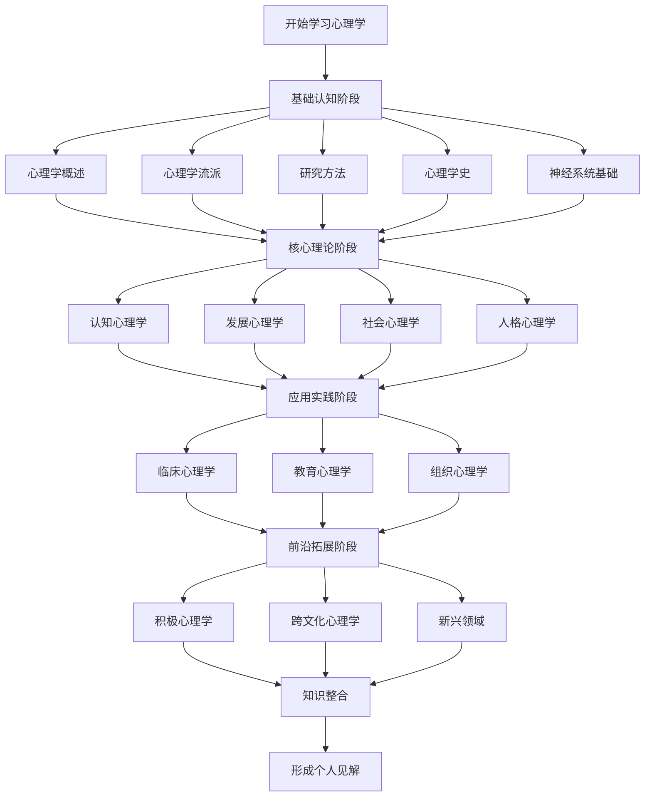
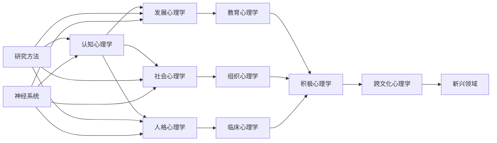

# 心理学思维导图

## 🗺️ 思维导图使用指南

### 思维导图原理
思维导图是一种可视化思维工具，通过图形化方式展现知识的层次结构和关联关系，特别适合INTJ学习者的结构化思维特点。

### 制作原则
1. **中心主题**：明确核心概念
2. **分支结构**：逻辑层次清晰
3. **关键词**：简洁有力
4. **视觉元素**：颜色、图标、线条
5. **关联连接**：概念间的关系

## 📊 心理学知识结构图

### 1. 整体知识架构

### 2. 认知心理学结构图

### 3. 发展心理学结构图

## 🔗 概念关系图

### 1. 理论发展脉络图

### 2. 研究方法关系图

## 📈 学习路径图

### 1. 学习阶段流程图

### 2. 知识连接网络图

## 🎯 思维导图制作技巧

### 1. 制作步骤

#### 第一步：确定中心主题
- 选择核心概念
- 写在纸张中央
- 用图形突出显示

#### 第二步：绘制主要分支
- 从中心向外辐射
- 使用不同颜色
- 保持分支平衡

#### 第三步：添加次级分支
- 细化主要概念
- 保持层次清晰
- 使用关键词

#### 第四步：建立关联
- 连接相关概念
- 使用箭头指示
- 标注关系类型

#### 第五步：美化完善
- 添加图标符号
- 调整颜色搭配
- 检查逻辑结构

### 2. 设计原则

#### 视觉设计
- **颜色编码**：不同主题使用不同颜色
- **字体大小**：重要概念使用大字体
- **线条粗细**：主要分支使用粗线条
- **图标使用**：增加视觉识别度

#### 结构设计
- **层次清晰**：主次分明
- **逻辑合理**：符合认知规律
- **平衡美观**：视觉平衡
- **简洁明了**：避免冗余

### 3. 制作工具

#### 手绘工具
- **纸张**：A4或A3纸张
- **彩笔**：多种颜色
- **铅笔**：打草稿
- **橡皮**：修改错误

#### 数字工具
- **MindMeister**：在线思维导图
- **XMind**：专业思维导图软件
- **FreeMind**：开源免费软件
- **Draw.io**：在线绘图工具

## 📚 思维导图应用场景

### 1. 学习应用

#### 课前预习
- 构建知识框架
- 了解学习重点
- 建立学习目标

#### 课中记录
- 记录关键概念
- 建立概念联系
- 标注重点难点

#### 课后复习
- 整理知识结构
- 强化概念记忆
- 检查理解程度

### 2. 研究应用

#### 文献综述
- 整理研究脉络
- 分析理论关系
- 识别研究空白

#### 实验设计
- 设计实验框架
- 确定变量关系
- 规划实验步骤

#### 数据分析
- 整理分析思路
- 确定分析方法
- 规划结果呈现

### 3. 教学应用

#### 课程设计
- 规划课程结构
- 确定教学重点
- 设计教学流程

#### 课堂讲解
- 展示知识结构
- 引导思维过程
- 促进理解记忆

#### 学习评估
- 检查知识掌握
- 评估理解程度
- 指导学习改进

## 🔄 思维导图优化策略

### 1. 持续更新
- **定期修订**：根据学习进展更新
- **内容补充**：添加新的知识点
- **结构优化**：调整逻辑关系
- **视觉改进**：美化视觉效果

### 2. 个性化定制
- **学习风格**：适应个人学习特点
- **知识背景**：结合已有知识
- **学习目标**：聚焦学习重点
- **应用需求**：满足实际需要

### 3. 协作共享
- **团队学习**：共同制作思维导图
- **知识分享**：分享学习成果
- **讨论交流**：讨论不同观点
- **互相学习**：学习他人经验

---

**相关链接**：
- [[00-01-学习指南]] - 学习方法
- [[00-06-记忆技巧]] - 记忆策略
- [[02-01-认知心理学]] - 认知理论
- [[99-08-知识地图]] - 个人知识地图
