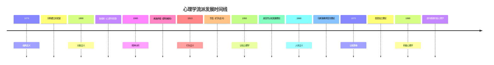

# 心理学流派

## 🏛️ 心理学流派概述

### 流派定义
心理学流派是指在特定历史时期，具有相似理论观点和研究方法的一群心理学家所形成的学术群体。

### 流派特征
- **共同的理论基础**：相似的理论假设
- **共同的研究方法**：相似的研究方法
- **共同的研究对象**：相似的研究重点
- **共同的应用领域**：相似的应用方向

## 📚 主要心理学流派

### 1. 结构主义 (Structuralism)

#### 基本观点
- **研究对象**：意识的结构和内容
- **研究方法**：[[01-03-研究方法]] - 内省法
- **核心假设**：意识可以分解为基本元素

#### 代表人物
- **威廉·冯特** (Wilhelm Wundt, 1832-1920)
  - 心理学之父
  - 建立第一个心理学实验室
  - 提出内省法

- **爱德华·铁钦纳** (Edward Titchener, 1867-1927)
  - 冯特的学生
  - 在美国推广结构主义
  - 完善内省法

#### 主要贡献
- **科学化心理学**：将心理学从哲学中分离
- **实验方法**：建立心理学实验方法
- **系统研究**：系统研究意识现象

#### 局限性
- **主观性强**：内省法主观性太强
- **个体差异**：忽视个体差异
- **应用性差**：缺乏实际应用价值

### 2. 功能主义 (Functionalism)

#### 基本观点
- **研究对象**：意识的功能和作用
- **研究方法**：多种方法并用
- **核心假设**：意识具有适应功能

#### 代表人物
- **威廉·詹姆斯** (William James, 1842-1910)
  - 美国心理学之父
  - 《心理学原理》作者
  - 意识流理论

- **约翰·杜威** (John Dewey, 1859-1952)
  - 实用主义哲学家
  - 教育心理学先驱
  - 强调心理的适应性

#### 主要贡献
- **实用主义**：强调心理学的实用价值
- **个体差异**：关注个体差异
- **应用导向**：重视实际应用

#### 局限性
- **理论松散**：缺乏统一的理论框架
- **方法多样**：研究方法不够严谨
- **概念模糊**：核心概念不够清晰

### 3. 精神分析学派 (Psychoanalysis)

#### 基本观点
- **研究对象**：[[02-01-01-注意与意识]] - 潜意识
- **研究方法**：自由联想、梦的解析
- **核心假设**：潜意识决定行为

#### 代表人物
- **西格蒙德·弗洛伊德** (Sigmund Freud, 1856-1939)
  - 精神分析创始人
  - 潜意识理论
  - 人格结构理论

- **卡尔·荣格** (Carl Jung, 1875-1961)
  - 分析心理学创始人
  - 集体潜意识理论
  - 心理类型理论

- **阿尔弗雷德·阿德勒** (Alfred Adler, 1870-1937)
  - 个体心理学创始人
  - 自卑情结理论
  - 社会兴趣理论

#### 主要贡献
- **潜意识理论**：揭示潜意识的作用
- **人格理论**：[[02-04-01-人格理论]] - 人格结构理论
- **心理治疗**：[[03-01-05-心理治疗方法]] - 精神分析疗法

#### 局限性
- **科学性差**：缺乏科学验证
- **性别偏见**：存在性别偏见
- **文化局限**：文化特异性强

### 4. 行为主义 (Behaviorism)

#### 基本观点
- **研究对象**：可观察的行为
- **研究方法**：实验法、观察法
- **核心假设**：环境决定行为

#### 代表人物
- **约翰·华生** (John Watson, 1878-1958)
  - 行为主义创始人
  - 环境决定论
  - 条件反射理论

- **伯尔赫斯·斯金纳** (B.F. Skinner, 1904-1990)
  - 操作性条件反射
  - 强化理论
  - 程序教学

- **阿尔伯特·班杜拉** (Albert Bandura, 1925-2021)
  - 社会学习理论
  - 观察学习
  - 自我效能理论

#### 主要贡献
- **科学方法**：强调科学方法
- **客观研究**：客观研究行为
- **应用价值**：[[03-02-01-学习理论]] - 学习理论应用

#### 局限性
- **忽视认知**：忽视认知过程
- **机械论**：过于机械
- **个体差异**：忽视个体差异

### 5. 认知心理学 (Cognitive Psychology)

#### 基本观点
- **研究对象**：[[02-01-认知心理学]] - 认知过程
- **研究方法**：实验法、计算机模拟
- **核心假设**：人像计算机一样处理信息

#### 代表人物
- **让·皮亚杰** (Jean Piaget, 1896-1980)
  - 认知发展理论
  - 建构主义
  - 发展阶段理论

- **列夫·维果茨基** (Lev Vygotsky, 1896-1934)
  - 社会文化理论
  - 最近发展区
  - 社会建构主义

- **艾伦·纽厄尔** (Allen Newell, 1927-1992)
  - 人工智能先驱
  - 信息加工理论
  - 问题解决理论

#### 主要贡献
- **认知革命**：引发认知革命
- **信息加工**：信息加工理论
- **人工智能**：人工智能发展

#### 局限性
- **计算机隐喻**：过于简化
- **忽视情感**：忽视情感因素
- **文化局限**：文化特异性

### 6. 人本主义心理学 (Humanistic Psychology)

#### 基本观点
- **研究对象**：人的潜能和自我实现
- **研究方法**：现象学方法、个案研究
- **核心假设**：人有自我实现的倾向

#### 代表人物
- **亚伯拉罕·马斯洛** (Abraham Maslow, 1908-1970)
  - 需求层次理论
  - 自我实现理论
  - 人本主义心理学创始人

- **卡尔·罗杰斯** (Carl Rogers, 1902-1987)
  - 来访者中心疗法
  - 无条件积极关注
  - 自我概念理论

- **罗洛·梅** (Rollo May, 1909-1994)
  - 存在主义心理学
  - 焦虑理论
  - 意义理论

#### 主要贡献
- **积极视角**：关注人的积极面
- **个体价值**：强调个体价值
- **心理治疗**：人本主义疗法

#### 局限性
- **科学性差**：缺乏科学验证
- **概念模糊**：概念不够清晰
- **应用局限**：应用范围有限

## 📊 流派对比分析

### 流派特征对比表

| 流派 | 研究对象 | 研究方法 | 核心假设 | 代表人物 |
|------|----------|----------|----------|----------|
| 结构主义 | 意识结构 | 内省法 | 意识可分解 | 冯特、铁钦纳 |
| 功能主义 | 意识功能 | 多种方法 | 意识有功能 | 詹姆斯、杜威 |
| 精神分析 | 潜意识 | 自由联想 | 潜意识决定行为 | 弗洛伊德、荣格 |
| 行为主义 | 行为 | 实验法 | 环境决定行为 | 华生、斯金纳 |
| 认知心理学 | 认知过程 | 实验法 | 信息加工 | 皮亚杰、纽厄尔 |
| 人本主义 | 人的潜能 | 现象学 | 自我实现 | 马斯洛、罗杰斯 |

### 发展时间线

## 🔄 流派发展趋势

### 现代发展趋势

#### 1. 整合趋势
- **理论整合**：不同流派理论整合
- **方法整合**：多种研究方法结合
- **应用整合**：理论与实践结合

#### 2. 分化趋势
- **专业分化**：专业领域细分
- **方法分化**：研究方法专业化
- **应用分化**：应用领域专门化

#### 3. 新兴流派
- **积极心理学**：[[04-01-积极心理学]] - 关注人类优势
- **进化心理学**：[[04-03-02-进化心理学]] - 进化视角
- **文化心理学**：[[04-02-跨文化心理学]] - 文化视角
- **认知神经科学**：[[04-03-01-神经心理学]] - 脑科学视角

### 流派融合

#### 1. 认知行为疗法
- **理论基础**：认知心理学 + 行为主义
- **治疗方法**：认知重构 + 行为改变
- **应用领域**：[[03-01-05-心理治疗方法]] - 心理治疗

#### 2. 人本主义认知疗法
- **理论基础**：人本主义 + 认知心理学
- **治疗方法**：无条件积极关注 + 认知重构
- **应用领域**：心理治疗、教育

#### 3. 整合性心理治疗
- **理论基础**：多种理论整合
- **治疗方法**：多种技术结合
- **应用领域**：个性化治疗

## 🎯 流派学习策略

### 学习建议

#### 1. 历史脉络学习
- **时间顺序**：按历史发展顺序学习
- **因果关系**：理解流派间的因果关系
- **发展规律**：掌握心理学发展规律

#### 2. 对比分析学习
- **理论对比**：对比不同流派的理论
- **方法对比**：对比不同流派的方法
- **应用对比**：对比不同流派的应用

#### 3. 批判思考学习
- **理论批判**：批判分析各流派理论
- **方法批判**：批判分析各流派方法
- **应用批判**：批判分析各流派应用

### 记忆技巧

#### 1. 口诀记忆
"结构功能精神分析，行为认知人本主义"

#### 2. 故事记忆
- **冯特建实验室**（结构主义）
- **詹姆斯讲实用**（功能主义）
- **弗洛伊德挖潜意识**（精神分析）
- **华生训练行为**（行为主义）
- **皮亚杰看发展**（认知心理学）
- **马斯洛求自我**（人本主义）

#### 3. 图表记忆
- **时间轴**：按时间排列流派
- **对比表**：对比流派特征
- **关系图**：展示流派关系

## 📚 流派应用价值

### 理论价值

#### 1. 理论贡献
- **概念贡献**：提供重要概念
- **理论贡献**：建立理论框架
- **方法贡献**：发展研究方法

#### 2. 历史价值
- **发展脉络**：理解心理学发展
- **思想传承**：理解思想传承
- **文化背景**：理解文化背景

### 实践价值

#### 1. 研究方法
- **实验方法**：实验研究方法
- **观察方法**：观察研究方法
- **调查方法**：调查研究方法

#### 2. 应用技术
- **心理治疗**：心理治疗技术
- **教育方法**：教育方法技术
- **管理技术**：管理技术方法

#### 3. 问题解决
- **理论指导**：理论指导实践
- **方法应用**：方法应用实践
- **技术应用**：技术应用实践

---

**相关链接**：
- [[01-01-心理学概述]] - 学科概述
- [[01-03-研究方法]] - 研究方法
- [[01-04-心理学史时间线]] - 历史发展
- [[00-03-重要人物]] - 代表人物
- [[00-04-实验案例]] - 经典实验
