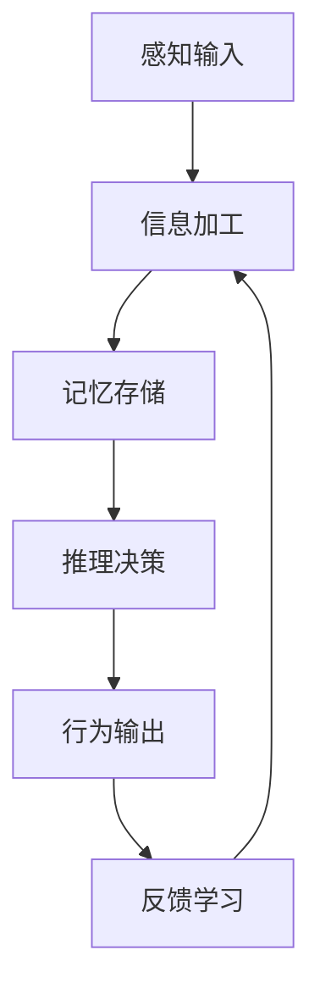

# 人工智能心理学

## 🤖 概念概述

### 人工智能心理学的定义
人工智能心理学是研究人工智能系统如何模拟、理解和应用人类心理过程的交叉学科。它结合了认知科学、计算机科学和心理学，探索机器智能与人类智能的相似性和差异性。

### 研究意义
- **理解智能**：深入理解人类智能的本质
- **技术发展**：推动人工智能技术发展
- **人机交互**：改善人机交互体验
- **心理应用**：将AI技术应用于心理领域

## 🔍 主要研究领域

### 1. 认知建模

#### 认知架构
- **符号主义**：基于符号和规则的认知模型
- **连接主义**：基于神经网络的认知模型
- **行为主义**：基于行为反应的认知模型
- **混合主义**：结合多种方法的认知模型

#### 认知过程模拟

#### 主要认知模型
- **ACT-R模型**：适应性控制思维-理性模型
- **SOAR模型**：通用问题解决架构
- **CLARION模型**：连接主义学习与推理
- **EPIC模型**：执行过程交互控制

### 2. 机器学习与心理学

#### 学习理论应用
- **强化学习**：基于奖励的学习机制
- **监督学习**：基于标签的学习方法
- **无监督学习**：发现数据中的模式
- **迁移学习**：将知识迁移到新任务

#### 心理学习机制
| 学习类型 | 心理学基础 | AI实现 | 应用场景 |
|----------|------------|--------|----------|
| **经典条件反射** | 巴甫洛夫条件反射 | 关联学习 | 推荐系统 |
| **操作条件反射** | 斯金纳箱实验 | 强化学习 | 游戏AI |
| **观察学习** | 班杜拉社会学习 | 模仿学习 | 机器人学习 |
| **内隐学习** | 无意识学习 | 深度学习 | 模式识别 |

### 3. 情感计算

#### 情感识别
- **面部表情识别**：基于面部特征的情感识别
- **语音情感识别**：基于语音特征的情感识别
- **文本情感分析**：基于文本内容的情感分析
- **生理信号识别**：基于生理指标的情感识别

#### 情感生成
- **情感表达**：机器如何表达情感
- **情感调节**：机器如何调节情感状态
- **情感交互**：人机情感交互机制
- **情感智能**：情感在决策中的作用

#### 情感计算应用

### 4. 人机交互心理学

#### 交互设计原则
- **可用性**：系统易于使用和理解
- **可访问性**：系统适用于不同用户
- **用户体验**：提供良好的使用体验
- **情感设计**：考虑用户的情感需求

#### 交互模式
- **命令式交互**：用户发出命令，系统执行
- **对话式交互**：自然语言对话交互
- **手势交互**：基于手势的交互方式
- **脑机接口**：基于脑电信号的交互

#### 用户心理模型
- **心智模型**：用户对系统的理解
- **任务模型**：用户的任务需求
- **系统模型**：系统的功能结构
- **交互模型**：用户与系统的交互方式

## 📊 心理学理论在AI中的应用

### 1. 认知心理学应用

#### 注意力机制
- **选择性注意**：AI系统的注意力分配
- **分配性注意**：多任务处理能力
- **持续性注意**：长时间专注能力
- **执行控制**：认知控制机制

#### 记忆系统
- **工作记忆**：短期信息存储和处理
- **长期记忆**：知识存储和检索
- **情景记忆**：具体事件记忆
- **语义记忆**：概念和知识记忆

### 2. 发展心理学应用

#### 学习发展
- **阶段性学习**：分阶段的学习过程
- **关键期学习**：特定时期的学习敏感期
- **个体差异**：不同个体的学习特点
- **环境适应**：适应不同环境的能力

#### 认知发展
- **感知发展**：感知能力的发展
- **思维发展**：思维能力的发展
- **语言发展**：语言能力的发展
- **社会认知**：社会认知能力的发展

### 3. 社会心理学应用

#### 社会认知
- **社会知觉**：理解社会信息
- **社会判断**：做出社会判断
- **社会记忆**：记忆社会信息
- **社会推理**：进行社会推理

#### 群体行为
- **群体决策**：群体决策机制
- **群体智慧**：集体智慧的应用
- **群体动态**：群体行为动态
- **社会影响**：社会影响机制

## 🎯 AI技术在心理学中的应用

### 1. 心理评估

#### 智能评估系统
- **自动化测试**：自动化的心理测试
- **个性化评估**：根据个体特点的评估
- **实时监测**：实时的心理状态监测
- **预测分析**：预测心理发展趋势

#### 评估工具
- **智能问卷**：自适应的问卷系统
- **行为分析**：基于行为数据的分析
- **生理监测**：基于生理指标的分析
- **多模态融合**：多维度数据融合

### 2. 心理治疗

#### 智能治疗系统
- **虚拟治疗师**：AI驱动的治疗师
- **个性化治疗**：根据个体特点的治疗
- **远程治疗**：远程心理治疗服务
- **治疗监测**：治疗过程监测

#### 治疗技术
- **认知行为治疗**：AI辅助的CBT
- **正念训练**：AI指导的正念练习
- **暴露治疗**：虚拟现实暴露治疗
- **社交技能训练**：AI辅助的社交训练

### 3. 心理健康

#### 心理健康监测
- **情绪监测**：实时情绪状态监测
- **压力检测**：压力水平检测
- **睡眠分析**：睡眠质量分析
- **行为模式**：行为模式分析

#### 干预策略
- **早期预警**：心理健康问题早期预警
- **个性化干预**：个性化的干预策略
- **持续支持**：持续的心理支持
- **效果评估**：干预效果评估

## 📈 发展趋势与挑战

### 1. 发展趋势

#### 技术发展
- **深度学习**：更强大的学习能力
- **大语言模型**：更自然的语言理解
- **多模态AI**：多感官信息处理
- **边缘计算**：更高效的本地处理

#### 应用拓展
- **个性化服务**：更个性化的心理服务
- **预防医学**：心理健康预防
- **精准医疗**：精准的心理治疗
- **社会应用**：更广泛的社会应用

### 2. 面临挑战

#### 技术挑战
- **数据隐私**：用户数据隐私保护
- **算法偏见**：算法中的偏见问题
- **可解释性**：AI决策的可解释性
- **可靠性**：AI系统的可靠性

#### 伦理挑战
- **人机关系**：人机关系的边界
- **责任归属**：AI决策的责任归属
- **公平性**：AI服务的公平性
- **透明度**：AI系统的透明度

#### 社会挑战
- **就业影响**：AI对就业的影响
- **社会不平等**：AI加剧社会不平等
- **文化适应**：AI的文化适应性
- **监管框架**：AI的监管框架

## 🎯 应用与反思

### 1. 教育应用
- **个性化学习**：AI驱动的个性化教育
- **智能辅导**：AI智能辅导系统
- **学习分析**：学习过程分析
- **教育评估**：智能教育评估

### 2. 医疗应用
- **诊断辅助**：AI辅助心理诊断
- **治疗支持**：AI支持心理治疗
- **药物研发**：AI辅助药物研发
- **健康管理**：AI健康管理系统

### 3. 商业应用
- **用户体验**：AI改善用户体验
- **市场分析**：AI市场心理分析
- **产品设计**：AI辅助产品设计
- **客户服务**：AI客户服务系统

### 4. 社会应用
- **社会治理**：AI辅助社会治理
- **公共安全**：AI公共安全系统
- **环境保护**：AI环境心理研究
- **文化保护**：AI文化心理研究

---

**相关概念链接**：
- [[02-01-认知心理学]]
- [[02-03-社会心理学]]
- [[04-03-07-心理学与大数据]]
- [[05-交叉学科/05-09-心理学与人工智能]]
