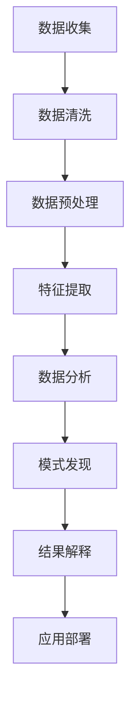

# 心理学与大数据

## 📊 概念概述

### 心理学与大数据的定义
心理学与大数据是研究如何运用大数据技术和方法来理解、分析和预测人类心理行为的交叉学科。它结合了心理学理论、统计学方法和计算机技术，通过分析大规模数据来揭示人类心理的规律和模式。

### 研究意义
- **数据驱动**：基于数据驱动的心理学研究
- **模式发现**：发现人类行为的隐藏模式
- **预测能力**：提高心理行为预测能力
- **个性化**：实现个性化的心理服务

## 🔍 主要研究领域

### 1. 大数据收集与处理

#### 数据来源
- **社交媒体数据**：微博、微信、Twitter等
- **移动设备数据**：手机使用行为、位置信息
- **网络行为数据**：浏览记录、搜索行为
- **生理数据**：心率、血压、睡眠等
- **环境数据**：天气、空气质量、噪音等

#### 数据类型
| 数据类型 | 特征 | 应用场景 | 挑战 |
|----------|------|----------|------|
| **结构化数据** | 表格形式 | 问卷调查、实验数据 | 数据质量 |
| **半结构化数据** | 部分结构化 | 日志文件、XML | 数据解析 |
| **非结构化数据** | 文本、图像 | 社交媒体、视频 | 信息提取 |
| **流数据** | 实时数据流 | 实时监测 | 实时处理 |

#### 数据处理流程

### 2. 心理行为分析

#### 行为模式识别
- **时间模式**：行为的时间规律
- **空间模式**：行为的地理分布
- **社交模式**：社交网络结构
- **情绪模式**：情绪变化规律

#### 心理状态预测
- **情绪预测**：基于行为数据预测情绪
- **压力预测**：预测压力水平
- **心理健康**：预测心理健康状态
- **行为倾向**：预测行为倾向

#### 个体差异分析
- **人格特征**：基于行为数据推断人格
- **认知风格**：分析认知处理方式
- **学习偏好**：识别学习偏好
- **社交特征**：分析社交行为特征

### 3. 社交媒体心理学

#### 社交网络分析
- **网络结构**：社交网络的结构特征
- **影响力分析**：个体在网络中的影响力
- **信息传播**：信息在社交网络中的传播
- **群体形成**：网络中的群体形成机制

#### 情感分析
- **情感识别**：识别文本中的情感
- **情感传播**：情感在社交网络中的传播
- **情感影响**：情感对行为的影响
- **情感预测**：预测情感变化趋势

#### 行为预测
- **消费行为**：预测消费行为
- **投票行为**：预测投票行为
- **健康行为**：预测健康相关行为
- **学习行为**：预测学习行为

### 4. 数字足迹分析

#### 数字行为模式
- **浏览行为**：网页浏览模式
- **搜索行为**：搜索查询模式
- **购买行为**：在线购买模式
- **社交行为**：在线社交模式

#### 生活方式分析
- **作息规律**：生活作息模式
- **兴趣爱好**：兴趣爱好分析
- **社交圈子**：社交圈子特征
- **消费习惯**：消费习惯分析

#### 心理健康指标
- **情绪波动**：情绪变化模式
- **压力水平**：压力水平变化
- **社交活跃度**：社交活跃程度
- **睡眠质量**：睡眠质量指标

## 📊 大数据分析方法

### 1. 机器学习方法

#### 监督学习
- **分类算法**：预测分类结果
- **回归算法**：预测连续数值
- **集成学习**：结合多个模型
- **深度学习**：神经网络方法

#### 无监督学习
- **聚类分析**：发现数据中的群体
- **降维分析**：降低数据维度
- **关联规则**：发现数据关联
- **异常检测**：发现异常数据

#### 强化学习
- **策略学习**：学习最优策略
- **价值学习**：学习状态价值
- **模型学习**：学习环境模型
- **多智能体**：多智能体学习

### 2. 统计分析方法

#### 描述性统计
- **集中趋势**：均值、中位数、众数
- **离散程度**：方差、标准差、极差
- **分布形状**：偏度、峰度
- **相关性**：相关系数分析

#### 推断性统计
- **假设检验**：检验统计假设
- **置信区间**：估计参数区间
- **方差分析**：比较组间差异
- **回归分析**：分析变量关系

#### 多元统计
- **主成分分析**：降维和特征提取
- **因子分析**：发现潜在因子
- **聚类分析**：数据分组
- **判别分析**：分类预测

### 3. 文本挖掘方法

#### 文本预处理
- **分词处理**：中文分词
- **词性标注**：词性识别
- **实体识别**：命名实体识别
- **去停用词**：去除无意义词汇

#### 特征提取
- **词袋模型**：基于词汇的特征
- **TF-IDF**：词频-逆文档频率
- **词向量**：Word2Vec、GloVe
- **主题模型**：LDA主题建模

#### 情感分析
- **词典方法**：基于情感词典
- **机器学习**：基于机器学习
- **深度学习**：基于神经网络
- **多模态**：结合多种信息

## 🎯 应用领域

### 1. 心理健康监测

#### 早期预警系统
- **抑郁预警**：基于行为数据预警抑郁
- **焦虑预警**：预警焦虑状态
- **自杀风险**：评估自杀风险
- **压力预警**：预警压力水平

#### 个性化干预
- **个性化建议**：基于数据的个性化建议
- **干预时机**：确定最佳干预时机
- **干预方式**：选择合适干预方式
- **效果评估**：评估干预效果

### 2. 教育心理学

#### 学习分析
- **学习行为**：分析学习行为模式
- **学习效果**：预测学习效果
- **学习困难**：识别学习困难
- **个性化学习**：个性化学习路径

#### 教学优化
- **教学方法**：优化教学方法
- **课程设计**：改进课程设计
- **学习环境**：优化学习环境
- **教师支持**：提供教师支持

### 3. 组织心理学

#### 员工分析
- **工作满意度**：分析工作满意度
- **工作压力**：监测工作压力
- **离职预测**：预测员工离职
- **绩效预测**：预测工作绩效

#### 组织优化
- **团队建设**：优化团队结构
- **沟通模式**：改善沟通模式
- **决策支持**：提供决策支持
- **文化分析**：分析组织文化

### 4. 消费心理学

#### 消费者行为
- **购买决策**：分析购买决策过程
- **品牌偏好**：识别品牌偏好
- **价格敏感度**：分析价格敏感度
- **忠诚度**：分析品牌忠诚度

#### 营销策略
- **精准营销**：精准营销策略
- **产品推荐**：个性化产品推荐
- **广告投放**：优化广告投放
- **客户细分**：客户细分策略

## 📈 技术挑战与解决方案

### 1. 数据质量挑战

#### 数据质量问题
- **数据缺失**：数据不完整
- **数据噪声**：数据中的噪声
- **数据偏差**：数据存在偏差
- **数据不一致**：数据不一致

#### 解决方案
- **数据清洗**：清理和修复数据
- **数据验证**：验证数据质量
- **数据标准化**：标准化数据格式
- **质量控制**：建立质量控制体系

### 2. 隐私保护挑战

#### 隐私问题
- **个人信息泄露**：个人信息泄露风险
- **数据滥用**：数据被滥用
- **身份识别**：身份被识别
- **数据追踪**：数据被追踪

#### 解决方案
- **数据匿名化**：匿名化处理数据
- **差分隐私**：差分隐私技术
- **联邦学习**：联邦学习方法
- **隐私计算**：隐私计算技术

### 3. 算法偏见挑战

#### 偏见问题
- **训练数据偏见**：训练数据存在偏见
- **算法设计偏见**：算法设计存在偏见
- **结果解释偏见**：结果解释存在偏见
- **应用场景偏见**：应用场景存在偏见

#### 解决方案
- **偏见检测**：检测算法偏见
- **偏见缓解**：缓解算法偏见
- **公平性评估**：评估算法公平性
- **多样化训练**：使用多样化训练数据

### 4. 可解释性挑战

#### 可解释性问题
- **黑盒模型**：模型不可解释
- **决策过程**：决策过程不透明
- **结果可信度**：结果可信度低
- **用户理解**：用户难以理解

#### 解决方案
- **可解释AI**：可解释人工智能
- **模型简化**：简化模型结构
- **特征重要性**：分析特征重要性
- **可视化技术**：可视化技术

## 🎯 未来发展趋势

### 1. 技术发展趋势

#### 技术融合
- **多模态数据**：融合多种数据类型
- **实时分析**：实时数据分析
- **边缘计算**：边缘计算技术
- **量子计算**：量子计算应用

#### 方法创新
- **因果推断**：因果推断方法
- **因果发现**：自动因果发现
- **因果机器学习**：因果机器学习
- **反事实推理**：反事实推理

### 2. 应用发展趋势

#### 应用拓展
- **精准医疗**：精准心理健康医疗
- **智能教育**：智能化教育系统
- **智慧城市**：智慧城市应用
- **数字健康**：数字健康管理

#### 服务模式
- **个性化服务**：个性化心理服务
- **预防性服务**：预防性心理健康服务
- **连续性服务**：连续性心理健康服务
- **社区化服务**：社区化心理健康服务

### 3. 伦理发展趋势

#### 伦理框架
- **数据伦理**：数据使用伦理
- **算法伦理**：算法设计伦理
- **应用伦理**：应用场景伦理
- **社会伦理**：社会影响伦理

#### 监管框架
- **数据保护**：数据保护法规
- **算法监管**：算法监管框架
- **应用监管**：应用监管机制
- **国际协调**：国际协调机制

---

**相关概念链接**：
- [[02-01-认知心理学]]
- [[02-03-社会心理学]]
- [[04-03-06-人工智能心理学]]
- [[05-交叉学科/05-09-心理学与人工智能]]
