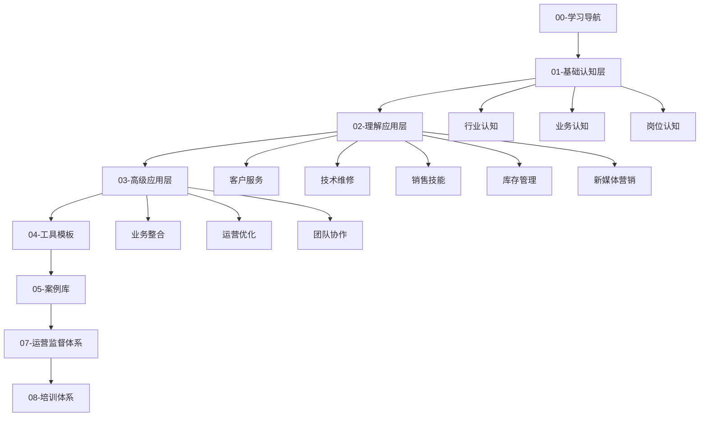

# 学习路径指南

## 学习目标
掌握新西兰手机维修与二手机销售店运营的核心技能，从基础认知到高级应用，形成完整的知识体系。

## 学习路径图

## 学习阶段规划

### 第一阶段：基础认知（1-2周）
- **目标**：建立行业基础认知
- **重点**：[[01-基础认知层/01-行业认知/01-手机维修行业现状分析|行业现状]]、[[01-基础认知层/02-业务认知/01-核心业务模块概述|业务模块]]、[[01-基础认知层/03-岗位认知/01-店员职责清单|岗位职责]]
- **学习方法**：阅读+理解+笔记

### 第二阶段：理解应用（3-4周）
- **目标**：掌握核心业务技能
- **重点**：[[02-理解应用层/01-客户服务/01-客户接待流程|客户服务]]、[[02-理解应用层/02-技术维修/01-基础诊断方法|技术维修]]、[[02-理解应用层/03-销售技能/01-产品知识库|销售技能]]
- **学习方法**：理论学习+实践操作+案例分析

### 第三阶段：高级应用（2-3周）
- **目标**：提升综合运营能力
- **重点**：[[03-高级应用层/01-业务整合/01-多业务协同策略|业务整合]]、[[03-高级应用层/02-运营优化/01-效率提升方法|运营优化]]
- **学习方法**：项目实践+反思总结+持续改进

### 第四阶段：工具应用（1-2周）
- **目标**：熟练使用工具模板
- **重点**：[[04-工具模板/01-工作流程/01-客户接待流程模板|工作流程]]、[[04-工具模板/02-检查清单/01-日常检查清单|检查清单]]
- **学习方法**：模板练习+标准化操作

## 学习建议

### 费曼学习法应用
1. **概念学习**：用简单语言解释复杂概念
2. **教学他人**：向同事或朋友讲解知识点
3. **简化表达**：用图表、表格简化复杂信息
4. **查漏补缺**：发现知识盲点及时补充

### 刻意练习要点
1. **明确目标**：每个学习阶段设定具体目标
2. **专注练习**：集中精力练习核心技能
3. **及时反馈**：通过[[07-运营监督体系/02-绩效监督/01-员工绩效评估标准|绩效评估]]获得反馈
4. **持续改进**：基于反馈调整学习策略

## 学习资源链接

- [[00-学习导航/02-关键概念速查|关键概念速查]]
- [[00-学习导航/03-常见问题解答|常见问题解答]]
- [[00-学习导航/04-知识体系总览|知识体系总览]]
- [[06-参考资料/04-学习资源/README|学习资源库]]

## 学习进度跟踪

| 阶段 | 完成状态 | 学习时间 | 掌握程度 |
|------|----------|----------|----------|
| 基础认知 | ⬜ | 0/14天 | 0% |
| 理解应用 | ⬜ | 0/28天 | 0% |
| 高级应用 | ⬜ | 0/21天 | 0% |
| 工具应用 | ⬜ | 0/14天 | 0% |

---
*最后更新：2024年*
*适用市场：新西兰*
