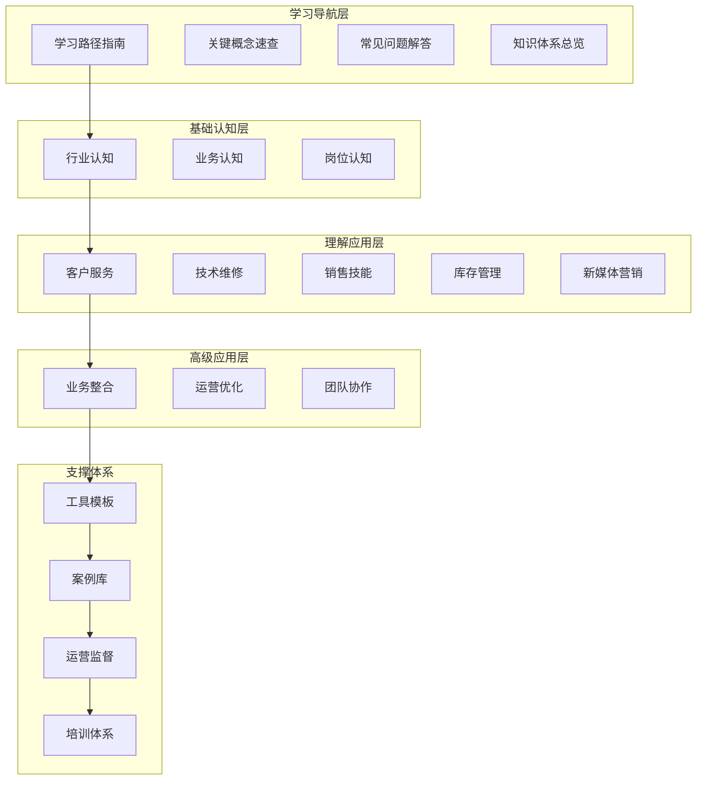
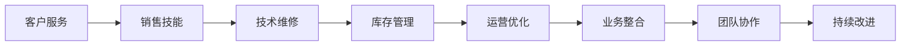

# 知识体系总览

## 体系架构图

## 知识层级结构

### 第一层：学习导航（00-学习导航）
**目标**：提供学习指导和快速查找
- [[00-学习导航/01-学习路径指南|学习路径指南]]：系统化学习路径
- [[00-学习导航/02-关键概念速查|关键概念速查]]：核心概念快速查找
- [[00-学习导航/03-常见问题解答|常见问题解答]]：常见问题解决方案
- [[00-学习导航/04-知识体系总览|知识体系总览]]：整体架构概览

### 第二层：基础认知（01-基础认知层）
**目标**：建立行业基础认知框架

#### 行业认知
- [[01-基础认知层/01-行业认知/01-手机维修行业现状分析|行业现状分析]]
- [[01-基础认知层/01-行业认知/02-二手机市场趋势分析|市场趋势分析]]
- [[01-基础认知层/01-行业认知/03-竞争格局分析|竞争格局分析]]
- [[01-基础认知层/01-行业认知/04-政策法规解读|政策法规解读]]
- [[01-基础认知层/01-行业认知/05-法律法规合规要求|合规要求]]

#### 业务认知
- [[01-基础认知层/02-业务认知/01-核心业务模块概述|业务模块概述]]
- [[01-基础认知层/02-业务认知/02-业务流程总览|业务流程总览]]
- [[01-基础认知层/02-业务认知/03-盈利模式分析|盈利模式分析]]
- [[01-基础认知层/02-业务认知/04-客户画像分析|客户画像分析]]
- [[01-基础认知层/02-业务认知/05-业务风险识别|风险识别]]

#### 岗位认知
- [[01-基础认知层/03-岗位认知/01-店员职责清单|职责清单]]
- [[01-基础认知层/03-岗位认知/02-技能要求标准|技能要求]]
- [[01-基础认知层/03-岗位认知/03-职业发展路径|发展路径]]
- [[01-基础认知层/03-岗位认知/04-工作标准规范|工作标准]]
- [[01-基础认知层/03-岗位认知/05-安全操作规范|安全操作]]

### 第三层：理解应用（02-理解应用层）
**目标**：掌握核心业务技能

#### 客户服务
- [[02-理解应用层/01-客户服务/01-客户接待流程|接待流程]]
- [[02-理解应用层/01-客户服务/02-沟通技巧指南|沟通技巧]]
- [[02-理解应用层/01-客户服务/03-投诉处理流程|投诉处理]]
- [[02-理解应用层/01-客户服务/04-客户维护策略|客户维护]]
- [[02-理解应用层/01-客户服务/05-客户关系管理|关系管理]]

#### 技术维修
- [[02-理解应用层/02-技术维修/01-基础诊断方法|诊断方法]]
- [[02-理解应用层/02-技术维修/02-常见故障处理|故障处理]]
- [[02-理解应用层/02-技术维修/03-维修流程标准|流程标准]]
- [[02-理解应用层/02-技术维修/04-质量管控体系|质量管控]]
- [[02-理解应用层/02-技术维修/05-设备维护保养|设备维护]]
- [[02-理解应用层/02-技术维修/06-应急处理预案|应急处理]]

#### 销售技能
- [[02-理解应用层/03-销售技能/01-产品知识库|产品知识]]
- [[02-理解应用层/03-销售技能/02-销售话术模板|销售话术]]
- [[02-理解应用层/03-销售技能/03-成交技巧方法|成交技巧]]
- [[02-理解应用层/03-销售技能/04-售后服务流程|售后服务]]
- [[02-理解应用层/03-销售技能/05-交叉销售策略|交叉销售]]

#### 库存管理
- [[02-理解应用层/04-库存管理/01-入库流程操作|入库流程]]
- [[02-理解应用层/04-库存管理/02-出库操作规范|出库规范]]
- [[02-理解应用层/04-库存管理/03-盘点方法技巧|盘点方法]]
- [[02-理解应用层/04-库存管理/04-库存优化策略|优化策略]]
- [[02-理解应用层/04-库存管理/05-供应链管理基础|供应链管理]]

#### 新媒体营销
- [[02-理解应用层/05-新媒体营销/01-内容策划方法|内容策划]]
- [[02-理解应用层/05-新媒体营销/02-平台运营技巧|平台运营]]
- [[02-理解应用层/05-新媒体营销/03-客户引流策略|客户引流]]
- [[02-理解应用层/05-新媒体营销/04-数据分析方法|数据分析]]
- [[02-理解应用层/05-新媒体营销/05-品牌建设基础|品牌建设]]

### 第四层：高级应用（03-高级应用层）
**目标**：提升综合运营能力

#### 业务整合
- [[03-高级应用层/01-业务整合/01-多业务协同策略|协同策略]]
- [[03-高级应用层/01-业务整合/02-交叉销售技巧|交叉销售]]
- [[03-高级应用层/01-业务整合/03-客户生命周期管理|生命周期管理]]
- [[03-高级应用层/01-业务整合/04-业务数据分析决策|数据分析决策]]

#### 运营优化
- [[03-高级应用层/02-运营优化/01-效率提升方法|效率提升]]
- [[03-高级应用层/02-运营优化/02-成本控制策略|成本控制]]
- [[03-高级应用层/02-运营优化/03-利润最大化技巧|利润最大化]]
- [[03-高级应用层/02-运营优化/04-风险管控体系|风险管控]]
- [[03-高级应用层/02-运营优化/05-财务管理基础|财务管理]]

#### 团队协作
- [[03-高级应用层/03-团队协作/01-跨部门配合流程|跨部门配合]]
- [[03-高级应用层/03-团队协作/02-知识分享机制|知识分享]]
- [[03-高级应用层/03-团队协作/03-经验传承方法|经验传承]]
- [[03-高级应用层/03-团队协作/04-持续改进体系|持续改进]]

### 第五层：支撑体系
**目标**：提供工具和案例支持

#### 工具模板（04-工具模板）
- [[04-工具模板/01-工作流程|工作流程模板]]
- [[04-工具模板/02-检查清单|检查清单模板]]
- [[04-工具模板/03-数据表格|数据表格模板]]

#### 案例库（05-案例库）
- [[05-案例库/01-成功案例|成功案例]]
- [[05-案例库/02-问题解决|问题解决案例]]
- [[05-案例库/03-经验总结|经验总结]]

#### 运营监督（07-运营监督体系）
- [[07-运营监督体系/01-质量监督|质量监督]]
- [[07-运营监督体系/02-绩效监督|绩效监督]]
- [[07-运营监督体系/03-合规监督|合规监督]]
- [[07-运营监督体系/04-客户满意度监督|客户满意度监督]]

#### 培训体系（08-培训体系）
- [[08-培训体系/01-新员工培训|新员工培训]]
- [[08-培训体系/02-在职培训|在职培训]]
- [[08-培训体系/03-技能提升培训|技能提升培训]]
- [[08-培训体系/04-考核评估|考核评估]]

## 学习路径建议

### 新手路径
1. **基础认知** → 2. **客户服务** → 3. **技术维修** → 4. **销售技能** → 5. **工具应用**

### 进阶路径
1. **业务整合** → 2. **运营优化** → 3. **团队协作** → 4. **监督体系** → 5. **培训体系**

### 专家路径
1. **高级应用** → 2. **案例研究** → 3. **经验总结** → 4. **知识创新** → 5. **体系优化**

## 知识关联网络

## 学习成果评估

### 知识掌握程度
- **基础认知**：行业理解、业务认知、岗位职责
- **技能应用**：客户服务、技术维修、销售技能
- **综合能力**：业务整合、运营优化、团队协作
- **专业发展**：监督体系、培训体系、持续改进

### 能力提升指标
- **技术能力**：维修技能、诊断能力、质量管控
- **服务能力**：客户沟通、问题解决、关系维护
- **销售能力**：产品推荐、成交技巧、交叉销售
- **管理能力**：库存管理、运营优化、团队协作

---
*最后更新：2024年*
*适用市场：新西兰*
