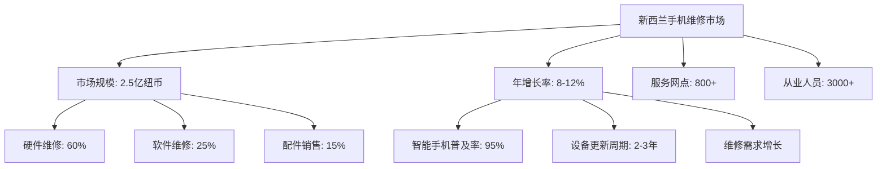
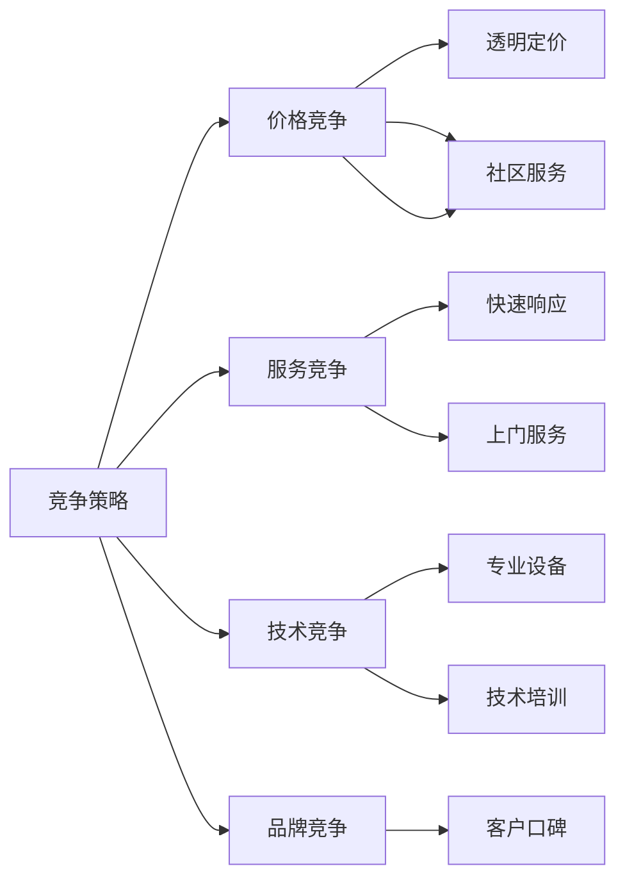

# 手机维修行业现状分析

## 新西兰手机维修行业概况

### 市场规模与增长趋势

### 行业特点分析

#### 1. 市场集中度
| 地区 | 服务网点数量 | 市场份额 | 主要特点 |
|------|-------------|----------|----------|
| **奥克兰** | 300+ | 45% | 竞争激烈，技术先进 |
| **惠灵顿** | 150+ | 20% | 政府客户多，要求高 |
| **基督城** | 120+ | 15% | 地震后重建，需求稳定 |
| **其他地区** | 230+ | 20% | 服务相对稀缺 |

#### 2. 技术发展趋势
- **5G技术普及**：网络升级带来新维修需求
- **折叠屏技术**：新兴技术维修挑战
- **AI诊断工具**：智能化维修辅助
- **环保要求**：电子废弃物处理规范

#### 3. 客户需求变化
- **快速服务**：客户期望更短的维修时间
- **透明定价**：价格透明化需求增加
- **质量保证**：对维修质量要求更高
- **环保意识**：重视设备回收和环保处理

## 竞争格局分析

### 主要竞争对手类型

#### 1. 官方授权服务中心
**优势**：
- 原厂配件和技术支持
- 品牌信任度高
- 专业技术人员

**劣势**：
- 价格较高
- 服务时间较长
- 地理位置限制

#### 2. 独立维修店
**优势**：
- 价格灵活
- 服务快速
- 本地化服务

**劣势**：
- 配件质量参差不齐
- 技术水平差异大
- 品牌影响力有限

#### 3. 连锁维修品牌
**优势**：
- 标准化服务
- 品牌影响力
- 技术支持体系

**劣势**：
- 运营成本高
- 灵活性有限
- 本地化程度低

### 竞争策略分析

## 行业挑战与机遇

### 主要挑战

#### 1. 技术挑战
- **设备更新快**：需要持续学习新技术
- **配件获取难**：原厂配件价格高、获取难
- **技术门槛高**：维修技术复杂度增加

#### 2. 市场挑战
- **价格竞争激烈**：利润空间压缩
- **客户期望高**：服务质量要求提升
- **法规变化**：合规要求不断增加

#### 3. 运营挑战
- **人才短缺**：技术人才招聘困难
- **成本上升**：租金、人工成本增加
- **库存管理**：配件库存管理复杂

### 发展机遇

#### 1. 市场机遇
- **设备保有量大**：智能手机普及率高
- **更新需求强**：设备更新周期缩短
- **服务需求增**：维修服务需求增长

#### 2. 技术机遇
- **新技术应用**：AI、IoT等技术应用
- **服务创新**：远程诊断、上门服务
- **效率提升**：自动化工具应用

#### 3. 政策机遇
- **环保政策**：电子废弃物处理政策
- **消费者保护**：消费者权益保护法规
- **技术标准**：行业技术标准建立

## 行业发展趋势

### 短期趋势（1-2年）
- **服务标准化**：行业服务标准逐步建立
- **价格透明化**：维修价格更加透明
- **技术升级**：维修技术持续升级
- **品牌化发展**：品牌影响力重要性提升

### 中期趋势（3-5年）
- **智能化服务**：AI诊断和自动化维修
- **生态化发展**：维修、回收、销售一体化
- **专业化分工**：技术专业化程度提高
- **国际化竞争**：国际品牌进入市场

### 长期趋势（5-10年）
- **技术革命**：新技术彻底改变维修模式
- **服务创新**：全新的服务模式和体验
- **市场整合**：行业整合和集中度提升
- **可持续发展**：环保和可持续发展要求

## 对从业者的启示

### 技能发展建议
1. **技术技能**：持续学习新技术，提升专业水平
2. **服务技能**：提升客户服务能力和沟通技巧
3. **管理技能**：学习运营管理和团队协作
4. **创新技能**：培养创新思维和问题解决能力

### 职业发展路径
- **技术专家**：专注于技术维修和问题解决
- **服务经理**：负责客户服务和团队管理
- **业务发展**：拓展新业务和市场机会
- **创业发展**：独立创业或加盟发展

### 学习重点
- **行业知识**：深入了解行业发展趋势
- **技术更新**：跟上技术发展步伐
- **客户需求**：理解客户需求变化
- **竞争分析**：分析竞争对手策略

---
**相关链接**：
- [[01-基础认知层/01-行业认知/02-二手机市场趋势分析|二手机市场趋势分析]]
- [[01-基础认知层/01-行业认知/03-竞争格局分析|竞争格局分析]]
- [[02-理解应用层/02-技术维修/01-基础诊断方法|基础诊断方法]]

*最后更新：2024年*
*适用市场：新西兰*
