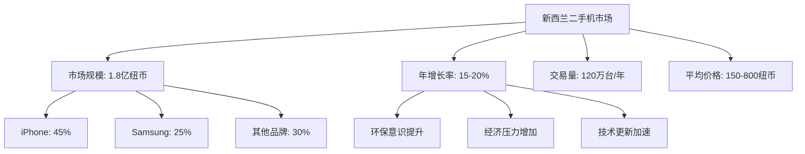
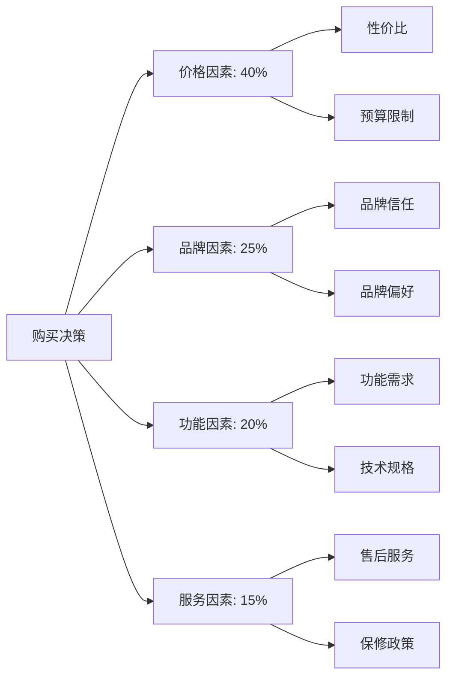
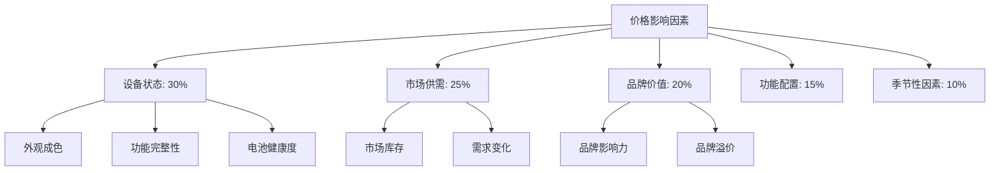

# 二手机市场趋势分析

## 新西兰二手机市场概况

### 市场规模与增长

### 市场驱动因素

#### 1. 消费者因素
| 驱动因素 | 影响程度 | 具体表现 |
|----------|----------|----------|
| **环保意识** | 高 | 重视资源循环利用，减少电子废弃物 |
| **经济压力** | 中 | 生活成本上升，寻求性价比更高的选择 |
| **技术需求** | 高 | 需要最新功能但预算有限 |
| **品牌偏好** | 中 | 对特定品牌的忠诚度和偏好 |

#### 2. 市场因素
- **新机价格高**：旗舰机型价格持续上涨
- **技术更新快**：新功能推出频率高
- **保修政策**：二手机保修政策逐步完善
- **交易平台**：在线交易平台发展成熟

#### 3. 政策因素
- **环保政策**：政府推动电子废弃物回收
- **消费者保护**：二手机消费者权益保护
- **税收政策**：GST等税收政策影响
- **进口管制**：二手设备进口相关规定

## 消费者行为分析

### 购买决策因素

### 消费者画像分析

#### 1. 主要消费群体
- **学生群体**（25%）：预算有限，追求性价比
- **年轻职场人**（35%）：需要最新功能，预算适中
- **中低收入家庭**（25%）：经济实用，注重耐用性
- **环保意识消费者**（15%）：重视环保，支持循环经济

#### 2. 购买渠道偏好
| 渠道类型 | 使用比例 | 主要特点 |
|----------|----------|----------|
| **实体店** | 45% | 可现场体验，服务直接 |
| **在线平台** | 35% | 选择多样，价格透明 |
| **社交媒体** | 15% | 社交推荐，信任度高 |
| **其他渠道** | 5% | 朋友推荐，个人交易 |

#### 3. 购买考虑因素
- **设备状态**：外观、功能、电池健康度
- **价格合理性**：与市场价格的对比
- **保修服务**：售后保障和维修服务
- **交易安全**：交易过程的安全性和可靠性

## 产品趋势分析

### 热门机型分析

#### 1. iPhone系列
| 机型 | 市场占比 | 平均价格 | 主要特点 |
|------|----------|----------|----------|
| **iPhone 12/13** | 30% | 600-800纽币 | 5G功能，性能稳定 |
| **iPhone 11** | 25% | 400-600纽币 | 性价比高，功能全面 |
| **iPhone X/XS** | 20% | 300-500纽币 | 价格实惠，功能满足需求 |
| **其他型号** | 25% | 200-400纽币 | 入门级选择 |

#### 2. Samsung系列
| 机型 | 市场占比 | 平均价格 | 主要特点 |
|------|----------|----------|----------|
| **Galaxy S21/S22** | 35% | 500-700纽币 | 高端配置，拍照优秀 |
| **Galaxy A系列** | 40% | 200-400纽币 | 中端定位，性价比高 |
| **Galaxy Note系列** | 15% | 400-600纽币 | 商务功能，大屏体验 |
| **其他型号** | 10% | 150-300纽币 | 入门级选择 |

### 功能需求趋势

#### 1. 核心功能需求
- **拍照功能**：高像素、多摄像头、夜景模式
- **存储容量**：128GB以上存储需求增加
- **电池续航**：快充、无线充电功能
- **网络连接**：5G、WiFi 6等新技术

#### 2. 新兴功能需求
- **折叠屏**：大屏体验，但价格较高
- **AI功能**：智能助手、AI拍照等
- **AR/VR**：增强现实和虚拟现实应用
- **健康监测**：心率、血氧等健康功能

## 价格趋势分析

### 价格影响因素

### 价格波动规律

#### 1. 季节性波动
- **开学季**（2-3月）：学生需求增加，价格上升
- **节日季**（11-12月）：礼品需求，价格波动
- **新品发布**（9-10月）：旧机型价格下降
- **淡季**（6-8月）：需求减少，价格相对稳定

#### 2. 生命周期价格
| 设备年龄 | 价格衰减 | 主要特点 |
|----------|----------|----------|
| **0-6个月** | 20-30% | 接近新机，价格较高 |
| **6-12个月** | 30-40% | 功能完整，性价比高 |
| **1-2年** | 40-60% | 价格实惠，功能满足需求 |
| **2年以上** | 60-80% | 价格低廉，适合入门使用 |

## 市场机遇与挑战

### 发展机遇

#### 1. 市场机遇
- **需求增长**：消费者对二手机接受度提高
- **技术升级**：新功能推动设备更新
- **环保政策**：政府支持循环经济发展
- **平台发展**：在线交易平台技术成熟

#### 2. 业务机遇
- **服务创新**：提供增值服务，如翻新、保修
- **渠道拓展**：线上线下结合，扩大销售渠道
- **品牌建设**：建立专业、可信的品牌形象
- **技术应用**：利用AI、大数据等技术提升服务

### 面临挑战

#### 1. 市场挑战
- **价格竞争**：市场竞争激烈，利润空间压缩
- **质量风险**：设备质量参差不齐，影响客户信任
- **库存管理**：库存积压风险，资金占用
- **法规变化**：相关法规政策变化影响

#### 2. 运营挑战
- **技术更新**：需要跟上技术发展步伐
- **人才需求**：需要专业的技术和服务人员
- **资金压力**：库存资金占用，现金流压力
- **客户教育**：需要教育客户接受二手机概念

## 未来发展趋势

### 短期趋势（1-2年）
- **市场规范化**：行业标准逐步建立
- **服务标准化**：服务质量标准统一
- **价格透明化**：价格信息更加透明
- **技术升级**：检测和翻新技术提升

### 中期趋势（3-5年）
- **智能化发展**：AI检测、自动化翻新
- **生态化发展**：维修、回收、销售一体化
- **品牌化发展**：专业品牌影响力提升
- **国际化竞争**：国际品牌进入市场

### 长期趋势（5-10年）
- **技术革命**：新技术改变设备形态
- **服务创新**：全新的服务模式和体验
- **市场整合**：行业整合和集中度提升
- **可持续发展**：环保和可持续发展要求

## 对从业者的建议

### 市场定位策略
1. **专业化定位**：专注于特定品牌或机型
2. **服务差异化**：提供独特的增值服务
3. **价格策略**：合理定价，确保利润空间
4. **品牌建设**：建立专业可信的品牌形象

### 运营优化建议
1. **库存管理**：优化库存结构，减少积压
2. **质量控制**：建立严格的质量检测标准
3. **客户服务**：提供优质的售后服务
4. **技术升级**：持续提升检测和翻新技术

### 发展机会把握
1. **新技术应用**：关注新技术发展趋势
2. **服务创新**：开发新的服务模式
3. **渠道拓展**：探索新的销售渠道
4. **合作机会**：寻找战略合作伙伴

---
**相关链接**：
- [[01-基础认知层/01-行业认知/01-手机维修行业现状分析|手机维修行业现状分析]]
- [[01-基础认知层/02-业务认知/03-盈利模式分析|盈利模式分析]]
- [[02-理解应用层/03-销售技能/01-产品知识库|产品知识库]]

*最后更新：2024年*
*适用市场：新西兰*
