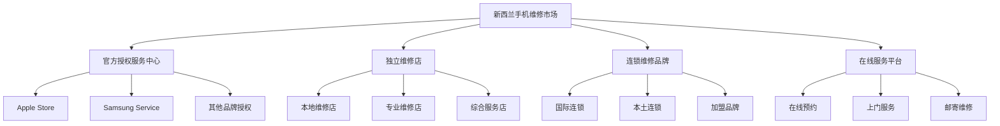
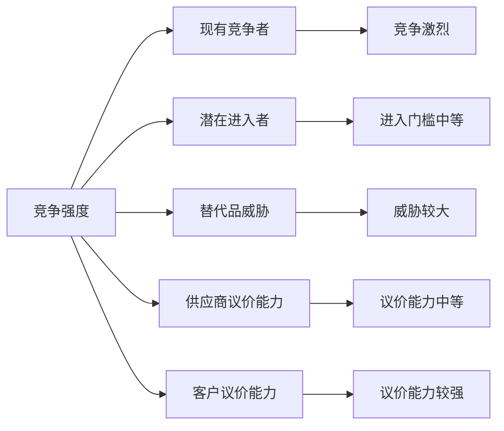
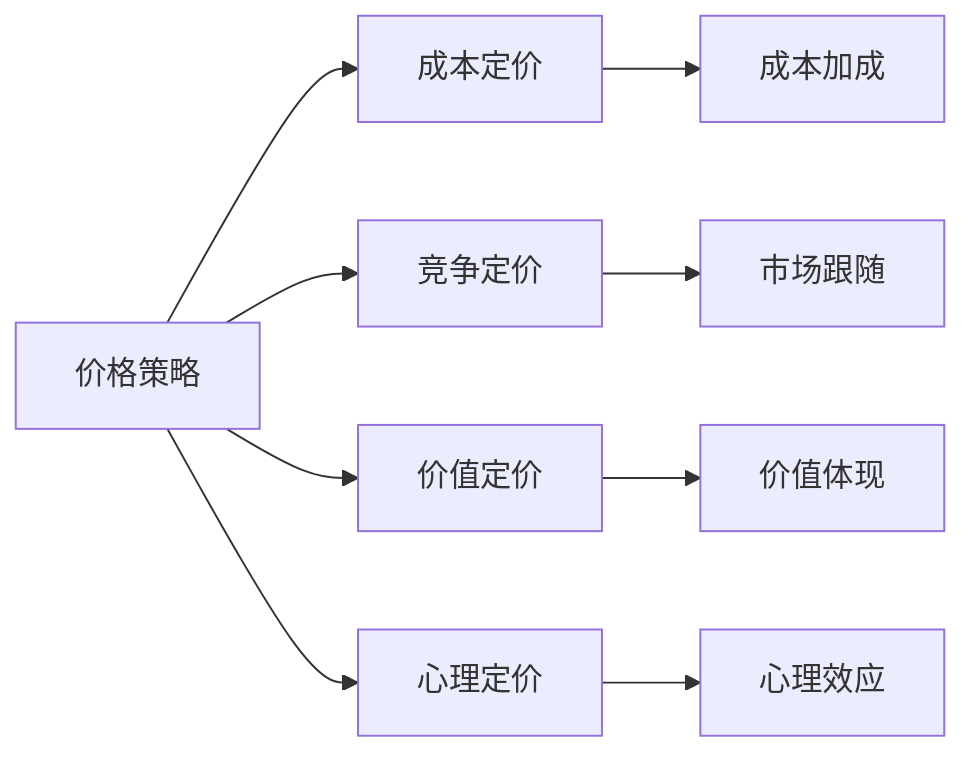

# 竞争格局分析

## 新西兰手机维修与二手机销售竞争格局

### 竞争环境概览

### 主要竞争对手分析

#### 1. 官方授权服务中心

**代表企业**：
- Apple Store（奥克兰、惠灵顿、基督城）
- Samsung Service Center
- Huawei Service Center

**竞争优势**：
- 原厂配件和技术支持
- 品牌信任度和权威性
- 专业技术人员培训
- 完善的售后服务体系

**竞争劣势**：
- 价格相对较高
- 服务时间较长
- 地理位置限制
- 灵活性相对较低

**市场策略**：
- 高端市场定位
- 品牌价值营销
- 专业技术服务
- 客户体验优化

#### 2. 独立维修店

**代表企业**：
- 本地专业维修店
- 社区服务店
- 综合电子产品店

**竞争优势**：
- 价格灵活，竞争力强
- 服务快速，响应及时
- 本地化服务，贴近客户
- 经营灵活，适应性强

**竞争劣势**：
- 配件质量参差不齐
- 技术水平差异较大
- 品牌影响力有限
- 缺乏统一标准

**市场策略**：
- 价格竞争策略
- 快速服务定位
- 本地化营销
- 个性化服务

#### 3. 连锁维修品牌

**代表企业**：
- 国际连锁品牌
- 本土连锁品牌
- 加盟维修品牌

**竞争优势**：
- 标准化服务流程
- 品牌影响力
- 技术支持体系
- 规模经济效应

**竞争劣势**：
- 运营成本较高
- 灵活性有限
- 本地化程度低
- 管理复杂度高

**市场策略**：
- 品牌化发展
- 标准化服务
- 规模化扩张
- 技术升级

#### 4. 在线服务平台

**代表企业**：
- 在线预约平台
- 上门服务平台
- 邮寄维修服务

**竞争优势**：
- 便利性高
- 价格透明
- 服务范围广
- 技术应用先进

**竞争劣势**：
- 缺乏面对面服务
- 信任度建立困难
- 技术限制
- 物流成本

**市场策略**：
- 便利性营销
- 价格透明策略
- 技术驱动发展
- 用户体验优化

## 竞争强度分析

### 波特五力模型分析

#### 1. 现有竞争者竞争强度：**高**
- 竞争对手数量多
- 产品服务同质化程度高
- 价格竞争激烈
- 市场增长相对缓慢

#### 2. 潜在进入者威胁：**中等**
- 技术门槛相对较低
- 资金需求适中
- 品牌建立需要时间
- 客户关系建立困难

#### 3. 替代品威胁：**高**
- 新机购买替代维修
- 设备租赁服务
- 云服务替代本地存储
- 新技术改变使用模式

#### 4. 供应商议价能力：**中等**
- 配件供应商集中度中等
- 技术供应商议价能力强
- 原厂配件获取困难
- 替代供应商选择有限

#### 5. 客户议价能力：**强**
- 客户选择多样化
- 价格信息透明
- 服务质量要求高
- 转换成本相对较低

## 市场细分竞争分析

### 按服务类型细分

#### 1. 硬件维修市场
| 竞争对手类型 | 市场份额 | 主要优势 | 主要劣势 |
|-------------|----------|----------|----------|
| **官方授权** | 35% | 原厂配件，技术权威 | 价格高，时间长 |
| **连锁品牌** | 25% | 标准化服务，品牌影响 | 灵活性低，成本高 |
| **独立维修** | 30% | 价格灵活，服务快速 | 质量参差，标准不一 |
| **在线服务** | 10% | 便利性强，价格透明 | 信任度低，技术限制 |

#### 2. 软件维修市场
| 竞争对手类型 | 市场份额 | 主要优势 | 主要劣势 |
|-------------|----------|----------|----------|
| **官方授权** | 40% | 系统支持，技术专业 | 价格高，流程复杂 |
| **连锁品牌** | 20% | 标准化流程，技术支持 | 技术更新慢，成本高 |
| **独立维修** | 35% | 服务灵活，价格合理 | 技术水平差异大 |
| **在线服务** | 5% | 远程服务，便利性强 | 技术限制，信任问题 |

#### 3. 二手机销售市场
| 竞争对手类型 | 市场份额 | 主要优势 | 主要劣势 |
|-------------|----------|----------|----------|
| **官方授权** | 20% | 质量保证，品牌信任 | 价格高，选择有限 |
| **连锁品牌** | 30% | 标准化流程，质量管控 | 价格竞争激烈 |
| **独立维修** | 40% | 价格灵活，选择多样 | 质量参差，标准不一 |
| **在线平台** | 10% | 选择多样，价格透明 | 信任度低，服务有限 |

### 按地理区域细分

#### 1. 奥克兰地区
- **竞争最激烈**：竞争对手数量多，价格竞争激烈
- **技术最先进**：技术水平高，服务标准严格
- **市场最成熟**：客户需求多样化，服务要求高
- **机会最多**：市场规模大，发展机会多

#### 2. 惠灵顿地区
- **政府客户多**：政府机构和公务员客户需求大
- **服务要求高**：对服务质量和专业性要求高
- **价格敏感度低**：更注重服务质量和可靠性
- **竞争相对温和**：竞争对手数量适中

#### 3. 基督城地区
- **重建需求**：地震后重建带来市场机会
- **竞争适中**：竞争对手数量适中，竞争强度中等
- **技术需求**：对新技术和服务有需求
- **发展潜力**：市场发展潜力较大

#### 4. 其他地区
- **服务稀缺**：维修服务相对稀缺
- **价格较高**：由于竞争少，价格相对较高
- **技术落后**：技术水平相对落后
- **机会较大**：市场机会较大，竞争压力小

## 竞争策略分析

### 主要竞争策略

#### 1. 成本领先策略
**适用企业**：独立维修店、连锁品牌
**策略要点**：
- 降低运营成本
- 提高运营效率
- 规模化经营
- 价格竞争

**实施方法**：
- 优化供应链管理
- 提高员工效率
- 标准化作业流程
- 批量采购降低成本

#### 2. 差异化策略
**适用企业**：官方授权、专业维修店
**策略要点**：
- 提供独特服务
- 建立品牌差异
- 技术优势
- 客户体验

**实施方法**：
- 专业技术服务
- 个性化解决方案
- 优质客户服务
- 创新服务模式

#### 3. 集中化策略
**适用企业**：专业维修店、细分市场
**策略要点**：
- 专注特定市场
- 深度服务
- 专业优势
- 客户忠诚度

**实施方法**：
- 专注特定品牌或机型
- 提供专业深度服务
- 建立专业声誉
- 培养客户忠诚度

### 竞争策略实施

#### 1. 价格策略

#### 2. 服务策略
- **快速服务**：缩短服务时间，提高响应速度
- **质量保证**：提供质量保证，建立客户信任
- **增值服务**：提供额外服务，增加客户价值
- **个性化服务**：根据客户需求提供定制服务

#### 3. 营销策略
- **品牌建设**：建立专业可信的品牌形象
- **客户关系**：建立长期客户关系
- **口碑营销**：通过客户推荐扩大影响
- **数字营销**：利用数字渠道进行营销

## 竞争趋势预测

### 短期趋势（1-2年）
- **价格竞争加剧**：市场竞争激烈，价格压力增大
- **服务标准化**：行业服务标准逐步建立
- **技术升级**：维修技术持续升级
- **品牌化发展**：品牌影响力重要性提升

### 中期趋势（3-5年）
- **市场整合**：行业整合和集中度提升
- **技术革命**：新技术改变维修模式
- **服务创新**：新的服务模式和体验
- **国际化竞争**：国际品牌进入市场

### 长期趋势（5-10年）
- **生态化发展**：维修、回收、销售一体化
- **智能化服务**：AI、自动化等技术应用
- **可持续发展**：环保和可持续发展要求
- **市场成熟**：市场进入成熟期，竞争格局稳定

## 对从业者的竞争建议

### 竞争定位策略
1. **明确市场定位**：选择适合的市场细分
2. **建立竞争优势**：发展独特的竞争优势
3. **差异化服务**：提供差异化的服务体验
4. **品牌建设**：建立专业可信的品牌形象

### 竞争策略选择
1. **成本控制**：有效控制运营成本
2. **技术升级**：持续提升技术水平
3. **服务优化**：不断优化服务质量
4. **客户关系**：建立长期客户关系

### 竞争优势构建
1. **技术优势**：建立技术专业优势
2. **服务优势**：提供优质客户服务
3. **价格优势**：保持合理价格竞争力
4. **品牌优势**：建立品牌影响力

---
**相关链接**：
- [[01-基础认知层/01-行业认知/01-手机维修行业现状分析|手机维修行业现状分析]]
- [[01-基础认知层/02-业务认知/03-盈利模式分析|盈利模式分析]]
- [[03-高级应用层/02-运营优化/01-效率提升方法|效率提升方法]]

*最后更新：2024年*
*适用市场：新西兰*
