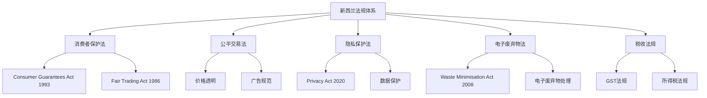
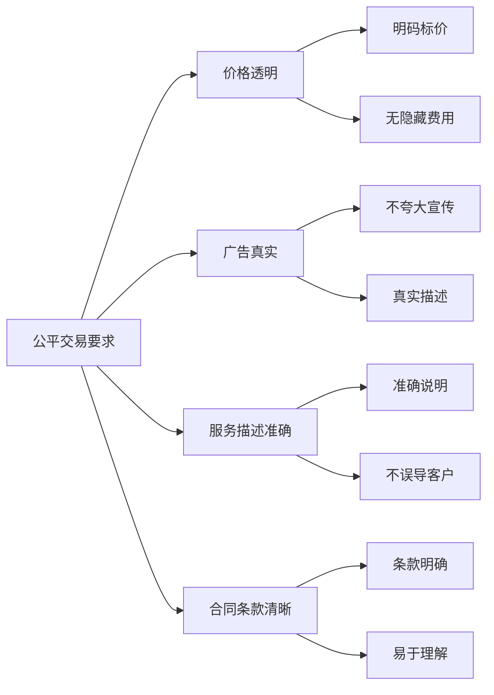
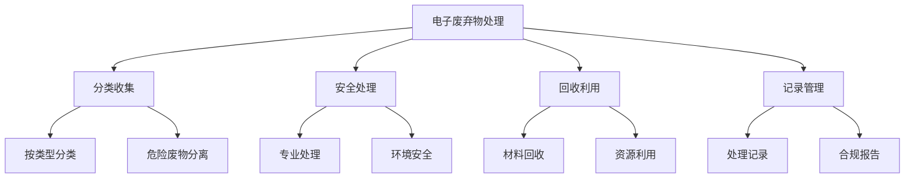
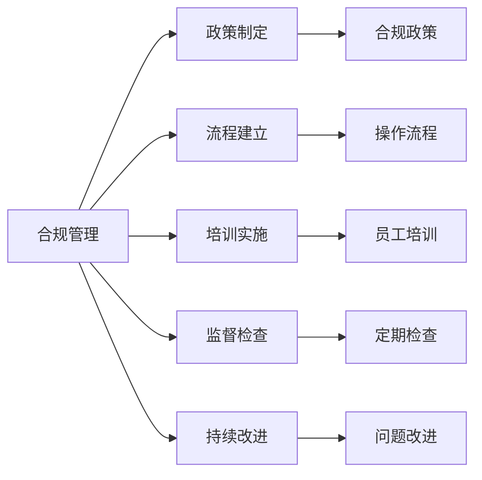

# 政策法规解读

## 新西兰手机维修与二手机销售相关法规

### 核心法规框架

### 主要法规详解

#### 1. Consumer Guarantees Act 1993（消费者保障法案）

**适用范围**：
- 所有向消费者销售的商品和服务
- 包括手机维修和二手机销售
- 适用于所有商业交易

**核心要求**：

| 保障类型 | 具体要求 | 适用场景 |
|----------|----------|----------|
| **质量保证** | 商品必须符合描述，质量良好 | 二手机销售，配件销售 |
| **适用性保证** | 商品必须适合预期用途 | 维修服务，功能恢复 |
| **维修保证** | 维修服务必须专业、及时 | 手机维修服务 |
| **价格保证** | 价格必须合理，透明 | 所有服务定价 |

**违规后果**：
- 消费者有权要求退款、更换或维修
- 可能面临消费者保护委员会的调查
- 最高罚款可达60万纽币

**合规建议**：
- 明确告知客户服务内容和价格
- 提供详细的服务记录和发票
- 建立完善的投诉处理机制
- 定期培训员工了解法规要求

#### 2. Fair Trading Act 1986（公平交易法案）

**核心原则**：
- 禁止误导性陈述
- 禁止欺骗性行为
- 要求价格透明
- 保护消费者权益

**具体要求**：

**违规行为示例**：
- 虚假宣传维修效果
- 隐瞒服务费用
- 夸大产品功能
- 误导性价格信息

**合规措施**：
- 制定标准化的服务描述
- 建立价格透明机制
- 培训员工合规意识
- 定期审查营销材料

#### 3. Privacy Act 2020（隐私保护法案）

**适用范围**：
- 客户个人信息收集
- 设备数据访问
- 维修记录管理
- 客户沟通记录

**核心要求**：

| 隐私原则 | 具体要求 | 实施措施 |
|----------|----------|----------|
| **目的明确** | 明确收集信息的目的 | 制定隐私政策 |
| **使用限制** | 仅用于声明目的 | 限制数据访问 |
| **安全保障** | 保护信息安全 | 技术和管理措施 |
| **透明度** | 告知客户数据使用 | 隐私声明 |

**合规要求**：
- 制定隐私政策
- 获得客户同意
- 保护数据安全
- 允许客户访问和更正数据

#### 4. Waste Minimisation Act 2008（废物最小化法案）

**电子废弃物处理要求**：

**合规要求**：
- 分类收集电子废弃物
- 使用有资质的处理商
- 保持处理记录
- 定期报告处理情况

### 税收法规要求

#### 1. GST（商品服务税）法规

**适用情况**：
- 所有商品销售（税率15%）
- 维修服务（税率15%）
- 二手机销售（税率15%）

**合规要求**：

| 项目 | 要求 | 实施方法 |
|------|------|----------|
| **注册要求** | 年营业额超过6万纽币必须注册 | 及时注册GST |
| **发票要求** | 必须提供GST发票 | 使用标准发票格式 |
| **申报要求** | 定期申报GST | 建立申报系统 |
| **记录要求** | 保持完整记录 | 建立记录管理系统 |

**发票要求**：
- 必须包含GST号码
- 明确显示GST金额
- 使用标准发票格式
- 保持发票记录

#### 2. 所得税法规

**收入确认**：
- 维修服务收入
- 二手机销售收入
- 配件销售收入
- 其他服务收入

**费用扣除**：
- 配件采购成本
- 设备折旧
- 员工工资
- 运营费用

### 行业特定法规

#### 1. 电子设备安全法规

**安全要求**：
- 使用符合标准的配件
- 确保维修安全
- 保护客户数据
- 环境安全处理

**合规措施**：
- 使用认证配件
- 建立安全操作程序
- 培训员工安全意识
- 定期安全检查

#### 2. 进口法规

**二手机进口要求**：
- 符合技术标准
- 通过安全检查
- 缴纳相关税费
- 获得进口许可

**合规流程**：
- 了解进口要求
- 准备相关文件
- 通过海关检查
- 缴纳相关费用

## 合规管理体系

### 合规框架建立

### 合规检查清单

#### 1. 日常合规检查
- [ ] 价格信息透明
- [ ] 服务描述准确
- [ ] 发票格式正确
- [ ] 隐私政策更新
- [ ] 安全操作规范

#### 2. 定期合规审查
- [ ] 法规变化跟踪
- [ ] 政策更新审查
- [ ] 员工培训记录
- [ ] 客户投诉处理
- [ ] 合规风险评估

### 违规风险防控

#### 1. 常见违规风险
| 风险类型 | 风险描述 | 防控措施 |
|----------|----------|----------|
| **价格违规** | 价格不透明，隐藏费用 | 建立价格透明机制 |
| **服务违规** | 服务质量不符合承诺 | 建立质量控制体系 |
| **隐私违规** | 客户信息泄露 | 建立数据保护机制 |
| **税务违规** | GST申报错误 | 建立税务管理系统 |

#### 2. 风险防控措施
- 建立合规检查机制
- 定期员工培训
- 建立投诉处理流程
- 定期法规更新
- 建立风险预警系统

## 合规最佳实践

### 1. 建立合规文化
- 领导层重视合规
- 员工合规意识培养
- 合规奖励机制
- 违规惩罚措施

### 2. 实施合规管理
- 制定合规政策
- 建立合规流程
- 定期合规培训
- 持续合规改进

### 3. 建立合规监督
- 定期合规检查
- 合规风险评估
- 违规问题处理
- 合规报告制度

### 4. 持续合规改进
- 法规变化跟踪
- 合规流程优化
- 员工培训更新
- 合规效果评估

## 对从业者的建议

### 合规意识培养
1. **了解法规要求**：熟悉相关法律法规
2. **建立合规意识**：将合规作为日常工作要求
3. **定期培训更新**：持续学习法规变化
4. **咨询专业意见**：必要时寻求法律咨询

### 合规管理实施
1. **制定合规政策**：建立内部合规政策
2. **建立合规流程**：制定标准化操作流程
3. **实施合规培训**：定期培训员工
4. **建立监督机制**：定期检查合规状况

### 风险防控措施
1. **识别合规风险**：识别潜在合规风险
2. **建立防控措施**：制定风险防控措施
3. **定期风险评估**：定期评估合规风险
4. **及时处理问题**：发现问题及时处理

---
**相关链接**：
- [[01-基础认知层/01-行业认知/05-法律法规合规要求|法律法规合规要求]]
- [[07-运营监督体系/03-合规监督/01-法律法规合规检查|法律法规合规检查]]
- [[08-培训体系/02-在职培训/03-政策法规培训|政策法规培训]]

*最后更新：2024年*
*适用市场：新西兰*
