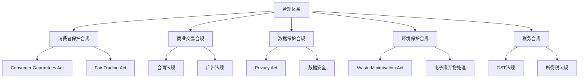
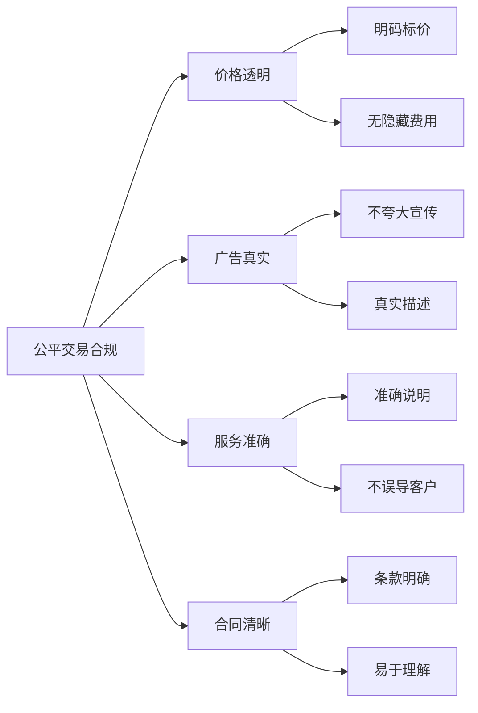
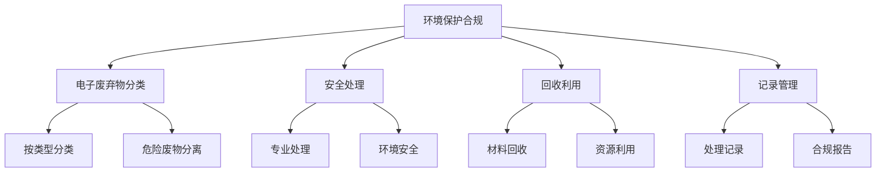
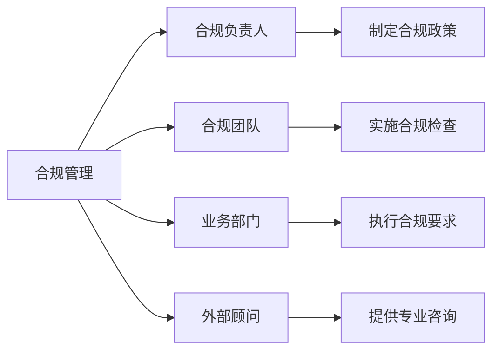
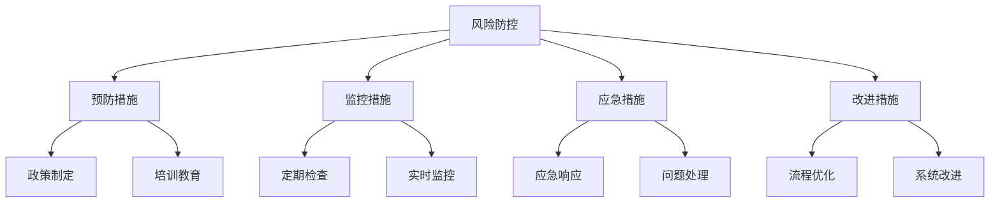

# 法律法规合规要求

## 新西兰手机维修与二手机销售合规框架

### 合规体系架构

### 核心合规要求

#### 1. 消费者保护合规

**Consumer Guarantees Act 1993 合规要求**：

| 合规领域 | 具体要求 | 实施标准 | 检查要点 |
|----------|----------|----------|----------|
| **服务质量** | 维修服务必须专业、及时 | 建立服务标准 | 服务记录、客户反馈 |
| **商品质量** | 二手机必须符合描述 | 质量检测标准 | 检测记录、质量报告 |
| **价格透明** | 价格必须明确、合理 | 价格公示制度 | 价格表、发票记录 |
| **售后服务** | 提供合理的售后服务 | 售后政策 | 售后记录、客户满意度 |

**合规实施要点**：
- 制定详细的服务标准和质量要求
- 建立客户投诉处理机制
- 保持完整的服务记录
- 定期培训员工合规意识

#### 2. 公平交易合规

**Fair Trading Act 1986 合规要求**：

**关键合规要求**：
- **价格透明**：所有价格必须明确公示，无隐藏费用
- **广告真实**：营销宣传必须真实，不得夸大
- **服务准确**：服务描述必须准确，不得误导
- **合同清晰**：合同条款必须清晰易懂

#### 3. 隐私保护合规

**Privacy Act 2020 合规要求**：

| 隐私原则 | 具体要求 | 实施措施 | 合规检查 |
|----------|----------|----------|----------|
| **目的明确** | 明确收集信息的目的 | 制定隐私政策 | 隐私政策文档 |
| **使用限制** | 仅用于声明目的 | 限制数据访问 | 访问控制记录 |
| **安全保障** | 保护信息安全 | 技术安全措施 | 安全审计报告 |
| **透明度** | 告知客户数据使用 | 隐私声明 | 客户同意记录 |

**数据保护要求**：
- 制定隐私政策
- 获得客户明确同意
- 实施数据安全措施
- 允许客户访问和更正数据
- 建立数据泄露应急机制

#### 4. 环境保护合规

**Waste Minimisation Act 2008 合规要求**：

**合规实施要求**：
- 分类收集电子废弃物
- 使用有资质的处理商
- 保持完整的处理记录
- 定期向相关部门报告
- 建立环境管理体系

#### 5. 税务合规

**GST和所得税合规要求**：

| 税务类型 | 合规要求 | 实施标准 | 检查要点 |
|----------|----------|----------|----------|
| **GST注册** | 年营业额超过6万纽币必须注册 | 及时注册GST | GST注册证书 |
| **发票管理** | 必须提供标准GST发票 | 使用标准发票格式 | 发票样本、记录 |
| **申报管理** | 定期申报GST | 建立申报系统 | 申报记录、回执 |
| **记录保持** | 保持完整税务记录 | 建立记录系统 | 记录完整性检查 |

### 合规管理体系

#### 1. 合规组织架构

#### 2. 合规流程建立

**合规管理流程**：
1. **政策制定**：制定内部合规政策
2. **流程设计**：设计合规操作流程
3. **培训实施**：实施员工合规培训
4. **监督检查**：定期合规检查
5. **持续改进**：基于检查结果改进

#### 3. 合规检查机制

**定期检查项目**：

| 检查类型 | 检查频率 | 检查内容 | 负责部门 |
|----------|----------|----------|----------|
| **日常检查** | 每日 | 价格公示、服务标准 | 业务部门 |
| **周度检查** | 每周 | 客户投诉、服务质量 | 质量部门 |
| **月度检查** | 每月 | 合规政策执行、记录完整性 | 合规部门 |
| **季度检查** | 每季度 | 全面合规评估、风险评估 | 管理层 |

### 合规风险防控

#### 1. 风险识别与评估

**主要合规风险**：

| 风险类型 | 风险等级 | 风险描述 | 防控措施 |
|----------|----------|----------|----------|
| **价格违规** | 高 | 价格不透明，隐藏费用 | 建立价格透明机制 |
| **服务违规** | 中 | 服务质量不符合承诺 | 建立质量控制体系 |
| **隐私违规** | 中 | 客户信息泄露 | 建立数据保护机制 |
| **税务违规** | 高 | GST申报错误 | 建立税务管理系统 |
| **环保违规** | 低 | 电子废弃物处理不当 | 建立环保处理流程 |

#### 2. 风险防控措施

**风险防控框架**：

#### 3. 违规处理机制

**违规处理流程**：
1. **发现违规**：通过检查或举报发现违规
2. **初步调查**：了解违规情况和影响
3. **风险评估**：评估违规风险和后果
4. **制定方案**：制定处理和改进方案
5. **实施处理**：执行处理措施
6. **跟踪改进**：跟踪改进效果
7. **总结学习**：总结经验教训

### 合规培训体系

#### 1. 培训内容设计

**合规培训内容**：

| 培训对象 | 培训内容 | 培训频率 | 培训方式 |
|----------|----------|----------|----------|
| **新员工** | 基础合规知识 | 入职时 | 集中培训 |
| **业务人员** | 业务合规要求 | 每季度 | 专题培训 |
| **管理人员** | 管理合规责任 | 每半年 | 高级培训 |
| **全体员工** | 法规更新 | 每年 | 全员培训 |

#### 2. 培训效果评估

**培训评估方法**：
- 培训后测试
- 实际操作考核
- 定期合规检查
- 客户反馈评估

### 合规记录管理

#### 1. 记录类型与要求

**合规记录分类**：

| 记录类型 | 保存期限 | 保存要求 | 检查频率 |
|----------|----------|----------|----------|
| **服务记录** | 7年 | 完整、准确 | 每月 |
| **客户投诉** | 7年 | 处理完整 | 每月 |
| **培训记录** | 3年 | 培训证明 | 每季度 |
| **检查记录** | 3年 | 检查报告 | 每季度 |
| **税务记录** | 7年 | 完整税务记录 | 每年 |

#### 2. 记录管理系统

**记录管理要求**：
- 建立统一的记录管理系统
- 确保记录的完整性和准确性
- 定期备份重要记录
- 建立记录访问控制机制

### 合规最佳实践

#### 1. 建立合规文化
- 领导层重视合规
- 员工合规意识培养
- 合规奖励机制
- 违规惩罚措施

#### 2. 实施合规管理
- 制定合规政策
- 建立合规流程
- 定期合规培训
- 持续合规改进

#### 3. 建立合规监督
- 定期合规检查
- 合规风险评估
- 违规问题处理
- 合规报告制度

#### 4. 持续合规改进
- 法规变化跟踪
- 合规流程优化
- 员工培训更新
- 合规效果评估

## 对从业者的合规建议

### 合规意识培养
1. **了解法规要求**：熟悉相关法律法规
2. **建立合规意识**：将合规作为日常工作要求
3. **定期培训更新**：持续学习法规变化
4. **咨询专业意见**：必要时寻求法律咨询

### 合规管理实施
1. **制定合规政策**：建立内部合规政策
2. **建立合规流程**：制定标准化操作流程
3. **实施合规培训**：定期培训员工
4. **建立监督机制**：定期检查合规状况

### 风险防控措施
1. **识别合规风险**：识别潜在合规风险
2. **建立防控措施**：制定风险防控措施
3. **定期风险评估**：定期评估合规风险
4. **及时处理问题**：发现问题及时处理

---
**相关链接**：
- [[01-基础认知层/01-行业认知/04-政策法规解读|政策法规解读]]
- [[07-运营监督体系/03-合规监督/01-法律法规合规检查|法律法规合规检查]]
- [[08-培训体系/02-在职培训/03-政策法规培训|政策法规培训]]

*最后更新：2024年*
*适用市场：新西兰*
