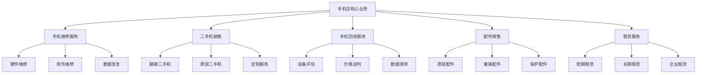
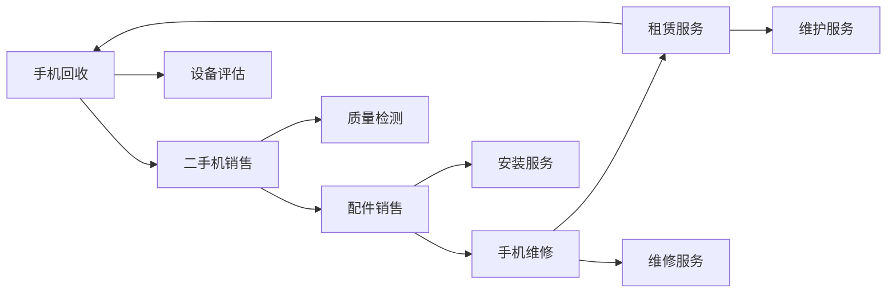

# 核心业务模块概述

## 新西兰手机维修与二手机销售业务架构

### 业务模块总览

### 核心业务模块详解

#### 1. 手机维修服务

**业务范围**：
- 硬件故障维修（屏幕、电池、主板等）
- 软件问题解决（系统升级、病毒清除等）
- 数据恢复服务
- 设备性能优化

**服务特点**：
- 专业技术支持
- 快速响应服务
- 质量保证承诺
- 透明价格体系

**盈利模式**：
- 维修服务费
- 配件销售利润
- 诊断费用
- 增值服务费

#### 2. 二手机销售

**业务范围**：
- 翻新二手机销售
- 原装二手机销售
- 定制化服务
- 质保服务

**服务特点**：
- 质量检测认证
- 价格优势明显
- 多样化选择
- 售后服务完善

**盈利模式**：
- 销售差价利润
- 翻新服务费
- 质保服务费
- 配件销售利润

#### 3. 手机回收服务

**业务范围**：
- 设备价值评估
- 数据安全清除
- 环保处理
- 以旧换新服务

**服务特点**：
- 专业评估技术
- 数据安全保障
- 环保处理流程
- 灵活交易方式

**盈利模式**：
- 回收差价利润
- 数据清除服务费
- 环保处理费
- 转售利润

#### 4. 配件销售

**业务范围**：
- 原装配件销售
- 兼容配件销售
- 保护配件销售
- 定制配件服务

**服务特点**：
- 产品种类丰富
- 质量保证
- 价格合理
- 安装服务

**盈利模式**：
- 配件销售利润
- 安装服务费
- 批量采购优势
- 品牌代理利润

#### 5. 租赁服务

**业务范围**：
- 短期设备租赁
- 长期设备租赁
- 企业批量租赁
- 活动设备租赁

**服务特点**：
- 灵活租赁方案
- 设备维护服务
- 技术支持
- 保险保障

**盈利模式**：
- 租赁费用收入
- 维护服务费
- 保险服务费
- 设备折旧回收

## 业务模块关联分析

### 模块间协同关系

### 业务协同优势

#### 1. 资源整合优势
- **设备资源**：回收设备为销售提供货源
- **技术资源**：维修技术为其他业务提供支持
- **客户资源**：各业务模块共享客户资源
- **供应链资源**：统一采购降低成本

#### 2. 服务协同优势
- **一站式服务**：为客户提供完整解决方案
- **交叉销售**：各业务模块相互促进
- **客户粘性**：多业务服务增加客户粘性
- **品牌价值**：综合服务提升品牌价值

#### 3. 运营协同优势
- **成本分摊**：共享运营成本
- **效率提升**：统一管理提高效率
- **风险分散**：多业务分散经营风险
- **规模效应**：业务规模带来成本优势

## 业务模块运营策略

### 1. 手机维修服务策略

**市场定位**：
- 专业、快速、可靠的维修服务
- 价格透明、质量保证
- 本地化服务优势

**运营重点**：
- 技术能力建设
- 服务质量提升
- 客户关系维护
- 品牌形象建设

**发展策略**：
- 技术升级和培训
- 服务标准化
- 客户满意度提升
- 市场份额扩大

### 2. 二手机销售策略

**市场定位**：
- 高质量、可信赖的二手机
- 性价比优势明显
- 环保理念推广

**运营重点**：
- 质量检测标准
- 价格策略制定
- 库存管理优化
- 销售渠道拓展

**发展策略**：
- 品牌建设
- 质量提升
- 服务创新
- 市场拓展

### 3. 手机回收策略

**市场定位**：
- 专业、安全、环保的回收服务
- 公平、透明的价格评估
- 数据安全保障

**运营重点**：
- 评估技术提升
- 数据安全处理
- 环保合规管理
- 客户信任建设

**发展策略**：
- 技术升级
- 服务标准化
- 合规管理
- 市场教育

### 4. 配件销售策略

**市场定位**：
- 丰富、优质、实惠的配件选择
- 专业安装服务
- 一站式配件解决方案

**运营重点**：
- 产品种类丰富
- 质量保证
- 安装服务
- 库存管理

**发展策略**：
- 产品线扩展
- 服务质量提升
- 供应链优化
- 品牌合作

### 5. 租赁服务策略

**市场定位**：
- 灵活、便捷的设备租赁
- 专业维护服务
- 企业级解决方案

**运营重点**：
- 租赁方案设计
- 设备维护管理
- 客户服务
- 风险控制

**发展策略**：
- 服务创新
- 技术升级
- 市场拓展
- 合作伙伴发展

## 业务模块绩效评估

### 关键绩效指标（KPI）

#### 1. 手机维修服务KPI
| 指标类型 | 具体指标 | 目标值 | 评估周期 |
|----------|----------|--------|----------|
| **服务质量** | 维修成功率 | >95% | 月度 |
| **服务效率** | 平均维修时间 | <2天 | 月度 |
| **客户满意度** | 客户满意度评分 | >4.5/5 | 月度 |
| **盈利能力** | 毛利率 | >40% | 月度 |

#### 2. 二手机销售KPI
| 指标类型 | 具体指标 | 目标值 | 评估周期 |
|----------|----------|--------|----------|
| **销售业绩** | 月销售额 | 增长10% | 月度 |
| **库存管理** | 库存周转率 | >6次/年 | 季度 |
| **质量指标** | 退货率 | <5% | 月度 |
| **盈利能力** | 毛利率 | >30% | 月度 |

#### 3. 手机回收KPI
| 指标类型 | 具体指标 | 目标值 | 评估周期 |
|----------|----------|--------|----------|
| **回收量** | 月回收数量 | 增长15% | 月度 |
| **评估准确性** | 评估准确率 | >90% | 月度 |
| **处理效率** | 平均处理时间 | <1天 | 月度 |
| **盈利能力** | 毛利率 | >25% | 月度 |

#### 4. 配件销售KPI
| 指标类型 | 具体指标 | 目标值 | 评估周期 |
|----------|----------|--------|----------|
| **销售业绩** | 月销售额 | 增长8% | 月度 |
| **库存管理** | 库存周转率 | >8次/年 | 季度 |
| **服务质量** | 安装成功率 | >98% | 月度 |
| **盈利能力** | 毛利率 | >35% | 月度 |

#### 5. 租赁服务KPI
| 指标类型 | 具体指标 | 目标值 | 评估周期 |
|----------|----------|--------|----------|
| **租赁业绩** | 月租赁收入 | 增长12% | 月度 |
| **设备利用率** | 设备利用率 | >80% | 月度 |
| **客户满意度** | 客户满意度评分 | >4.3/5 | 月度 |
| **盈利能力** | 毛利率 | >45% | 月度 |

## 业务模块发展建议

### 短期发展重点（1-2年）
1. **服务标准化**：建立各业务模块的服务标准
2. **技术升级**：提升维修和检测技术水平
3. **客户服务**：改善客户服务体验
4. **品牌建设**：建立专业可信的品牌形象

### 中期发展重点（3-5年）
1. **业务整合**：深化各业务模块的协同
2. **技术创新**：引入新技术提升服务能力
3. **市场拓展**：扩大服务覆盖范围
4. **合作伙伴**：建立战略合作伙伴关系

### 长期发展重点（5-10年）
1. **生态化发展**：构建完整的业务生态
2. **智能化服务**：利用AI等技术提升服务
3. **可持续发展**：实现环保和可持续发展
4. **国际化发展**：考虑国际市场拓展

---
**相关链接**：
- [[01-基础认知层/02-业务认知/02-业务流程总览|业务流程总览]]
- [[01-基础认知层/02-业务认知/03-盈利模式分析|盈利模式分析]]
- [[03-高级应用层/01-业务整合/01-多业务协同策略|多业务协同策略]]

*最后更新：2024年*
*适用市场：新西兰*
