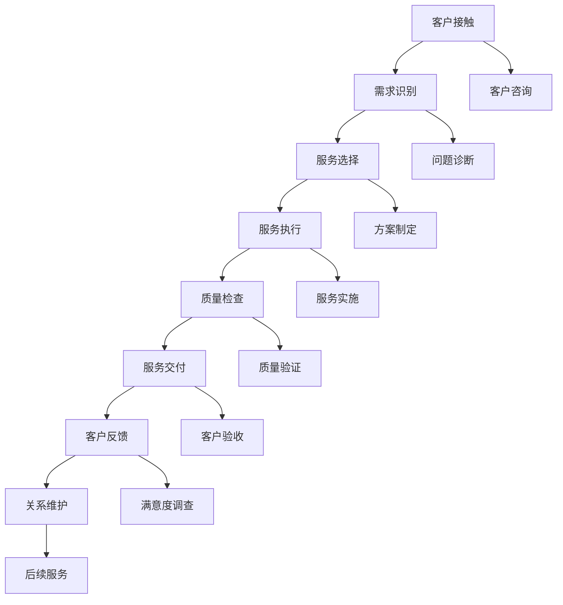
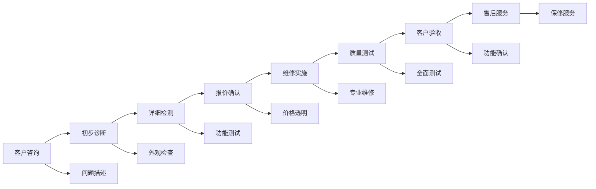
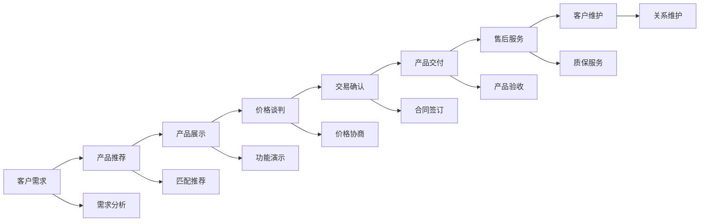
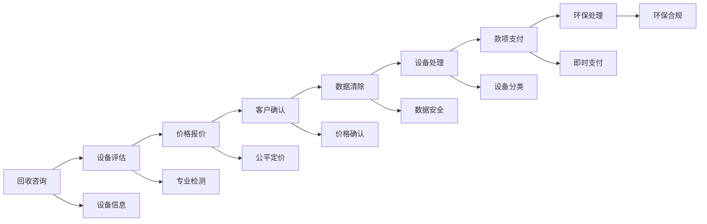
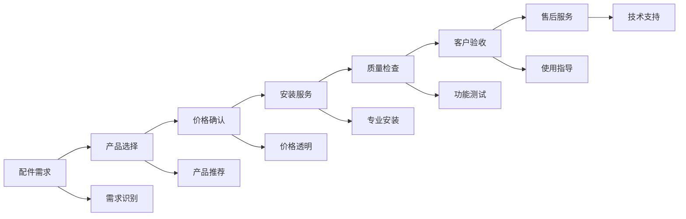
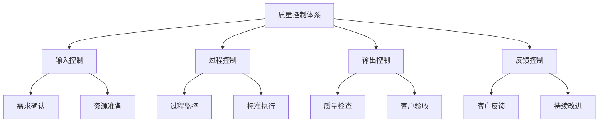

# 业务流程总览

## 新西兰手机维修与二手机销售业务流程架构

### 核心业务流程概览

### 主要业务流程详解

#### 1. 手机维修业务流程

**流程步骤**：

**关键控制点**：
- **初步诊断**：快速识别问题类型
- **详细检测**：全面了解故障情况
- **报价确认**：透明价格，客户确认
- **质量测试**：确保维修质量
- **客户验收**：客户满意确认

#### 2. 二手机销售业务流程

**流程步骤**：

**关键控制点**：
- **需求分析**：深入了解客户需求
- **产品匹配**：推荐合适产品
- **价格协商**：合理定价策略
- **产品验收**：确保产品质量
- **售后服务**：提供质保服务

#### 3. 手机回收业务流程

**流程步骤**：

**关键控制点**：
- **设备评估**：专业准确评估
- **价格报价**：公平透明定价
- **数据清除**：确保数据安全
- **环保处理**：合规环保处理
- **款项支付**：及时安全支付

#### 4. 配件销售业务流程

**流程步骤**：

**关键控制点**：
- **产品选择**：匹配客户需求
- **专业安装**：确保安装质量
- **功能测试**：验证配件功能
- **使用指导**：提供使用说明
- **技术支持**：持续技术支持

#### 5. 租赁服务业务流程

**流程步骤**：

**关键控制点**：
- **需求分析**：深入了解租赁需求
- **方案制定**：制定合适租赁方案
- **设备交付**：确保设备质量
- **使用支持**：提供技术支持
- **维护服务**：定期维护保养

## 业务流程优化策略

### 1. 流程标准化

**标准化要求**：
- 统一的操作流程
- 标准化的服务标准
- 规范化的质量控制
- 系统化的记录管理

**实施方法**：
- 制定标准操作程序（SOP）
- 建立质量控制体系
- 实施员工培训
- 定期流程审查

### 2. 流程自动化

**自动化领域**：
- 客户信息管理
- 订单处理系统
- 库存管理系统
- 财务管理系统

**实施效果**：
- 提高工作效率
- 减少人为错误
- 降低运营成本
- 提升服务质量

### 3. 流程数字化

**数字化应用**：
- 客户服务系统
- 维修管理系统
- 销售管理系统
- 数据分析系统

**数字化优势**：
- 数据实时更新
- 信息共享便捷
- 决策支持有力
- 客户体验提升

## 业务流程质量控制

### 质量控制体系

### 质量控制要点

#### 1. 输入质量控制
- **需求确认**：准确理解客户需求
- **资源准备**：确保所需资源到位
- **标准确认**：明确服务标准要求
- **风险评估**：识别潜在风险因素

#### 2. 过程质量控制
- **过程监控**：实时监控服务过程
- **标准执行**：严格按照标准执行
- **问题处理**：及时处理过程中问题
- **记录管理**：完整记录过程信息

#### 3. 输出质量控制
- **质量检查**：全面检查服务质量
- **客户验收**：确保客户满意
- **标准符合**：符合质量标准要求
- **文档完整**：提供完整服务文档

#### 4. 反馈质量控制
- **客户反馈**：收集客户反馈意见
- **问题分析**：分析质量问题原因
- **改进措施**：制定改进措施
- **持续改进**：持续优化服务质量

## 业务流程绩效评估

### 关键绩效指标

#### 1. 效率指标
| 指标名称 | 计算方法 | 目标值 | 评估周期 |
|----------|----------|--------|----------|
| **平均处理时间** | 总处理时间/处理数量 | <2天 | 月度 |
| **流程完成率** | 完成流程数/总流程数 | >95% | 月度 |
| **资源利用率** | 实际使用/计划使用 | >80% | 月度 |
| **自动化率** | 自动化流程/总流程 | >60% | 季度 |

#### 2. 质量指标
| 指标名称 | 计算方法 | 目标值 | 评估周期 |
|----------|----------|--------|----------|
| **一次通过率** | 一次通过数/总处理数 | >90% | 月度 |
| **客户满意度** | 满意客户数/总客户数 | >4.5/5 | 月度 |
| **返工率** | 返工数量/总处理数 | <5% | 月度 |
| **投诉率** | 投诉数量/总服务数 | <2% | 月度 |

#### 3. 成本指标
| 指标名称 | 计算方法 | 目标值 | 评估周期 |
|----------|----------|--------|----------|
| **单位成本** | 总成本/服务数量 | 持续降低 | 月度 |
| **成本控制率** | 实际成本/预算成本 | <100% | 月度 |
| **资源浪费率** | 浪费资源/总资源 | <5% | 月度 |
| **效率提升率** | 效率提升/基准效率 | >10% | 季度 |

## 业务流程改进建议

### 短期改进（1-6个月）
1. **流程标准化**：建立标准操作程序
2. **质量控制**：实施质量控制体系
3. **员工培训**：提升员工流程执行能力
4. **系统优化**：优化现有管理系统

### 中期改进（6-18个月）
1. **流程自动化**：引入自动化工具
2. **数字化升级**：升级数字化系统
3. **流程整合**：整合相关业务流程
4. **绩效优化**：优化流程绩效指标

### 长期改进（18个月以上）
1. **智能化发展**：引入AI和机器学习
2. **生态化建设**：构建完整业务生态
3. **创新服务**：开发创新服务模式
4. **持续优化**：建立持续改进机制

---
**相关链接**：
- [[01-基础认知层/02-业务认知/01-核心业务模块概述|核心业务模块概述]]
- [[04-工具模板/01-工作流程/01-客户接待流程模板|客户接待流程模板]]
- [[03-高级应用层/02-运营优化/01-效率提升方法|效率提升方法]]

*最后更新：2024年*
*适用市场：新西兰*
