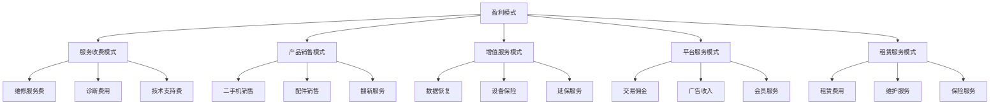
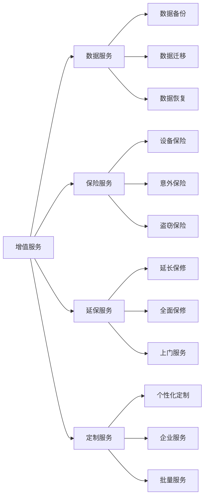
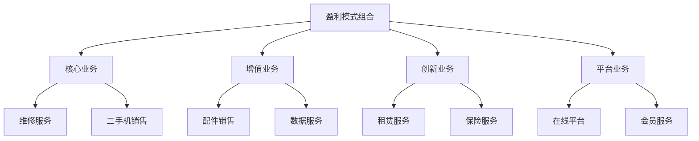

# 盈利模式分析

## 新西兰手机维修与二手机销售盈利模式

### 盈利模式总览

### 核心盈利模式详解

#### 1. 服务收费模式

**主要收入来源**：

| 服务类型 | 收费方式 | 平均价格 | 毛利率 | 市场占比 |
|----------|----------|----------|--------|----------|
| **硬件维修** | 按项目收费 | 80-300纽币 | 60-80% | 40% |
| **软件维修** | 按时间收费 | 50-150纽币 | 70-90% | 25% |
| **数据恢复** | 按难度收费 | 100-500纽币 | 50-70% | 15% |
| **设备诊断** | 固定收费 | 30-80纽币 | 80-95% | 20% |

**盈利特点**：
- **高毛利率**：服务成本主要为人工成本
- **技术溢价**：专业技术服务获得溢价
- **客户粘性**：优质服务建立客户忠诚度
- **规模效应**：服务量增加带来成本分摊

**优化策略**：
- 提升服务效率，降低单位成本
- 开发高价值服务项目
- 建立服务标准化体系
- 培养专业技术团队

#### 2. 产品销售模式

**主要收入来源**：

| 产品类型 | 销售方式 | 平均价格 | 毛利率 | 市场占比 |
|----------|----------|----------|--------|----------|
| **二手机销售** | 直接销售 | 200-800纽币 | 25-40% | 35% |
| **原装配件** | 零售销售 | 50-200纽币 | 30-50% | 20% |
| **兼容配件** | 批量销售 | 20-100纽币 | 40-60% | 25% |
| **保护配件** | 搭配销售 | 30-150纽币 | 50-70% | 20% |

**盈利特点**：
- **规模效应**：批量采购降低成本
- **品牌溢价**：知名品牌获得溢价
- **库存管理**：合理库存控制成本
- **交叉销售**：多产品组合销售

**优化策略**：
- 优化供应链管理，降低采购成本
- 建立库存管理系统，减少积压
- 开发自有品牌产品
- 实施精准营销策略

#### 3. 增值服务模式

**主要收入来源**：

**盈利特点**：
- **高附加值**：服务价值高于成本
- **客户粘性**：增值服务增加客户粘性
- **差异化竞争**：提供独特服务价值
- **持续收入**：建立长期收入来源

**优化策略**：
- 开发创新增值服务
- 建立服务标准化体系
- 提升服务质量
- 扩大服务覆盖范围

#### 4. 平台服务模式

**主要收入来源**：

| 收入类型 | 收费方式 | 平均费率 | 毛利率 | 市场占比 |
|----------|----------|----------|--------|----------|
| **交易佣金** | 按交易额收费 | 3-8% | 80-95% | 50% |
| **广告收入** | 按展示收费 | 0.5-2纽币/次 | 90-98% | 25% |
| **会员服务** | 按年收费 | 50-200纽币/年 | 70-85% | 15% |
| **数据服务** | 按使用收费 | 10-50纽币/月 | 60-80% | 10% |

**盈利特点**：
- **平台效应**：连接供需双方
- **网络效应**：用户越多价值越大
- **边际成本低**：服务成本相对固定
- **可扩展性强**：易于扩展服务范围

**优化策略**：
- 扩大用户基础
- 提升平台价值
- 开发新服务功能
- 建立生态系统

#### 5. 租赁服务模式

**主要收入来源**：

| 租赁类型 | 收费方式 | 平均价格 | 毛利率 | 市场占比 |
|----------|----------|----------|--------|----------|
| **短期租赁** | 按天收费 | 10-30纽币/天 | 40-60% | 30% |
| **长期租赁** | 按月收费 | 50-150纽币/月 | 35-50% | 40% |
| **企业租赁** | 按合同收费 | 100-500纽币/月 | 30-45% | 20% |
| **活动租赁** | 按项目收费 | 200-1000纽币/项目 | 45-65% | 10% |

**盈利特点**：
- **持续收入**：建立长期收入流
- **资产利用**：提高资产利用率
- **风险分散**：分散设备投资风险
- **服务增值**：提供维护等增值服务

**优化策略**：
- 优化设备配置
- 提升服务质量
- 扩大租赁范围
- 建立合作伙伴关系

## 盈利模式组合策略

### 盈利模式组合矩阵

### 盈利模式优化策略

#### 1. 收入结构优化
- **多元化收入**：减少对单一收入来源依赖
- **高价值服务**：重点发展高毛利率服务
- **客户价值**：提升单个客户价值
- **市场拓展**：扩大服务覆盖范围

#### 2. 成本结构优化
- **规模效应**：通过规模降低成本
- **效率提升**：提高运营效率
- **供应链优化**：优化供应链管理
- **技术应用**：利用技术降低成本

#### 3. 利润结构优化
- **毛利率提升**：提高服务毛利率
- **成本控制**：有效控制运营成本
- **价格策略**：制定合理价格策略
- **价值创造**：创造更多客户价值

## 盈利能力分析

### 盈利能力指标

#### 1. 收入指标
| 指标名称 | 计算方法 | 目标值 | 评估周期 |
|----------|----------|--------|----------|
| **总收入** | 各项收入总和 | 持续增长 | 月度 |
| **收入增长率** | (本期-上期)/上期 | >15% | 季度 |
| **人均收入** | 总收入/员工数 | 持续提升 | 月度 |
| **客户价值** | 总收入/客户数 | 持续提升 | 月度 |

#### 2. 成本指标
| 指标名称 | 计算方法 | 目标值 | 评估周期 |
|----------|----------|--------|----------|
| **总成本** | 各项成本总和 | 合理控制 | 月度 |
| **成本率** | 总成本/总收入 | <70% | 月度 |
| **人均成本** | 总成本/员工数 | 合理控制 | 月度 |
| **成本增长率** | (本期-上期)/上期 | <收入增长率 | 季度 |

#### 3. 利润指标
| 指标名称 | 计算方法 | 目标值 | 评估周期 |
|----------|----------|--------|----------|
| **毛利润** | 总收入-直接成本 | 持续增长 | 月度 |
| **毛利率** | 毛利润/总收入 | >30% | 月度 |
| **净利润** | 总收入-总成本 | 持续增长 | 月度 |
| **净利率** | 净利润/总收入 | >15% | 月度 |

### 盈利能力提升策略

#### 1. 收入提升策略
- **服务创新**：开发新的服务项目
- **市场拓展**：扩大服务覆盖范围
- **客户开发**：增加新客户获取
- **价值提升**：提升服务价值

#### 2. 成本控制策略
- **效率提升**：提高运营效率
- **规模效应**：通过规模降低成本
- **供应链优化**：优化供应链管理
- **技术应用**：利用技术降低成本

#### 3. 利润优化策略
- **价格策略**：制定合理价格策略
- **成本控制**：有效控制运营成本
- **价值创造**：创造更多客户价值
- **风险控制**：控制经营风险

## 盈利模式发展趋势

### 短期趋势（1-2年）
- **服务化转型**：从产品销售向服务转型
- **数字化升级**：利用数字技术提升效率
- **客户价值**：更加注重客户价值创造
- **成本控制**：加强成本控制和效率提升

### 中期趋势（3-5年）
- **平台化发展**：构建服务平台生态
- **智能化服务**：利用AI等技术提升服务
- **生态化发展**：构建完整业务生态
- **可持续发展**：实现可持续发展目标

### 长期趋势（5-10年）
- **技术革命**：新技术改变盈利模式
- **服务创新**：全新的服务模式和体验
- **市场整合**：行业整合和集中度提升
- **国际化发展**：考虑国际市场拓展

## 对从业者的建议

### 盈利模式选择
1. **市场定位**：明确市场定位和目标客户
2. **资源评估**：评估自身资源和能力
3. **竞争分析**：分析竞争对手策略
4. **模式创新**：开发创新盈利模式

### 盈利能力提升
1. **收入优化**：优化收入结构和来源
2. **成本控制**：有效控制运营成本
3. **效率提升**：提高运营效率
4. **价值创造**：创造更多客户价值

### 风险控制
1. **收入风险**：分散收入来源，降低风险
2. **成本风险**：控制成本上升风险
3. **市场风险**：应对市场变化风险
4. **技术风险**：跟上技术发展步伐

---
**相关链接**：
- [[01-基础认知层/02-业务认知/01-核心业务模块概述|核心业务模块概述]]
- [[03-高级应用层/02-运营优化/03-利润最大化技巧|利润最大化技巧]]
- [[03-高级应用层/02-运营优化/02-成本控制策略|成本控制策略]]

*最后更新：2024年*
*适用市场：新西兰*
