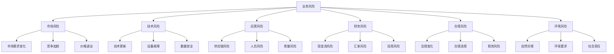
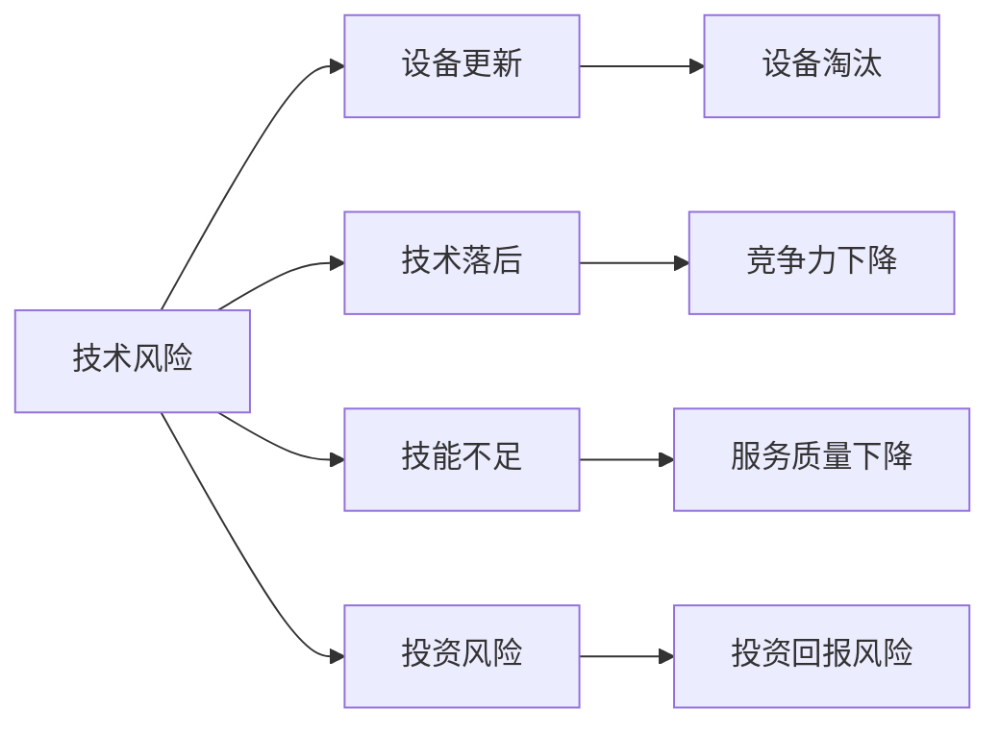
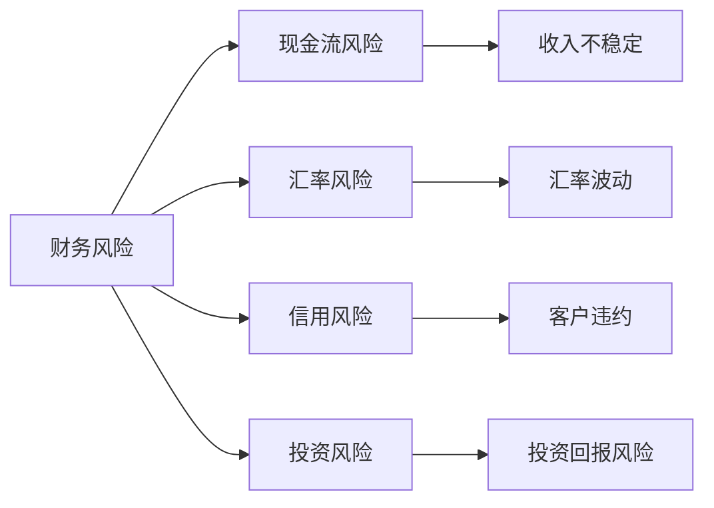
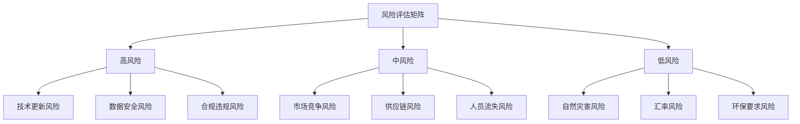
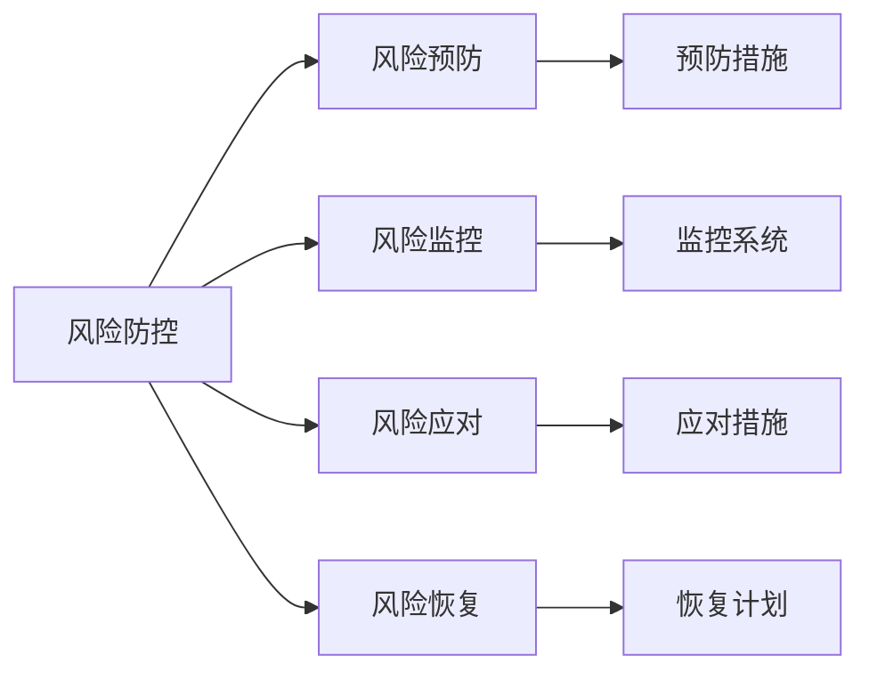
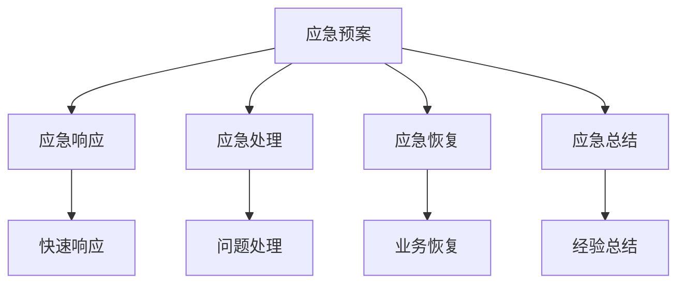

# 业务风险识别

## 新西兰手机维修与二手机销售业务风险分析

### 风险分类框架

### 主要风险类型详解

#### 1. 市场风险

**市场需求变化风险**：

| 风险因素 | 风险描述 | 影响程度 | 发生概率 | 应对策略 |
|----------|----------|----------|----------|----------|
| **技术更新** | 新技术导致需求变化 | 高 | 中 | 技术跟踪，服务升级 |
| **经济环境** | 经济衰退影响消费 | 中 | 低 | 多元化服务，成本控制 |
| **消费习惯** | 消费者偏好变化 | 中 | 中 | 市场调研，服务创新 |
| **替代产品** | 新产品替代现有需求 | 高 | 中 | 技术升级，服务转型 |

**竞争加剧风险**：
- **新竞争者进入**：降低市场份额和利润
- **价格竞争**：压缩利润空间
- **服务差异化**：需要持续创新
- **品牌竞争**：需要品牌建设投入

**价格波动风险**：
- **配件价格波动**：影响成本控制
- **服务价格竞争**：影响收入水平
- **汇率波动**：影响进口成本
- **通胀压力**：影响运营成本

#### 2. 技术风险

**技术更新风险**：

**具体技术风险**：
- **设备技术更新**：维修设备需要持续更新
- **软件技术变化**：需要跟上软件发展
- **诊断技术升级**：诊断工具需要升级
- **数据恢复技术**：数据恢复技术发展

**设备故障风险**：
- **关键设备故障**：影响服务能力
- **设备维护成本**：增加运营成本
- **设备安全风险**：可能造成损失
- **设备更新需求**：需要持续投资

**数据安全风险**：
- **客户数据泄露**：违反隐私法规
- **数据丢失**：影响客户信任
- **数据恢复失败**：影响服务质量
- **数据备份风险**：备份系统故障

#### 3. 运营风险

**供应链风险**：

| 风险类型 | 风险描述 | 影响程度 | 发生概率 | 应对策略 |
|----------|----------|----------|----------|----------|
| **供应商依赖** | 过度依赖单一供应商 | 中 | 中 | 供应商多元化 |
| **配件短缺** | 关键配件供应不足 | 高 | 中 | 库存管理，备选方案 |
| **质量问题** | 配件质量问题 | 高 | 中 | 质量检测，供应商管理 |
| **价格波动** | 配件价格大幅波动 | 中 | 中 | 价格锁定，长期合同 |

**人员风险**：
- **关键人员流失**：影响服务能力
- **技能不足**：影响服务质量
- **培训成本**：增加运营成本
- **人员安全**：工作安全风险

**质量风险**：
- **服务质量下降**：影响客户满意度
- **产品质量问题**：影响品牌形象
- **维修质量风险**：可能造成损失
- **质量控制失效**：系统性质量问题

#### 4. 财务风险

**现金流风险**：

**具体财务风险**：
- **收入不稳定**：季节性波动，客户流失
- **成本上升**：人工成本，租金成本
- **应收账款**：客户延期付款
- **库存积压**：资金占用，贬值风险

**汇率风险**：
- **进口成本**：汇率波动影响成本
- **出口收入**：汇率波动影响收入
- **外汇结算**：结算汇率风险
- **汇率对冲**：对冲成本风险

**信用风险**：
- **客户违约**：客户不付款风险
- **供应商信用**：供应商违约风险
- **银行信用**：银行授信风险
- **合作伙伴信用**：合作伙伴违约风险

#### 5. 合规风险

**法规变化风险**：

| 法规类型 | 变化风险 | 影响程度 | 应对策略 |
|----------|----------|----------|----------|
| **消费者保护法** | 法规要求提高 | 高 | 合规培训，流程更新 |
| **隐私保护法** | 数据保护要求 | 中 | 数据安全，隐私政策 |
| **环保法规** | 环保要求提高 | 中 | 环保处理，合规管理 |
| **税务法规** | 税务政策变化 | 中 | 税务咨询，合规申报 |

**合规违规风险**：
- **操作违规**：员工操作不当
- **流程违规**：流程不符合要求
- **记录违规**：记录不完整
- **培训不足**：员工培训不足

**税务风险**：
- **GST申报错误**：税务申报错误
- **所得税风险**：所得税计算错误
- **税务审计**：税务部门审计
- **税务处罚**：税务违规处罚

#### 6. 环境风险

**自然灾害风险**：
- **地震风险**：新西兰地震频发
- **洪水风险**：极端天气影响
- **火灾风险**：设备火灾风险
- **其他灾害**：其他自然灾害

**环保要求风险**：
- **电子废弃物处理**：环保处理要求
- **环保认证**：环保认证要求
- **环保处罚**：环保违规处罚
- **环保成本**：环保处理成本

**社会责任风险**：
- **社区关系**：社区关系维护
- **员工权益**：员工权益保护
- **客户权益**：客户权益保护
- **社会形象**：企业社会形象

## 风险评估矩阵

### 风险等级评估

### 风险优先级排序

| 风险类型 | 风险等级 | 影响程度 | 发生概率 | 优先级 |
|----------|----------|----------|----------|--------|
| **技术更新风险** | 高 | 高 | 中 | 1 |
| **数据安全风险** | 高 | 高 | 中 | 2 |
| **合规违规风险** | 高 | 高 | 低 | 3 |
| **市场竞争风险** | 中 | 中 | 高 | 4 |
| **供应链风险** | 中 | 中 | 中 | 5 |
| **人员流失风险** | 中 | 中 | 中 | 6 |
| **现金流风险** | 中 | 中 | 中 | 7 |
| **自然灾害风险** | 低 | 高 | 低 | 8 |

## 风险防控策略

### 风险防控框架

### 具体防控措施

#### 1. 技术风险防控
- **技术跟踪**：持续跟踪技术发展
- **设备更新**：定期更新维修设备
- **技能培训**：提升员工技术水平
- **技术投资**：合理投资技术升级

#### 2. 数据安全风险防控
- **数据加密**：实施数据加密保护
- **访问控制**：建立访问控制机制
- **备份系统**：建立数据备份系统
- **安全培训**：员工数据安全培训

#### 3. 合规风险防控
- **合规培训**：定期合规培训
- **流程更新**：及时更新操作流程
- **合规检查**：定期合规检查
- **专业咨询**：寻求专业法律咨询

#### 4. 市场风险防控
- **市场调研**：持续市场调研
- **服务创新**：持续服务创新
- **客户关系**：维护客户关系
- **品牌建设**：加强品牌建设

#### 5. 运营风险防控
- **供应商管理**：建立供应商管理体系
- **质量控制**：实施质量控制体系
- **人员管理**：完善人员管理制度
- **流程优化**：持续优化运营流程

#### 6. 财务风险防控
- **现金流管理**：加强现金流管理
- **成本控制**：有效控制运营成本
- **信用管理**：建立信用管理体系
- **投资决策**：谨慎投资决策

## 风险应急预案

### 应急预案框架

### 具体应急预案

#### 1. 技术故障应急预案
- **故障识别**：快速识别技术故障
- **应急处理**：启动应急处理程序
- **替代方案**：提供替代服务方案
- **客户沟通**：及时沟通客户
- **故障修复**：尽快修复故障
- **业务恢复**：恢复正常业务

#### 2. 数据泄露应急预案
- **泄露发现**：及时发现数据泄露
- **应急响应**：启动应急响应程序
- **影响评估**：评估泄露影响范围
- **客户通知**：及时通知受影响客户
- **修复措施**：实施修复措施
- **预防改进**：改进预防措施

#### 3. 合规违规应急预案
- **违规发现**：及时发现合规违规
- **影响评估**：评估违规影响
- **整改措施**：制定整改措施
- **监管部门沟通**：与监管部门沟通
- **整改实施**：实施整改措施
- **预防措施**：加强预防措施

#### 4. 自然灾害应急预案
- **灾害预警**：关注灾害预警信息
- **预防措施**：实施预防措施
- **应急响应**：启动应急响应
- **人员安全**：确保人员安全
- **设备保护**：保护关键设备
- **业务恢复**：尽快恢复业务

## 风险监控体系

### 风险监控指标

| 风险类型 | 监控指标 | 监控频率 | 预警阈值 |
|----------|----------|----------|----------|
| **技术风险** | 设备故障率 | 每日 | >5% |
| **数据安全** | 安全事件数 | 每日 | >0 |
| **合规风险** | 违规事件数 | 每月 | >0 |
| **市场风险** | 客户流失率 | 每月 | >10% |
| **运营风险** | 质量问题数 | 每周 | >3 |
| **财务风险** | 现金流状况 | 每日 | <安全线 |

### 风险监控系统

#### 1. 监控系统建立
- **监控指标**：建立监控指标体系
- **监控工具**：使用监控工具
- **监控流程**：建立监控流程
- **监控人员**：指定监控人员

#### 2. 监控系统运行
- **数据收集**：收集监控数据
- **数据分析**：分析监控数据
- **预警机制**：建立预警机制
- **报告制度**：建立报告制度

#### 3. 监控系统改进
- **效果评估**：评估监控效果
- **系统优化**：优化监控系统
- **指标调整**：调整监控指标
- **流程改进**：改进监控流程

## 对从业者的建议

### 风险意识培养
1. **风险教育**：加强风险意识教育
2. **风险培训**：定期风险培训
3. **风险文化**：建立风险文化
4. **风险责任**：明确风险责任

### 风险防控实施
1. **风险识别**：定期识别风险
2. **风险评估**：评估风险等级
3. **防控措施**：实施防控措施
4. **效果评估**：评估防控效果

### 应急能力建设
1. **应急预案**：制定应急预案
2. **应急培训**：实施应急培训
3. **应急演练**：定期应急演练
4. **应急改进**：持续改进应急能力

---
**相关链接**：
- [[01-基础认知层/02-业务认知/01-核心业务模块概述|核心业务模块概述]]
- [[03-高级应用层/02-运营优化/04-风险管控体系|风险管控体系]]
- [[07-运营监督体系/03-合规监督/04-合规风险识别与管控|合规风险识别与管控]]

*最后更新：2024年*
*适用市场：新西兰*

