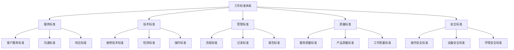
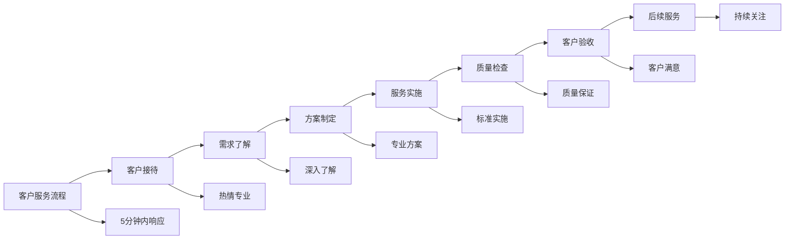
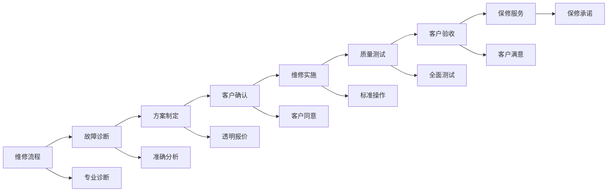
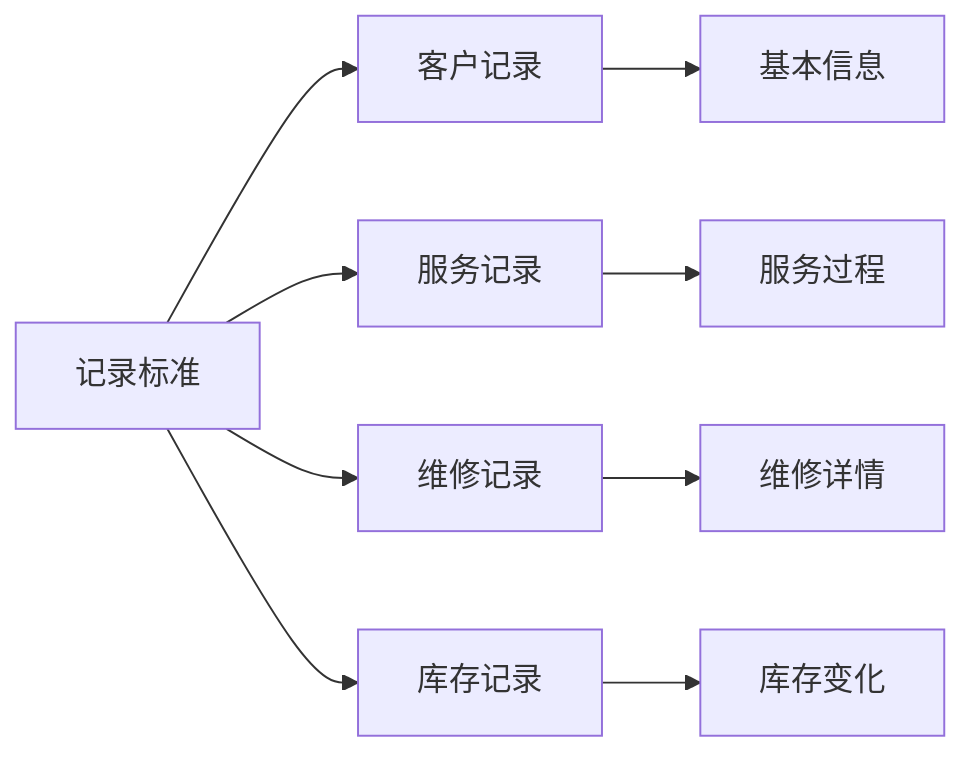

# 工作标准规范

## 新西兰手机维修与二手机销售工作标准体系

### 工作标准架构

### 服务标准规范

#### 1. 客户服务标准

**服务态度标准**：

| 服务环节 | 标准要求 | 具体要求 | 评估方法 |
|----------|----------|----------|----------|
| **接待服务** | 热情专业 | 主动问候，微笑服务，专业态度 | 客户反馈，神秘客户 |
| **咨询服务** | 耐心细致 | 耐心倾听，详细解答，专业建议 | 咨询记录，客户满意度 |
| **问题解决** | 快速有效 | 快速响应，有效解决，及时反馈 | 问题解决率，响应时间 |
| **后续服务** | 持续关注 | 定期回访，问题跟踪，关系维护 | 回访记录，客户维护 |

**服务流程标准**：

**服务时间标准**：
- **响应时间**：客户咨询5分钟内响应
- **服务时间**：维修服务2天内完成
- **等待时间**：客户等待时间不超过30分钟
- **回访时间**：服务完成后24小时内回访

#### 2. 沟通标准

**语言沟通标准**：
- **语言使用**：使用标准英语，避免俚语
- **语速控制**：语速适中，清晰表达
- **音量控制**：音量适中，确保清晰
- **语调控制**：语调友好，专业自信

**非语言沟通标准**：
- **肢体语言**：姿态端正，手势自然
- **面部表情**：保持微笑，表情自然
- **眼神交流**：适当眼神交流，表示关注
- **空间距离**：保持合适距离，尊重隐私

**沟通内容标准**：
- **信息准确**：提供准确信息，避免误导
- **内容完整**：信息内容完整，不遗漏
- **逻辑清晰**：表达逻辑清晰，易于理解
- **专业术语**：适当使用专业术语，解释清楚

#### 3. 响应标准

**响应时间标准**：

| 服务类型 | 响应时间 | 处理时间 | 完成时间 |
|----------|----------|----------|----------|
| **电话咨询** | 5分钟内 | 30分钟内 | 当天完成 |
| **在线咨询** | 10分钟内 | 1小时内 | 当天完成 |
| **现场咨询** | 立即响应 | 30分钟内 | 当天完成 |
| **紧急维修** | 立即响应 | 2小时内 | 24小时内 |

**响应质量标准**：
- **响应及时**：在规定时间内响应
- **响应准确**：准确理解客户需求
- **响应专业**：提供专业建议
- **响应完整**：提供完整解决方案

### 技术标准规范

#### 1. 维修技术标准

**硬件维修标准**：

| 维修项目 | 技术标准 | 质量要求 | 安全要求 |
|----------|----------|----------|----------|
| **屏幕维修** | 使用原厂或认证配件 | 功能正常，外观完美 | 防静电，安全操作 |
| **电池更换** | 使用原厂电池 | 续航正常，安全可靠 | 防短路，安全操作 |
| **主板维修** | 专业设备，标准流程 | 功能完整，性能稳定 | 防静电，专业操作 |
| **摄像头维修** | 使用原厂配件 | 拍照清晰，功能正常 | 防尘防潮，安全操作 |

**软件维修标准**：
- **系统升级**：使用官方系统，备份数据
- **病毒清除**：使用专业工具，彻底清除
- **数据恢复**：使用专业软件，安全恢复
- **性能优化**：系统优化，性能提升

**维修流程标准**：

#### 2. 检测标准

**设备检测标准**：
- **外观检测**：检查外观损伤，记录状态
- **功能检测**：测试各项功能，确保正常
- **性能检测**：测试性能指标，评估状态
- **安全检测**：检查安全隐患，确保安全

**检测工具标准**：
- **专业工具**：使用专业检测工具
- **工具校准**：定期校准检测工具
- **工具维护**：定期维护检测工具
- **工具更新**：及时更新检测工具

**检测记录标准**：
- **记录完整**：完整记录检测结果
- **记录准确**：准确记录检测数据
- **记录及时**：及时记录检测过程
- **记录保存**：妥善保存检测记录

#### 3. 操作标准

**操作流程标准**：
- **标准流程**：按照标准流程操作
- **安全操作**：遵守安全操作规程
- **质量操作**：确保操作质量
- **效率操作**：提高操作效率

**操作环境标准**：
- **工作环境**：保持整洁工作环境
- **设备环境**：确保设备正常运行
- **安全环境**：确保操作安全
- **环保环境**：遵守环保要求

### 管理标准规范

#### 1. 流程标准

**业务流程标准**：

| 业务流程 | 标准要求 | 执行标准 | 质量控制 |
|----------|----------|----------|----------|
| **客户接待流程** | 标准化接待 | 热情专业，流程完整 | 客户满意度>4.5/5 |
| **维修服务流程** | 标准化维修 | 专业操作，质量保证 | 维修质量>98% |
| **销售服务流程** | 标准化销售 | 专业推荐，透明交易 | 销售成功率>60% |
| **库存管理流程** | 标准化管理 | 准确记录，及时更新 | 库存准确率>99% |

**流程优化标准**：
- **流程简化**：简化不必要流程
- **流程标准化**：建立标准流程
- **流程监控**：监控流程执行
- **流程改进**：持续改进流程

#### 2. 记录标准

**记录内容标准**：

**记录质量标准**：
- **记录完整**：记录内容完整
- **记录准确**：记录数据准确
- **记录及时**：及时记录信息
- **记录规范**：记录格式规范

**记录管理标准**：
- **记录保存**：妥善保存记录
- **记录安全**：确保记录安全
- **记录检索**：便于记录检索
- **记录更新**：及时更新记录

#### 3. 报告标准

**报告内容标准**：
- **报告完整**：报告内容完整
- **报告准确**：报告数据准确
- **报告及时**：及时提交报告
- **报告清晰**：报告表达清晰

**报告格式标准**：
- **格式统一**：使用统一格式
- **结构清晰**：结构层次清晰
- **内容规范**：内容表达规范
- **图表使用**：适当使用图表

### 质量标准规范

#### 1. 服务质量标准

**服务质量指标**：

| 质量指标 | 标准要求 | 测量方法 | 改进目标 |
|----------|----------|----------|----------|
| **客户满意度** | >4.5/5 | 客户调查 | 持续提升 |
| **问题解决率** | >95% | 问题统计 | 达到100% |
| **响应时间** | <5分钟 | 时间记录 | 进一步缩短 |
| **服务完成率** | >98% | 完成统计 | 达到100% |

**质量改进标准**：
- **质量监控**：持续监控质量
- **质量分析**：分析质量问题
- **质量改进**：实施质量改进
- **质量验证**：验证改进效果

#### 2. 产品质量标准

**产品质量要求**：
- **功能正常**：产品功能正常
- **性能稳定**：产品性能稳定
- **外观完美**：产品外观完美
- **安全可靠**：产品安全可靠

**质量检测标准**：
- **检测全面**：全面检测产品
- **检测准确**：准确检测结果
- **检测及时**：及时检测产品
- **检测记录**：完整检测记录

#### 3. 工作质量标准

**工作质量要求**：
- **工作准确**：工作结果准确
- **工作完整**：工作内容完整
- **工作及时**：工作完成及时
- **工作规范**：工作过程规范

### 安全标准规范

#### 1. 操作安全标准

**安全操作要求**：

| 操作类型 | 安全要求 | 防护措施 | 应急处理 |
|----------|----------|----------|----------|
| **设备操作** | 遵守操作规程 | 使用防护设备 | 立即停止，报告处理 |
| **工具使用** | 正确使用工具 | 定期检查工具 | 更换工具，安全操作 |
| **化学品使用** | 安全使用化学品 | 使用防护用品 | 立即清洗，医疗处理 |
| **电气操作** | 安全电气操作 | 断电操作，绝缘保护 | 立即断电，医疗处理 |

**安全防护标准**：
- **个人防护**：使用个人防护设备
- **环境防护**：确保环境安全
- **设备防护**：使用安全设备
- **操作防护**：遵守安全操作

#### 2. 设备安全标准

**设备安全要求**：
- **设备检查**：定期检查设备
- **设备维护**：定期维护设备
- **设备更新**：及时更新设备
- **设备安全**：确保设备安全

**设备操作标准**：
- **操作培训**：接受操作培训
- **操作资格**：获得操作资格
- **操作监督**：接受操作监督
- **操作记录**：记录操作过程

#### 3. 环境安全标准

**工作环境安全**：
- **环境整洁**：保持环境整洁
- **环境通风**：确保环境通风
- **环境照明**：确保环境照明
- **环境温度**：控制环境温度

**环保要求标准**：
- **废物处理**：正确处理废物
- **资源节约**：节约使用资源
- **污染控制**：控制环境污染
- **环保合规**：遵守环保法规

## 标准执行与监督

### 标准执行

#### 1. 执行要求
- **严格执行**：严格执行工作标准
- **持续执行**：持续执行工作标准
- **全面执行**：全面执行工作标准
- **规范执行**：规范执行工作标准

#### 2. 执行方法
- **培训教育**：通过培训教育执行
- **监督检查**：通过监督检查执行
- **考核评估**：通过考核评估执行
- **改进优化**：通过改进优化执行

### 标准监督

#### 1. 监督机制
- **内部监督**：建立内部监督机制
- **外部监督**：接受外部监督
- **客户监督**：接受客户监督
- **社会监督**：接受社会监督

#### 2. 监督方法
- **定期检查**：定期检查标准执行
- **随机抽查**：随机抽查标准执行
- **客户反馈**：收集客户反馈
- **绩效评估**：通过绩效评估监督

## 对从业者的建议

### 标准执行建议
1. **认真学习**：认真学习工作标准
2. **严格执行**：严格执行工作标准
3. **持续改进**：持续改进工作标准
4. **经验分享**：分享标准执行经验

### 质量提升建议
1. **质量意识**：树立质量意识
2. **质量标准**：掌握质量标准
3. **质量改进**：持续质量改进
4. **质量创新**：质量创新实践

### 安全防护建议
1. **安全意识**：树立安全意识
2. **安全操作**：遵守安全操作
3. **安全防护**：使用安全防护
4. **安全应急**：掌握安全应急

---
**相关链接**：
- [[01-基础认知层/03-岗位认知/01-店员职责清单|店员职责清单]]
- [[01-基础认知层/03-岗位认知/02-技能要求标准|技能要求标准]]
- [[04-工具模板/02-检查清单/01-日常检查清单|日常检查清单]]

*最后更新：2024年*
*适用市场：新西兰*

