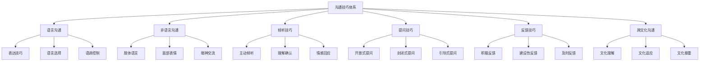
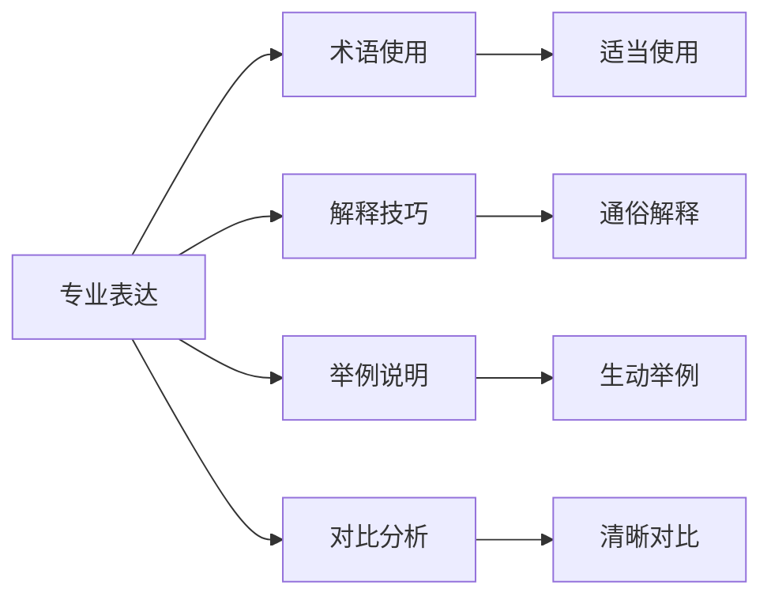
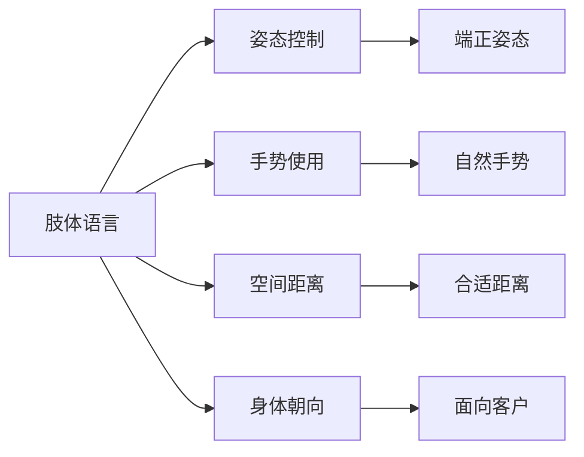
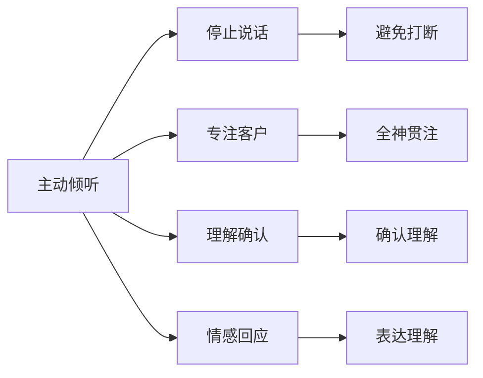
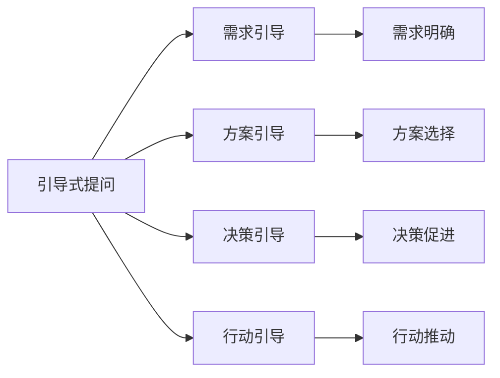

# 沟通技巧指南

## 新西兰手机维修与二手机销售沟通技巧体系

### 沟通技巧架构

### 语言沟通技巧

#### 1. 表达技巧

**清晰表达原则**：

| 表达要素 | 技巧要求 | 具体方法 | 应用场景 |
|----------|----------|----------|----------|
| **语言简洁** | 用词准确，表达简洁 | 避免冗长，突出重点 | 技术解释，问题说明 |
| **逻辑清晰** | 结构合理，层次分明 | 先总后分，先因后果 | 方案介绍，问题分析 |
| **语速适中** | 语速控制，节奏把握 | 根据内容调整语速 | 重要信息，复杂概念 |
| **语调友好** | 语调温和，表达友好 | 保持积极语调 | 客户服务，问题解决 |

**专业表达技巧**：

**具体表达方法**：
- **术语解释**：使用专业术语后立即解释
- **类比说明**：用生活中的例子解释技术概念
- **步骤分解**：将复杂过程分解为简单步骤
- **重点强调**：重复重要信息，确保理解

#### 2. 语言选择技巧

**语言选择原则**：

| 客户类型 | 语言特点 | 选择策略 | 注意事项 |
|----------|----------|----------|----------|
| **技术客户** | 专业性强，技术敏感 | 使用专业术语，技术细节 | 避免过度简化 |
| **普通客户** | 技术基础弱，需要解释 | 使用通俗语言，简单解释 | 避免专业术语 |
| **老年客户** | 理解较慢，需要耐心 | 语速放慢，重复重要信息 | 避免复杂概念 |
| **年轻客户** | 接受能力强，喜欢新概念 | 使用现代词汇，创新表达 | 保持专业准确 |

**语言适应技巧**：
- **客户识别**：快速识别客户类型
- **语言调整**：根据客户调整语言
- **反馈观察**：观察客户反应调整
- **持续优化**：持续优化语言表达

#### 3. 语调控制技巧

**语调控制要素**：

| 语调要素 | 控制要求 | 应用技巧 | 效果评估 |
|----------|----------|----------|----------|
| **音量控制** | 适中音量，清晰可听 | 根据环境调整音量 | 客户听清，不打扰他人 |
| **语速控制** | 适中语速，节奏把握 | 重要信息放慢语速 | 客户理解，信息传达 |
| **语调变化** | 自然变化，表达情感 | 根据内容调整语调 | 客户感受，情感共鸣 |
| **停顿技巧** | 适当停顿，突出重点 | 关键信息前后停顿 | 客户思考，信息强调 |

### 非语言沟通技巧

#### 1. 肢体语言技巧

**肢体语言要素**：

**具体技巧要求**：

| 肢体语言 | 技巧要求 | 具体表现 | 注意事项 |
|----------|----------|----------|----------|
| **站立姿态** | 端正自然，自信专业 | 挺胸抬头，双脚稳定 | 避免懒散，保持活力 |
| **坐姿控制** | 端正坐姿，前倾倾听 | 身体前倾，表示关注 | 避免后仰，保持专注 |
| **手势使用** | 自然手势，辅助表达 | 适当手势，增强表达 | 避免过度，保持自然 |
| **空间距离** | 合适距离，尊重隐私 | 保持1-1.5米距离 | 避免过近，尊重空间 |

#### 2. 面部表情技巧

**表情控制要求**：

| 表情类型 | 控制要求 | 应用场景 | 效果评估 |
|----------|----------|----------|----------|
| **微笑表情** | 自然微笑，真诚友好 | 客户接待，问题解决 | 客户感受，关系建立 |
| **专注表情** | 认真专注，表示重视 | 倾听客户，问题分析 | 客户信任，专业形象 |
| **理解表情** | 表示理解，情感共鸣 | 客户抱怨，问题解释 | 客户安慰，情绪缓解 |
| **自信表情** | 自信专业，能力展现 | 方案介绍，技术解释 | 客户信心，专业信任 |

#### 3. 眼神交流技巧

**眼神交流要求**：
- **适当交流**：保持适当眼神交流
- **避免直视**：避免长时间直视
- **表达关注**：用眼神表达关注
- **建立连接**：通过眼神建立连接

### 倾听技巧

#### 1. 主动倾听技巧

**主动倾听要素**：

| 倾听要素 | 技巧要求 | 具体方法 | 应用效果 |
|----------|----------|----------|----------|
| **专注倾听** | 全神贯注，避免分心 | 停止其他活动，专注客户 | 客户感受，信息完整 |
| **理解确认** | 确认理解，避免误解 | 重复关键信息，确认理解 | 信息准确，沟通有效 |
| **情感回应** | 情感共鸣，表示理解 | 适当回应，表达理解 | 客户安慰，关系建立 |
| **非语言回应** | 肢体回应，表示关注 | 点头示意，身体前倾 | 客户感受，沟通顺畅 |

**倾听技巧应用**：

#### 2. 理解确认技巧

**确认方法**：
- **重复确认**：重复客户关键信息
- **总结确认**：总结客户主要观点
- **提问确认**：通过提问确认理解
- **反馈确认**：通过反馈确认理解

#### 3. 情感回应技巧

**情感回应方法**：
- **情感识别**：识别客户情感状态
- **情感回应**：适当回应客户情感
- **情感支持**：提供情感支持
- **情感引导**：引导客户积极情感

### 提问技巧

#### 1. 开放式提问技巧

**开放式提问特点**：

| 提问类型 | 特点 | 应用场景 | 示例 |
|----------|------|----------|------|
| **探索性提问** | 了解基本情况 | 初步了解客户需求 | "请告诉我您的具体情况" |
| **深入性提问** | 深入了解问题 | 深入了解客户问题 | "您能详细描述一下问题吗？" |
| **感受性提问** | 了解客户感受 | 了解客户情感状态 | "您对这个问题有什么感受？" |
| **期望性提问** | 了解客户期望 | 了解客户期望结果 | "您希望达到什么效果？" |

**开放式提问技巧**：
- **避免引导**：避免引导性提问
- **鼓励表达**：鼓励客户充分表达
- **耐心等待**：耐心等待客户回答
- **适时追问**：适时追问细节

#### 2. 封闭式提问技巧

**封闭式提问特点**：

| 提问类型 | 特点 | 应用场景 | 示例 |
|----------|------|----------|------|
| **确认性提问** | 确认具体信息 | 确认客户基本信息 | "您的手机是iPhone吗？" |
| **选择性提问** | 提供选择选项 | 了解客户偏好 | "您更喜欢黑色还是白色？" |
| **判断性提问** | 判断是非对错 | 确认客户理解 | "您理解我的解释吗？" |
| **时间性提问** | 了解时间安排 | 了解客户时间 | "您希望什么时候完成？" |

**封闭式提问技巧**：
- **逐步缩小**：逐步缩小问题范围
- **确认细节**：确认具体细节信息
- **控制节奏**：控制沟通节奏
- **避免过度**：避免过度使用

#### 3. 引导式提问技巧

**引导式提问应用**：

**引导技巧**：
- **需求引导**：引导客户明确需求
- **方案引导**：引导客户选择方案
- **决策引导**：引导客户做出决策
- **行动引导**：引导客户采取行动

### 反馈技巧

#### 1. 积极反馈技巧

**积极反馈要素**：

| 反馈类型 | 特点 | 应用方法 | 效果评估 |
|----------|------|----------|----------|
| **肯定反馈** | 肯定客户观点 | 表达认同，支持客户 | 客户信心，关系建立 |
| **鼓励反馈** | 鼓励客户表达 | 鼓励继续，支持表达 | 客户开放，信息完整 |
| **赞美反馈** | 赞美客户行为 | 适当赞美，表达欣赏 | 客户愉悦，关系提升 |
| **支持反馈** | 支持客户决定 | 表达支持，提供帮助 | 客户信心，决策促进 |

#### 2. 建设性反馈技巧

**建设性反馈要求**：
- **客观描述**：客观描述问题
- **具体建议**：提供具体建议
- **积极态度**：保持积极态度
- **支持帮助**：提供支持帮助

#### 3. 及时反馈技巧

**及时反馈原则**：
- **立即反馈**：立即反馈重要信息
- **适时反馈**：适时反馈一般信息
- **持续反馈**：持续反馈进展情况
- **完整反馈**：完整反馈所有信息

### 跨文化沟通技巧

#### 1. 文化理解技巧

**新西兰多元文化特点**：

| 文化群体 | 文化特点 | 沟通方式 | 注意事项 |
|----------|----------|----------|----------|
| **欧洲裔** | 直接沟通，时间观念强 | 直接表达，准时守约 | 尊重时间，直接沟通 |
| **毛利人** | 重视关系，集体意识 | 建立关系，集体决策 | 尊重传统，建立关系 |
| **太平洋岛民** | 重视家庭，尊重长辈 | 尊重长辈，家庭观念 | 尊重家庭，礼貌沟通 |
| **亚洲移民** | 重视面子，间接沟通 | 间接表达，避免冲突 | 保持面子，间接沟通 |

#### 2. 文化适应技巧

**适应策略**：
- **文化学习**：学习不同文化特点
- **行为调整**：调整沟通行为
- **语言适应**：适应不同语言习惯
- **价值观尊重**：尊重不同价值观

#### 3. 文化尊重技巧

**尊重原则**：
- **平等对待**：平等对待所有客户
- **文化包容**：包容不同文化
- **避免偏见**：避免文化偏见
- **求同存异**：求同存异，和谐相处

## 沟通技巧应用

### 不同场景沟通技巧

#### 1. 客户咨询场景

**沟通要点**：
- **热情接待**：热情接待客户
- **需求了解**：深入了解客户需求
- **专业解答**：专业解答客户问题
- **方案推荐**：推荐合适方案

#### 2. 问题解决场景

**沟通要点**：
- **问题分析**：分析客户问题
- **解决方案**：提供解决方案
- **过程沟通**：沟通解决过程
- **结果确认**：确认解决结果

#### 3. 投诉处理场景

**沟通要点**：
- **认真倾听**：认真倾听客户投诉
- **表示理解**：表示理解和歉意
- **问题解决**：快速解决问题
- **关系修复**：修复客户关系

### 沟通技巧提升

#### 1. 技能训练

**训练方法**：
- **角色扮演**：通过角色扮演训练
- **案例分析**：通过案例分析学习
- **实践练习**：通过实践练习提升
- **反馈改进**：通过反馈持续改进

#### 2. 经验积累

**积累方法**：
- **工作实践**：通过工作实践积累
- **客户反馈**：收集客户反馈
- **同事交流**：与同事交流经验
- **持续学习**：持续学习新技巧

## 对从业者的建议

### 沟通技能建议
1. **持续学习**：持续学习沟通技巧
2. **实践应用**：在实践中应用技巧
3. **反馈改进**：通过反馈持续改进
4. **文化适应**：适应多元文化环境

### 客户关系建议
1. **建立信任**：通过沟通建立信任
2. **维护关系**：维护良好客户关系
3. **价值创造**：为客户创造价值
4. **长期合作**：建立长期合作关系

### 服务质量建议
1. **专业沟通**：保持专业沟通水平
2. **有效沟通**：确保沟通有效性
3. **客户满意**：确保客户沟通满意
4. **持续改进**：持续改进沟通质量

---
**相关链接**：
- [[02-理解应用层/01-客户服务/01-客户接待流程|客户接待流程]]
- [[02-理解应用层/01-客户服务/03-投诉处理流程|投诉处理流程]]
- [[01-基础认知层/02-业务认知/04-客户画像分析|客户画像分析]]

*最后更新：2024年*
*适用市场：新西兰*

