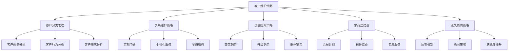
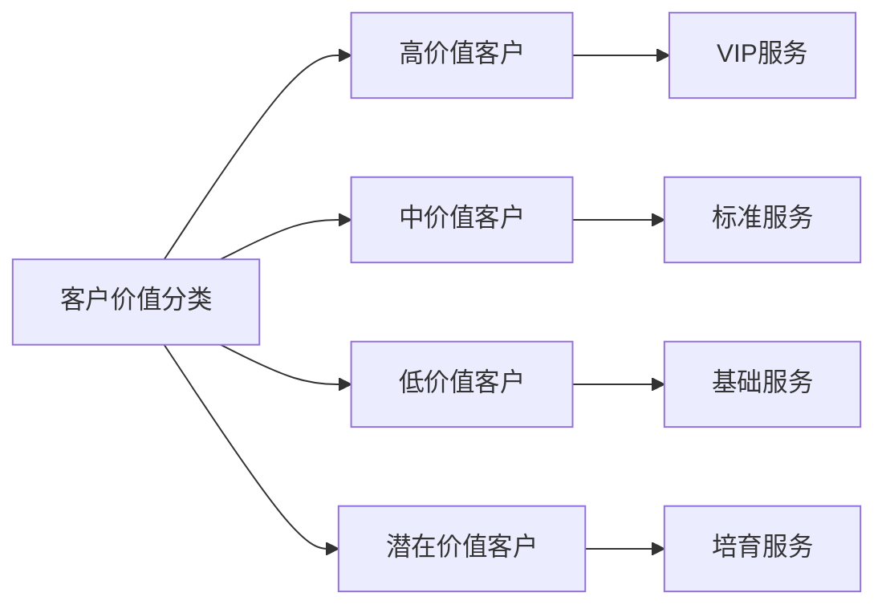
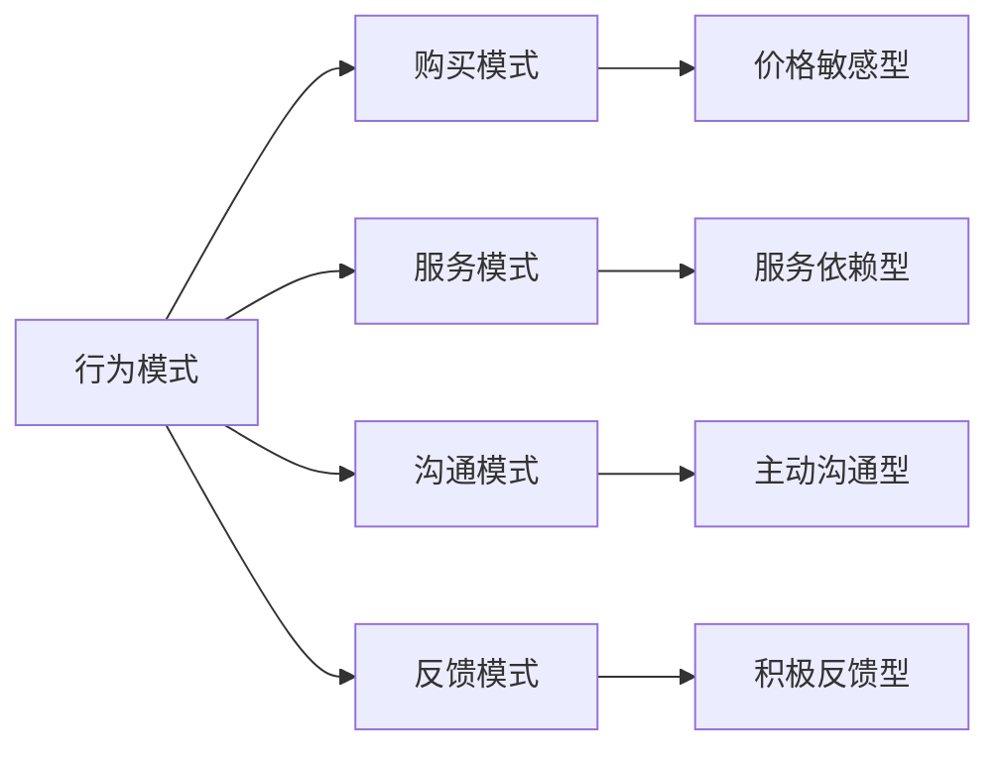
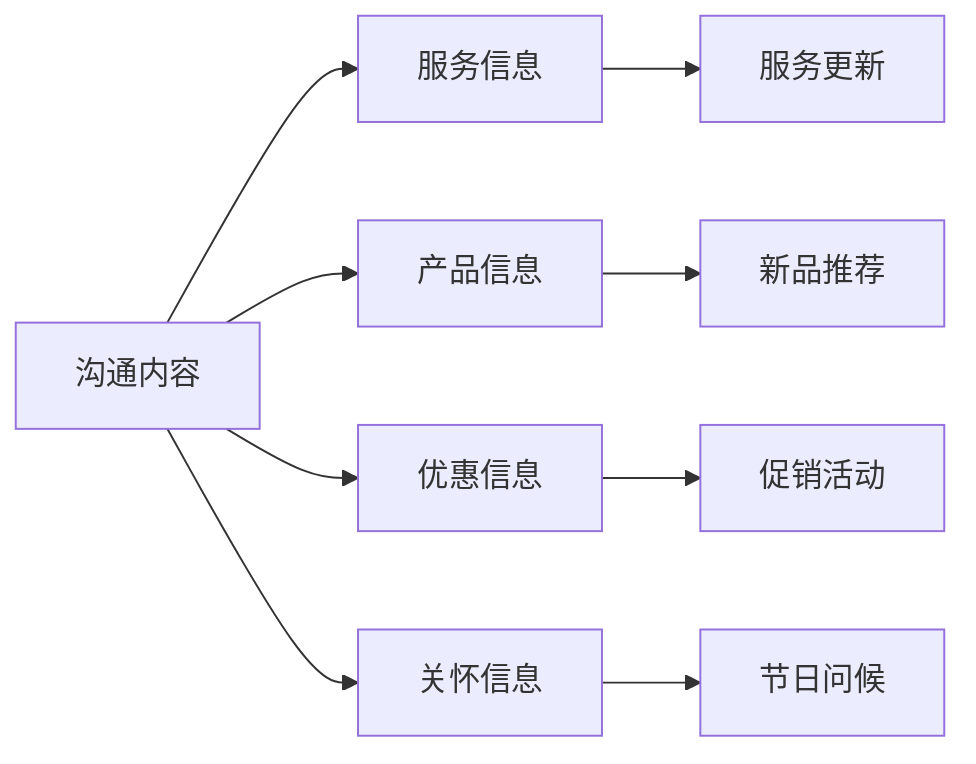
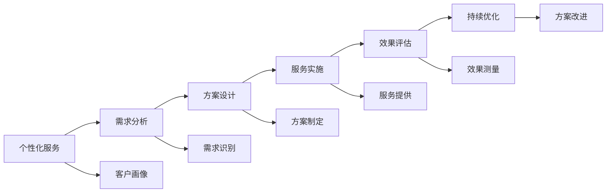
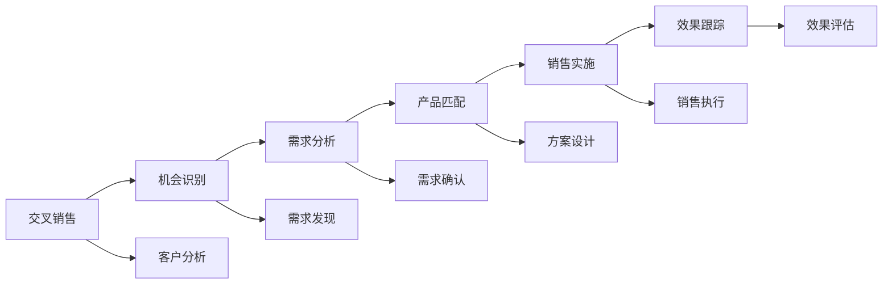
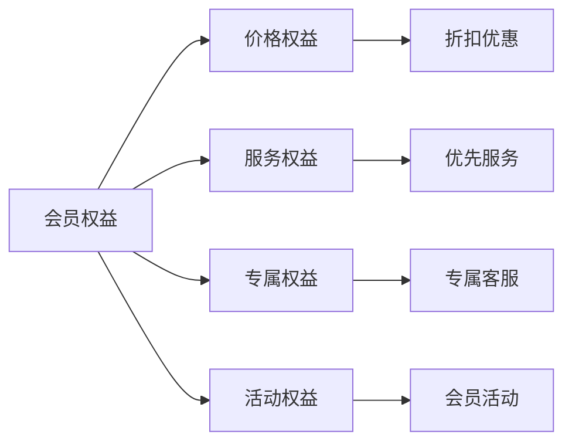
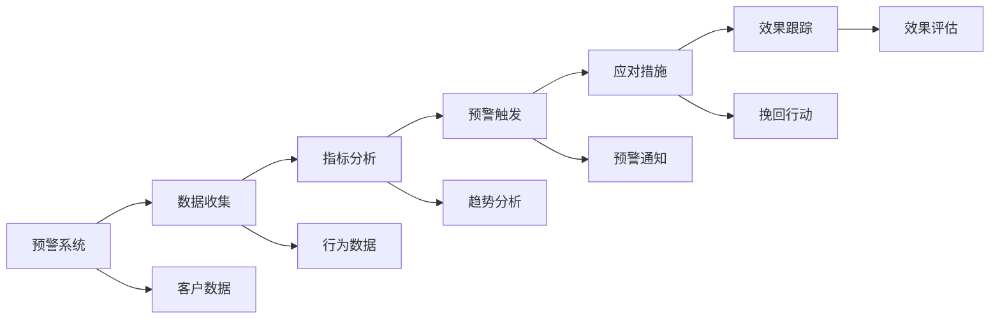
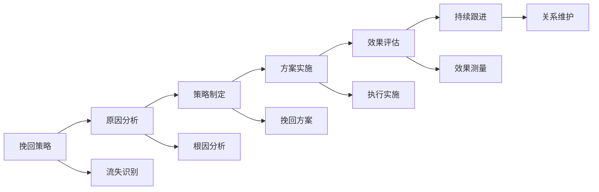

# 客户维护策略

## 新西兰手机维修与二手机销售客户维护体系

### 客户维护策略架构

### 客户分类管理

#### 1. 客户价值分析

**客户价值评估模型**：

| 价值维度 | 评估指标 | 权重 | 评分标准 |
|----------|----------|------|----------|
| **消费金额** | 年度消费总额 | 30% | 高价值>5000纽币，中价值2000-5000纽币，低价值<2000纽币 |
| **消费频率** | 年度消费次数 | 25% | 高频>12次，中频6-12次，低频<6次 |
| **客户生命周期** | 成为客户的时间 | 20% | 长期>2年，中期1-2年，短期<1年 |
| **推荐价值** | 推荐新客户数量 | 15% | 高推荐>5人，中推荐2-5人，低推荐<2人 |
| **忠诚度** | 客户满意度评分 | 10% | 高忠诚>4.5分，中忠诚3.5-4.5分，低忠诚<3.5分 |

**客户价值分类**：

**分类标准**：
- **高价值客户**：综合评分>80分，占比15%
- **中价值客户**：综合评分60-80分，占比35%
- **低价值客户**：综合评分40-60分，占比40%
- **潜在价值客户**：综合评分<40分，占比10%

#### 2. 客户行为分析

**行为分析维度**：

| 行为维度 | 分析内容 | 分析方法 | 应用价值 |
|----------|----------|----------|----------|
| **购买行为** | 购买频率、金额、偏好 | 数据分析，行为模式识别 | 个性化推荐，精准营销 |
| **服务行为** | 服务使用频率、类型 | 服务记录分析，使用模式 | 服务优化，需求预测 |
| **沟通行为** | 沟通频率、方式、内容 | 沟通记录分析，偏好识别 | 沟通策略，关系维护 |
| **反馈行为** | 反馈频率、内容、态度 | 反馈分析，满意度评估 | 服务改进，问题预防 |

**行为模式识别**：

#### 3. 客户需求分析

**需求分析框架**：

| 需求层次 | 需求内容 | 满足方式 | 维护策略 |
|----------|----------|----------|----------|
| **基础需求** | 基本服务需求 | 标准化服务 | 质量保证，及时响应 |
| **功能需求** | 特定功能需求 | 定制化服务 | 个性化方案，专业支持 |
| **情感需求** | 情感体验需求 | 人性化服务 | 情感关怀，关系建立 |
| **社会需求** | 社会认同需求 | 品牌化服务 | 品牌价值，社会地位 |

### 关系维护策略

#### 1. 定期沟通策略

**沟通频率标准**：

| 客户类型 | 沟通频率 | 沟通方式 | 沟通内容 |
|----------|----------|----------|----------|
| **高价值客户** | 每月2-3次 | 电话、邮件、现场 | 专属服务、新品推荐、节日问候 |
| **中价值客户** | 每月1-2次 | 电话、邮件、短信 | 服务提醒、优惠信息、使用指导 |
| **低价值客户** | 每季度1-2次 | 邮件、短信 | 促销信息、服务介绍、满意度调查 |
| **潜在客户** | 每季度1次 | 邮件、短信 | 品牌介绍、服务优势、优惠活动 |

**沟通内容规划**：

**沟通效果评估**：
- **响应率**：客户对沟通的响应率
- **参与度**：客户参与活动的程度
- **满意度**：客户对沟通的满意度
- **转化率**：沟通转化为业务的比例

#### 2. 个性化服务策略

**个性化服务内容**：

| 服务类型 | 服务内容 | 实施方法 | 效果评估 |
|----------|----------|----------|----------|
| **产品推荐** | 基于偏好的产品推荐 | 数据分析，智能推荐 | 推荐准确率，购买转化率 |
| **服务定制** | 定制化服务方案 | 需求分析，方案设计 | 客户满意度，服务效果 |
| **价格优惠** | 个性化价格策略 | 价值评估，优惠设计 | 客户接受度，业务增长 |
| **服务时间** | 灵活的服务时间 | 时间偏好分析，时间安排 | 客户便利性，服务效率 |

**个性化实施流程**：

#### 3. 增值服务策略

**增值服务类型**：

| 服务类型 | 服务内容 | 目标客户 | 实施策略 |
|----------|----------|----------|----------|
| **技术支持** | 免费技术咨询，使用指导 | 所有客户 | 专业团队，及时响应 |
| **数据服务** | 数据备份，数据恢复 | 高价值客户 | 专业服务，安全保障 |
| **延保服务** | 延长保修期，全面保障 | 中高价值客户 | 灵活方案，价值体现 |
| **上门服务** | 上门维修，上门取送 | 高价值客户 | 便捷服务，专属体验 |

### 价值提升策略

#### 1. 交叉销售策略

**交叉销售机会识别**：

| 业务类型 | 交叉销售机会 | 目标客户 | 销售策略 |
|----------|-------------|----------|----------|
| **维修服务** | 配件销售，延保服务 | 维修客户 | 服务过程中推荐 |
| **二手机销售** | 配件销售，维修服务 | 购买客户 | 购买后推荐 |
| **配件销售** | 安装服务，维护服务 | 配件客户 | 销售时推荐 |
| **回收服务** | 新机销售，维修服务 | 回收客户 | 回收时推荐 |

**交叉销售实施**：

#### 2. 升级销售策略

**升级销售机会**：

| 升级类型 | 升级内容 | 目标客户 | 升级策略 |
|----------|----------|----------|----------|
| **产品升级** | 低端产品升级到高端产品 | 价格敏感客户 | 价值展示，分期付款 |
| **服务升级** | 基础服务升级到高级服务 | 服务依赖客户 | 服务优势，体验提升 |
| **套餐升级** | 单一服务升级到套餐服务 | 多需求客户 | 套餐优势，成本节约 |
| **品牌升级** | 普通品牌升级到高端品牌 | 品牌敏感客户 | 品牌价值，身份体现 |

#### 3. 推荐销售策略

**推荐激励机制**：

| 推荐类型 | 激励方式 | 激励标准 | 实施方法 |
|----------|----------|----------|----------|
| **新客户推荐** | 现金奖励，服务优惠 | 推荐成功奖励50-200纽币 | 推荐码，跟踪系统 |
| **业务推荐** | 积分奖励，等级提升 | 推荐业务获得积分 | 积分系统，等级管理 |
| **口碑推荐** | 专属服务，优先权 | 口碑传播获得专属服务 | 口碑监测，服务升级 |
| **长期推荐** | 长期合作，深度绑定 | 长期推荐获得深度合作 | 长期协议，深度服务 |

### 忠诚度建设

#### 1. 会员计划

**会员等级设计**：

| 会员等级 | 升级条件 | 会员权益 | 服务标准 |
|----------|----------|----------|----------|
| **普通会员** | 注册即可 | 基础优惠，积分累积 | 标准服务 |
| **银牌会员** | 年消费2000纽币 | 9.5折优惠，专属客服 | 优先服务 |
| **金牌会员** | 年消费5000纽币 | 9折优惠，上门服务 | VIP服务 |
| **钻石会员** | 年消费10000纽币 | 8.5折优惠，专属服务 | 顶级服务 |

**会员权益体系**：

#### 2. 积分奖励

**积分获取规则**：

| 行为类型 | 积分标准 | 积分上限 | 有效期 |
|----------|----------|----------|--------|
| **消费积分** | 每消费1纽币获得1积分 | 无上限 | 2年 |
| **推荐积分** | 成功推荐获得100积分 | 每月500积分 | 1年 |
| **评价积分** | 评价服务获得10积分 | 每月50积分 | 1年 |
| **活动积分** | 参与活动获得20-100积分 | 按活动规定 | 1年 |

**积分使用规则**：

| 使用方式 | 兑换比例 | 使用限制 | 有效期 |
|----------|----------|----------|--------|
| **现金抵扣** | 100积分=1纽币 | 单次最多抵扣50% | 2年 |
| **服务兑换** | 按服务价值兑换 | 无限制 | 2年 |
| **礼品兑换** | 按礼品价值兑换 | 无限制 | 2年 |
| **升级兑换** | 按等级要求兑换 | 无限制 | 2年 |

#### 3. 专属服务

**专属服务内容**：

| 服务类型 | 服务内容 | 服务标准 | 服务对象 |
|----------|----------|----------|----------|
| **专属客服** | 专属客户经理，一对一服务 | 24小时响应，专业服务 | 金牌以上会员 |
| **上门服务** | 上门维修，上门取送 | 预约时间，专业服务 | 金牌以上会员 |
| **优先服务** | 优先排队，优先处理 | 无需等待，快速服务 | 银牌以上会员 |
| **定制服务** | 个性化服务方案 | 量身定制，专业设计 | 钻石会员 |

### 流失预防策略

#### 1. 预警机制

**流失预警指标**：

| 预警指标 | 预警标准 | 预警级别 | 应对措施 |
|----------|----------|----------|----------|
| **消费频率下降** | 连续3个月消费频率下降50% | 中级预警 | 主动联系，了解原因 |
| **满意度下降** | 满意度评分连续2次低于3.5分 | 高级预警 | 立即处理，挽回措施 |
| **投诉增加** | 连续2次投诉或1次严重投诉 | 高级预警 | 专业处理，关系修复 |
| **沟通减少** | 连续2个月无主动沟通 | 中级预警 | 主动沟通，关系维护 |

**预警系统架构**：

#### 2. 挽回策略

**挽回策略类型**：

| 挽回类型 | 挽回策略 | 实施方法 | 成功率 |
|----------|----------|----------|--------|
| **价格挽回** | 特殊优惠，价格让步 | 个性化优惠方案 | 60-70% |
| **服务挽回** | 服务升级，问题解决 | 专业服务，问题彻底解决 | 70-80% |
| **关系挽回** | 关系修复，情感关怀 | 深度沟通，关系重建 | 50-60% |
| **价值挽回** | 价值重新认知，利益重新分配 | 价值重新评估，利益重新分配 | 40-50% |

**挽回实施流程**：

#### 3. 满意度提升

**满意度提升策略**：

| 提升维度 | 提升策略 | 实施方法 | 预期效果 |
|----------|----------|----------|----------|
| **服务质量** | 服务标准化，质量提升 | 培训员工，优化流程 | 满意度提升0.5分 |
| **响应速度** | 响应时间缩短，效率提升 | 流程优化，技术升级 | 响应时间缩短50% |
| **个性化服务** | 个性化方案，定制服务 | 数据分析，方案设计 | 客户粘性提升30% |
| **价值感知** | 价值重新认知，利益重新分配 | 价值教育，利益重新分配 | 价值感知提升40% |

## 客户维护效果评估

### 评估指标

#### 1. 客户维护指标
- **客户保留率**：>85%
- **客户满意度**：>4.5/5
- **客户推荐率**：>60%
- **客户生命周期价值**：持续增长

#### 2. 业务增长指标
- **交叉销售率**：>30%
- **升级销售率**：>20%
- **推荐销售率**：>15%
- **客户价值增长率**：>20%

#### 3. 运营效率指标
- **客户维护成本**：持续降低
- **客户获取成本**：持续降低
- **客户服务效率**：持续提升
- **客户关系质量**：持续改善

## 对从业者的建议

### 客户维护建议
1. **客户分类**：科学分类客户，差异化维护
2. **关系建立**：建立长期客户关系
3. **价值创造**：持续为客户创造价值
4. **忠诚度建设**：建设客户忠诚度

### 策略实施建议
1. **系统化实施**：系统化实施维护策略
2. **个性化服务**：提供个性化服务
3. **持续改进**：持续改进维护策略
4. **效果评估**：定期评估维护效果

### 技能提升建议
1. **沟通技巧**：提升客户沟通技巧
2. **分析能力**：提升客户分析能力
3. **服务技能**：提升客户服务技能
4. **创新能力**：提升服务创新能力

---
**相关链接**：
- [[02-理解应用层/01-客户服务/05-客户关系管理|客户关系管理]]
- [[03-高级应用层/01-业务整合/03-客户生命周期管理|客户生命周期管理]]
- [[07-运营监督体系/04-客户满意度监督/01-客户满意度调查方法|客户满意度调查方法]]

*最后更新：2024年*
*适用市场：新西兰*

