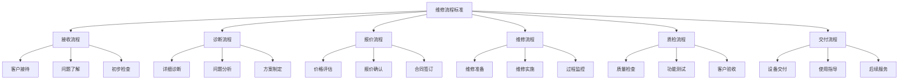
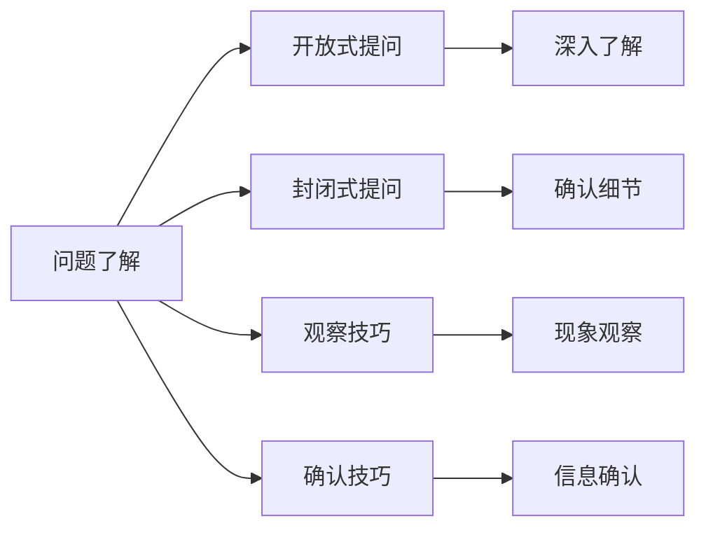
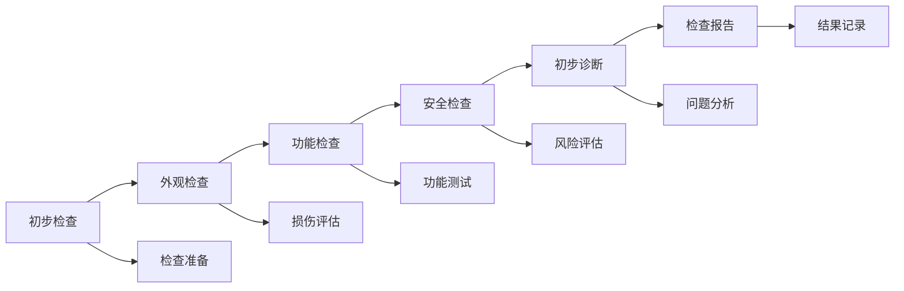
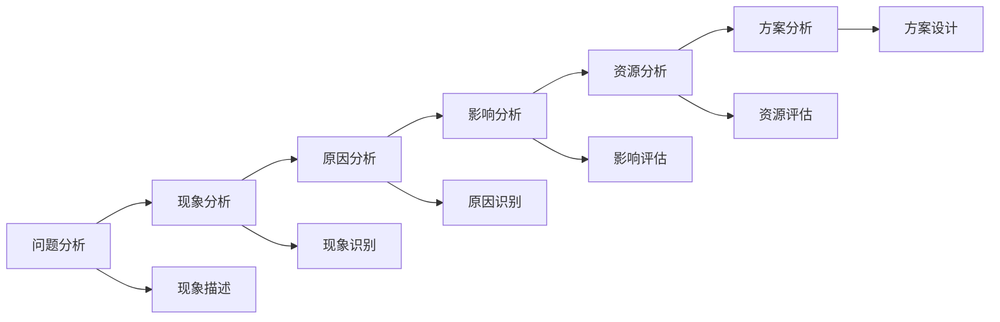
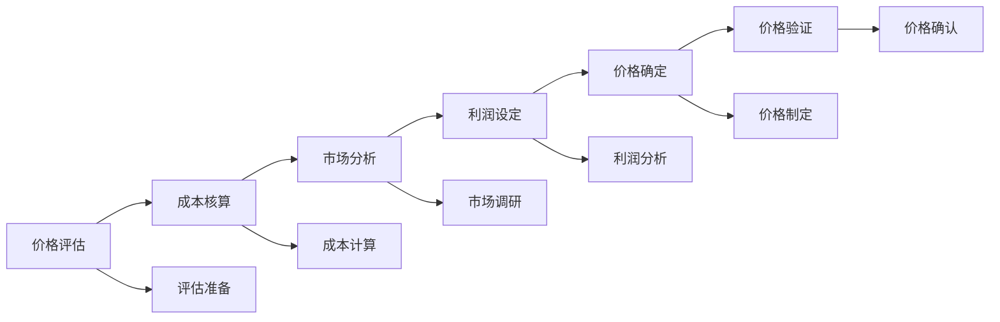
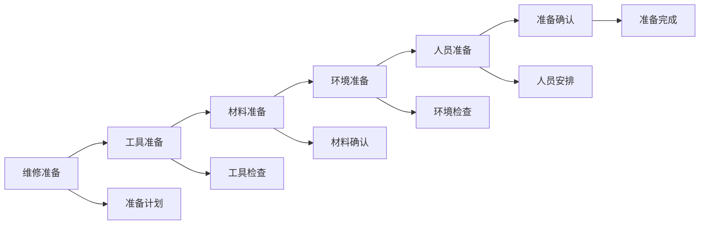
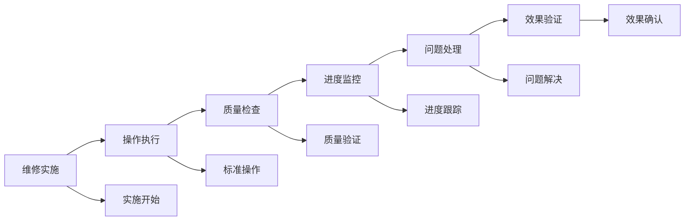
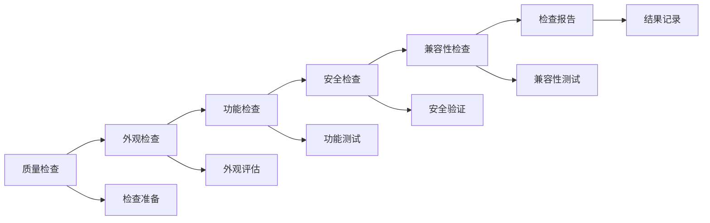
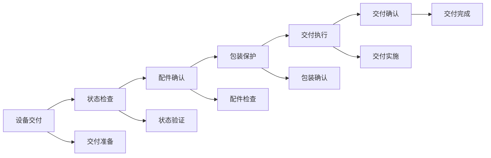

# 维修流程标准

## 新西兰手机维修标准化流程体系

### 维修流程架构

### 接收流程标准

#### 1. 客户接待标准

**接待要求**：

| 接待要素 | 标准要求 | 具体要求 | 评估标准 |
|----------|----------|----------|----------|
| **响应时间** | 5秒内响应 | 立即停止工作，转向客户 | 响应时间<5秒 |
| **接待态度** | 热情专业 | 微笑服务，专业态度 | 客户满意度>4.5/5 |
| **环境准备** | 整洁有序 | 工作区域整洁，工具就位 | 环境专业整洁 |
| **信息记录** | 完整准确 | 详细记录客户信息 | 信息完整率>95% |

**接待流程**：

**接待标准**：
- **立即响应**：客户到达后5秒内响应
- **热情问候**：主动问候，保持微笑
- **专业介绍**：介绍自己和服务内容
- **环境展示**：简要介绍工作环境
- **需求询问**：了解客户具体需求

#### 2. 问题了解标准

**了解内容**：

| 了解项目 | 了解内容 | 了解方法 | 记录要求 |
|----------|----------|----------|----------|
| **基本信息** | 设备型号、购买时间、使用情况 | 直接询问，设备检查 | 详细记录，准确完整 |
| **问题描述** | 具体问题现象、发生时间 | 详细询问，现象观察 | 准确描述，时间记录 |
| **使用环境** | 使用环境、使用习惯 | 环境询问，习惯了解 | 环境记录，习惯分析 |
| **期望结果** | 客户期望、时间要求 | 期望了解，时间确认 | 期望记录，时间安排 |

**了解方法**：

**了解标准**：
- **详细询问**：详细了解问题情况
- **现象观察**：观察设备现象
- **信息确认**：确认信息准确性
- **需求明确**：明确客户需求

#### 3. 初步检查标准

**检查项目**：

| 检查类型 | 检查内容 | 检查方法 | 检查标准 |
|----------|----------|----------|----------|
| **外观检查** | 外观损伤、接口状态 | 目视检查，触摸检查 | 损伤记录，状态评估 |
| **功能检查** | 基础功能、响应状态 | 功能测试，响应测试 | 功能状态，响应时间 |
| **安全检查** | 安全状态、风险识别 | 安全检查，风险评估 | 安全状态，风险等级 |
| **初步诊断** | 问题类型、严重程度 | 初步分析，程度评估 | 问题分类，严重程度 |

**检查流程**：

### 诊断流程标准

#### 1. 详细诊断标准

**诊断要求**：

| 诊断要素 | 诊断要求 | 诊断方法 | 诊断标准 |
|----------|----------|----------|----------|
| **诊断时间** | 30分钟内完成 | 系统化诊断，专业工具 | 诊断时间<30分钟 |
| **诊断准确率** | >90% | 专业诊断，经验判断 | 准确率>90% |
| **诊断完整性** | 全面诊断 | 多维度诊断，系统分析 | 诊断完整率>95% |
| **诊断记录** | 详细记录 | 标准格式，完整记录 | 记录完整率>98% |

**诊断流程**：

**诊断标准**：
- **系统诊断**：全面检查系统状态
- **硬件诊断**：详细检查硬件状态
- **软件诊断**：深入分析软件问题
- **性能诊断**：评估设备性能状态

#### 2. 问题分析标准

**分析要求**：

| 分析维度 | 分析内容 | 分析方法 | 分析标准 |
|----------|----------|----------|----------|
| **问题性质** | 问题类型、严重程度 | 分类分析，程度评估 | 问题分类准确，程度评估合理 |
| **问题原因** | 根本原因、直接原因 | 因果分析，根因分析 | 原因分析准确，根因识别正确 |
| **影响范围** | 影响范围、影响程度 | 影响分析，范围评估 | 影响范围明确，程度评估准确 |
| **解决难度** | 解决难度、资源需求 | 难度评估，资源分析 | 难度评估合理，资源需求准确 |

**分析方法**：

#### 3. 方案制定标准

**方案要求**：

| 方案要素 | 方案要求 | 制定方法 | 方案标准 |
|----------|----------|----------|----------|
| **方案可行性** | 技术可行，资源充足 | 技术评估，资源评估 | 技术可行性>95%，资源充足性>90% |
| **方案经济性** | 成本合理，效益明显 | 成本分析，效益分析 | 成本合理性>90%，效益明显性>85% |
| **方案时效性** | 时间合理，效率高 | 时间评估，效率评估 | 时间合理性>90%，效率>85% |
| **方案风险性** | 风险可控，安全可靠 | 风险评估，安全评估 | 风险可控性>95%，安全性>98% |

### 报价流程标准

#### 1. 价格评估标准

**评估要求**：

| 评估要素 | 评估要求 | 评估方法 | 评估标准 |
|----------|----------|----------|----------|
| **成本核算** | 准确核算，透明公开 | 成本分析，价格计算 | 成本核算准确率>95% |
| **市场定价** | 市场合理，竞争有力 | 市场调研，竞争分析 | 市场合理性>90%，竞争力>85% |
| **利润控制** | 利润合理，可持续发展 | 利润分析，发展评估 | 利润率15-30%，可持续性>90% |
| **客户接受** | 客户接受，价值感知 | 客户调研，价值分析 | 客户接受度>80%，价值感知>85% |

**评估流程**：

#### 2. 报价确认标准

**确认要求**：

| 确认要素 | 确认要求 | 确认方法 | 确认标准 |
|----------|----------|----------|----------|
| **价格透明** | 价格透明，无隐藏费用 | 价格说明，费用明细 | 价格透明度100%，隐藏费用0% |
| **客户理解** | 客户理解，价格接受 | 价格解释，客户确认 | 客户理解度>90%，接受度>80% |
| **合同明确** | 合同明确，条款清晰 | 合同签订，条款说明 | 合同明确性100%，条款清晰度>95% |
| **风险控制** | 风险可控，责任明确 | 风险评估，责任划分 | 风险可控性>95%，责任明确性100% |

#### 3. 合同签订标准

**签订要求**：

| 签订要素 | 签订要求 | 签订方法 | 签订标准 |
|----------|----------|----------|----------|
| **合同内容** | 内容完整，条款明确 | 合同制定，条款审核 | 内容完整性100%，条款明确性>95% |
| **法律合规** | 法律合规，风险可控 | 法律审查，合规检查 | 法律合规性100%，风险可控性>95% |
| **客户权益** | 权益保护，责任明确 | 权益分析，责任划分 | 权益保护性>95%，责任明确性100% |
| **执行保障** | 执行保障，监督机制 | 执行计划，监督体系 | 执行保障性>90%，监督有效性>85% |

### 维修流程标准

#### 1. 维修准备标准

**准备要求**：

| 准备要素 | 准备要求 | 准备方法 | 准备标准 |
|----------|----------|----------|----------|
| **工具准备** | 工具齐全，状态良好 | 工具检查，状态确认 | 工具齐全率100%，状态良好率>95% |
| **材料准备** | 材料充足，质量保证 | 材料采购，质量检查 | 材料充足率>95%，质量保证率>98% |
| **环境准备** | 环境适宜，安全可靠 | 环境检查，安全确认 | 环境适宜性>95%，安全性100% |
| **人员准备** | 人员到位，技能匹配 | 人员安排，技能确认 | 人员到位率100%，技能匹配度>90% |

**准备流程**：

#### 2. 维修实施标准

**实施要求**：

| 实施要素 | 实施要求 | 实施方法 | 实施标准 |
|----------|----------|----------|----------|
| **操作规范** | 操作规范，安全可靠 | 标准操作，安全控制 | 操作规范性100%，安全性100% |
| **质量保证** | 质量保证，效果明显 | 质量控制，效果验证 | 质量保证率>98%，效果明显性>95% |
| **进度控制** | 进度控制，按时完成 | 进度管理，时间控制 | 进度控制率>95%，按时完成率>90% |
| **过程监控** | 过程监控，问题及时处理 | 过程监督，问题处理 | 监控覆盖率100%，问题处理及时率>95% |

**实施流程**：

#### 3. 过程监控标准

**监控要求**：

| 监控要素 | 监控要求 | 监控方法 | 监控标准 |
|----------|----------|----------|----------|
| **质量监控** | 质量监控，问题及时发现 | 质量检查，问题识别 | 监控覆盖率100%，问题发现及时率>95% |
| **进度监控** | 进度监控，按时完成 | 进度跟踪，时间控制 | 监控频率>90%，按时完成率>90% |
| **安全监控** | 安全监控，风险控制 | 安全检查，风险识别 | 安全监控率100%，风险控制率>95% |
| **成本监控** | 成本监控，预算控制 | 成本跟踪，预算管理 | 成本监控率>95%，预算控制率>90% |

### 质检流程标准

#### 1. 质量检查标准

**检查要求**：

| 检查要素 | 检查要求 | 检查方法 | 检查标准 |
|----------|----------|----------|----------|
| **外观检查** | 外观完美，无损伤 | 目视检查，触摸检查 | 外观完美率>98%，损伤率<2% |
| **功能检查** | 功能正常，性能达标 | 功能测试，性能测试 | 功能正常率>98%，性能达标率>95% |
| **安全检查** | 安全可靠，无隐患 | 安全检查，隐患识别 | 安全性100%，隐患率0% |
| **兼容性检查** | 兼容性好，无冲突 | 兼容性测试，冲突检查 | 兼容性>95%，冲突率<5% |

**检查流程**：

#### 2. 功能测试标准

**测试要求**：

| 测试要素 | 测试要求 | 测试方法 | 测试标准 |
|----------|----------|----------|----------|
| **基础功能** | 基础功能正常，响应及时 | 功能测试，响应测试 | 功能正常率>98%，响应时间<2秒 |
| **高级功能** | 高级功能正常，性能达标 | 性能测试，功能验证 | 功能正常率>95%，性能达标率>90% |
| **网络功能** | 网络功能正常，连接稳定 | 网络测试，连接测试 | 功能正常率>95%，连接稳定性>90% |
| **多媒体功能** | 多媒体功能正常，效果良好 | 多媒体测试，效果评估 | 功能正常率>95%，效果良好率>90% |

#### 3. 客户验收标准

**验收要求**：

| 验收要素 | 验收要求 | 验收方法 | 验收标准 |
|----------|----------|----------|----------|
| **客户满意** | 客户满意，需求满足 | 客户验收，满意度调查 | 客户满意度>4.5/5，需求满足率>95% |
| **功能确认** | 功能确认，效果明显 | 功能演示，效果确认 | 功能确认率100%，效果明显性>95% |
| **使用指导** | 使用指导，操作熟练 | 使用培训，操作指导 | 指导完整性>95%，操作熟练度>90% |
| **保修说明** | 保修说明，政策明确 | 保修介绍，政策说明 | 说明完整性100%，政策明确性100% |

### 交付流程标准

#### 1. 设备交付标准

**交付要求**：

| 交付要素 | 交付要求 | 交付方法 | 交付标准 |
|----------|----------|----------|----------|
| **设备状态** | 设备状态良好，功能正常 | 状态检查，功能验证 | 状态良好率100%，功能正常率>98% |
| **配件完整** | 配件完整，无缺失 | 配件检查，完整性确认 | 配件完整率100%，缺失率0% |
| **包装保护** | 包装保护，运输安全 | 包装检查，保护确认 | 包装保护率>95%，运输安全性>98% |
| **交付及时** | 交付及时，时间准确 | 时间管理，交付确认 | 交付及时率>95%，时间准确率>90% |

**交付流程**：

#### 2. 使用指导标准

**指导要求**：

| 指导要素 | 指导要求 | 指导方法 | 指导标准 |
|----------|----------|----------|----------|
| **操作指导** | 操作指导，步骤清晰 | 操作演示，步骤说明 | 指导完整性>95%，步骤清晰度>90% |
| **注意事项** | 注意事项，风险提示 | 注意说明，风险告知 | 说明完整性>95%，风险提示率100% |
| **维护保养** | 维护保养，延长寿命 | 维护指导，保养说明 | 指导完整性>90%，保养说明率>95% |
| **问题处理** | 问题处理，应急措施 | 问题说明，应急指导 | 说明完整性>90%，应急指导率>95% |

#### 3. 后续服务标准

**服务要求**：

| 服务要素 | 服务要求 | 服务方法 | 服务标准 |
|----------|----------|----------|----------|
| **保修服务** | 保修服务，及时响应 | 保修政策，服务承诺 | 保修覆盖率100%，响应及时率>95% |
| **技术支持** | 技术支持，专业服务 | 技术咨询，问题解决 | 支持覆盖率>90%，问题解决率>95% |
| **定期回访** | 定期回访，关系维护 | 回访计划，关系维护 | 回访覆盖率>80%，关系维护率>90% |
| **升级服务** | 升级服务，价值提升 | 升级推荐，服务升级 | 升级推荐率>60%，服务升级率>40% |

## 流程质量控制

### 质量控制体系

#### 1. 质量监控
- **过程监控**：全程监控维修过程
- **质量检查**：定期检查维修质量
- **问题处理**：及时处理质量问题
- **持续改进**：持续改进维修质量

#### 2. 质量保证
- **标准执行**：严格执行维修标准
- **技能培训**：定期培训维修技能
- **工具维护**：维护维修工具设备
- **环境管理**：管理维修环境

#### 3. 质量改进
- **问题分析**：分析质量问题原因
- **改进措施**：制定改进措施
- **效果评估**：评估改进效果
- **经验总结**：总结维修经验

## 对从业者的建议

### 流程执行建议
1. **标准执行**：严格执行维修流程标准
2. **质量保证**：确保维修质量
3. **客户满意**：确保客户满意
4. **持续改进**：持续改进维修流程

### 技能提升建议
1. **流程掌握**：熟练掌握维修流程
2. **技能提升**：持续提升维修技能
3. **工具使用**：熟练使用维修工具
4. **问题解决**：提升问题解决能力

### 服务质量建议
1. **专业服务**：提供专业维修服务
2. **及时响应**：及时响应客户需求
3. **质量保证**：确保维修质量
4. **客户满意**：确保客户满意

---
**相关链接**：
- [[02-理解应用层/02-技术维修/01-基础诊断方法|基础诊断方法]]
- [[02-理解应用层/02-技术维修/02-常见故障处理|常见故障处理]]
- [[04-工具模板/01-工作流程/02-维修服务流程模板|维修服务流程模板]]

*最后更新：2024年*
*适用市场：新西兰*

