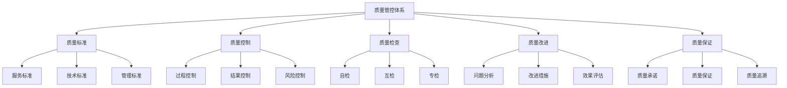
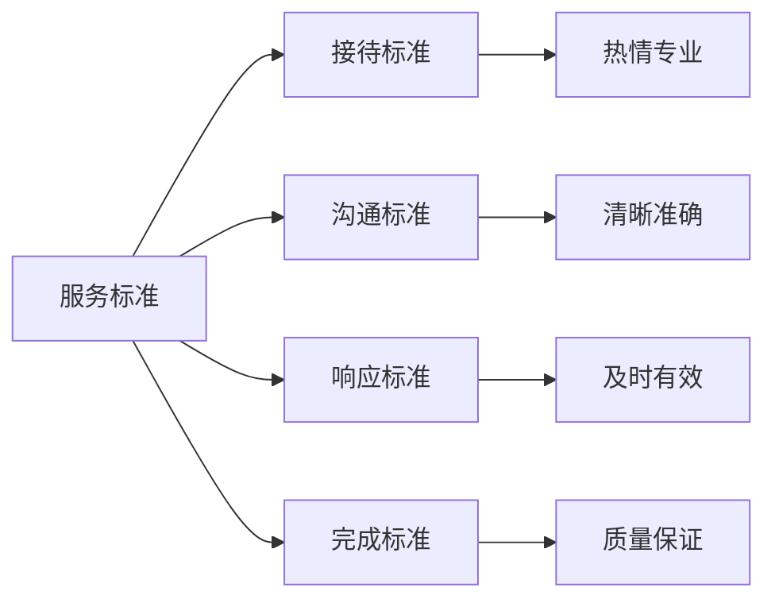
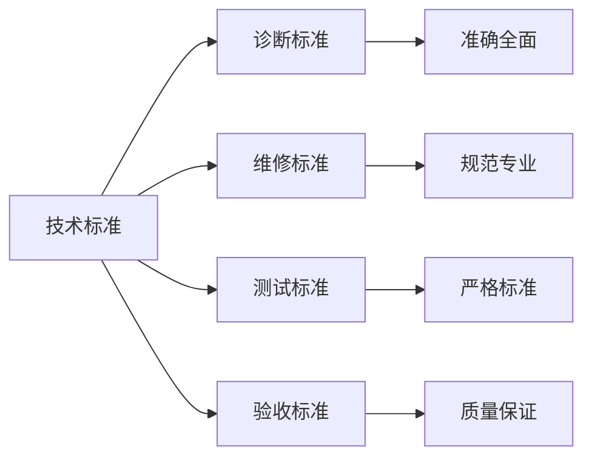
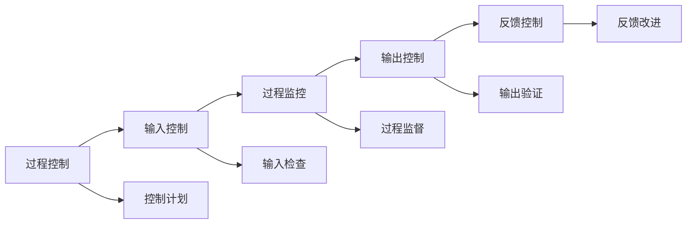
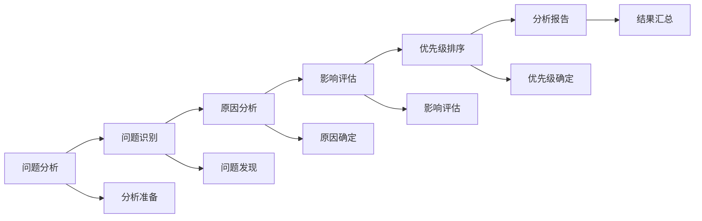
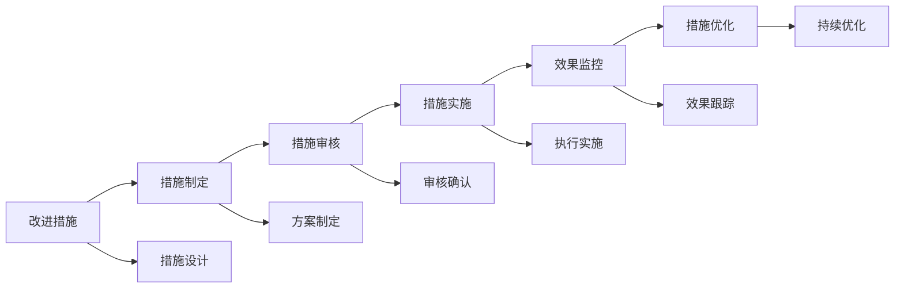
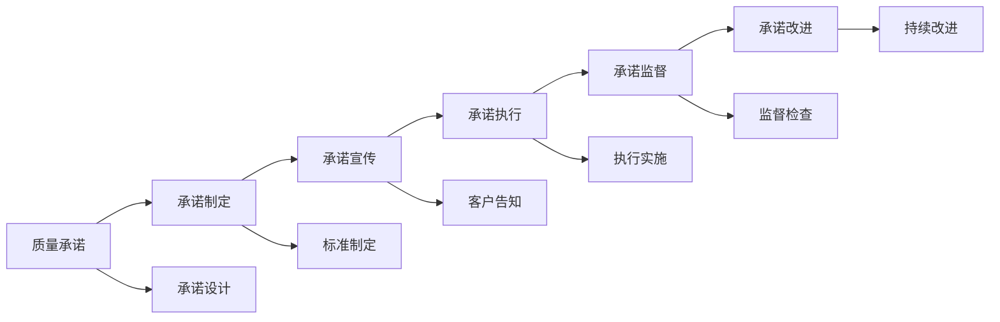

# 质量管控体系

## 新西兰手机维修质量管控标准体系

### 质量管控架构

### 质量标准体系

#### 1. 服务质量标准

**服务质量指标**：

| 质量指标 | 标准要求 | 测量方法 | 目标值 |
|----------|----------|----------|--------|
| **客户满意度** | 客户对服务的满意程度 | 客户调查，满意度评分 | >4.5/5 |
| **服务响应时间** | 客户咨询到响应的时间 | 时间记录，响应统计 | <5分钟 |
| **问题解决率** | 问题得到解决的比例 | 问题统计，解决记录 | >95% |
| **服务完成率** | 服务按时完成的比例 | 完成统计，时间记录 | >98% |

**服务标准要求**：

**具体标准**：
- **接待标准**：热情专业，5秒内响应
- **沟通标准**：清晰准确，客户理解
- **响应标准**：及时有效，快速响应
- **完成标准**：质量保证，按时完成

#### 2. 技术质量标准

**技术质量指标**：

| 技术指标 | 标准要求 | 测量方法 | 目标值 |
|----------|----------|----------|--------|
| **维修成功率** | 维修成功的比例 | 维修记录，成功统计 | >98% |
| **返修率** | 维修后再次故障的比例 | 返修记录，故障统计 | <3% |
| **维修时间** | 平均维修时间 | 时间记录，时间统计 | <2天 |
| **技术准确率** | 技术诊断准确的比例 | 诊断记录，准确统计 | >90% |

**技术标准要求**：

**具体标准**：
- **诊断标准**：准确全面，30分钟内完成
- **维修标准**：规范专业，按标准操作
- **测试标准**：严格标准，全面测试
- **验收标准**：质量保证，客户满意

#### 3. 管理质量标准

**管理质量指标**：

| 管理指标 | 标准要求 | 测量方法 | 目标值 |
|----------|----------|----------|--------|
| **流程执行率** | 按流程执行的比例 | 流程记录，执行统计 | >95% |
| **记录完整率** | 记录完整的比例 | 记录检查，完整统计 | >98% |
| **培训合格率** | 培训合格的比例 | 培训记录，合格统计 | >90% |
| **合规率** | 符合法规要求的比例 | 合规检查，合规统计 | 100% |

### 质量控制体系

#### 1. 过程控制

**控制要点**：

| 控制环节 | 控制内容 | 控制方法 | 控制标准 |
|----------|----------|----------|----------|
| **接收控制** | 客户接待，问题了解 | 标准流程，质量检查 | 接待标准，了解完整 |
| **诊断控制** | 问题诊断，方案制定 | 专业诊断，方案审核 | 诊断准确，方案合理 |
| **维修控制** | 维修实施，过程监控 | 标准操作，质量监控 | 操作规范，质量保证 |
| **交付控制** | 质量检查，客户验收 | 全面检查，客户确认 | 质量达标，客户满意 |

**控制流程**：

#### 2. 结果控制

**控制要求**：

| 控制要素 | 控制要求 | 控制方法 | 控制标准 |
|----------|----------|----------|----------|
| **质量结果** | 质量达标，客户满意 | 质量检查，客户验收 | 质量达标率>98%，客户满意度>4.5/5 |
| **时间结果** | 按时完成，效率高 | 时间控制，效率监控 | 按时完成率>95%，效率提升>10% |
| **成本结果** | 成本控制，效益好 | 成本监控，效益分析 | 成本控制率>90%，效益提升>15% |
| **安全结果** | 安全可靠，无事故 | 安全检查，事故预防 | 安全性100%，事故率0% |

#### 3. 风险控制

**风险识别**：

| 风险类型 | 风险内容 | 风险等级 | 控制措施 |
|----------|----------|----------|----------|
| **技术风险** | 技术故障，维修失败 | 中等 | 技术培训，设备维护 |
| **质量风险** | 质量不达标，客户投诉 | 高 | 质量控制，质量检查 |
| **安全风险** | 安全事故，设备损坏 | 高 | 安全培训，安全措施 |
| **合规风险** | 法规违规，法律风险 | 中等 | 合规培训，合规检查 |

**风险控制措施**：

### 质量检查体系

#### 1. 自检体系

**自检要求**：

| 自检项目 | 自检内容 | 自检方法 | 自检标准 |
|----------|----------|----------|----------|
| **工作质量** | 工作质量，服务效果 | 自我检查，质量评估 | 质量达标，效果良好 |
| **操作规范** | 操作规范，流程执行 | 规范检查，流程验证 | 操作规范，流程完整 |
| **技能水平** | 技能水平，专业能力 | 技能评估，能力测试 | 技能达标，能力匹配 |
| **服务态度** | 服务态度，客户关系 | 态度检查，关系评估 | 态度良好，关系和谐 |

**自检流程**：

#### 2. 互检体系

**互检要求**：

| 互检项目 | 互检内容 | 互检方法 | 互检标准 |
|----------|----------|----------|----------|
| **工作质量** | 同事工作质量检查 | 相互检查，质量评估 | 质量达标，标准一致 |
| **技能水平** | 同事技能水平评估 | 技能评估，能力测试 | 技能匹配，能力相当 |
| **服务标准** | 服务标准执行检查 | 标准检查，执行验证 | 标准统一，执行一致 |
| **团队协作** | 团队协作效果评估 | 协作评估，效果测试 | 协作良好，效果明显 |

#### 3. 专检体系

**专检要求**：

| 专检项目 | 专检内容 | 专检方法 | 专检标准 |
|----------|----------|----------|----------|
| **质量审核** | 全面质量审核 | 专业审核，质量评估 | 质量达标，标准符合 |
| **技能考核** | 专业技能考核 | 专业考核，能力测试 | 技能达标，能力匹配 |
| **合规检查** | 法规合规检查 | 合规审核，法规验证 | 合规100%，法规符合 |
| **客户满意度** | 客户满意度调查 | 客户调查，满意度评估 | 满意度>4.5/5，客户满意 |

### 质量改进体系

#### 1. 问题分析

**分析要求**：

| 分析维度 | 分析内容 | 分析方法 | 分析标准 |
|----------|----------|----------|----------|
| **问题识别** | 质量问题识别 | 问题发现，问题分类 | 问题识别率>95%，分类准确率>90% |
| **原因分析** | 问题原因分析 | 根因分析，因果分析 | 原因分析准确率>90%，根因识别率>85% |
| **影响评估** | 问题影响评估 | 影响分析，损失评估 | 影响评估准确率>90%，损失评估合理 |
| **优先级排序** | 问题优先级排序 | 优先级分析，排序方法 | 优先级排序合理，重点突出 |

**分析流程**：

#### 2. 改进措施

**措施要求**：

| 措施要素 | 措施要求 | 措施方法 | 措施标准 |
|----------|----------|----------|----------|
| **措施可行性** | 措施可行，可执行 | 可行性分析，执行评估 | 可行性>90%，可执行性>85% |
| **措施有效性** | 措施有效，问题解决 | 有效性分析，效果评估 | 有效性>85%，问题解决率>80% |
| **措施经济性** | 措施经济，成本合理 | 成本分析，效益评估 | 成本合理性>90%，效益明显 |
| **措施时效性** | 措施及时，快速实施 | 时间分析，实施评估 | 及时性>90%，实施速度>85% |

**措施实施**：

#### 3. 效果评估

**评估要求**：

| 评估要素 | 评估要求 | 评估方法 | 评估标准 |
|----------|----------|----------|----------|
| **效果测量** | 效果测量，数据收集 | 数据收集，效果测量 | 数据完整性>95%，测量准确性>90% |
| **效果分析** | 效果分析，趋势分析 | 数据分析，趋势分析 | 分析准确性>90%，趋势判断正确 |
| **效果对比** | 效果对比，改进验证 | 对比分析，改进验证 | 对比准确性>90%，改进验证有效 |
| **效果总结** | 效果总结，经验提炼 | 总结分析，经验提炼 | 总结完整性>95%，经验价值高 |

### 质量保证体系

#### 1. 质量承诺

**承诺内容**：

| 承诺类型 | 承诺内容 | 承诺标准 | 承诺保障 |
|----------|----------|----------|----------|
| **服务质量** | 优质服务，客户满意 | 满意度>4.5/5 | 服务标准，质量检查 |
| **维修质量** | 专业维修，质量保证 | 成功率>98%，返修率<3% | 技术标准，质量管控 |
| **时间保证** | 按时完成，效率保证 | 按时完成率>95% | 时间管理，进度控制 |
| **价格保证** | 价格透明，合理收费 | 价格透明度100% | 价格标准，成本控制 |

**承诺实施**：

#### 2. 质量保证

**保证措施**：

| 保证要素 | 保证内容 | 保证方法 | 保证标准 |
|----------|----------|----------|----------|
| **人员保证** | 专业人员，技能达标 | 人员培训，技能考核 | 人员合格率>90%，技能达标率>95% |
| **设备保证** | 专业设备，状态良好 | 设备维护，状态检查 | 设备完好率>95%，状态良好率>90% |
| **环境保证** | 适宜环境，安全可靠 | 环境管理，安全检查 | 环境适宜性>95%，安全性100% |
| **流程保证** | 标准流程，规范执行 | 流程管理，执行监督 | 流程完整率100%，执行率>95% |

#### 3. 质量追溯

**追溯要求**：

| 追溯要素 | 追溯内容 | 追溯方法 | 追溯标准 |
|----------|----------|----------|----------|
| **过程追溯** | 维修过程，操作记录 | 过程记录，操作追踪 | 记录完整性>98%，追溯准确性>95% |
| **责任追溯** | 责任人员，责任环节 | 责任记录，责任追踪 | 责任明确性100%，追溯准确性>95% |
| **问题追溯** | 问题原因，问题处理 | 问题记录，处理追踪 | 问题追溯率>95%，处理追溯率>90% |
| **效果追溯** | 改进效果，质量提升 | 效果记录，提升追踪 | 效果追溯率>90%，提升追溯率>85% |

## 质量管控工具

### 质量工具

#### 1. 检查工具
- **检查清单**：标准化检查清单
- **检查表**：质量检查表
- **检查记录**：质量检查记录
- **检查报告**：质量检查报告

#### 2. 分析工具
- **鱼骨图**：问题原因分析
- **帕累托图**：问题优先级分析
- **控制图**：质量趋势分析
- **散点图**：质量关系分析

#### 3. 改进工具
- **PDCA循环**：持续改进循环
- **5W1H分析**：问题分析方法
- **头脑风暴**：改进方案生成
- **标杆管理**：最佳实践学习

### 质量系统

#### 1. 质量管理系统
- **质量管理软件**：质量管理系统
- **质量数据库**：质量数据管理
- **质量报告系统**：质量报告生成
- **质量分析系统**：质量数据分析

#### 2. 质量监控系统
- **实时监控**：质量实时监控
- **预警系统**：质量预警系统
- **报警系统**：质量报警系统
- **反馈系统**：质量反馈系统

## 对从业者的建议

### 质量管控建议
1. **质量意识**：树立质量第一意识
2. **标准执行**：严格执行质量标准
3. **持续改进**：持续改进质量水平
4. **客户满意**：确保客户满意

### 技能提升建议
1. **质量技能**：提升质量管理技能
2. **分析能力**：提升质量分析能力
3. **改进能力**：提升质量改进能力
4. **工具使用**：熟练使用质量工具

### 管理建议
1. **系统管理**：建立系统化质量管理
2. **过程控制**：加强过程质量控制
3. **结果导向**：以结果为导向管理
4. **持续优化**：持续优化质量管理

---
**相关链接**：
- [[02-理解应用层/02-技术维修/03-维修流程标准|维修流程标准]]
- [[07-运营监督体系/01-质量监督/01-维修质量监督标准|维修质量监督标准]]
- [[04-工具模板/02-检查清单/03-质量检查清单|质量检查清单]]

*最后更新：2024年*
*适用市场：新西兰*

