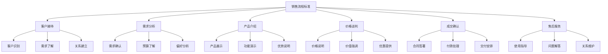
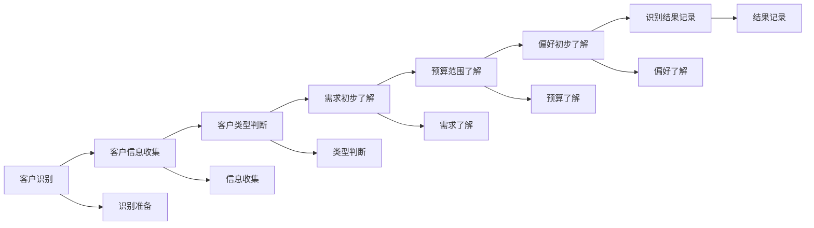
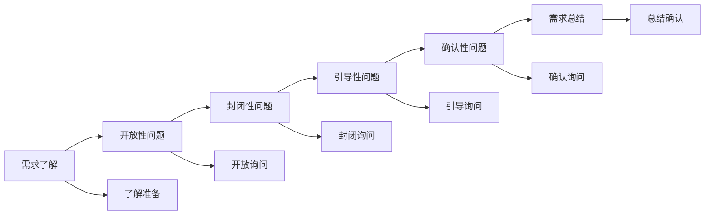
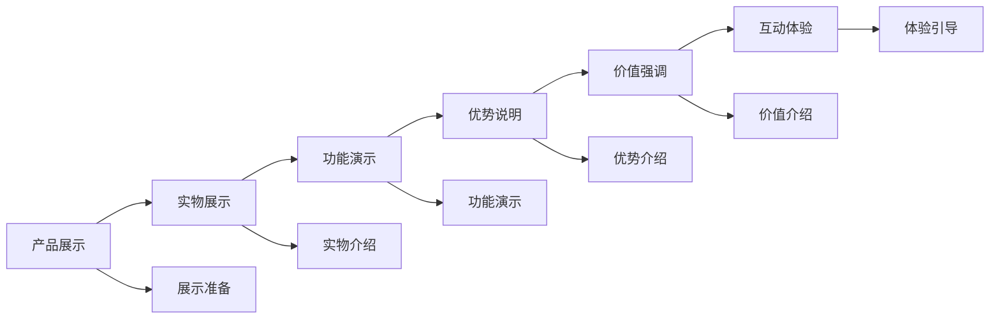
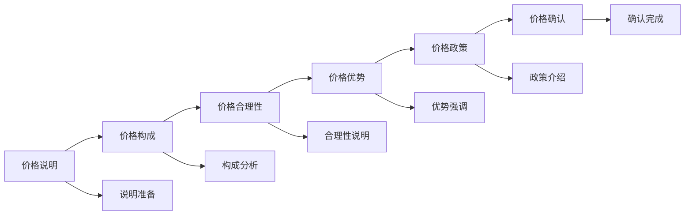
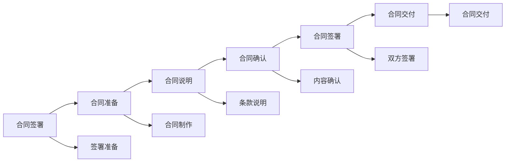

# 销售流程标准

## 新西兰手机维修与二手机销售流程标准

### 销售流程架构

### 客户接待

#### 1. 客户识别

**识别要素**：

| 识别类型 | 识别内容 | 识别方法 | 识别标准 |
|----------|----------|----------|----------|
| **客户类型** | 新客户，老客户，潜在客户 | 客户记录，客户信息 | 识别准确，分类正确 |
| **客户需求** | 维修需求，购买需求，咨询需求 | 需求了解，需求分析 | 需求明确，分析准确 |
| **客户预算** | 预算范围，价格敏感度 | 预算了解，价格测试 | 预算合理，敏感度明确 |
| **客户偏好** | 品牌偏好，功能偏好，服务偏好 | 偏好了解，偏好分析 | 偏好明确，分析准确 |

**识别流程**：

**识别标准**：
- **识别时间**：客户进店后3分钟内完成
- **识别准确率**：≥90%
- **信息完整性**：关键信息完整
- **记录及时性**：实时记录客户信息

#### 2. 需求了解

**了解内容**：

| 了解要素 | 了解内容 | 了解方法 | 了解标准 |
|----------|----------|----------|----------|
| **基本需求** | 产品需求，服务需求 | 需求询问，需求分析 | 需求明确，分析准确 |
| **功能需求** | 功能要求，性能要求 | 功能了解，性能了解 | 功能明确，性能明确 |
| **价格需求** | 价格期望，预算范围 | 价格了解，预算了解 | 价格合理，预算明确 |
| **时间需求** | 购买时间，使用时间 | 时间了解，时间分析 | 时间明确，分析准确 |

**了解技巧**：

**了解标准**：
- **了解深度**：需求细节清晰
- **了解广度**：需求范围全面
- **了解准确性**：需求理解准确
- **了解及时性**：需求了解及时

#### 3. 关系建立

**建立要素**：

| 建立要素 | 建立内容 | 建立方法 | 建立标准 |
|----------|----------|----------|----------|
| **信任建立** | 专业信任，服务信任 | 专业展示，服务承诺 | 信任建立，关系良好 |
| **沟通建立** | 沟通渠道，沟通方式 | 沟通建立，沟通维护 | 沟通顺畅，方式合适 |
| **合作建立** | 合作关系，合作模式 | 合作建立，合作维护 | 合作良好，模式有效 |
| **长期建立** | 长期关系，长期合作 | 长期建立，长期维护 | 长期稳定，合作持续 |

### 需求分析

#### 1. 需求确认

**确认内容**：

| 确认要素 | 确认内容 | 确认方法 | 确认标准 |
|----------|----------|----------|----------|
| **需求准确性** | 需求理解，需求确认 | 需求确认，需求验证 | 需求准确，理解正确 |
| **需求完整性** | 需求完整，需求全面 | 需求检查，需求补充 | 需求完整，全面覆盖 |
| **需求可行性** | 需求可行，需求实现 | 可行性分析，实现评估 | 需求可行，实现可能 |
| **需求优先级** | 需求优先级，需求排序 | 优先级分析，排序确定 | 优先级明确，排序合理 |

**确认流程**：

#### 2. 预算了解

**了解内容**：

| 了解要素 | 了解内容 | 了解方法 | 了解标准 |
|----------|----------|----------|----------|
| **预算范围** | 预算上限，预算下限 | 预算询问，预算测试 | 预算明确，范围合理 |
| **价格敏感度** | 价格敏感，价格接受度 | 价格测试，价格分析 | 敏感度明确，接受度合理 |
| **支付能力** | 支付能力，支付方式 | 支付了解，支付分析 | 支付能力明确，方式合适 |
| **价值认知** | 价值认知，价值判断 | 价值了解，价值分析 | 价值认知明确，判断合理 |

#### 3. 偏好分析

**分析内容**：

| 分析要素 | 分析内容 | 分析方法 | 分析标准 |
|----------|----------|----------|----------|
| **品牌偏好** | 品牌偏好，品牌认知 | 品牌了解，品牌分析 | 品牌偏好明确，认知准确 |
| **功能偏好** | 功能偏好，功能需求 | 功能了解，功能分析 | 功能偏好明确，需求合理 |
| **服务偏好** | 服务偏好，服务要求 | 服务了解，服务分析 | 服务偏好明确，要求合理 |
| **购买偏好** | 购买偏好，购买习惯 | 购买了解，购买分析 | 购买偏好明确，习惯合理 |

### 产品介绍

#### 1. 产品展示

**展示要求**：

| 展示要素 | 展示内容 | 展示方法 | 展示标准 |
|----------|----------|----------|----------|
| **产品外观** | 外观展示，外观介绍 | 实物展示，图片展示 | 外观清晰，介绍准确 |
| **产品功能** | 功能展示，功能介绍 | 功能演示，功能说明 | 功能明确，介绍详细 |
| **产品优势** | 优势展示，优势介绍 | 优势说明，优势对比 | 优势明显，介绍有力 |
| **产品价值** | 价值展示，价值介绍 | 价值说明，价值分析 | 价值明确，介绍有说服力 |

**展示技巧**：

#### 2. 功能演示

**演示要求**：

| 演示要素 | 演示内容 | 演示方法 | 演示标准 |
|----------|----------|----------|----------|
| **核心功能** | 核心功能，主要功能 | 功能演示，功能说明 | 功能明确，演示清晰 |
| **特色功能** | 特色功能，独特功能 | 特色演示，特色说明 | 特色明显，演示有效 |
| **实用功能** | 实用功能，常用功能 | 实用演示，实用说明 | 实用性强，演示有用 |
| **创新功能** | 创新功能，新技术 | 创新演示，创新说明 | 创新明显，演示有吸引力 |

#### 3. 优势说明

**说明要求**：

| 说明要素 | 说明内容 | 说明方法 | 说明标准 |
|----------|----------|----------|----------|
| **技术优势** | 技术优势，技术特点 | 技术说明，技术对比 | 技术优势明显，说明有力 |
| **质量优势** | 质量优势，质量保证 | 质量说明，质量对比 | 质量优势明显，说明可信 |
| **服务优势** | 服务优势，服务特色 | 服务说明，服务对比 | 服务优势明显，说明有吸引力 |
| **价格优势** | 价格优势，性价比 | 价格说明，价格对比 | 价格优势明显，说明有说服力 |

### 价格谈判

#### 1. 价格说明

**说明要求**：

| 说明要素 | 说明内容 | 说明方法 | 说明标准 |
|----------|----------|----------|----------|
| **价格构成** | 价格构成，成本分析 | 价格说明，成本分析 | 价格构成清晰，分析准确 |
| **价格合理性** | 价格合理，价格公平 | 价格说明，价格对比 | 价格合理，说明有说服力 |
| **价格优势** | 价格优势，性价比 | 价格说明，价格对比 | 价格优势明显，说明有力 |
| **价格政策** | 价格政策，优惠条件 | 政策说明，优惠介绍 | 政策明确，优惠有吸引力 |

**说明技巧**：

#### 2. 价值强调

**强调要求**：

| 强调要素 | 强调内容 | 强调方法 | 强调标准 |
|----------|----------|----------|----------|
| **使用价值** | 使用价值，实用价值 | 价值说明，价值分析 | 使用价值明确，说明有说服力 |
| **投资价值** | 投资价值，保值价值 | 价值说明，价值分析 | 投资价值明确，说明有吸引力 |
| **情感价值** | 情感价值，心理价值 | 价值说明，价值分析 | 情感价值明确，说明有感染力 |
| **社会价值** | 社会价值，身份价值 | 价值说明，价值分析 | 社会价值明确，说明有影响力 |

#### 3. 优惠提供

**提供要求**：

| 提供要素 | 提供内容 | 提供方法 | 提供标准 |
|----------|----------|----------|----------|
| **优惠条件** | 优惠条件，优惠幅度 | 优惠说明，优惠介绍 | 优惠条件明确，幅度合理 |
| **优惠限制** | 优惠限制，优惠条件 | 限制说明，条件介绍 | 限制明确，条件合理 |
| **优惠时间** | 优惠时间，优惠期限 | 时间说明，期限介绍 | 时间明确，期限合理 |
| **优惠价值** | 优惠价值，优惠效果 | 价值说明，效果介绍 | 价值明确，效果明显 |

### 成交确认

#### 1. 合同签署

**签署要求**：

| 签署要素 | 签署内容 | 签署方法 | 签署标准 |
|----------|----------|----------|----------|
| **合同内容** | 合同条款，合同条件 | 合同说明，合同确认 | 合同内容完整，条款明确 |
| **合同条款** | 条款内容，条款解释 | 条款说明，条款确认 | 条款明确，解释清楚 |
| **合同条件** | 条件内容，条件要求 | 条件说明，条件确认 | 条件明确，要求合理 |
| **合同执行** | 执行要求，执行标准 | 执行说明，执行确认 | 执行要求明确，标准合理 |

**签署流程**：

#### 2. 付款处理

**处理要求**：

| 处理要素 | 处理内容 | 处理方法 | 处理标准 |
|----------|----------|----------|----------|
| **付款方式** | 付款方式，支付方式 | 方式说明，方式确认 | 付款方式明确，支付方式合适 |
| **付款金额** | 付款金额，支付金额 | 金额说明，金额确认 | 付款金额准确，支付金额明确 |
| **付款时间** | 付款时间，支付时间 | 时间说明，时间确认 | 付款时间明确，支付时间合理 |
| **付款确认** | 付款确认，支付确认 | 确认说明，确认完成 | 付款确认及时，支付确认准确 |

#### 3. 交付安排

**安排要求**：

| 安排要素 | 安排内容 | 安排方法 | 安排标准 |
|----------|----------|----------|----------|
| **交付时间** | 交付时间，交付期限 | 时间安排，时间确认 | 交付时间明确，期限合理 |
| **交付方式** | 交付方式，交付方法 | 方式安排，方式确认 | 交付方式明确，方法合适 |
| **交付地点** | 交付地点，交付位置 | 地点安排，地点确认 | 交付地点明确，位置合适 |
| **交付确认** | 交付确认，交付完成 | 确认安排，确认完成 | 交付确认及时，完成准确 |

### 售后服务

#### 1. 使用指导

**指导要求**：

| 指导要素 | 指导内容 | 指导方法 | 指导标准 |
|----------|----------|----------|----------|
| **使用说明** | 使用说明，使用方法 | 说明指导，方法演示 | 使用说明清晰，方法明确 |
| **操作指导** | 操作指导，操作步骤 | 步骤指导，步骤演示 | 操作指导详细，步骤清晰 |
| **注意事项** | 注意事项，注意要点 | 要点说明，要点强调 | 注意事项明确，要点重要 |
| **问题解答** | 问题解答，疑问解答 | 解答及时，解答准确 | 问题解答及时，解答准确 |

#### 2. 问题解答

**解答要求**：

| 解答要素 | 解答内容 | 解答方法 | 解答标准 |
|----------|----------|----------|----------|
| **技术问题** | 技术问题，技术解答 | 技术解答，技术指导 | 技术问题解答准确，指导有效 |
| **使用问题** | 使用问题，使用解答 | 使用解答，使用指导 | 使用问题解答及时，指导有用 |
| **服务问题** | 服务问题，服务解答 | 服务解答，服务指导 | 服务问题解答及时，指导有效 |
| **其他问题** | 其他问题，其他解答 | 其他解答，其他指导 | 其他问题解答及时，指导有用 |

#### 3. 关系维护

**维护要求**：

| 维护要素 | 维护内容 | 维护方法 | 维护标准 |
|----------|----------|----------|----------|
| **客户关系** | 客户关系，关系维护 | 关系维护，关系发展 | 客户关系良好，维护有效 |
| **服务关系** | 服务关系，服务维护 | 服务维护，服务发展 | 服务关系良好，维护有效 |
| **合作关系** | 合作关系，合作维护 | 合作维护，合作发展 | 合作关系良好，维护有效 |
| **长期关系** | 长期关系，长期维护 | 长期维护，长期发展 | 长期关系稳定，维护持续 |

## 销售技巧

### 沟通技巧

#### 1. 倾听技巧
- **主动倾听**：专注倾听客户需求
- **理解倾听**：理解客户真实意图
- **反馈倾听**：及时反馈理解内容
- **确认倾听**：确认理解准确性

#### 2. 表达技巧
- **清晰表达**：表达清晰，逻辑清楚
- **生动表达**：表达生动，有吸引力
- **专业表达**：表达专业，有说服力
- **情感表达**：表达有情感，有感染力

#### 3. 引导技巧
- **需求引导**：引导客户需求
- **选择引导**：引导客户选择
- **决策引导**：引导客户决策
- **行动引导**：引导客户行动

### 谈判技巧

#### 1. 价格谈判
- **价值强调**：强调产品价值
- **优势突出**：突出产品优势
- **优惠提供**：提供合理优惠
- **底线坚持**：坚持价格底线

#### 2. 条件谈判
- **条件交换**：交换谈判条件
- **条件妥协**：适当妥协条件
- **条件坚持**：坚持重要条件
- **条件平衡**：平衡各方条件

#### 3. 时间谈判
- **时间控制**：控制谈判时间
- **时间压力**：适当施加时间压力
- **时间缓冲**：提供时间缓冲
- **时间利用**：充分利用时间

## 销售工具

### 销售资料

#### 1. 产品资料
- **产品手册**：详细产品介绍
- **产品图片**：高质量产品图片
- **产品视频**：产品演示视频
- **产品对比**：竞品对比资料

#### 2. 价格资料
- **价格表**：详细价格信息
- **优惠表**：优惠条件说明
- **政策表**：价格政策说明
- **对比表**：价格对比分析

#### 3. 服务资料
- **服务说明**：服务内容说明
- **服务承诺**：服务承诺说明
- **服务流程**：服务流程说明
- **服务案例**：服务成功案例

### 销售设备

#### 1. 展示设备
- **展示台**：产品展示台
- **演示设备**：产品演示设备
- **测试设备**：产品测试设备
- **体验设备**：产品体验设备

#### 2. 计算设备
- **计算器**：价格计算器
- **电脑**：销售管理系统
- **平板**：移动销售工具
- **手机**：客户沟通工具

## 对从业者的建议

### 销售技能建议
1. **专业能力**：提升产品专业知识
2. **沟通能力**：提升沟通表达能力
3. **谈判能力**：提升谈判技巧
4. **服务能力**：提升客户服务能力

### 销售心态建议
1. **积极心态**：保持积极销售心态
2. **客户导向**：以客户需求为导向
3. **价值导向**：以价值创造为导向
4. **长期导向**：以长期关系为导向

### 销售管理建议
1. **流程管理**：严格执行销售流程
2. **过程控制**：控制销售过程质量
3. **结果管理**：管理销售结果
4. **持续改进**：持续改进销售方法

---
**相关链接**：
- [[02-理解应用层/01-客户服务/01-客户接待流程|客户接待流程]]
- [[02-理解应用层/03-销售服务/02-产品知识掌握|产品知识掌握]]
- [[04-工具模板/01-销售工具/01-销售话术模板|销售话术模板]]

*最后更新：2024年*
*适用市场：新西兰*

