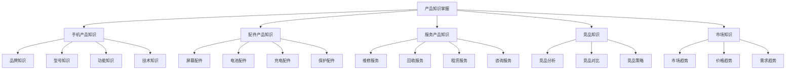
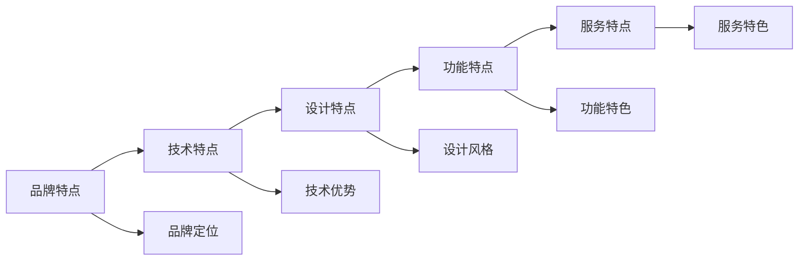
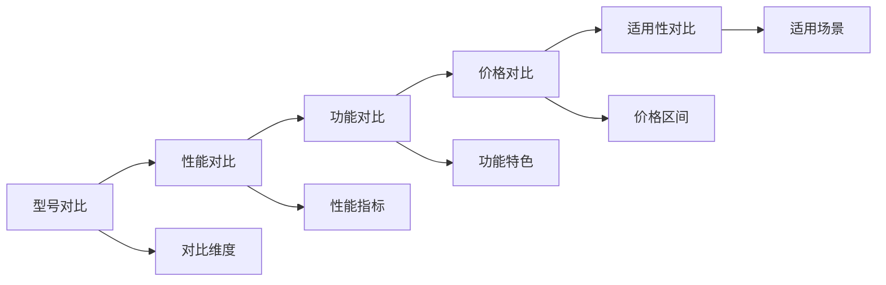
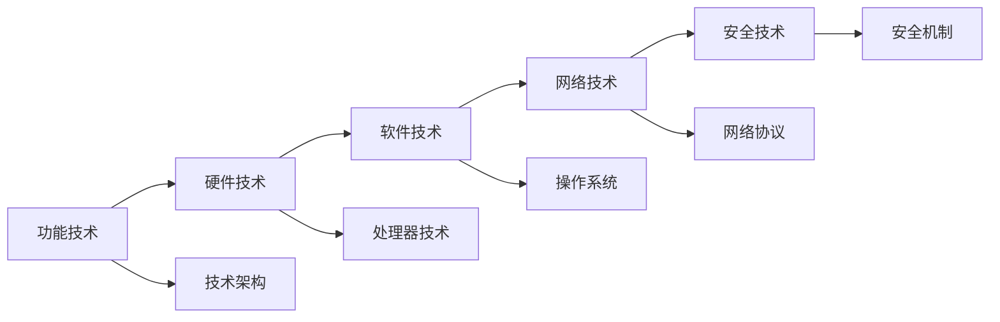
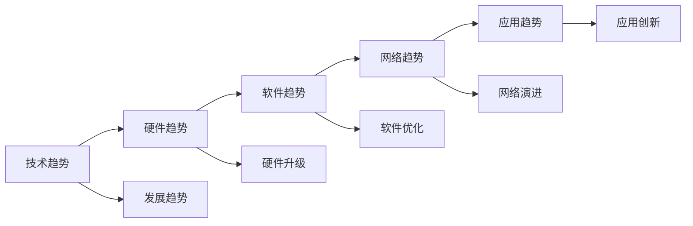

# 产品知识掌握

## 新西兰手机维修与二手机销售产品知识体系

### 产品知识架构

### 手机产品知识

#### 1. 品牌知识

**主要品牌**：

| 品牌类别 | 品牌名称 | 市场定位 | 主要特点 | 目标客户 |
|----------|----------|----------|----------|----------|
| **高端品牌** | Apple, Samsung Galaxy | 高端市场 | 技术领先，品质卓越 | 高收入群体 |
| **中端品牌** | Huawei, Xiaomi, OPPO, Vivo | 中端市场 | 性价比高，功能丰富 | 中等收入群体 |
| **入门品牌** | Nokia, Motorola, Realme | 入门市场 | 价格实惠，基础功能 | 预算有限群体 |
| **专业品牌** | OnePlus, Google Pixel | 专业市场 | 专业功能，技术特色 | 技术爱好者 |

**品牌特点分析**：

**品牌知识要点**：
- **品牌历史**：了解品牌发展历程
- **品牌文化**：理解品牌价值理念
- **品牌定位**：明确品牌市场定位
- **品牌优势**：掌握品牌核心优势

#### 2. 型号知识

**型号分类**：

| 分类标准 | 分类内容 | 主要型号 | 特点说明 |
|----------|----------|----------|----------|
| **按价格分类** | 高端、中端、入门 | iPhone 15 Pro, Galaxy S24, Redmi Note 13 | 价格区间明确，功能差异明显 |
| **按功能分类** | 拍照、游戏、商务、时尚 | iPhone 15 Pro Max, ROG Phone 8, ThinkPhone | 功能特色突出，目标用户明确 |
| **按尺寸分类** | 大屏、中屏、小屏 | iPhone 15 Plus, iPhone 15, iPhone 15 mini | 尺寸选择多样，使用场景不同 |
| **按发布时间** | 最新、次新、经典 | iPhone 15系列, iPhone 14系列, iPhone 13系列 | 发布时间影响价格和性能 |

**型号对比分析**：

**型号知识要点**：
- **技术规格**：掌握主要技术参数
- **功能特色**：了解独特功能特点
- **价格区间**：明确市场价格范围
- **适用场景**：了解使用场景需求

#### 3. 功能知识

**核心功能**：

| 功能类别 | 功能内容 | 技术特点 | 应用场景 |
|----------|----------|----------|----------|
| **通信功能** | 通话、短信、网络 | 5G网络，VoLTE通话 | 日常通信，商务沟通 |
| **娱乐功能** | 音乐、视频、游戏 | 高刷新率，立体声 | 娱乐休闲，游戏体验 |
| **拍照功能** | 拍照、录像、编辑 | 多摄像头，AI优化 | 生活记录，社交分享 |
| **办公功能** | 文档处理，邮件，会议 | 大屏幕，多任务 | 商务办公，远程工作 |

**功能技术解析**：

**功能知识要点**：
- **技术原理**：理解功能技术原理
- **性能指标**：掌握性能评估标准
- **使用技巧**：了解功能使用技巧
- **故障处理**：掌握功能故障处理

#### 4. 技术知识

**核心技术**：

| 技术类别 | 技术内容 | 技术特点 | 发展趋势 |
|----------|----------|----------|----------|
| **处理器技术** | CPU, GPU, NPU | 性能提升，功耗优化 | AI集成，性能突破 |
| **显示技术** | OLED, LCD, Mini-LED | 色彩准确，亮度提升 | 折叠屏，Micro-LED |
| **摄像技术** | 多摄像头，AI摄影 | 画质提升，功能丰富 | 计算摄影，AR应用 |
| **电池技术** | 快充，无线充电 | 充电速度，续航能力 | 固态电池，无线充电 |

**技术发展趋势**：

### 配件产品知识

#### 1. 屏幕配件

**屏幕类型**：

| 屏幕类型 | 技术特点 | 优势 | 劣势 | 适用机型 |
|----------|----------|------|------|----------|
| **OLED屏幕** | 自发光，对比度高 | 色彩鲜艳，省电 | 价格高，烧屏风险 | 高端机型 |
| **LCD屏幕** | 背光显示，技术成熟 | 价格低，寿命长 | 对比度低，厚度大 | 中低端机型 |
| **Mini-LED** | 背光分区，对比度高 | 画质优秀，寿命长 | 价格高，功耗大 | 高端机型 |

**屏幕配件知识**：
- **屏幕规格**：尺寸、分辨率、刷新率
- **屏幕材质**：玻璃类型、保护层
- **屏幕维修**：更换流程、注意事项
- **屏幕价格**：市场价格、成本分析

#### 2. 电池配件

**电池类型**：

| 电池类型 | 技术特点 | 优势 | 劣势 | 适用场景 |
|----------|----------|------|------|----------|
| **锂离子电池** | 技术成熟，性能稳定 | 容量大，寿命长 | 充电慢，安全性 | 主流应用 |
| **锂聚合物电池** | 形状灵活，安全性高 | 轻薄，安全 | 容量相对小 | 轻薄机型 |
| **快充电池** | 充电速度快 | 充电效率高 | 成本高，发热 | 高端机型 |

**电池配件知识**：
- **电池规格**：容量、电压、充电功率
- **电池性能**：续航能力、充电速度
- **电池安全**：安全标准、使用注意事项
- **电池更换**：更换流程、质量保证

#### 3. 充电配件

**充电类型**：

| 充电类型 | 技术特点 | 优势 | 劣势 | 适用场景 |
|----------|----------|------|------|----------|
| **有线快充** | 充电速度快 | 效率高，稳定 | 需要线缆 | 日常使用 |
| **无线充电** | 无需线缆 | 方便，美观 | 速度慢，发热 | 桌面使用 |
| **磁吸充电** | 磁吸连接 | 方便，稳定 | 价格高 | 专业应用 |

**充电配件知识**：
- **充电标准**：Qi标准、快充协议
- **充电功率**：功率等级、兼容性
- **充电安全**：安全保护、认证标准
- **充电效率**：效率指标、影响因素

#### 4. 保护配件

**保护类型**：

| 保护类型 | 保护功能 | 材质特点 | 适用场景 | 价格区间 |
|----------|----------|----------|----------|----------|
| **屏幕保护膜** | 防刮防摔 | 钢化玻璃、PET | 日常保护 | $5-30 |
| **手机壳** | 全面保护 | 硅胶、PC、皮革 | 全面保护 | $10-50 |
| **保护套** | 时尚保护 | 各种材质 | 时尚搭配 | $15-80 |

**保护配件知识**：
- **保护功能**：防摔、防刮、防水
- **材质选择**：材质特点、适用性
- **安装方法**：安装步骤、注意事项
- **维护保养**：清洁方法、更换周期

### 服务产品知识

#### 1. 维修服务

**维修类型**：

| 维修类型 | 维修内容 | 维修时间 | 维修价格 | 质量保证 |
|----------|----------|----------|----------|----------|
| **屏幕维修** | 屏幕更换、修复 | 1-2小时 | $50-300 | 3个月保修 |
| **电池维修** | 电池更换、检测 | 30分钟 | $30-100 | 6个月保修 |
| **主板维修** | 主板检测、修复 | 2-4小时 | $100-500 | 3个月保修 |
| **摄像头维修** | 摄像头更换、修复 | 1小时 | $40-200 | 3个月保修 |

**维修服务知识**：
- **维修流程**：检测、报价、维修、测试
- **维修标准**：技术标准、质量标准
- **维修时间**：标准时间、加急服务
- **维修价格**：价格构成、优惠政策

#### 2. 回收服务

**回收类型**：

| 回收类型 | 回收条件 | 回收价格 | 回收流程 | 环保处理 |
|----------|----------|----------|----------|----------|
| **整机回收** | 功能正常 | $50-800 | 检测、估价、回收 | 数据清除、环保处理 |
| **配件回收** | 可再利用 | $5-100 | 分类、检测、回收 | 分类处理、再利用 |
| **损坏回收** | 部分功能 | $10-200 | 评估、回收 | 拆解回收、材料利用 |

**回收服务知识**：
- **回收标准**：功能标准、外观标准
- **价格评估**：评估因素、价格计算
- **数据安全**：数据清除、隐私保护
- **环保处理**：环保标准、处理流程

#### 3. 租赁服务

**租赁类型**：

| 租赁类型 | 租赁期限 | 租赁价格 | 租赁条件 | 服务内容 |
|----------|----------|----------|----------|----------|
| **短期租赁** | 1-30天 | $5-20/天 | 押金、身份证 | 设备提供、技术支持 |
| **长期租赁** | 1-12个月 | $50-200/月 | 押金、合同 | 设备提供、维护服务 |
| **企业租赁** | 定制期限 | 定制价格 | 企业资质 | 批量提供、专业服务 |

**租赁服务知识**：
- **租赁流程**：申请、审核、签约、交付
- **租赁条件**：资格要求、押金标准
- **服务内容**：设备提供、技术支持
- **风险控制**：风险评估、保险保障

### 竞品知识

#### 1. 竞品分析

**主要竞品**：

| 竞品类型 | 竞品名称 | 主要优势 | 主要劣势 | 市场定位 |
|----------|----------|----------|----------|----------|
| **专业维修店** | 本地维修店 | 专业性强，服务好 | 价格高，等待时间长 | 高端市场 |
| **连锁维修店** | 大型连锁店 | 品牌知名，服务标准 | 价格统一，灵活性差 | 中端市场 |
| **在线维修服务** | 上门维修 | 方便快捷，价格透明 | 技术限制，质量风险 | 年轻市场 |

**竞品对比分析**：

#### 2. 竞品策略

**竞争策略**：

| 策略类型 | 策略内容 | 实施方法 | 预期效果 |
|----------|----------|----------|----------|
| **价格策略** | 价格竞争，性价比 | 价格优化，成本控制 | 价格优势，市场份额 |
| **服务策略** | 服务差异化，增值服务 | 服务创新，服务提升 | 服务优势，客户忠诚 |
| **质量策略** | 质量保证，技术领先 | 质量提升，技术投入 | 质量优势，品牌形象 |
| **便利策略** | 便利服务，快速响应 | 服务网络，响应速度 | 便利优势，客户满意 |

### 市场知识

#### 1. 市场趋势

**市场发展趋势**：

| 趋势类型 | 趋势内容 | 影响因素 | 应对策略 |
|----------|----------|----------|----------|
| **技术趋势** | 5G普及，AI应用 | 技术发展，用户需求 | 技术跟进，服务升级 |
| **消费趋势** | 环保意识，性价比 | 消费观念，经济环境 | 产品优化，服务创新 |
| **竞争趋势** | 竞争加剧，服务升级 | 市场成熟，竞争激烈 | 差异化竞争，价值创造 |
| **政策趋势** | 环保要求，数据保护 | 政策法规，社会要求 | 合规经营，责任担当 |

#### 2. 价格趋势

**价格变化趋势**：

| 价格类型 | 变化趋势 | 影响因素 | 应对措施 |
|----------|----------|----------|----------|
| **新机价格** | 逐年上涨 | 技术成本，品牌价值 | 价格策略，价值强调 |
| **二手机价格** | 相对稳定 | 供需关系，产品生命周期 | 价格优化，价值提升 |
| **维修价格** | 小幅上涨 | 人工成本，配件成本 | 成本控制，效率提升 |
| **配件价格** | 下降趋势 | 技术进步，规模效应 | 采购优化，成本控制 |

#### 3. 需求趋势

**需求变化趋势**：

| 需求类型 | 变化趋势 | 驱动因素 | 应对策略 |
|----------|----------|----------|----------|
| **功能需求** | 多样化，个性化 | 技术进步，生活方式 | 产品丰富，服务定制 |
| **服务需求** | 专业化，便利化 | 服务意识，时间价值 | 服务提升，便利创新 |
| **价格需求** | 性价比，透明化 | 经济环境，消费理性 | 价格优化，透明定价 |
| **环保需求** | 绿色消费，循环利用 | 环保意识，社会责任 | 环保服务，循环经济 |

## 产品知识更新

### 知识更新机制

#### 1. 更新频率
- **日常更新**：每日关注行业动态
- **周度更新**：每周整理产品信息
- **月度更新**：每月更新产品知识
- **季度更新**：每季度全面更新

#### 2. 更新内容
- **新产品信息**：新发布产品信息
- **技术更新**：新技术、新功能
- **价格变化**：市场价格变化
- **政策变化**：相关政策变化

#### 3. 更新方法
- **信息收集**：多渠道信息收集
- **信息整理**：系统化信息整理
- **知识验证**：专业知识验证
- **知识应用**：实际应用验证

## 对从业者的建议

### 知识学习建议
1. **系统学习**：建立完整知识体系
2. **持续学习**：保持知识更新
3. **实践学习**：结合实际应用
4. **分享学习**：团队知识分享

### 知识应用建议
1. **客户咨询**：准确回答客户问题
2. **产品推荐**：精准推荐合适产品
3. **问题解决**：有效解决客户问题
4. **价值创造**：为客户创造价值

### 知识管理建议
1. **知识整理**：系统化整理知识
2. **知识更新**：及时更新知识内容
3. **知识分享**：团队内知识分享
4. **知识创新**：基于知识进行创新

---
**相关链接**：
- [[02-理解应用层/03-销售服务/01-销售流程标准|销售流程标准]]
- [[02-理解应用层/03-销售服务/03-销售技巧提升|销售技巧提升]]
- [[04-工具模板/02-检查清单/05-产品知识检查清单|产品知识检查清单]]

*最后更新：2024年*
*适用市场：新西兰*

