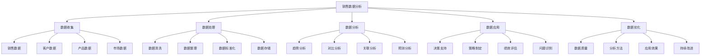
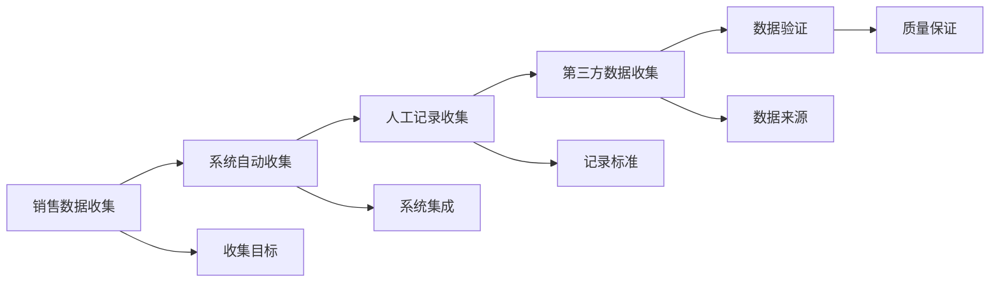
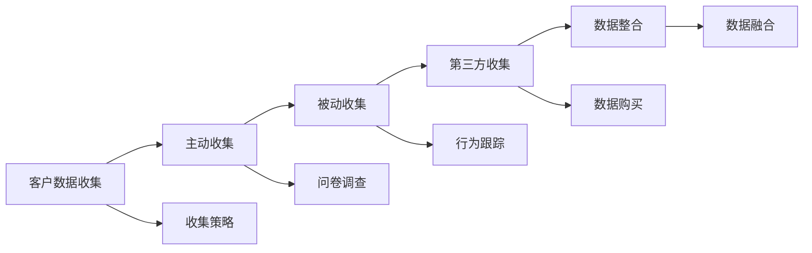
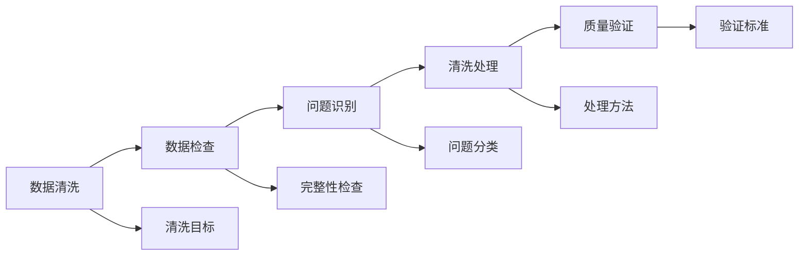
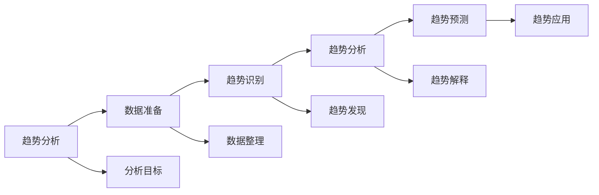
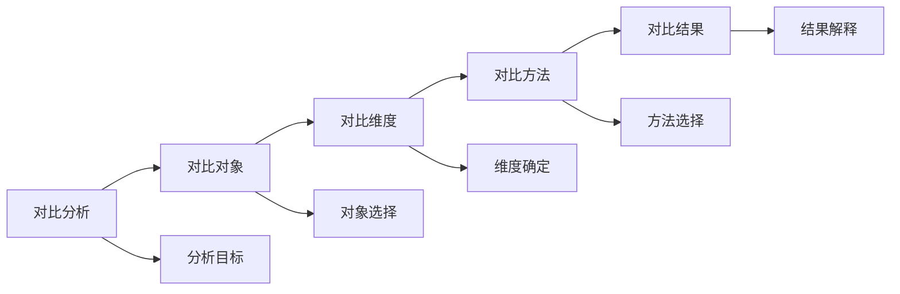
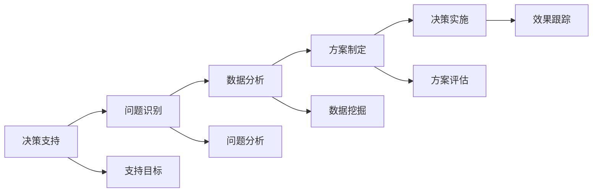

# 销售数据分析

## 新西兰手机维修与二手机销售数据分析体系

### 销售数据分析架构

### 数据收集

#### 1. 销售数据

**销售数据类型**：

| 数据类型 | 数据内容 | 数据来源 | 数据价值 |
|----------|----------|----------|----------|
| **销售金额** | 日销售额，月销售额，年销售额 | 销售系统，财务系统 | 业绩评估，趋势分析 |
| **销售数量** | 产品销量，服务数量 | 销售系统，库存系统 | 需求分析，库存管理 |
| **销售渠道** | 门店销售，在线销售，电话销售 | 销售系统，渠道系统 | 渠道分析，渠道优化 |
| **销售时间** | 销售时间，销售周期 | 销售系统，时间记录 | 时间分析，效率提升 |

**销售数据收集方法**：

**收集要点**：
- **数据完整性**：确保数据收集完整
- **数据准确性**：保证数据收集准确
- **数据及时性**：及时收集最新数据
- **数据标准化**：统一数据收集标准

#### 2. 客户数据

**客户数据类型**：

| 数据类型 | 数据内容 | 数据来源 | 数据价值 |
|----------|----------|----------|----------|
| **基本信息** | 年龄，性别，职业，收入 | 客户登记，问卷调查 | 客户画像，市场细分 |
| **消费行为** | 购买频率，购买金额，购买偏好 | 交易记录，行为分析 | 行为预测，需求分析 |
| **服务记录** | 服务类型，服务频率，满意度 | 服务系统，反馈系统 | 服务优化，满意度提升 |
| **沟通记录** | 沟通频率，沟通内容，沟通效果 | 沟通系统，CRM系统 | 关系维护，沟通优化 |

**客户数据收集策略**：

#### 3. 产品数据

**产品数据类型**：

| 数据类型 | 数据内容 | 数据来源 | 数据价值 |
|----------|----------|----------|----------|
| **产品信息** | 产品规格，产品功能，产品价格 | 产品系统，价格系统 | 产品分析，价格策略 |
| **库存数据** | 库存数量，库存周转，库存成本 | 库存系统，财务系统 | 库存管理，成本控制 |
| **销售数据** | 产品销量，销售排名，销售趋势 | 销售系统，分析系统 | 销售分析，产品优化 |
| **质量数据** | 产品质量，故障率，返修率 | 质量系统，维修系统 | 质量分析，质量提升 |

#### 4. 市场数据

**市场数据类型**：

| 数据类型 | 数据内容 | 数据来源 | 数据价值 |
|----------|----------|----------|----------|
| **竞争数据** | 竞品价格，竞品销量，竞品策略 | 市场调研，行业报告 | 竞争分析，策略制定 |
| **行业数据** | 行业规模，行业趋势，行业政策 | 行业报告，政府数据 | 行业分析，趋势预测 |
| **经济数据** | 经济指标，消费指数，价格指数 | 统计局，经济报告 | 经济分析，市场预测 |
| **技术数据** | 技术趋势，技术标准，技术发展 | 技术报告，专利数据 | 技术分析，创新方向 |

### 数据处理

#### 1. 数据清洗

**清洗内容**：

| 清洗类型 | 清洗内容 | 清洗方法 | 清洗标准 |
|----------|----------|----------|----------|
| **重复数据** | 重复记录，重复信息 | 去重算法，人工检查 | 数据唯一，无重复 |
| **缺失数据** | 缺失字段，缺失记录 | 数据补全，数据删除 | 数据完整，无缺失 |
| **错误数据** | 数据错误，格式错误 | 数据修正，格式统一 | 数据正确，格式标准 |
| **异常数据** | 异常值，离群值 | 异常检测，异常处理 | 数据正常，无异常 |

**数据清洗流程**：

**清洗要点**：
- **清洗标准**：制定统一清洗标准
- **清洗方法**：选择合适清洗方法
- **清洗质量**：保证清洗质量
- **清洗记录**：记录清洗过程

#### 2. 数据整理

**整理内容**：

| 整理类型 | 整理内容 | 整理方法 | 整理标准 |
|----------|----------|----------|----------|
| **数据分类** | 数据类型，数据来源 | 分类规则，分类标准 | 分类清晰，标准统一 |
| **数据排序** | 时间排序，数值排序 | 排序规则，排序方法 | 排序合理，逻辑清晰 |
| **数据分组** | 数据分组，数据聚合 | 分组规则，聚合方法 | 分组合理，聚合准确 |
| **数据转换** | 格式转换，单位转换 | 转换规则，转换方法 | 转换准确，格式统一 |

#### 3. 数据标准化

**标准化内容**：

| 标准化类型 | 标准化内容 | 标准化方法 | 标准化标准 |
|----------|----------|----------|----------|
| **格式标准化** | 数据格式，字段格式 | 格式规范，格式转换 | 格式统一，规范标准 |
| **单位标准化** | 计量单位，货币单位 | 单位统一，单位转换 | 单位统一，换算准确 |
| **编码标准化** | 数据编码，分类编码 | 编码规则，编码转换 | 编码统一，规则标准 |
| **命名标准化** | 字段命名，表命名 | 命名规范，命名规则 | 命名统一，规范标准 |

### 数据分析

#### 1. 趋势分析

**趋势分析类型**：

| 分析类型 | 分析内容 | 分析方法 | 分析价值 |
|----------|----------|----------|----------|
| **时间趋势** | 销售趋势，需求趋势 | 时间序列分析，趋势线分析 | 趋势预测，策略制定 |
| **季节性趋势** | 季节性变化，周期性变化 | 季节性分析，周期性分析 | 季节策略，周期管理 |
| **增长趋势** | 增长率，增长模式 | 增长率分析，增长模式分析 | 增长预测，增长策略 |
| **下降趋势** | 下降率，下降原因 | 下降率分析，原因分析 | 问题识别，改进措施 |

**趋势分析方法**：

**分析要点**：
- **数据质量**：确保分析数据质量
- **分析方法**：选择合适分析方法
- **分析深度**：深入分析趋势原因
- **分析应用**：将分析结果应用于决策

#### 2. 对比分析

**对比分析类型**：

| 对比类型 | 对比内容 | 对比方法 | 对比价值 |
|----------|----------|----------|----------|
| **时间对比** | 同期对比，环比对比 | 时间对比分析，环比分析 | 变化识别，趋势分析 |
| **产品对比** | 产品性能，产品销量 | 产品对比分析，性能分析 | 产品优化，产品策略 |
| **渠道对比** | 渠道效果，渠道成本 | 渠道对比分析，效果分析 | 渠道优化，渠道策略 |
| **客户对比** | 客户价值，客户行为 | 客户对比分析，价值分析 | 客户细分，客户策略 |

**对比分析框架**：

#### 3. 关联分析

**关联分析类型**：

| 关联类型 | 关联内容 | 关联方法 | 关联价值 |
|----------|----------|----------|----------|
| **产品关联** | 产品组合，产品推荐 | 关联规则分析，推荐算法 | 产品推荐，交叉销售 |
| **客户关联** | 客户行为，客户需求 | 行为关联分析，需求关联 | 客户细分，精准营销 |
| **时间关联** | 时间模式，时间规律 | 时间关联分析，模式识别 | 时间策略，时机把握 |
| **地理关联** | 地理分布，地理影响 | 地理关联分析，空间分析 | 地理策略，区域管理 |

#### 4. 预测分析

**预测分析类型**：

| 预测类型 | 预测内容 | 预测方法 | 预测价值 |
|----------|----------|----------|----------|
| **销售预测** | 销售趋势，销售目标 | 时间序列预测，回归预测 | 销售计划，目标制定 |
| **需求预测** | 需求趋势，需求变化 | 需求预测模型，市场预测 | 需求管理，库存规划 |
| **客户预测** | 客户行为，客户价值 | 客户预测模型，行为预测 | 客户管理，价值提升 |
| **市场预测** | 市场趋势，市场机会 | 市场预测模型，趋势预测 | 市场策略，机会把握 |

### 数据应用

#### 1. 决策支持

**决策支持类型**：

| 支持类型 | 支持内容 | 支持方法 | 支持效果 |
|----------|----------|----------|----------|
| **销售决策** | 销售策略，销售计划 | 销售数据分析，趋势分析 | 决策科学，策略有效 |
| **产品决策** | 产品策略，产品规划 | 产品数据分析，市场分析 | 产品优化，市场适应 |
| **价格决策** | 价格策略，价格调整 | 价格数据分析，竞争分析 | 价格合理，竞争力强 |
| **库存决策** | 库存策略，库存管理 | 库存数据分析，需求预测 | 库存优化，成本控制 |

**决策支持流程**：

#### 2. 策略制定

**策略制定应用**：

| 策略类型 | 策略内容 | 数据支持 | 策略效果 |
|----------|----------|----------|----------|
| **营销策略** | 营销计划，营销活动 | 客户数据分析，市场分析 | 营销精准，效果提升 |
| **产品策略** | 产品规划，产品开发 | 产品数据分析，需求分析 | 产品优化，市场适应 |
| **服务策略** | 服务计划，服务优化 | 服务数据分析，满意度分析 | 服务提升，客户满意 |
| **竞争策略** | 竞争分析，竞争策略 | 竞争数据分析，市场分析 | 竞争优势，市场地位 |

#### 3. 绩效评估

**绩效评估应用**：

| 评估类型 | 评估内容 | 数据支持 | 评估效果 |
|----------|----------|----------|----------|
| **销售绩效** | 销售目标，销售完成率 | 销售数据分析，目标对比 | 绩效明确，激励有效 |
| **客户绩效** | 客户满意度，客户忠诚度 | 客户数据分析，满意度分析 | 客户满意，关系稳定 |
| **产品绩效** | 产品销量，产品利润 | 产品数据分析，利润分析 | 产品优化，利润提升 |
| **服务绩效** | 服务质量，服务效率 | 服务数据分析，质量分析 | 服务提升，效率提高 |

### 数据优化

#### 1. 数据质量

**质量提升方法**：

| 质量要素 | 质量内容 | 提升方法 | 提升效果 |
|----------|----------|----------|----------|
| **数据准确性** | 数据正确，数据可靠 | 数据验证，数据检查 | 数据准确，分析可靠 |
| **数据完整性** | 数据完整，数据全面 | 数据补全，数据收集 | 数据完整，分析全面 |
| **数据及时性** | 数据及时，数据新鲜 | 实时收集，及时更新 | 数据及时，分析及时 |
| **数据一致性** | 数据一致，数据统一 | 数据标准化，数据统一 | 数据一致，分析统一 |

#### 2. 分析方法

**方法优化策略**：

| 优化类型 | 优化内容 | 优化方法 | 优化效果 |
|----------|----------|----------|----------|
| **分析深度** | 分析深入，分析透彻 | 深度分析，多维度分析 | 分析深入，洞察深刻 |
| **分析广度** | 分析全面，分析完整 | 全面分析，多角度分析 | 分析全面，视角完整 |
| **分析速度** | 分析快速，分析及时 | 算法优化，工具优化 | 分析快速，响应及时 |
| **分析准确性** | 分析准确，分析可靠 | 方法优化，验证加强 | 分析准确，结果可靠 |

## 数据分析工具

### 分析软件

#### 1. 专业软件
- **Excel**：基础数据分析
- **SPSS**：统计分析软件
- **R语言**：统计分析语言
- **Python**：数据分析语言

#### 2. 商业智能
- **Tableau**：数据可视化
- **Power BI**：商业智能
- **QlikView**：数据发现
- **SAP BI**：企业级BI

### 数据可视化

#### 1. 图表类型
- **趋势图**：时间趋势分析
- **对比图**：数据对比分析
- **分布图**：数据分布分析
- **关联图**：数据关联分析

#### 2. 仪表板
- **销售仪表板**：销售数据监控
- **客户仪表板**：客户数据监控
- **产品仪表板**：产品数据监控
- **运营仪表板**：运营数据监控

## 对从业者的建议

### 数据分析建议
1. **数据思维**：培养数据思维
2. **分析技能**：提升分析技能
3. **工具使用**：熟练使用分析工具
4. **结果应用**：将分析结果应用于实践

### 数据管理建议
1. **数据质量**：重视数据质量
2. **数据安全**：保护数据安全
3. **数据标准**：建立数据标准
4. **数据更新**：及时更新数据

### 决策支持建议
1. **数据驱动**：以数据驱动决策
2. **分析深入**：深入分析数据
3. **结果验证**：验证分析结果
4. **持续改进**：持续改进分析方法

---
**相关链接**：
- [[02-理解应用层/03-销售服务/01-销售流程标准|销售流程标准]]
- [[02-理解应用层/03-销售服务/04-客户关系维护|客户关系维护]]
- [[04-工具模板/04-数据分析/01-销售数据分析模板|销售数据分析模板]]

*最后更新：2024年*
*适用市场：新西兰*

