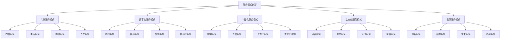
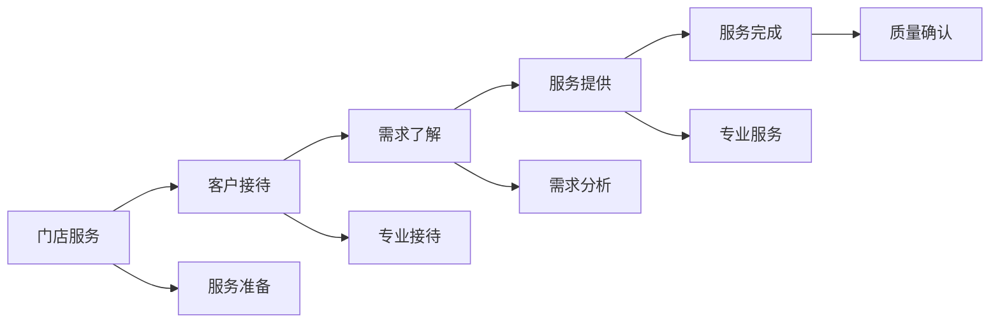
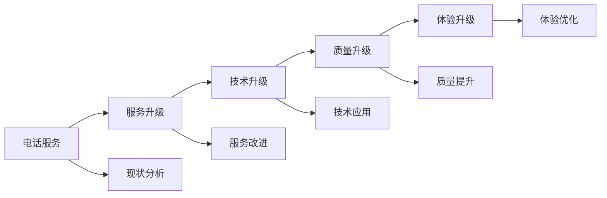
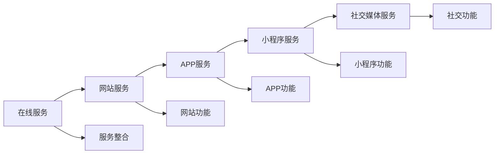
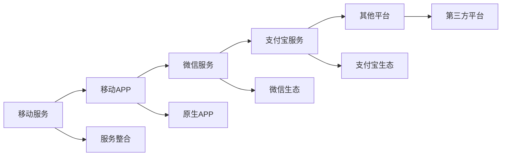
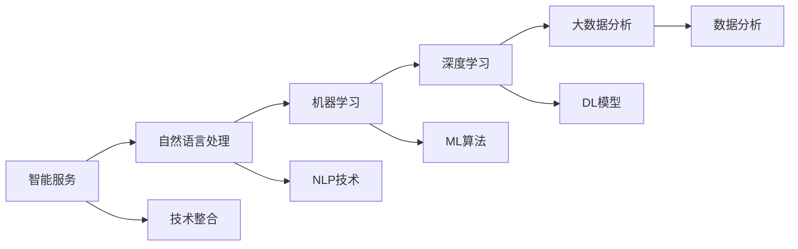
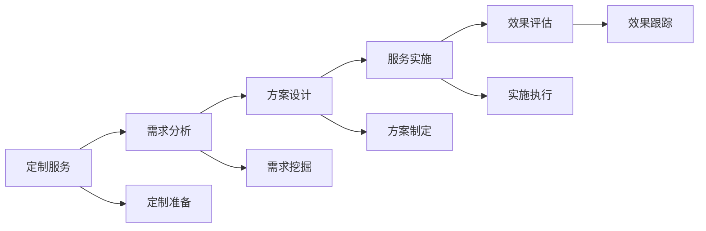
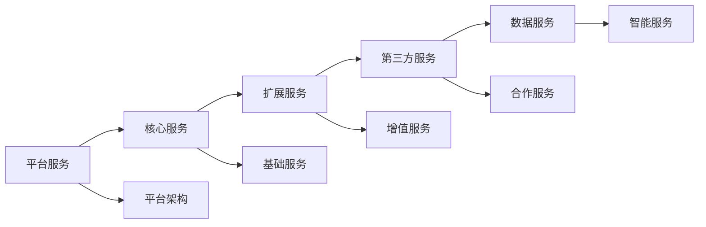
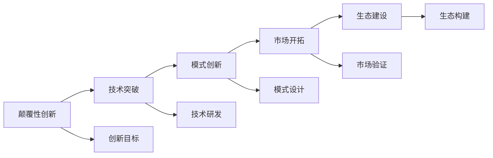

# 服务模式创新

## 新西兰手机维修与二手机销售服务模式创新体系

### 服务模式创新架构

### 传统服务模式

#### 1. 门店服务模式

**服务特点**：

| 服务要素 | 服务内容 | 服务优势 | 服务劣势 |
|----------|----------|----------|----------|
| **面对面服务** | 直接接触，即时沟通 | 沟通直接，信任建立 | 时间限制，地点限制 |
| **专业服务** | 专业技术人员，专业设备 | 服务质量高，技术专业 | 成本高，人员要求高 |
| **即时服务** | 即时响应，即时解决 | 响应快速，解决及时 | 资源有限，效率有限 |
| **体验服务** | 现场体验，实物展示 | 体验真实，选择直观 | 空间限制，展示有限 |

**服务流程优化**：

**优化策略**：
- **服务标准化**：建立标准化服务流程
- **服务专业化**：提升服务专业水平
- **服务效率化**：提高服务效率
- **服务体验化**：优化服务体验

#### 2. 电话服务模式

**服务特点**：

| 服务要素 | 服务内容 | 服务优势 | 服务劣势 |
|----------|----------|----------|----------|
| **远程服务** | 电话咨询，电话支持 | 方便快捷，成本较低 | 沟通有限，效果有限 |
| **即时响应** | 即时接听，即时解答 | 响应快速，便利性高 | 服务质量，专业程度 |
| **成本控制** | 成本较低，效率较高 | 成本优势，效率优势 | 服务深度，客户体验 |
| **覆盖范围** | 覆盖广泛，不受地域限制 | 覆盖优势，地域优势 | 服务质量，专业程度 |

**服务优化方向**：

### 数字化服务模式

#### 1. 在线服务模式

**服务特点**：

| 服务要素 | 服务内容 | 服务优势 | 服务劣势 |
|----------|----------|----------|----------|
| **24/7服务** | 全天候服务，无时间限制 | 时间优势，便利性高 | 人工成本，服务质量 |
| **多媒体服务** | 文字、图片、视频服务 | 信息丰富，表达清晰 | 技术要求，设备要求 |
| **自助服务** | 客户自助，系统自动 | 效率高，成本低 | 个性化，人性化 |
| **数据服务** | 数据记录，数据分析 | 数据优势，分析优势 | 隐私保护，数据安全 |

**在线服务平台**：

**平台功能设计**：
- **客户门户**：客户信息管理，服务记录
- **服务预约**：在线预约，时间管理
- **进度跟踪**：服务进度，状态更新
- **在线支付**：支付方式，支付安全

#### 2. 移动服务模式

**服务特点**：

| 服务要素 | 服务内容 | 服务优势 | 服务劣势 |
|----------|----------|----------|----------|
| **移动便捷** | 随时随地，移动办公 | 便利性高，灵活性好 | 屏幕限制，操作限制 |
| **位置服务** | GPS定位，位置服务 | 位置优势，本地化 | 隐私问题，定位精度 |
| **推送服务** | 消息推送，通知服务 | 及时性高，互动性强 | 打扰问题，频率控制 |
| **社交服务** | 社交分享，社交互动 | 社交优势，传播效应 | 隐私保护，内容管理 |

**移动服务应用**：

#### 3. 智能服务模式

**服务特点**：

| 服务要素 | 服务内容 | 服务优势 | 服务劣势 |
|----------|----------|----------|----------|
| **AI客服** | 智能客服，自动回答 | 24/7服务，成本低 | 理解能力，情感交流 |
| **智能诊断** | 自动诊断，智能分析 | 诊断准确，效率高 | 复杂问题，人工干预 |
| **智能推荐** | 个性化推荐，智能匹配 | 推荐精准，体验好 | 数据依赖，算法优化 |
| **智能预测** | 需求预测，趋势预测 | 预测准确，决策支持 | 数据质量，模型优化 |

**智能服务技术**：

### 个性化服务模式

#### 1. 定制服务模式

**服务特点**：

| 服务要素 | 服务内容 | 服务优势 | 服务劣势 |
|----------|----------|----------|----------|
| **个性化定制** | 根据客户需求定制 | 满足个性需求，客户满意 | 成本高，效率低 |
| **专属服务** | 专属客户经理，专属服务 | 服务专业，关系密切 | 资源投入，成本控制 |
| **差异化服务** | 不同客户不同服务 | 服务精准，价值提升 | 管理复杂，标准统一 |
| **价值服务** | 高价值服务，高端服务 | 价值体现，利润提升 | 市场限制，客户要求 |

**定制服务流程**：

**定制服务策略**：
- **需求分析**：深入分析客户需求
- **方案设计**：设计个性化方案
- **服务实施**：专业实施服务
- **效果评估**：评估服务效果

#### 2. 会员服务模式

**服务特点**：

| 服务要素 | 服务内容 | 服务优势 | 服务劣势 |
|----------|----------|----------|----------|
| **等级服务** | 不同等级不同服务 | 激励消费，忠诚度提升 | 管理复杂，成本控制 |
| **专属权益** | 会员专属权益，特权服务 | 价值感强，归属感强 | 权益设计，成本平衡 |
| **积分服务** | 积分累积，积分兑换 | 消费激励，粘性提升 | 积分管理，兑换成本 |
| **社群服务** | 会员社群，交流互动 | 社群效应，口碑传播 | 社群管理，内容运营 |

**会员服务体系**：

### 生态化服务模式

#### 1. 平台服务模式

**服务特点**：

| 服务要素 | 服务内容 | 服务优势 | 服务劣势 |
|----------|----------|----------|----------|
| **平台整合** | 整合多方资源，平台服务 | 资源整合，效率提升 | 平台管理，质量控制 |
| **生态服务** | 生态化服务，全链条服务 | 服务完整，价值提升 | 生态建设，合作管理 |
| **开放服务** | 开放平台，第三方服务 | 服务丰富，创新驱动 | 质量控制，标准统一 |
| **数据服务** | 数据共享，数据服务 | 数据价值，决策支持 | 数据安全，隐私保护 |

**平台服务架构**：

#### 2. 合作服务模式

**服务特点**：

| 服务要素 | 服务内容 | 服务优势 | 服务劣势 |
|----------|----------|----------|----------|
| **战略合作** | 战略合作伙伴，深度合作 | 资源共享，优势互补 | 合作管理，利益分配 |
| **技术合作** | 技术合作伙伴，技术共享 | 技术提升，创新驱动 | 技术保护，知识产权 |
| **渠道合作** | 渠道合作伙伴，渠道共享 | 渠道扩展，市场覆盖 | 渠道管理，质量控制 |
| **服务合作** | 服务合作伙伴，服务整合 | 服务完善，客户满意 | 服务标准，质量统一 |

### 创新服务模式

#### 1. 颠覆性创新

**创新特点**：

| 创新要素 | 创新内容 | 创新优势 | 创新风险 |
|----------|----------|----------|----------|
| **技术颠覆** | 新技术应用，技术革命 | 技术领先，竞争优势 | 技术风险，投资风险 |
| **模式颠覆** | 新模式创新，模式革命 | 模式创新，市场颠覆 | 市场风险，接受风险 |
| **服务颠覆** | 新服务创新，服务革命 | 服务创新，体验颠覆 | 服务风险，质量风险 |
| **市场颠覆** | 新市场开拓，市场革命 | 市场开拓，增长驱动 | 市场风险，竞争风险 |

**颠覆性创新策略**：

#### 2. 渐进性创新

**创新特点**：

| 创新要素 | 创新内容 | 创新优势 | 创新风险 |
|----------|----------|----------|----------|
| **持续改进** | 持续优化，持续提升 | 风险较低，效果稳定 | 创新程度，竞争优势 |
| **微创新** | 微小改进，细节优化 | 成本较低，见效快 | 创新影响，市场反应 |
| **迭代创新** | 快速迭代，快速改进 | 响应快速，适应性强 | 迭代质量，用户体验 |
| **用户驱动** | 用户需求驱动，用户反馈 | 用户满意，市场适应 | 需求理解，反馈处理 |

### 服务模式创新实施

#### 1. 创新策略制定

**策略要素**：

| 策略要素 | 策略内容 | 策略方法 | 策略效果 |
|----------|----------|----------|----------|
| **市场分析** | 市场需求，竞争分析 | 市场调研，竞争分析 | 市场洞察，策略基础 |
| **技术评估** | 技术可行性，技术风险 | 技术评估，风险评估 | 技术保障，风险控制 |
| **资源规划** | 资源配置，资源投入 | 资源规划，投入计划 | 资源保障，实施基础 |
| **实施计划** | 实施步骤，时间安排 | 计划制定，进度控制 | 实施有序，目标达成 |

#### 2. 创新团队建设

**团队要素**：

| 团队要素 | 团队内容 | 团队要求 | 团队效果 |
|----------|----------|----------|----------|
| **创新人才** | 创新思维，创新能力 | 人才招聘，人才培养 | 人才保障，创新驱动 |
| **跨部门合作** | 部门协作，资源整合 | 协作机制，沟通机制 | 协作效率，资源整合 |
| **外部合作** | 外部专家，外部资源 | 合作机制，资源整合 | 外部支持，资源补充 |
| **激励机制** | 创新激励，成果激励 | 激励制度，奖励机制 | 创新动力，成果转化 |

#### 3. 创新文化建设

**文化要素**：

| 文化要素 | 文化内容 | 文化建设 | 文化效果 |
|----------|----------|----------|----------|
| **创新氛围** | 创新环境，创新氛围 | 氛围营造，环境建设 | 创新环境，创新驱动 |
| **容错文化** | 容错机制，失败容忍 | 容错制度，失败学习 | 创新勇气，风险承担 |
| **学习文化** | 学习氛围，持续学习 | 学习机制，知识管理 | 学习能力，知识积累 |
| **分享文化** | 知识分享，经验分享 | 分享机制，交流平台 | 知识传播，经验积累 |

## 服务模式创新案例

### 成功案例

#### 1. 数字化服务案例
- **案例背景**：传统门店服务转型
- **创新内容**：在线预约，移动支付，智能客服
- **创新效果**：效率提升30%，客户满意度提升25%
- **关键因素**：技术投入，流程优化，员工培训

#### 2. 个性化服务案例
- **案例背景**：客户需求多样化
- **创新内容**：定制服务，专属客户经理，个性化推荐
- **创新效果**：客户忠诚度提升40%，复购率提升35%
- **关键因素**：需求分析，服务设计，关系维护

#### 3. 生态化服务案例
- **案例背景**：服务链条不完整
- **创新内容**：平台整合，生态服务，合作共赢
- **创新效果**：服务完整性提升50%，客户价值提升45%
- **关键因素**：平台建设，生态构建，合作管理

## 对从业者的建议

### 创新思维建议
1. **开放思维**：保持开放心态，接受新事物
2. **用户思维**：以用户需求为导向
3. **数据思维**：以数据驱动创新
4. **生态思维**：构建服务生态

### 创新能力建议
1. **学习能力**：持续学习新技术，新方法
2. **分析能力**：深入分析市场需求，竞争态势
3. **设计能力**：设计创新服务模式
4. **执行能力**：有效执行创新计划

### 创新管理建议
1. **创新规划**：制定创新发展规划
2. **创新投入**：合理投入创新资源
3. **创新评估**：建立创新评估机制
4. **创新推广**：推广创新成果

---
**相关链接**：
- [[03-高级应用层/01-业务创新/02-技术应用创新|技术应用创新]]
- [[03-高级应用层/01-业务创新/03-商业模式创新|商业模式创新]]
- [[04-工具模板/05-创新工具/01-服务创新评估表|服务创新评估表]]

*最后更新：2024年*
*适用市场：新西兰*

