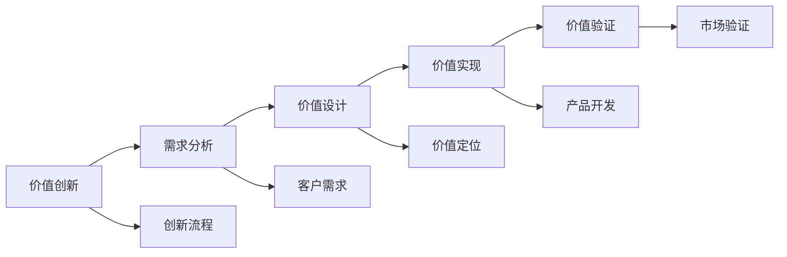
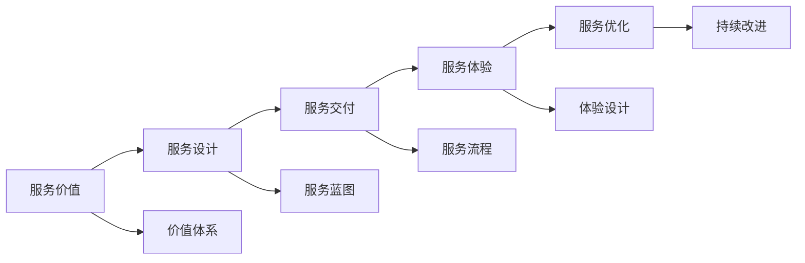
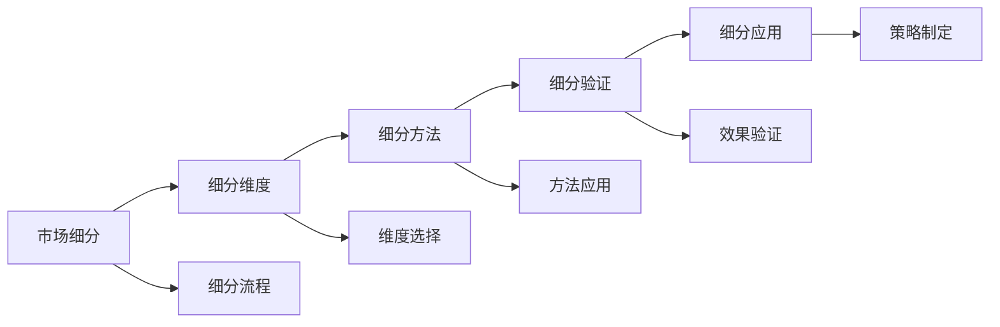
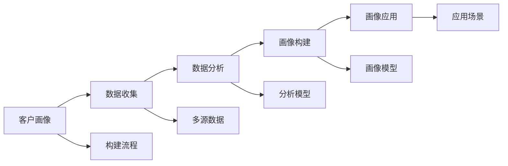
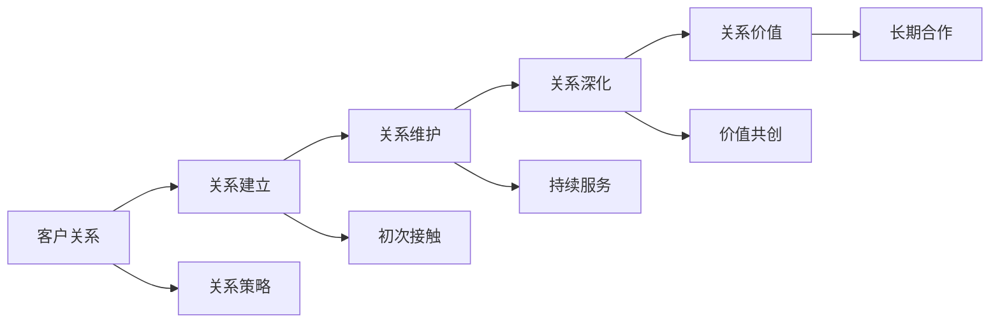

# 商业模式创新

## 新西兰手机维修与二手机销售商业模式创新体系

### 商业模式创新架构

```mermaid
graph TD
    A[商业模式创新] --> B[价值主张创新]
    A --> C[客户细分创新]
    A --> D[渠道通路创新]
    A --> E[客户关系创新]
    A --> F[收入模式创新]
    A --> G[核心资源创新]
    A --> H[关键活动创新]
    A --> I[合作伙伴创新]
    A --> J[成本结构创新]
    
    B --> B1[产品价值]
    B --> B2[服务价值]
    B --> B3[体验价值]
    B --> B4[社会价值]
    
    C --> C1[市场细分]
    C --> C2[客户画像]
    C --> C3[需求分析]
    C --> C4[价值定位]
    
    D --> D1[线上渠道]
    D --> D2[线下渠道]
    D --> D3[混合渠道]
    D --> D4[新兴渠道]
    
    E --> E1[服务关系]
    E --> E2[合作关系]
    E --> E3[社区关系]
    E --> E4[生态关系]
    
    F --> F1[产品销售]
    F --> F2[服务收费]
    F --> F3[订阅模式]
    F --> F4[平台分成]
    
    G --> G1[技术资源]
    G --> G2[人力资源]
    G --> G3[品牌资源]
    G --> G4[数据资源]
    
    H --> H1[研发活动]
    H --> H2[生产活动]
    H --> H3[营销活动]
    H --> H4[服务活动]
    
    I --> I1[供应商合作]
    I --> I2[渠道合作]
    I --> I3[技术合作]
    I --> I4[生态合作]
    
    J --> J1[固定成本]
    J --> J2[变动成本]
    J --> J3[运营成本]
    J --> J4[创新成本]
```

### 价值主张创新

#### 1. 产品价值创新

**价值创新类型**：

| 创新类型 | 创新内容 | 创新优势 | 创新效果 |
|----------|----------|----------|----------|
| **功能价值** | 产品功能，技术特性 | 功能强大，技术领先 | 产品竞争力，市场地位 |
| **质量价值** | 产品质量，可靠性 | 质量保证，用户信任 | 品牌形象，客户忠诚 |
| **设计价值** | 产品设计，用户体验 | 设计美观，体验优秀 | 用户满意度，市场接受度 |
| **创新价值** | 技术创新，模式创新 | 创新驱动，差异化 | 竞争优势，市场领先 |

**价值创新策略**：

**创新要点**：
- **客户导向**：以客户需求为导向
- **价值驱动**：以价值创造为驱动
- **差异化**：实现差异化价值
- **持续创新**：持续创新价值

#### 2. 服务价值创新

**服务价值类型**：

| 价值类型 | 价值内容 | 价值优势 | 价值效果 |
|----------|----------|----------|----------|
| **专业价值** | 专业服务，专业建议 | 专业权威，客户信任 | 专业形象，市场地位 |
| **便利价值** | 便利服务，便捷体验 | 使用便利，体验优秀 | 客户满意度，使用频率 |
| **个性价值** | 个性化服务，定制服务 | 满足个性，客户满意 | 客户忠诚度，复购率 |
| **情感价值** | 情感连接，心理满足 | 情感认同，心理满足 | 品牌忠诚，口碑传播 |

**服务价值创新方法**：

#### 3. 体验价值创新

**体验价值要素**：

| 体验要素 | 体验内容 | 体验优势 | 体验效果 |
|----------|----------|----------|----------|
| **感官体验** | 视觉，听觉，触觉 | 感官刺激，印象深刻 | 品牌记忆，情感连接 |
| **情感体验** | 情感共鸣，心理满足 | 情感认同，心理满足 | 品牌忠诚，情感依赖 |
| **认知体验** | 知识获取，思维启发 | 知识价值，思维提升 | 学习价值，认知提升 |
| **行为体验** | 互动参与，行为改变 | 参与感强，行为改变 | 行为习惯，生活方式 |

### 客户细分创新

#### 1. 市场细分创新

**细分维度**：

| 细分维度 | 细分内容 | 细分优势 | 细分效果 |
|----------|----------|----------|----------|
| **人口统计** | 年龄，性别，收入，职业 | 数据客观，易于分析 | 目标明确，策略精准 |
| **地理因素** | 地区，城市，气候，文化 | 地域特色，文化差异 | 本地化策略，文化适应 |
| **心理因素** | 价值观，生活方式，个性 | 心理洞察，需求理解 | 心理满足，情感连接 |
| **行为因素** | 购买行为，使用行为，忠诚度 | 行为预测，需求预判 | 行为引导，需求满足 |

**细分策略创新**：

#### 2. 客户画像创新

**画像要素**：

| 画像要素 | 画像内容 | 画像优势 | 画像效果 |
|----------|----------|----------|----------|
| **基本信息** | 年龄，性别，职业，收入 | 基础了解，目标定位 | 精准营销，个性化服务 |
| **消费行为** | 购买频率，购买金额，购买偏好 | 行为预测，需求分析 | 需求满足，行为引导 |
| **生活方式** | 生活态度，消费观念，社交方式 | 生活方式，价值观念 | 生活方式，价值认同 |
| **技术偏好** | 技术接受度，使用习惯，学习能力 | 技术适应，产品选择 | 技术匹配，使用体验 |

**画像构建方法**：

### 渠道通路创新

#### 1. 线上渠道创新

**渠道类型**：

| 渠道类型 | 渠道内容 | 渠道优势 | 渠道效果 |
|----------|----------|----------|----------|
| **电商平台** | 淘宝，京东，亚马逊 | 流量大，覆盖广 | 销售增长，市场扩展 |
| **社交媒体** | 微信，Facebook，Instagram | 社交传播，用户粘性 | 品牌传播，用户互动 |
| **内容平台** | 抖音，YouTube，博客 | 内容营销，用户教育 | 品牌认知，用户教育 |
| **移动应用** | APP，小程序，H5 | 用户粘性，个性化 | 用户留存，个性化服务 |

**线上渠道策略**：

#### 2. 线下渠道创新

**渠道类型**：

| 渠道类型 | 渠道内容 | 渠道优势 | 渠道效果 |
|----------|----------|----------|----------|
| **直营门店** | 品牌门店，体验店 | 品牌形象，服务体验 | 品牌建设，客户体验 |
| **加盟门店** | 加盟商，合作伙伴 | 快速扩张，成本控制 | 市场覆盖，规模效应 |
| **合作门店** | 异业合作，渠道合作 | 资源共享，优势互补 | 渠道扩展，成本降低 |
| **移动服务** | 上门服务，移动服务 | 便利性，个性化 | 服务便利，客户满意 |

#### 3. 混合渠道创新

**混合策略**：

| 策略类型 | 策略内容 | 策略优势 | 策略效果 |
|----------|----------|----------|----------|
| **O2O模式** | 线上线下一体化 | 渠道整合，体验优化 | 渠道协同，体验提升 |
| **全渠道** | 全渠道覆盖，无缝体验 | 覆盖全面，体验一致 | 市场覆盖，客户满意 |
| **渠道融合** | 渠道融合，数据共享 | 数据整合，运营优化 | 运营效率，客户洞察 |
| **渠道创新** | 新渠道开发，模式创新 | 渠道创新，竞争优势 | 市场领先，竞争优势 |

### 客户关系创新

#### 1. 服务关系创新

**关系类型**：

| 关系类型 | 关系内容 | 关系优势 | 关系效果 |
|----------|----------|----------|----------|
| **专业服务** | 专业咨询，专业建议 | 专业权威，客户信任 | 专业形象，客户忠诚 |
| **个性化服务** | 定制服务，专属服务 | 个性满足，客户满意 | 客户忠诚，复购率 |
| **社区服务** | 社区建设，用户互动 | 社区效应，用户粘性 | 用户粘性，口碑传播 |
| **生态服务** | 生态建设，价值共创 | 生态价值，长期合作 | 生态价值，长期合作 |

**关系创新策略**：

#### 2. 合作关系创新

**合作类型**：

| 合作类型 | 合作内容 | 合作优势 | 合作效果 |
|----------|----------|----------|----------|
| **战略合作** | 战略联盟，深度合作 | 资源共享，优势互补 | 竞争优势，市场地位 |
| **技术合作** | 技术共享，联合研发 | 技术提升，创新驱动 | 技术创新，产品优势 |
| **渠道合作** | 渠道共享，市场拓展 | 渠道扩展，市场覆盖 | 市场覆盖，销售增长 |
| **生态合作** | 生态建设，价值共创 | 生态价值，长期发展 | 生态价值，可持续发展 |

### 收入模式创新

#### 1. 产品销售模式

**销售模式**：

| 销售模式 | 模式内容 | 模式优势 | 模式效果 |
|----------|----------|----------|----------|
| **一次性销售** | 产品购买，一次性付费 | 收入确定，现金流好 | 收入稳定，现金流好 |
| **分期销售** | 分期付款，灵活支付 | 降低门槛，扩大市场 | 市场扩大，销售增长 |
| **租赁销售** | 产品租赁，使用权转移 | 降低门槛，持续收入 | 市场扩大，持续收入 |
| **以旧换新** | 旧品回收，新品销售 | 客户粘性，循环销售 | 客户粘性，循环经济 |

#### 2. 服务收费模式

**收费模式**：

| 收费模式 | 模式内容 | 模式优势 | 模式效果 |
|----------|----------|----------|----------|
| **按次收费** | 按服务次数收费 | 收费灵活，客户接受 | 收费灵活，客户满意 |
| **包月收费** | 月度服务包，固定收费 | 收入稳定，客户粘性 | 收入稳定，客户粘性 |
| **包年收费** | 年度服务包，优惠收费 | 收入稳定，客户忠诚 | 收入稳定，客户忠诚 |
| **增值服务** | 基础服务+增值服务 | 收入增长，价值提升 | 收入增长，价值提升 |

#### 3. 订阅模式

**订阅类型**：

| 订阅类型 | 订阅内容 | 订阅优势 | 订阅效果 |
|----------|----------|----------|----------|
| **软件订阅** | SaaS服务，软件使用 | 收入稳定，客户粘性 | 收入稳定，客户粘性 |
| **服务订阅** | 服务包订阅，持续服务 | 收入稳定，服务深度 | 收入稳定，服务深度 |
| **内容订阅** | 内容服务，知识付费 | 收入稳定，内容价值 | 收入稳定，内容价值 |
| **平台订阅** | 平台服务，生态服务 | 收入稳定，生态价值 | 收入稳定，生态价值 |

#### 4. 平台分成模式

**分成模式**：

| 分成模式 | 模式内容 | 模式优势 | 模式效果 |
|----------|----------|----------|----------|
| **交易分成** | 交易佣金，平台抽成 | 收入增长，规模效应 | 收入增长，规模效应 |
| **广告分成** | 广告收入，流量变现 | 收入增长，流量价值 | 收入增长，流量价值 |
| **数据分成** | 数据服务，数据变现 | 收入增长，数据价值 | 收入增长，数据价值 |
| **生态分成** | 生态服务，价值分成 | 收入增长，生态价值 | 收入增长，生态价值 |

### 核心资源创新

#### 1. 技术资源创新

**技术资源**：

| 资源类型 | 资源内容 | 资源优势 | 资源效果 |
|----------|----------|----------|----------|
| **核心技术** | 专利技术，专有技术 | 技术壁垒，竞争优势 | 技术优势，市场地位 |
| **技术团队** | 研发团队，技术专家 | 技术能力，创新能力 | 技术能力，产品优势 |
| **技术平台** | 技术平台，开发平台 | 开发效率，技术标准 | 开发效率，技术标准 |
| **技术数据** | 技术数据，研发数据 | 数据价值，决策支持 | 数据价值，技术优化 |

#### 2. 人力资源创新

**人力资源**：

| 资源类型 | 资源内容 | 资源优势 | 资源效果 |
|----------|----------|----------|----------|
| **核心团队** | 管理团队，核心员工 | 团队能力，执行能力 | 团队能力，业务发展 |
| **专业人才** | 技术人才，专业人才 | 专业能力，服务质量 | 专业能力，服务质量 |
| **人才体系** | 人才培养，人才管理 | 人才储备，能力提升 | 人才储备，能力提升 |
| **企业文化** | 企业文化，价值观 | 文化认同，团队凝聚力 | 文化认同，团队凝聚力 |

#### 3. 品牌资源创新

**品牌资源**：

| 资源类型 | 资源内容 | 资源优势 | 资源效果 |
|----------|----------|----------|----------|
| **品牌价值** | 品牌知名度，品牌美誉度 | 品牌效应，市场地位 | 品牌效应，市场地位 |
| **品牌资产** | 品牌资产，品牌价值 | 资产价值，竞争优势 | 资产价值，竞争优势 |
| **品牌传播** | 品牌传播，品牌营销 | 品牌认知，市场影响 | 品牌认知，市场影响 |
| **品牌生态** | 品牌生态，品牌联盟 | 生态价值，协同效应 | 生态价值，协同效应 |

### 关键活动创新

#### 1. 研发活动创新

**研发活动**：

| 活动类型 | 活动内容 | 活动优势 | 活动效果 |
|----------|----------|----------|----------|
| **产品研发** | 新产品开发，产品创新 | 产品优势，市场竞争力 | 产品优势，市场竞争力 |
| **技术研发** | 技术研究，技术创新 | 技术优势，技术壁垒 | 技术优势，技术壁垒 |
| **服务研发** | 服务创新，服务优化 | 服务优势，客户满意 | 服务优势，客户满意 |
| **模式研发** | 模式创新，商业模式 | 模式优势，竞争优势 | 模式优势，竞争优势 |

#### 2. 营销活动创新

**营销活动**：

| 活动类型 | 活动内容 | 活动优势 | 活动效果 |
|----------|----------|----------|----------|
| **数字营销** | 数字营销，在线营销 | 营销效率，成本控制 | 营销效率，成本控制 |
| **内容营销** | 内容营销，价值营销 | 品牌认知，用户教育 | 品牌认知，用户教育 |
| **社交营销** | 社交营销，口碑营销 | 社交传播，用户粘性 | 社交传播，用户粘性 |
| **体验营销** | 体验营销，互动营销 | 用户体验，品牌记忆 | 用户体验，品牌记忆 |

#### 3. 服务活动创新

**服务活动**：

| 活动类型 | 活动内容 | 活动优势 | 活动效果 |
|----------|----------|----------|----------|
| **客户服务** | 客户服务，客户支持 | 客户满意，客户忠诚 | 客户满意，客户忠诚 |
| **售后服务** | 售后服务，维修服务 | 服务质量，客户信任 | 服务质量，客户信任 |
| **增值服务** | 增值服务，延伸服务 | 价值提升，收入增长 | 价值提升，收入增长 |
| **生态服务** | 生态服务，平台服务 | 生态价值，长期合作 | 生态价值，长期合作 |

### 合作伙伴创新

#### 1. 供应商合作创新

**合作类型**：

| 合作类型 | 合作内容 | 合作优势 | 合作效果 |
|----------|----------|----------|----------|
| **战略合作** | 战略联盟，深度合作 | 资源共享，优势互补 | 竞争优势，成本控制 |
| **技术合作** | 技术共享，联合研发 | 技术提升，创新驱动 | 技术创新，产品优势 |
| **供应链合作** | 供应链整合，协同优化 | 效率提升，成本降低 | 效率提升，成本降低 |
| **生态合作** | 生态建设，价值共创 | 生态价值，长期发展 | 生态价值，可持续发展 |

#### 2. 渠道合作创新

**合作类型**：

| 合作类型 | 合作内容 | 合作优势 | 合作效果 |
|----------|----------|----------|----------|
| **渠道联盟** | 渠道联盟，资源共享 | 渠道扩展，市场覆盖 | 市场覆盖，销售增长 |
| **异业合作** | 异业合作，交叉销售 | 客户共享，市场扩展 | 市场扩展，客户增长 |
| **平台合作** | 平台合作，生态建设 | 平台效应，规模效应 | 规模效应，竞争优势 |
| **社区合作** | 社区合作，用户共建 | 社区效应，用户粘性 | 用户粘性，口碑传播 |

### 成本结构创新

#### 1. 成本优化创新

**优化类型**：

| 优化类型 | 优化内容 | 优化优势 | 优化效果 |
|----------|----------|----------|----------|
| **成本控制** | 成本管理，成本控制 | 成本降低，利润提升 | 成本降低，利润提升 |
| **效率提升** | 效率优化，流程优化 | 效率提升，成本降低 | 效率提升，成本降低 |
| **规模效应** | 规模经济，批量效应 | 成本降低，竞争优势 | 成本降低，竞争优势 |
| **技术创新** | 技术优化，自动化 | 效率提升，成本降低 | 效率提升，成本降低 |

#### 2. 成本结构创新

**结构创新**：

| 创新类型 | 创新内容 | 创新优势 | 创新效果 |
|----------|----------|----------|----------|
| **固定成本** | 固定成本优化，资产优化 | 成本稳定，风险控制 | 成本稳定，风险控制 |
| **变动成本** | 变动成本控制，弹性成本 | 成本灵活，适应性强 | 成本灵活，适应性强 |
| **运营成本** | 运营成本优化，管理优化 | 运营效率，成本控制 | 运营效率，成本控制 |
| **创新成本** | 创新投入，研发投入 | 创新能力，竞争优势 | 创新能力，竞争优势 |

## 商业模式创新实施

### 创新策略制定

#### 1. 创新目标设定
- **市场目标**：市场地位，市场份额
- **财务目标**：收入增长，利润提升
- **客户目标**：客户满意，客户忠诚
- **创新目标**：创新能力，竞争优势

#### 2. 创新路径规划
- **渐进创新**：逐步改进，风险控制
- **突破创新**：重大突破，市场颠覆
- **组合创新**：多要素组合，协同创新
- **生态创新**：生态建设，价值共创

### 创新实施管理

#### 1. 实施计划
- **分阶段实施**：分阶段推进，风险控制
- **试点验证**：小范围试点，效果验证
- **逐步推广**：逐步推广，扩大应用
- **持续优化**：持续优化，效果提升

#### 2. 风险控制
- **市场风险**：市场变化，竞争风险
- **技术风险**：技术风险，实施风险
- **财务风险**：投资风险，回报风险
- **运营风险**：运营风险，管理风险

## 对从业者的建议

### 创新思维建议
1. **客户导向**：以客户需求为导向
2. **价值驱动**：以价值创造为驱动
3. **生态思维**：构建商业生态
4. **持续创新**：持续创新，不断改进

### 创新能力建议
1. **分析能力**：深入分析市场，竞争态势
2. **设计能力**：设计创新商业模式
3. **执行能力**：有效执行创新计划
4. **学习能力**：持续学习，知识更新

### 创新管理建议
1. **创新规划**：制定创新发展规划
2. **创新投入**：合理投入创新资源
3. **创新评估**：建立创新评估机制
4. **创新推广**：推广创新成果

---
**相关链接**：
- [[03-高级应用层/01-业务创新/01-服务模式创新|服务模式创新]]
- [[03-高级应用层/01-业务创新/02-技术应用创新|技术应用创新]]
- [[04-工具模板/05-创新工具/03-商业模式画布|商业模式画布]]

*最后更新：2024年*
*适用市场：新西兰*

