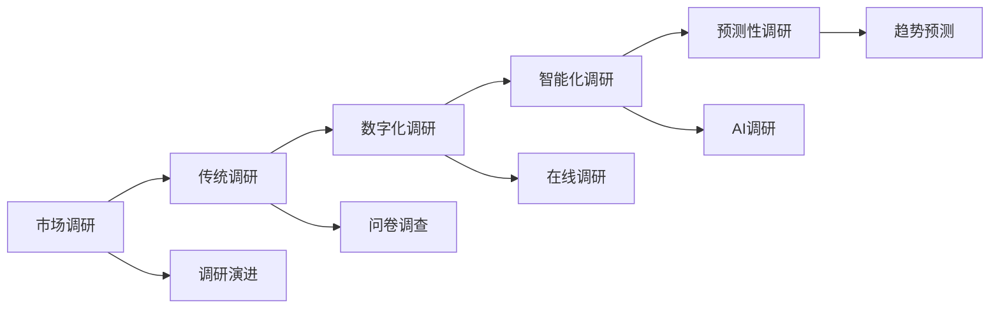
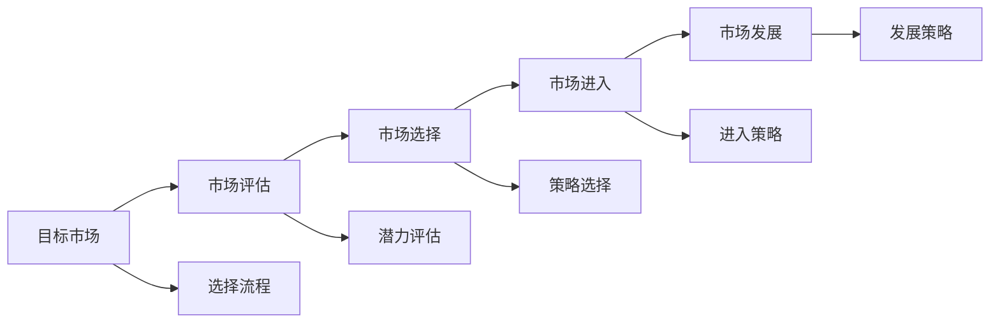
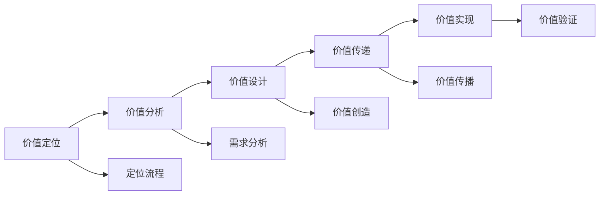
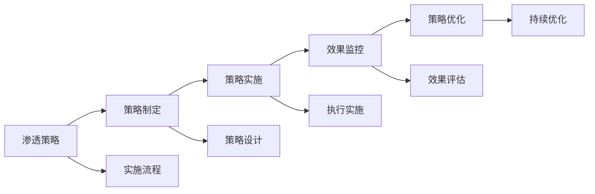
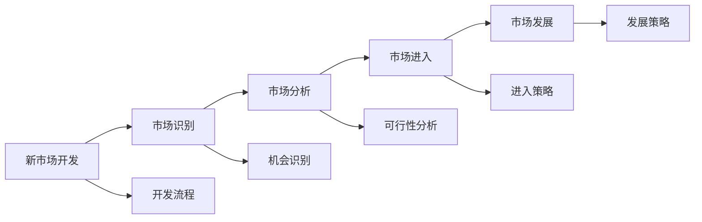

# 市场拓展创新

## 新西兰手机维修与二手机销售市场拓展创新体系

### 市场拓展创新架构

```mermaid
graph TD
    A[市场拓展创新] --> B[市场分析创新]
    A --> C[市场定位创新]
    A --> D[市场进入创新]
    A --> E[市场渗透创新]
    A --> F[市场开发创新]
    A --> G[产品开发创新]
    A --> H[渠道拓展创新]
    A --> I[品牌拓展创新]
    
    B --> B1[市场调研]
    B --> B2[竞争分析]
    B --> B3[趋势预测]
    B --> B4[机会识别]
    
    C --> C1[目标市场]
    C --> C2[市场细分]
    C --> C3[价值定位]
    C --> C4[差异化策略]
    
    D --> D1[进入策略]
    D --> D2[进入时机]
    D --> D3[进入方式]
    D --> D4[风险评估]
    
    E --> E1[渗透策略]
    E --> E2[渗透方法]
    E --> E3[渗透效果]
    E --> E4[渗透优化]
    
    F --> F1[新市场开发]
    F --> F2[新客户开发]
    F --> F3[新需求开发]
    F --> F4[新应用开发]
    
    G --> G1[产品创新]
    G --> G2[产品组合]
    G --> G3[产品线扩展]
    G --> G4[产品生命周期]
    
    H --> H1[渠道创新]
    H --> H2[渠道整合]
    H --> H3[渠道优化]
    H --> H4[渠道管理]
    
    I --> I1[品牌延伸]
    I --> I2[品牌授权]
    I --> I3[品牌合作]
    I --> I4[品牌国际化]
```

### 市场分析创新

#### 1. 市场调研创新

**调研方法创新**：

| 调研方法 | 方法内容 | 方法优势 | 应用场景 |
|----------|----------|----------|----------|
| **大数据分析** | 海量数据分析，行为分析 | 数据丰富，分析深入 | 市场趋势，用户行为 |
| **社交媒体分析** | 社交媒体数据，用户反馈 | 实时性强，覆盖面广 | 品牌监测，用户洞察 |
| **移动调研** | 移动端调研，实时反馈 | 便利性强，响应率高 | 快速调研，实时反馈 |
| **AI调研** | 人工智能调研，智能分析 | 效率高，分析准确 | 大规模调研，智能分析 |

**调研创新策略**：

**调研要点**：
- **数据质量**：确保调研数据质量
- **方法创新**：采用创新调研方法
- **分析深度**：深入分析调研结果
- **应用价值**：将调研结果应用于决策

#### 2. 竞争分析创新

**分析维度创新**：

| 分析维度 | 分析内容 | 分析优势 | 分析效果 |
|----------|----------|----------|----------|
| **动态竞争** | 竞争动态，竞争变化 | 实时性强，适应性强 | 竞争策略，市场应对 |
| **生态竞争** | 生态竞争，平台竞争 | 全面分析，系统思维 | 生态策略，平台策略 |
| **数据竞争** | 数据竞争，算法竞争 | 数据驱动，智能决策 | 数据策略，算法优化 |
| **用户体验竞争** | 体验竞争，服务竞争 | 用户导向，体验优化 | 体验策略，服务优化 |

**竞争分析框架**：

#### 3. 趋势预测创新

**预测方法创新**：

| 预测方法 | 方法内容 | 方法优势 | 预测效果 |
|----------|----------|----------|----------|
| **机器学习预测** | 算法预测，模型预测 | 预测准确，适应性强 | 趋势预测，需求预测 |
| **大数据预测** | 海量数据预测，行为预测 | 数据丰富，预测全面 | 市场预测，用户预测 |
| **专家预测** | 专家判断，经验预测 | 经验丰富，判断准确 | 行业预测，技术预测 |
| **场景预测** | 场景分析，情景预测 | 场景丰富，预测全面 | 情景预测，策略预测 |

### 市场定位创新

#### 1. 目标市场创新

**市场选择创新**：

| 选择标准 | 选择内容 | 选择优势 | 选择效果 |
|----------|----------|----------|----------|
| **潜力市场** | 市场潜力，增长潜力 | 增长空间大，发展前景好 | 市场增长，业务发展 |
| **蓝海市场** | 蓝海策略，差异化市场 | 竞争少，利润高 | 竞争优势，利润提升 |
| **细分市场** | 市场细分，精准定位 | 定位精准，竞争少 | 精准营销，竞争优势 |
| **新兴市场** | 新兴市场，创新市场 | 市场新，机会多 | 市场机会，业务拓展 |

**目标市场策略**：

#### 2. 价值定位创新

**定位策略创新**：

| 定位策略 | 策略内容 | 策略优势 | 策略效果 |
|----------|----------|----------|----------|
| **价值定位** | 价值主张，价值创造 | 价值明确，客户认同 | 客户认同，市场地位 |
| **情感定位** | 情感连接，心理满足 | 情感认同，品牌忠诚 | 品牌忠诚，客户粘性 |
| **功能定位** | 功能特色，技术优势 | 功能明确，技术领先 | 技术优势，产品竞争力 |
| **体验定位** | 用户体验，服务体验 | 体验优秀，用户满意 | 用户满意，口碑传播 |

**价值定位创新方法**：

### 市场进入创新

#### 1. 进入策略创新

**策略类型**：

| 策略类型 | 策略内容 | 策略优势 | 策略效果 |
|----------|----------|----------|----------|
| **直接进入** | 直接投资，直接运营 | 控制力强，利润高 | 市场控制，利润最大化 |
| **合作进入** | 合作伙伴，联合进入 | 风险低，资源互补 | 风险控制，资源整合 |
| **收购进入** | 收购现有企业，快速进入 | 进入快速，市场现成 | 快速进入，市场现成 |
| **授权进入** | 品牌授权，技术授权 | 成本低，风险小 | 成本控制，风险控制 |

**进入策略选择**：

#### 2. 进入时机创新

**时机选择**：

| 时机类型 | 时机内容 | 时机优势 | 时机效果 |
|----------|----------|----------|----------|
| **先发优势** | 市场先行，技术领先 | 市场地位，技术壁垒 | 市场地位，竞争优势 |
| **后发优势** | 学习经验，避免风险 | 风险低，成本低 | 风险控制，成本控制 |
| **时机窗口** | 市场机会，政策机会 | 机会把握，快速发展 | 机会把握，快速发展 |
| **竞争时机** | 竞争分析，时机选择 | 竞争策略，市场应对 | 竞争策略，市场应对 |

#### 3. 进入方式创新

**进入方式**：

| 进入方式 | 方式内容 | 方式优势 | 方式效果 |
|----------|----------|----------|----------|
| **渐进进入** | 逐步进入，分阶段进入 | 风险控制，适应性强 | 风险控制，市场适应 |
| **快速进入** | 快速进入，大规模进入 | 市场地位，规模效应 | 市场地位，规模效应 |
| **试点进入** | 小范围试点，验证效果 | 风险低，效果验证 | 风险控制，效果验证 |
| **全面进入** | 全面进入，全方位进入 | 市场覆盖，品牌影响 | 市场覆盖，品牌影响 |

### 市场渗透创新

#### 1. 渗透策略创新

**策略类型**：

| 策略类型 | 策略内容 | 策略优势 | 策略效果 |
|----------|----------|----------|----------|
| **价格渗透** | 低价策略，价格竞争 | 市场快速，客户获取 | 市场快速，客户获取 |
| **产品渗透** | 产品创新，功能升级 | 产品优势，技术领先 | 产品优势，技术领先 |
| **渠道渗透** | 渠道扩展，渠道优化 | 渠道覆盖，市场覆盖 | 渠道覆盖，市场覆盖 |
| **服务渗透** | 服务升级，服务创新 | 服务优势，客户满意 | 服务优势，客户满意 |

**渗透策略实施**：

#### 2. 渗透方法创新

**方法类型**：

| 方法类型 | 方法内容 | 方法优势 | 方法效果 |
|----------|----------|----------|----------|
| **数字化渗透** | 数字营销，在线服务 | 效率高，成本低 | 效率提升，成本控制 |
| **社交化渗透** | 社交营销，口碑传播 | 传播快，影响大 | 品牌传播，用户增长 |
| **个性化渗透** | 个性化服务，精准营销 | 精准度高，效果好 | 精准营销，客户满意 |
| **生态化渗透** | 生态建设，平台效应 | 生态价值，规模效应 | 生态价值，规模效应 |

### 市场开发创新

#### 1. 新市场开发

**开发策略**：

| 开发策略 | 策略内容 | 策略优势 | 策略效果 |
|----------|----------|----------|----------|
| **地理扩展** | 地域扩展，市场扩展 | 市场覆盖，规模效应 | 市场覆盖，规模效应 |
| **客户扩展** | 客户群体扩展，市场细分 | 客户增长，市场增长 | 客户增长，市场增长 |
| **应用扩展** | 应用场景扩展，用途扩展 | 应用广泛，市场扩大 | 应用广泛，市场扩大 |
| **渠道扩展** | 销售渠道扩展，服务渠道 | 渠道覆盖，市场覆盖 | 渠道覆盖，市场覆盖 |

**新市场开发流程**：

#### 2. 新客户开发

**开发方法**：

| 开发方法 | 方法内容 | 方法优势 | 方法效果 |
|----------|----------|----------|----------|
| **精准营销** | 精准定位，精准投放 | 精准度高，效果好 | 精准营销，客户获取 |
| **内容营销** | 内容创作，价值传播 | 品牌认知，用户教育 | 品牌认知，用户教育 |
| **社交营销** | 社交传播，口碑营销 | 传播快，影响大 | 品牌传播，用户增长 |
| **体验营销** | 体验设计，用户参与 | 用户体验，品牌记忆 | 用户体验，品牌记忆 |

#### 3. 新需求开发

**需求开发策略**：

| 开发策略 | 策略内容 | 策略优势 | 策略效果 |
|----------|----------|----------|----------|
| **需求挖掘** | 潜在需求，隐性需求 | 需求发现，市场机会 | 需求发现，市场机会 |
| **需求创造** | 需求创造，市场创造 | 市场创造，竞争优势 | 市场创造，竞争优势 |
| **需求引导** | 需求引导，消费引导 | 消费引导，市场引导 | 消费引导，市场引导 |
| **需求满足** | 需求满足，价值创造 | 价值创造，客户满意 | 价值创造，客户满意 |

### 产品开发创新

#### 1. 产品创新策略

**创新类型**：

| 创新类型 | 创新内容 | 创新优势 | 创新效果 |
|----------|----------|----------|----------|
| **功能创新** | 新功能，功能升级 | 功能优势，技术领先 | 功能优势，技术领先 |
| **设计创新** | 外观设计，用户体验 | 设计优势，用户体验 | 设计优势，用户体验 |
| **技术创新** | 技术创新，技术突破 | 技术优势，技术壁垒 | 技术优势，技术壁垒 |
| **模式创新** | 商业模式，服务模式 | 模式优势，竞争优势 | 模式优势，竞争优势 |

**产品创新流程**：

#### 2. 产品组合创新

**组合策略**：

| 组合策略 | 策略内容 | 策略优势 | 策略效果 |
|----------|----------|----------|----------|
| **产品线扩展** | 产品线丰富，产品多样 | 市场覆盖，客户选择 | 市场覆盖，客户选择 |
| **产品组合优化** | 产品组合，协同效应 | 协同效应，整体优势 | 协同效应，整体优势 |
| **产品生命周期** | 生命周期管理，产品更新 | 产品更新，市场适应 | 产品更新，市场适应 |
| **产品差异化** | 产品差异化，市场细分 | 市场细分，竞争优势 | 市场细分，竞争优势 |

### 渠道拓展创新

#### 1. 渠道创新策略

**创新类型**：

| 创新类型 | 创新内容 | 创新优势 | 创新效果 |
|----------|----------|----------|----------|
| **新渠道开发** | 新渠道，新平台 | 渠道扩展，市场覆盖 | 渠道扩展，市场覆盖 |
| **渠道整合** | 渠道整合，全渠道 | 渠道协同，效率提升 | 渠道协同，效率提升 |
| **渠道优化** | 渠道优化，效率提升 | 效率提升，成本控制 | 效率提升，成本控制 |
| **渠道创新** | 渠道模式创新，渠道技术 | 模式创新，技术优势 | 模式创新，技术优势 |

**渠道创新实施**：

#### 2. 数字化渠道

**数字渠道类型**：

| 渠道类型 | 渠道内容 | 渠道优势 | 渠道效果 |
|----------|----------|----------|----------|
| **电商平台** | 在线销售，电商渠道 | 覆盖广，效率高 | 市场覆盖，销售增长 |
| **社交媒体** | 社交营销，社交销售 | 传播快，影响大 | 品牌传播，用户增长 |
| **移动应用** | 移动销售，APP销售 | 便利性强，用户粘性 | 用户粘性，销售增长 |
| **内容平台** | 内容营销，内容销售 | 品牌认知，用户教育 | 品牌认知，用户教育 |

### 品牌拓展创新

#### 1. 品牌延伸创新

**延伸策略**：

| 延伸策略 | 策略内容 | 策略优势 | 策略效果 |
|----------|----------|----------|----------|
| **产品延伸** | 产品线延伸，产品扩展 | 品牌价值，市场扩展 | 品牌价值，市场扩展 |
| **市场延伸** | 市场扩展，地域扩展 | 市场覆盖，品牌影响 | 市场覆盖，品牌影响 |
| **渠道延伸** | 渠道扩展，渠道创新 | 渠道覆盖，品牌传播 | 渠道覆盖，品牌传播 |
| **服务延伸** | 服务扩展，服务创新 | 服务价值，客户满意 | 服务价值，客户满意 |

**品牌延伸策略**：

#### 2. 品牌合作创新

**合作类型**：

| 合作类型 | 合作内容 | 合作优势 | 合作效果 |
|----------|----------|----------|----------|
| **品牌联盟** | 品牌合作，联合营销 | 资源共享，优势互补 | 资源共享，优势互补 |
| **品牌授权** | 品牌授权，特许经营 | 品牌价值，市场扩展 | 品牌价值，市场扩展 |
| **品牌收购** | 品牌收购，品牌整合 | 品牌整合，市场地位 | 品牌整合，市场地位 |
| **品牌合作** | 品牌合作，协同效应 | 协同效应，整体优势 | 协同效应，整体优势 |

## 市场拓展创新实施

### 创新策略制定

#### 1. 市场拓展规划
- **市场分析**：深入分析目标市场
- **竞争分析**：分析竞争态势和机会
- **资源评估**：评估自身资源和能力
- **策略制定**：制定市场拓展策略

#### 2. 实施计划制定
- **分阶段实施**：分阶段推进市场拓展
- **资源配置**：合理配置拓展资源
- **风险控制**：控制市场拓展风险
- **效果评估**：评估拓展效果

### 创新实施管理

#### 1. 项目管理
- **项目规划**：制定详细的项目计划
- **进度控制**：控制项目进度和质量
- **资源管理**：管理项目资源和成本
- **风险管理**：识别和控制项目风险

#### 2. 团队管理
- **团队建设**：建设专业的拓展团队
- **能力提升**：提升团队拓展能力
- **激励机制**：建立有效的激励机制
- **绩效管理**：管理团队绩效

## 对从业者的建议

### 市场拓展建议
1. **市场导向**：以市场需求为导向
2. **创新驱动**：以创新驱动市场拓展
3. **资源整合**：整合内外部资源
4. **风险控制**：控制市场拓展风险

### 能力提升建议
1. **市场分析能力**：提升市场分析能力
2. **策略制定能力**：提升策略制定能力
3. **执行能力**：提升市场拓展执行能力
4. **学习能力**：持续学习市场拓展知识

### 管理建议
1. **规划管理**：制定市场拓展规划
2. **过程管理**：管理市场拓展过程
3. **结果管理**：管理市场拓展结果
4. **持续改进**：持续改进市场拓展方法

---
**相关链接**：
- [[03-高级应用层/01-业务创新/01-服务模式创新|服务模式创新]]
- [[03-高级应用层/01-业务创新/02-技术应用创新|技术应用创新]]
- [[04-工具模板/05-创新工具/04-市场拓展计划模板|市场拓展计划模板]]

*最后更新：2024年*
*适用市场：新西兰*

