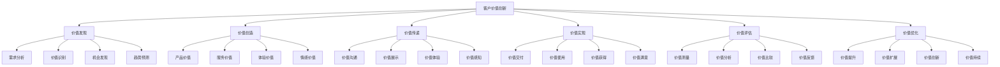
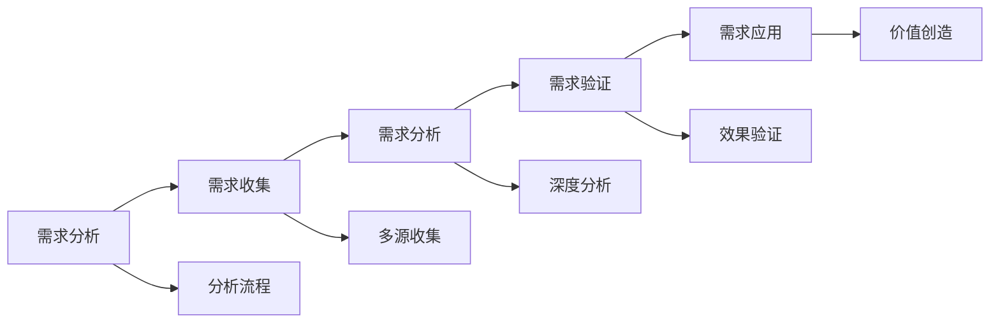
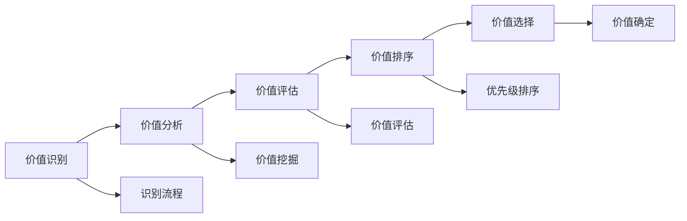
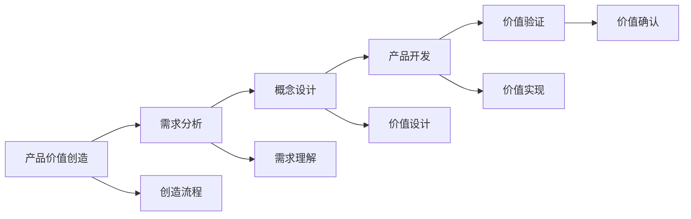
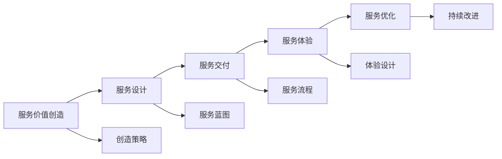
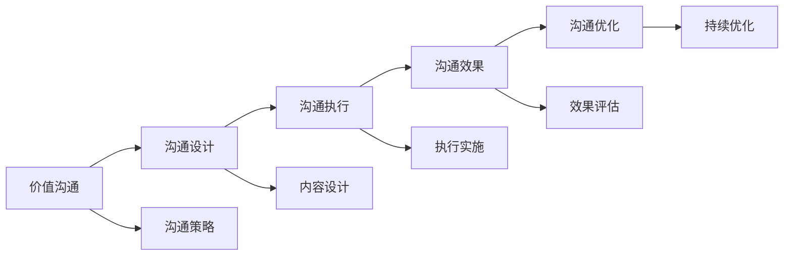
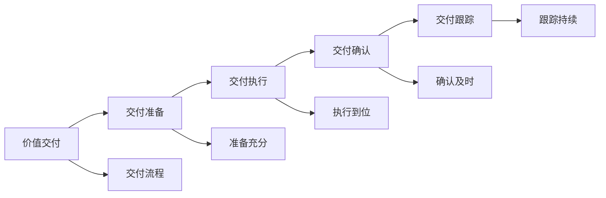

# 客户价值创新

## 新西兰手机维修与二手机销售客户价值创新体系

### 客户价值创新架构

### 价值发现

#### 1. 需求分析

**需求分析维度**：

| 分析维度 | 分析内容 | 分析优势 | 分析效果 |
|----------|----------|----------|----------|
| **显性需求** | 明确表达的需求 | 需求明确，易于满足 | 需求满足，客户满意 |
| **隐性需求** | 未明确表达的需求 | 需求挖掘，价值发现 | 价值发现，竞争优势 |
| **潜在需求** | 未来可能的需求 | 需求预测，市场机会 | 市场机会，业务拓展 |
| **变化需求** | 需求变化趋势 | 需求跟踪，适应变化 | 适应变化，持续满足 |

**需求分析方法**：

**分析要点**：
- **多维度分析**：从多个维度分析客户需求
- **深度挖掘**：深入挖掘客户真实需求
- **趋势预测**：预测需求变化趋势
- **价值导向**：以价值创造为导向

#### 2. 价值识别

**价值识别类型**：

| 价值类型 | 价值内容 | 价值特点 | 价值效果 |
|----------|----------|----------|----------|
| **功能价值** | 产品功能，服务功能 | 实用性强，直接满足 | 功能满足，实用价值 |
| **情感价值** | 情感满足，心理满足 | 情感连接，心理满足 | 情感认同，品牌忠诚 |
| **社会价值** | 社会认同，身份象征 | 社会地位，身份认同 | 社会认同，身份价值 |
| **经济价值** | 成本节约，收益增加 | 经济效益，成本控制 | 经济效益，价值提升 |

**价值识别方法**：

#### 3. 机会发现

**机会类型**：

| 机会类型 | 机会内容 | 机会特点 | 机会效果 |
|----------|----------|----------|----------|
| **市场机会** | 市场空白，市场增长 | 市场空间，增长潜力 | 市场拓展，业务增长 |
| **技术机会** | 技术突破，技术应用 | 技术优势，创新驱动 | 技术领先，产品优势 |
| **服务机会** | 服务创新，服务升级 | 服务优势，客户满意 | 服务提升，客户忠诚 |
| **合作机会** | 合作共赢，资源整合 | 资源共享，优势互补 | 合作价值，协同效应 |

### 价值创造

#### 1. 产品价值创造

**价值创造要素**：

| 创造要素 | 要素内容 | 创造方法 | 创造效果 |
|----------|----------|----------|----------|
| **功能创新** | 新功能，功能升级 | 技术创新，需求满足 | 功能优势，产品竞争力 |
| **质量提升** | 质量改进，可靠性提升 | 质量控制，工艺改进 | 质量保证，客户信任 |
| **设计优化** | 外观设计，用户体验 | 设计创新，体验优化 | 设计优势，用户体验 |
| **成本优化** | 成本控制，价格优化 | 成本管理，效率提升 | 价格优势，性价比高 |

**产品价值创造流程**：

#### 2. 服务价值创造

**服务价值类型**：

| 价值类型 | 价值内容 | 创造方法 | 创造效果 |
|----------|----------|----------|----------|
| **专业价值** | 专业服务，专业建议 | 专业能力，知识服务 | 专业形象，客户信任 |
| **便利价值** | 便利服务，便捷体验 | 服务创新，流程优化 | 使用便利，客户满意 |
| **个性价值** | 个性化服务，定制服务 | 服务定制，需求满足 | 个性满足，客户忠诚 |
| **情感价值** | 情感服务，心理满足 | 情感连接，心理关怀 | 情感认同，品牌忠诚 |

**服务价值创造策略**：

#### 3. 体验价值创造

**体验价值要素**：

| 体验要素 | 要素内容 | 创造方法 | 创造效果 |
|----------|----------|----------|----------|
| **感官体验** | 视觉，听觉，触觉 | 感官设计，环境营造 | 感官刺激，品牌记忆 |
| **情感体验** | 情感共鸣，心理满足 | 情感设计，心理关怀 | 情感认同，品牌忠诚 |
| **认知体验** | 知识获取，思维启发 | 知识服务，教育价值 | 学习价值，认知提升 |
| **行为体验** | 互动参与，行为改变 | 互动设计，参与体验 | 参与感强，行为改变 |

### 价值传递

#### 1. 价值沟通

**沟通方式**：

| 沟通方式 | 沟通内容 | 沟通优势 | 沟通效果 |
|----------|----------|----------|----------|
| **价值主张** | 价值说明，价值强调 | 价值明确，理解清晰 | 价值认知，购买决策 |
| **价值故事** | 价值故事，情感连接 | 故事性强，记忆深刻 | 品牌记忆，情感连接 |
| **价值证明** | 价值证据，效果展示 | 证据有力，说服力强 | 价值确认，信任建立 |
| **价值对比** | 价值对比，优势突出 | 对比明显，优势突出 | 优势认知，选择倾向 |

**价值沟通策略**：

#### 2. 价值展示

**展示方式**：

| 展示方式 | 展示内容 | 展示优势 | 展示效果 |
|----------|----------|----------|----------|
| **实物展示** | 产品展示，功能演示 | 直观真实，体验直接 | 产品认知，功能理解 |
| **数字展示** | 数据展示，效果展示 | 数据有力，效果明显 | 效果认知，价值确认 |
| **案例展示** | 成功案例，客户见证 | 案例真实，说服力强 | 信任建立，购买决策 |
| **体验展示** | 体验设计，互动体验 | 体验真实，参与感强 | 体验价值，品牌记忆 |

#### 3. 价值体验

**体验设计**：

| 体验类型 | 体验内容 | 设计方法 | 体验效果 |
|----------|----------|----------|----------|
| **试用体验** | 产品试用，服务体验 | 试用设计，体验优化 | 产品认知，使用体验 |
| **场景体验** | 场景设计，情境体验 | 场景营造，情境设计 | 情境体验，价值感知 |
| **互动体验** | 互动设计，参与体验 | 互动设计，参与感强 | 参与体验，品牌记忆 |
| **个性化体验** | 个性定制，专属体验 | 个性设计，专属服务 | 个性满足，客户忠诚 |

### 价值实现

#### 1. 价值交付

**交付方式**：

| 交付方式 | 交付内容 | 交付优势 | 交付效果 |
|----------|----------|----------|----------|
| **即时交付** | 即时服务，快速响应 | 响应快速，满足及时 | 客户满意，服务体验 |
| **定制交付** | 定制服务，个性化交付 | 个性满足，专属服务 | 个性满足，客户忠诚 |
| **全程交付** | 全程服务，一站式交付 | 服务完整，体验一致 | 服务完整，客户满意 |
| **持续交付** | 持续服务，长期交付 | 服务持续，关系维护 | 关系维护，长期合作 |

**价值交付流程**：

#### 2. 价值使用

**使用支持**：

| 支持类型 | 支持内容 | 支持方法 | 支持效果 |
|----------|----------|----------|----------|
| **使用指导** | 使用说明，操作指导 | 指导详细，操作简单 | 使用顺畅，功能掌握 |
| **技术支持** | 技术咨询，问题解决 | 技术支持，问题解决 | 问题解决，使用顺畅 |
| **培训支持** | 使用培训，技能培训 | 培训专业，技能提升 | 技能提升，使用熟练 |
| **维护支持** | 维护服务，保养指导 | 维护及时，使用稳定 | 使用稳定，价值持续 |

#### 3. 价值获得

**获得方式**：

| 获得方式 | 获得内容 | 获得优势 | 获得效果 |
|----------|----------|----------|----------|
| **直接获得** | 直接使用，即时获得 | 获得直接，效果明显 | 价值获得，客户满意 |
| **逐步获得** | 逐步使用，渐进获得 | 获得渐进，适应性强 | 适应性强，价值持续 |
| **持续获得** | 持续使用，长期获得 | 获得持续，价值长期 | 价值长期，客户忠诚 |
| **增值获得** | 增值服务，额外获得 | 获得增值，价值提升 | 价值提升，客户满意 |

### 价值评估

#### 1. 价值测量

**测量维度**：

| 测量维度 | 测量内容 | 测量方法 | 测量效果 |
|----------|----------|----------|----------|
| **功能价值** | 功能满足度，功能效果 | 功能测试，效果评估 | 功能价值，产品竞争力 |
| **情感价值** | 情感满足度，心理满足 | 情感调研，心理评估 | 情感价值，品牌忠诚 |
| **经济价值** | 成本节约，收益增加 | 经济分析，效益评估 | 经济价值，性价比 |
| **社会价值** | 社会认同，身份价值 | 社会调研，认同评估 | 社会价值，身份认同 |

**价值测量方法**：

#### 2. 价值分析

**分析类型**：

| 分析类型 | 分析内容 | 分析方法 | 分析效果 |
|----------|----------|----------|----------|
| **价值构成** | 价值组成，价值结构 | 构成分析，结构分析 | 价值理解，优化方向 |
| **价值比较** | 价值对比，竞争优势 | 对比分析，优势分析 | 优势认知，竞争策略 |
| **价值趋势** | 价值变化，价值趋势 | 趋势分析，变化分析 | 趋势把握，策略调整 |
| **价值影响** | 价值影响，价值效应 | 影响分析，效应分析 | 影响理解，效果评估 |

#### 3. 价值反馈

**反馈机制**：

| 反馈类型 | 反馈内容 | 反馈方法 | 反馈效果 |
|----------|----------|----------|----------|
| **客户反馈** | 客户意见，客户建议 | 反馈收集，意见分析 | 客户声音，改进方向 |
| **市场反馈** | 市场反应，市场表现 | 市场监测，表现分析 | 市场认知，策略调整 |
| **内部反馈** | 内部意见，内部建议 | 内部调研，意见收集 | 内部声音，管理改进 |
| **数据反馈** | 数据表现，数据趋势 | 数据分析，趋势分析 | 数据洞察，决策支持 |

### 价值优化

#### 1. 价值提升

**提升策略**：

| 提升策略 | 策略内容 | 实施方法 | 提升效果 |
|----------|----------|----------|----------|
| **功能提升** | 功能增强，功能优化 | 功能改进，技术升级 | 功能优势，产品竞争力 |
| **质量提升** | 质量改进，可靠性提升 | 质量控制，工艺改进 | 质量保证，客户信任 |
| **服务提升** | 服务改进，服务升级 | 服务优化，流程改进 | 服务优势，客户满意 |
| **体验提升** | 体验优化，体验升级 | 体验设计，体验改进 | 体验优势，品牌记忆 |

**价值提升流程**：

#### 2. 价值扩展

**扩展方向**：

| 扩展方向 | 扩展内容 | 扩展方法 | 扩展效果 |
|----------|----------|----------|----------|
| **功能扩展** | 功能增加，功能丰富 | 功能开发，技术应用 | 功能丰富，产品价值 |
| **服务扩展** | 服务增加，服务丰富 | 服务开发，服务创新 | 服务丰富，客户价值 |
| **市场扩展** | 市场扩大，客户增加 | 市场拓展，客户开发 | 市场扩大，业务增长 |
| **应用扩展** | 应用增加，用途扩展 | 应用开发，用途创新 | 应用广泛，价值提升 |

#### 3. 价值创新

**创新类型**：

| 创新类型 | 创新内容 | 创新方法 | 创新效果 |
|----------|----------|----------|----------|
| **价值模式创新** | 价值创造模式，价值传递模式 | 模式创新，流程创新 | 模式优势，竞争优势 |
| **价值内容创新** | 价值内容，价值内涵 | 内容创新，内涵创新 | 内容优势，价值提升 |
| **价值方式创新** | 价值实现方式，价值获得方式 | 方式创新，方法创新 | 方式优势，效率提升 |
| **价值体验创新** | 价值体验，价值感知 | 体验创新，感知创新 | 体验优势，品牌记忆 |

## 客户价值创新实施

### 创新策略制定

#### 1. 价值创新规划
- **价值分析**：深入分析客户价值需求
- **创新方向**：确定价值创新方向
- **创新策略**：制定价值创新策略
- **实施计划**：制定价值创新实施计划

#### 2. 创新资源配置
- **人力资源**：配置价值创新人力资源
- **技术资源**：配置价值创新技术资源
- **资金资源**：配置价值创新资金资源
- **时间资源**：配置价值创新时间资源

### 创新实施管理

#### 1. 项目管理
- **项目规划**：制定详细的项目计划
- **进度控制**：控制项目进度和质量
- **资源管理**：管理项目资源和成本
- **风险管理**：识别和控制项目风险

#### 2. 效果评估
- **价值评估**：评估价值创新效果
- **客户反馈**：收集客户反馈意见
- **市场表现**：监测市场表现
- **持续改进**：持续改进价值创新

## 对从业者的建议

### 价值创新建议
1. **客户导向**：以客户价值为导向
2. **创新驱动**：以创新驱动价值创造
3. **持续优化**：持续优化客户价值
4. **效果评估**：评估价值创新效果

### 能力提升建议
1. **价值分析能力**：提升价值分析能力
2. **创新设计能力**：提升创新设计能力
3. **实施执行能力**：提升实施执行能力
4. **效果评估能力**：提升效果评估能力

### 管理建议
1. **价值管理**：建立价值管理体系
2. **创新管理**：建立创新管理机制
3. **客户管理**：建立客户价值管理
4. **持续改进**：建立持续改进机制

---
**相关链接**：
- [[03-高级应用层/01-业务创新/01-服务模式创新|服务模式创新]]
- [[03-高级应用层/01-业务创新/02-技术应用创新|技术应用创新]]
- [[04-工具模板/05-创新工具/05-客户价值创新评估表|客户价值创新评估表]]

*最后更新：2024年*
*适用市场：新西兰*

