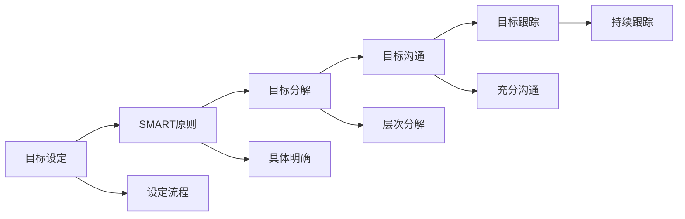
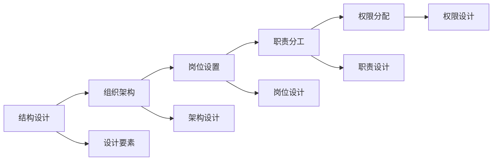
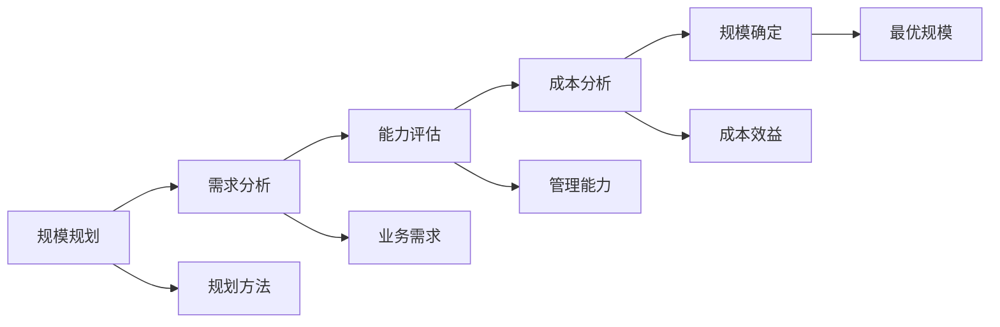
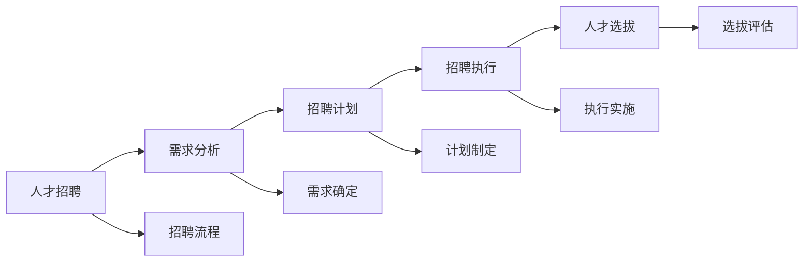
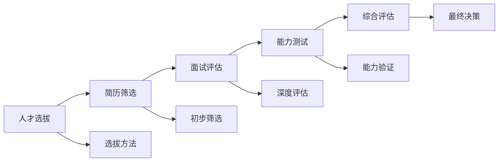
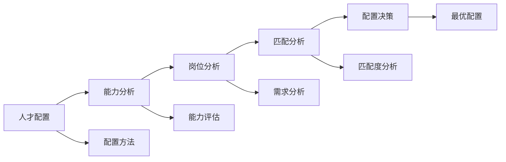

# 团队建设管理

## 新西兰手机维修与二手机销售团队建设管理体系

### 团队建设管理架构

```mermaid
graph TD
    A[团队建设管理] --> B[团队规划]
    A --> C[团队组建]
    A --> D[团队发展]
    A --> E[团队激励]
    A --> F[团队绩效]
    A --> G[团队文化]
    A --> H[团队沟通]
    A --> I[团队协作]
    
    B --> B1[团队目标]
    B --> B2[团队结构]
    B --> B3[团队规模]
    B --> B4[团队角色]
    
    C --> C1[人才招聘]
    C --> C2[人才选拔]
    C --> C3[人才配置]
    C --> C4[人才培训]
    
    D --> D1[能力发展]
    D --> D2[职业发展]
    D --> D3[技能提升]
    D --> D4[经验积累]
    
    E --> E1[激励机制]
    E --> E2[奖励体系]
    E --> E3[晋升通道]
    E --> E4[认可体系]
    
    F --> F1[绩效目标]
    F --> F2[绩效评估]
    F --> F3[绩效改进]
    F --> F4[绩效应用]
    
    G --> G1[价值观]
    G --> G2[行为规范]
    G --> G3[团队精神]
    G --> G4[文化传承]
    
    H --> H1[沟通机制]
    H --> H2[沟通渠道]
    H --> H3[沟通技巧]
    H --> H4[沟通效果]
    
    I --> I1[协作机制]
    I --> I2[协作工具]
    I --> I3[协作流程]
    I --> I4[协作效果]
```



### 团队规划

#### 1. 团队目标设定

**目标类型**：

| 目标类型 | 目标内容 | 目标特点 | 目标效果 |
|----------|----------|----------|----------|
| **业务目标** | 销售目标，服务目标 | 目标明确，可量化 | 业务发展，业绩提升 |
| **团队目标** | 团队建设，团队发展 | 目标清晰，可达成 | 团队发展，能力提升 |
| **个人目标** | 个人发展，个人成长 | 目标具体，可衡量 | 个人成长，能力提升 |
| **文化目标** | 文化建设，文化传承 | 目标长远，可持续 | 文化传承，价值观统一 |

**目标设定原则**：



**设定要点**：
- **具体明确**：目标具体，标准明确
- **可衡量**：目标可量化，可评估
- **可达成**：目标现实，可实现
- **相关性**：目标相关，相互支撑
- **时限性**：目标有时限，有期限

#### 2. 团队结构设计

**结构类型**：

| 结构类型 | 结构特点 | 结构优势 | 适用场景 |
|----------|----------|----------|----------|
| **职能型结构** | 按职能分工，专业性强 | 专业分工，效率高 | 专业服务，技术导向 |
| **项目型结构** | 按项目组织，灵活性强 | 项目导向，响应快 | 项目服务，客户导向 |
| **矩阵型结构** | 职能+项目，双重管理 | 资源整合，协同效应 | 复杂项目，资源整合 |
| **扁平化结构** | 层级少，沟通直接 | 沟通顺畅，决策快 | 快速响应，创新导向 |

**结构设计要素**：



#### 3. 团队规模规划

**规模考虑因素**：

| 考虑因素 | 因素内容 | 影响程度 | 规划要点 |
|----------|----------|----------|----------|
| **业务规模** | 业务量，服务需求 | 直接影响 | 业务匹配，需求满足 |
| **管理能力** | 管理幅度，管理效率 | 重要影响 | 管理有效，效率提升 |
| **成本控制** | 人力成本，运营成本 | 重要影响 | 成本合理，效益最优 |
| **发展需要** | 业务发展，团队发展 | 长期影响 | 发展匹配，能力储备 |

**规模规划方法**：



### 团队组建

#### 1. 人才招聘

**招聘策略**：

| 策略类型 | 策略内容 | 策略优势 | 策略效果 |
|----------|----------|----------|----------|
| **内部招聘** | 内部选拔，内部晋升 | 成本低，适应性强 | 员工激励，忠诚度提升 |
| **外部招聘** | 外部招聘，人才引进 | 新鲜血液，技能补充 | 技能补充，创新能力 |
| **校园招聘** | 应届毕业生，人才培养 | 成本低，可塑性强 | 人才培养，长期发展 |
| **猎头招聘** | 高端人才，专业人才 | 专业性强，效率高 | 高端人才，专业能力 |

**招聘流程**：



**招聘要点**：
- **需求明确**：明确人才需求，标准清晰
- **渠道多样**：多渠道招聘，覆盖面广
- **流程规范**：招聘流程规范，标准统一
- **评估科学**：评估方法科学，结果准确

#### 2. 人才选拔

**选拔标准**：

| 标准类型 | 标准内容 | 标准要求 | 评估方法 |
|----------|----------|----------|----------|
| **能力标准** | 专业技能，通用能力 | 能力匹配，岗位胜任 | 能力测试，技能评估 |
| **素质标准** | 个人素质，职业素养 | 素质良好，品德优秀 | 素质评估，行为观察 |
| **经验标准** | 工作经验，项目经验 | 经验丰富，实践能力强 | 经验评估，案例分析 |
| **潜力标准** | 学习能力，发展潜力 | 潜力大，可塑性强 | 潜力评估，发展预测 |

**选拔方法**：



#### 3. 人才配置

**配置原则**：

| 配置原则 | 原则内容 | 原则优势 | 配置效果 |
|----------|----------|----------|----------|
| **人岗匹配** | 能力与岗位匹配 | 效率高，满意度高 | 工作效率，员工满意 |
| **团队互补** | 能力互补，性格互补 | 团队和谐，协作顺畅 | 团队协作，整体效能 |
| **发展导向** | 个人发展，职业发展 | 员工成长，能力提升 | 员工发展，能力提升 |
| **动态调整** | 动态配置，灵活调整 | 适应性强，效率高 | 适应变化，效率提升 |

**配置方法**：



### 团队发展

#### 1. 能力发展

**发展维度**：

| 发展维度 | 发展内容 | 发展方法 | 发展效果 |
|----------|----------|----------|----------|
| **专业技能** | 技术技能，业务技能 | 专业培训，实践锻炼 | 技能提升，专业能力 |
| **管理技能** | 管理能力，领导能力 | 管理培训，管理实践 | 管理能力，领导能力 |
| **沟通技能** | 沟通能力，表达能力 | 沟通培训，沟通实践 | 沟通能力，协作能力 |
| **创新技能** | 创新能力，学习能力 | 创新培训，学习实践 | 创新能力，学习能力 |

**发展策略**：


#### 2. 职业发展

**发展路径**：

| 发展路径 | 路径内容 | 路径特点 | 发展效果 |
|----------|----------|----------|----------|
| **技术路径** | 技术专家，技术主管 | 专业深度，技术权威 | 技术专家，专业权威 |
| **管理路径** | 管理岗位，领导岗位 | 管理广度，领导能力 | 管理能力，领导能力 |
| **业务路径** | 业务专家，业务主管 | 业务深度，市场能力 | 业务能力，市场能力 |
| **综合路径** | 综合发展，全面发展 | 能力全面，适应性强 | 综合能力，适应性强 |

**职业发展规划**：

```mermaid
graph LR
    A[职业发展] --> B[现状分析]
    B --> C[目标设定]
    C --> D[路径规划]
    D --> E[实施支持]
    
    A --> A1[发展规划]
    B --> B1[能力现状]
    C --> C1[发展目标]
    D --> D1[发展路径]
    E --> E1[支持措施"]
```

#### 3. 技能提升

**提升方法**：

| 提升方法 | 方法内容 | 方法优势 | 提升效果 |
|----------|----------|----------|----------|
| **在职培训** | 岗位培训，实践培训 | 针对性强，实用性强 | 技能提升，工作能力 |
| **外部培训** | 专业培训，认证培训 | 专业性强，权威性强 | 专业能力，权威认证 |
| **自主学习** | 自我学习，自我提升 | 主动性强，成本低 | 学习能力，自我提升 |
| **导师指导** | 导师制，师傅带徒 | 针对性强，效果显著 | 技能传承，经验积累 |

### 团队激励

#### 1. 激励机制

**激励类型**：

| 激励类型 | 激励内容 | 激励特点 | 激励效果 |
|----------|----------|----------|----------|
| **物质激励** | 薪酬激励，奖金激励 | 直接有效，激励明显 | 工作积极性，业绩提升 |
| **精神激励** | 认可激励，荣誉激励 | 心理满足，价值认同 | 心理满足，价值认同 |
| **发展激励** | 晋升激励，培训激励 | 长期激励，发展导向 | 职业发展，能力提升 |
| **环境激励** | 工作环境，团队氛围 | 环境舒适，氛围和谐 | 工作满意度，团队和谐 |

**激励机制设计**：

```mermaid
graph LR
    A[激励机制] --> B[需求分析]
    B --> C[激励设计]
    C --> D[激励实施]
    D --> E[效果评估]
    
    A --> A1[机制设计]
    B --> B1[需求识别]
    C --> C1[方案设计"]
    D --> D1[执行实施"]
    E --> E1[效果评估"]
```

#### 2. 奖励体系

**奖励类型**：

| 奖励类型 | 奖励内容 | 奖励标准 | 奖励效果 |
|----------|----------|----------|----------|
| **绩效奖励** | 业绩奖励，目标奖励 | 业绩导向，目标达成 | 业绩提升，目标达成 |
| **创新奖励** | 创新奖励，改进奖励 | 创新导向，持续改进 | 创新能力，持续改进 |
| **团队奖励** | 团队奖励，协作奖励 | 团队导向，协作精神 | 团队协作，整体效能 |
| **长期奖励** | 长期激励，股权激励 | 长期导向，利益共享 | 长期发展，利益共享 |

#### 3. 晋升通道

**晋升标准**：

| 晋升标准 | 标准内容 | 标准要求 | 评估方法 |
|----------|----------|----------|----------|
| **能力标准** | 专业能力，管理能力 | 能力达标，岗位胜任 | 能力评估，绩效评估 |
| **业绩标准** | 工作业绩，目标达成 | 业绩优秀，目标达成 | 业绩评估，目标评估 |
| **素质标准** | 个人素质，职业素养 | 素质良好，品德优秀 | 素质评估，行为评估 |
| **潜力标准** | 发展潜力，学习能力 | 潜力大，可塑性强 | 潜力评估，发展预测 |

### 团队绩效

#### 1. 绩效目标

**目标类型**：

| 目标类型 | 目标内容 | 目标特点 | 目标效果 |
|----------|----------|----------|----------|
| **业务目标** | 销售目标，服务目标 | 业务导向，业绩导向 | 业务发展，业绩提升 |
| **质量目标** | 质量目标，客户满意 | 质量导向，客户导向 | 质量提升，客户满意 |
| **效率目标** | 效率目标，成本控制 | 效率导向，成本导向 | 效率提升，成本控制 |
| **发展目标** | 能力发展，团队发展 | 发展导向，长期导向 | 能力提升，团队发展 |

**目标设定方法**：

```mermaid
graph LR
    A[绩效目标] --> B[目标分解]
    B --> C[目标沟通]
    C --> D[目标确认]
    D --> E[目标跟踪]
    
    A --> A1[设定方法"]
    B --> B1[层次分解"]
    C --> C1[充分沟通"]
    D --> D1[目标确认"]
    E --> E1[持续跟踪"]
```

#### 2. 绩效评估

**评估维度**：

| 评估维度 | 评估内容 | 评估方法 | 评估效果 |
|----------|----------|----------|----------|
| **业绩评估** | 工作业绩，目标达成 | 量化评估，目标对比 | 业绩明确，目标导向 |
| **能力评估** | 专业能力，综合能力 | 能力测试，行为观察 | 能力提升，发展导向 |
| **态度评估** | 工作态度，团队精神 | 行为观察，同事评价 | 态度端正，团队和谐 |
| **潜力评估** | 发展潜力，学习能力 | 潜力测试，发展预测 | 潜力挖掘，发展导向 |

**评估流程**：

```mermaid
graph LR
    A[绩效评估] --> B[评估准备]
    B --> C[评估执行"]
    C --> D[评估结果"]
    D --> E[结果应用"]
    
    A --> A1[评估流程"]
    B --> B1[准备充分"]
    C --> C1[执行规范"]
    D --> D1[结果准确"]
    E --> E1[应用有效"]
```

### 团队文化

#### 1. 价值观建设

**价值观内容**：

| 价值观 | 价值内容 | 价值体现 | 建设方法 |
|--------|----------|----------|----------|
| **客户至上** | 客户导向，服务意识 | 客户满意，服务优质 | 文化宣导，行为示范 |
| **团队协作** | 协作精神，团队意识 | 团队和谐，协作顺畅 | 团队活动，协作实践 |
| **持续改进** | 改进意识，创新精神 | 持续优化，创新发展 | 改进实践，创新激励 |
| **诚信负责** | 诚信品质，责任意识 | 诚信经营，责任担当 | 诚信教育，责任培养 |

**价值观建设方法**：

```mermaid
graph LR
    A[价值观建设] --> B[价值观定义"]
    B --> C[价值观传播"]
    C --> D[价值观实践"]
    D --> E[价值观强化"]
    
    A --> A1[建设方法"]
    B --> B1[明确定义"]
    C --> C1[广泛传播"]
    D --> D1[实践体现"]
    E --> E1[持续强化"]
```

#### 2. 行为规范

**规范内容**：

| 规范类型 | 规范内容 | 规范要求 | 规范效果 |
|----------|----------|----------|----------|
| **工作规范** | 工作标准，工作流程 | 标准统一，流程规范 | 工作效率，质量保证 |
| **服务规范** | 服务标准，服务流程 | 服务统一，客户满意 | 服务质量，客户满意 |
| **沟通规范** | 沟通方式，沟通礼仪 | 沟通顺畅，关系和谐 | 沟通效果，关系和谐 |
| **行为规范** | 行为准则，道德标准 | 行为端正，品德优秀 | 团队形象，文化传承 |

### 团队沟通

#### 1. 沟通机制

**机制类型**：

| 机制类型 | 机制内容 | 机制特点 | 机制效果 |
|----------|----------|----------|----------|
| **正式沟通** | 会议沟通，报告沟通 | 正式规范，信息准确 | 信息传递，决策支持 |
| **非正式沟通** | 日常沟通，私下沟通 | 灵活自然，关系建立 | 关系建立，氛围和谐 |
| **上行沟通** | 向上汇报，意见反馈 | 信息上传，决策支持 | 信息上传，决策支持 |
| **下行沟通** | 向下传达，工作指导 | 信息下达，工作指导 | 信息下达，工作指导 |

**沟通机制设计**：

```mermaid
graph LR
    A[沟通机制] --> B[沟通渠道"]
    B --> C[沟通频率"]
    C --> D[沟通内容"]
    D --> E[沟通效果"]
    
    A --> A1[机制设计"]
    B --> B1[渠道建设"]
    C --> C1[频率设定"]
    D --> D1[内容规划"]
    E --> E1[效果评估"]
```

#### 2. 沟通技巧

**技巧类型**：

| 技巧类型 | 技巧内容 | 技巧要点 | 技巧效果 |
|----------|----------|----------|----------|
| **倾听技巧** | 主动倾听，理解倾听 | 专注倾听，理解准确 | 理解准确，关系建立 |
| **表达技巧** | 清晰表达，有效表达 | 表达清晰，逻辑清楚 | 信息传递，理解准确 |
| **反馈技巧** | 及时反馈，建设性反馈 | 反馈及时，建设性强 | 沟通效果，关系改善 |
| **冲突处理** | 冲突化解，矛盾处理 | 处理及时，方法得当 | 冲突化解，关系和谐 |

### 团队协作

#### 1. 协作机制

**机制类型**：

| 机制类型 | 机制内容 | 机制特点 | 机制效果 |
|----------|----------|----------|----------|
| **任务协作** | 任务分工，任务配合 | 分工明确，配合默契 | 任务完成，效率提升 |
| **信息协作** | 信息共享，信息交流 | 信息畅通，决策支持 | 信息共享，决策支持 |
| **资源协作** | 资源共享，资源整合 | 资源优化，效率提升 | 资源优化，效率提升 |
| **知识协作** | 知识共享，经验交流 | 知识传播，能力提升 | 知识共享，能力提升 |

**协作机制设计**：

```mermaid
graph LR
    A[协作机制] --> B[协作流程"]
    B --> C[协作工具"]
    C --> D[协作标准"]
    D --> E[协作效果"]
    
    A --> A1[机制设计"]
    B --> B1[流程设计"]
    C --> C1[工具配置"]
    D --> D1[标准制定"]
    E --> E1[效果评估"]
```

#### 2. 协作工具

**工具类型**：

| 工具类型 | 工具内容 | 工具特点 | 工具效果 |
|----------|----------|----------|----------|
| **沟通工具** | 即时通讯，视频会议 | 沟通便利，效率高 | 沟通效率，协作顺畅 |
| **协作平台** | 项目管理，任务管理 | 协作统一，管理规范 | 协作效率，管理规范 |
| **知识管理** | 知识库，经验库 | 知识共享，经验传承 | 知识共享，能力提升 |
| **绩效管理** | 绩效系统，评估系统 | 绩效透明，激励有效 | 绩效管理，激励有效 |

## 团队建设管理实施

### 管理策略制定

#### 1. 团队管理规划
- **现状分析**：分析团队现状和问题
- **目标设定**：设定团队管理目标
- **策略制定**：制定团队管理策略
- **实施计划**：制定团队管理实施计划

#### 2. 管理体系建设
- **制度体系**：建立团队管理制度体系
- **流程体系**：建立团队管理流程体系
- **工具体系**：建立团队管理工具体系
- **评估体系**：建立团队管理评估体系

### 管理实施执行

#### 1. 日常管理
- **团队会议**：定期召开团队会议
- **工作指导**：提供工作指导和支持
- **问题解决**：及时解决团队问题
- **关系维护**：维护团队关系和氛围

#### 2. 持续改进
- **效果评估**：评估团队管理效果
- **问题识别**：识别团队管理问题
- **改进措施**：制定改进措施
- **持续优化**：持续优化团队管理

## 对从业者的建议

### 团队管理建议
1. **以人为本**：以员工为中心，关注员工发展
2. **目标导向**：以目标为导向，明确发展方向
3. **沟通协作**：加强沟通协作，提升团队效能
4. **持续改进**：持续改进管理，提升管理水平

### 能力提升建议
1. **管理能力**：提升团队管理能力
2. **沟通能力**：提升沟通协调能力
3. **领导能力**：提升领导影响力
4. **学习能力**：持续学习管理知识

### 管理实践建议
1. **实践应用**：将管理理论应用于实践
2. **经验总结**：总结管理经验和教训
3. **方法创新**：创新管理方法和工具
4. **效果评估**：评估管理效果和改进

---
**相关链接**：
- [[03-高级应用层/02-团队管理/02-领导力发展|领导力发展]]
- [[03-高级应用层/02-团队管理/03-绩效管理体系|绩效管理体系]]
- [[04-工具模板/06-团队管理/01-团队建设计划模板|团队建设计划模板]]

*最后更新：2024年*
*适用市场：新西兰*

