# 销售技巧训练表

## 新西兰手机维修与二手机销售技巧训练表体系

### 训练表架构

```mermaid
graph TD
    A[销售技巧训练表] --> B[基础技能训练]
    A --> C[沟通技能训练]
    A --> D[谈判技能训练]
    A --> E[成交技能训练]
    A --> F[服务技能训练]
    A --> G[心理技能训练]
    
    B --> B1[产品知识训练]
    B --> B2[客户分析训练]
    B --> B3[需求识别训练]
    B --> B4[价值创造训练]
    
    C --> C1[倾听技巧训练]
    C --> C2[表达技巧训练]
    C --> C3[提问技巧训练]
    C --> C4[反馈技巧训练]
    
    D --> D1[价格谈判训练]
    D --> D2[条件谈判训练]
    D --> D3[时间谈判训练]
    D --> D4[关系谈判训练]
    
    E --> E1[时机把握训练]
    E --> E2[异议处理训练]
    E --> E3[成交引导训练]
    E --> E4[后续跟进训练]
    
    F --> F1[服务意识训练]
    F --> F2[服务技能训练]
    F --> F3[服务创新训练]
    F --> F4[服务优化训练]
    
    G --> G1[客户心理训练]
    G --> G2[销售心理训练]
    G --> G3[情绪管理训练]
    G --> G4[压力管理训练]
```



### 基础技能训练

#### 1. 产品知识训练表

**训练内容**：

| 训练项目 | 训练内容 | 训练目标 | 评估标准 | 训练时间 |
|----------|----------|----------|----------|----------|
| **产品功能** | 产品功能，技术特点 | 功能掌握，技术理解 | 功能测试，技术问答 | 2周 |
| **产品优势** | 产品优势，竞争优势 | 优势认知，竞争分析 | 优势分析，对比测试 | 1周 |
| **产品价格** | 价格体系，价格策略 | 价格掌握，策略理解 | 价格测试，策略分析 | 1周 |
| **产品应用** | 应用场景，使用技巧 | 应用掌握，技巧熟练 | 应用测试，技巧演示 | 2周 |

**训练方法**：

```mermaid
graph LR
    A[产品知识训练] --> B[理论学习]
    B --> C[实践应用]
    C --> D[测试评估"]
    D --> E[改进提升"]
    
    A --> A1[训练方法"]
    B --> B1[知识学习"]
    C --> C1[实际应用"]
    D --> D1[效果测试"]
    E --> E1[持续改进"]
```

**训练计划**：

| 训练阶段 | 训练内容 | 训练方法 | 训练时间 | 训练目标 |
|----------|----------|----------|----------|----------|
| **第一阶段** | 产品基础知识 | 理论学习，产品体验 | 1周 | 基础知识掌握 |
| **第二阶段** | 产品功能应用 | 功能演示，实际应用 | 1周 | 功能应用熟练 |
| **第三阶段** | 产品优势分析 | 优势分析，对比测试 | 1周 | 优势分析能力 |
| **第四阶段** | 产品综合应用 | 综合测试，实际销售 | 1周 | 综合应用能力 |

#### 2. 客户分析训练表

**训练内容**：

| 训练项目 | 训练内容 | 训练目标 | 评估标准 | 训练时间 |
|----------|----------|----------|----------|----------|
| **客户识别** | 客户类型，客户特征 | 识别准确，特征掌握 | 识别测试，特征分析 | 1周 |
| **需求分析** | 需求识别，需求分析 | 需求理解，分析准确 | 需求测试，分析评估 | 2周 |
| **行为分析** | 行为模式，购买行为 | 行为理解，模式掌握 | 行为测试，模式分析 | 1周 |
| **价值分析** | 价值认知，价值需求 | 价值理解，需求掌握 | 价值测试，需求分析 | 1周 |

**训练方法**：

```mermaid
graph LR
    A[客户分析训练] --> B[案例分析"]
    B --> C[模拟练习"]
    C --> D[实际应用"]
    D --> E[效果评估"]
    
    A --> A1[训练方法"]
    B --> B1[案例学习"]
    C --> C1[模拟训练"]
    D --> D1[实际应用"]
    E --> E1[效果评估"]
```

### 沟通技能训练

#### 1. 倾听技巧训练表

**训练内容**：

| 训练项目 | 训练内容 | 训练目标 | 评估标准 | 训练时间 |
|----------|----------|----------|----------|----------|
| **专注倾听** | 专注力，注意力集中 | 专注能力，注意力提升 | 专注测试，注意力评估 | 1周 |
| **理解倾听** | 理解能力，信息把握 | 理解准确，信息完整 | 理解测试，信息评估 | 2周 |
| **反馈倾听** | 反馈技巧，确认理解 | 反馈及时，理解确认 | 反馈测试，确认评估 | 1周 |
| **共情倾听** | 情感理解，同理心 | 情感共鸣，同理心强 | 情感测试，同理心评估 | 1周 |

**训练方法**：

```mermaid
graph LR
    A[倾听技巧训练] --> B[理论讲解"]
    B --> C[技巧演示"]
    C --> D[实践练习"]
    D --> E[效果评估"]
    
    A --> A1[训练方法"]
    B --> B1[理论掌握"]
    C --> C1[技巧学习"]
    D --> D1[实践应用"]
    E --> E1[效果评估"]
```

**训练计划**：

| 训练阶段 | 训练内容 | 训练方法 | 训练时间 | 训练目标 |
|----------|----------|----------|----------|----------|
| **第一阶段** | 倾听理论 | 理论讲解，案例分析 | 3天 | 理论掌握 |
| **第二阶段** | 倾听技巧 | 技巧演示，模拟练习 | 4天 | 技巧掌握 |
| **第三阶段** | 倾听实践 | 实际应用，角色扮演 | 3天 | 实践应用 |
| **第四阶段** | 倾听评估 | 效果评估，改进提升 | 2天 | 效果评估 |

#### 2. 表达技巧训练表

**训练内容**：

| 训练项目 | 训练内容 | 训练目标 | 评估标准 | 训练时间 |
|----------|----------|----------|----------|----------|
| **语言表达** | 语言组织，逻辑表达 | 表达清晰，逻辑清楚 | 表达测试，逻辑评估 | 2周 |
| **非语言表达** | 肢体语言，表情动作 | 表达自然，形象专业 | 表达测试，形象评估 | 1周 |
| **情感表达** | 情感传递，情绪感染 | 情感自然，感染力强 | 情感测试，感染力评估 | 1周 |
| **专业表达** | 专业术语，专业形象 | 专业准确，形象专业 | 专业测试，形象评估 | 1周 |

### 谈判技能训练

#### 1. 价格谈判训练表

**训练内容**：

| 训练项目 | 训练内容 | 训练目标 | 评估标准 | 训练时间 |
|----------|----------|----------|----------|----------|
| **价值强调** | 价值分析，价值强调 | 价值认知，强调有效 | 价值测试，强调评估 | 1周 |
| **优势突出** | 优势分析，优势突出 | 优势认知，突出有效 | 优势测试，突出评估 | 1周 |
| **优惠提供** | 优惠策略，优惠提供 | 优惠合理，提供有效 | 优惠测试，提供评估 | 1周 |
| **底线坚持** | 底线管理，坚持原则 | 底线明确，坚持有效 | 底线测试，坚持评估 | 1周 |

**训练方法**：

```mermaid
graph LR
    A[价格谈判训练] --> B[策略学习"]
    B --> C[技巧掌握"]
    C --> D[模拟练习"]
    D --> E[实战应用"]
    
    A --> A1[训练方法"]
    B --> B1[策略理解"]
    C --> C1[技巧掌握"]
    D --> D1[模拟训练"]
    E --> E1[实战应用"]
```

#### 2. 条件谈判训练表

**训练内容**：

| 训练项目 | 训练内容 | 训练目标 | 评估标准 | 训练时间 |
|----------|----------|----------|----------|----------|
| **条件交换** | 条件分析，条件交换 | 条件合理，交换有效 | 条件测试，交换评估 | 1周 |
| **优先级排序** | 条件排序，优先级管理 | 排序合理，优先级明确 | 排序测试，优先级评估 | 1周 |
| **让步策略** | 让步技巧，让步策略 | 让步合理，策略有效 | 让步测试，策略评估 | 1周 |
| **底线维护** | 底线管理，底线维护 | 底线明确，维护有效 | 底线测试，维护评估 | 1周 |

### 成交技能训练

#### 1. 时机把握训练表

**训练内容**：

| 训练项目 | 训练内容 | 训练目标 | 评估标准 | 训练时间 |
|----------|----------|----------|----------|----------|
| **信号识别** | 客户信号，成交信号 | 识别准确，信号把握 | 识别测试，信号评估 | 1周 |
| **时机判断** | 时机分析，时机判断 | 判断准确，时机把握 | 判断测试，时机评估 | 1周 |
| **行动执行** | 成交行动，执行果断 | 行动及时，执行有效 | 行动测试，执行评估 | 1周 |
| **效果验证** | 成交效果，效果验证 | 效果确认，验证及时 | 效果测试，验证评估 | 1周 |

**训练方法**：

```mermaid
graph LR
    A[时机把握训练] --> B[信号学习"]
    B --> C[时机判断"]
    C --> D[行动执行"]
    D --> E[效果验证"]
    
    A --> A1[训练方法"]
    B --> B1[信号识别"]
    C --> C1[时机判断"]
    D --> D1[行动执行"]
    E --> E1[效果验证"]
```

#### 2. 异议处理训练表

**训练内容**：

| 训练项目 | 训练内容 | 训练目标 | 评估标准 | 训练时间 |
|----------|----------|----------|----------|----------|
| **异议识别** | 异议类型，异议识别 | 识别准确，类型掌握 | 识别测试，类型评估 | 1周 |
| **异议分析** | 异议原因，异议分析 | 分析准确，原因明确 | 分析测试，原因评估 | 1周 |
| **解决方案** | 解决方案，方案提供 | 方案合理，解决有效 | 方案测试，解决评估 | 1周 |
| **异议消除** | 异议消除，效果确认 | 消除有效，效果确认 | 消除测试，效果评估 | 1周 |

### 服务技能训练

#### 1. 服务意识训练表

**训练内容**：

| 训练项目 | 训练内容 | 训练目标 | 评估标准 | 训练时间 |
|----------|----------|----------|----------|----------|
| **客户至上** | 客户导向，服务意识 | 意识强烈，导向明确 | 意识测试，导向评估 | 1周 |
| **主动服务** | 主动意识，服务主动 | 主动性强，服务及时 | 主动测试，服务评估 | 1周 |
| **专业服务** | 专业意识，服务专业 | 专业性强，服务专业 | 专业测试，服务评估 | 1周 |
| **持续服务** | 持续意识，服务持续 | 持续性强，服务持续 | 持续测试，服务评估 | 1周 |

**训练方法**：

```mermaid
graph LR
    A[服务意识训练] --> B[意识培养"]
    B --> C[行为训练"]
    C --> D[习惯养成"]
    D --> E[效果评估"]
    
    A --> A1[训练方法"]
    B --> B1[意识提升"]
    C --> C1[行为改变"]
    D --> D1[习惯形成"]
    E --> E1[效果评估"]
```

#### 2. 服务技能训练表

**训练内容**：

| 训练项目 | 训练内容 | 训练目标 | 评估标准 | 训练时间 |
|----------|----------|----------|----------|----------|
| **沟通技能** | 沟通技巧，沟通能力 | 沟通顺畅，能力提升 | 沟通测试，能力评估 | 2周 |
| **问题解决** | 问题识别，问题解决 | 解决及时，效果良好 | 解决测试，效果评估 | 2周 |
| **产品知识** | 产品了解，专业建议 | 知识丰富，建议专业 | 知识测试，建议评估 | 2周 |
| **服务创新** | 服务创新，服务优化 | 创新能力，优化效果 | 创新测试，优化评估 | 1周 |

### 心理技能训练

#### 1. 客户心理训练表

**训练内容**：

| 训练项目 | 训练内容 | 训练目标 | 评估标准 | 训练时间 |
|----------|----------|----------|----------|----------|
| **心理分析** | 客户心理，心理分析 | 分析准确，心理理解 | 分析测试，理解评估 | 2周 |
| **心理应对** | 心理应对，应对策略 | 应对有效，策略合理 | 应对测试，策略评估 | 1周 |
| **情感管理** | 情感理解，情感管理 | 理解准确，管理有效 | 理解测试，管理评估 | 1周 |
| **行为预测** | 行为预测，行为引导 | 预测准确，引导有效 | 预测测试，引导评估 | 1周 |

**训练方法**：

```mermaid
graph LR
    A[客户心理训练] --> B[理论学习"]
    B --> C[案例分析"]
    C --> D[实践应用"]
    D --> E[效果评估"]
    
    A --> A1[训练方法"]
    B --> B1[理论掌握"]
    C --> C1[案例学习"]
    D --> D1[实践应用"]
    E --> E1[效果评估"]
```

#### 2. 销售心理训练表

**训练内容**：

| 训练项目 | 训练内容 | 训练目标 | 评估标准 | 训练时间 |
|----------|----------|----------|----------|----------|
| **自信心** | 销售自信，专业自信 | 自信建立，表现提升 | 自信测试，表现评估 | 1周 |
| **耐心** | 销售耐心，服务耐心 | 耐心建立，服务提升 | 耐心测试，服务评估 | 1周 |
| **抗压能力** | 压力承受，挫折应对 | 抗压能力，韧性提升 | 抗压测试，韧性评估 | 1周 |
| **学习心态** | 持续学习，不断改进 | 学习能力，改进效果 | 学习测试，改进评估 | 1周 |

## 训练表使用方法

### 训练计划制定

#### 1. 训练目标设定
- **技能目标**：设定具体技能提升目标
- **时间目标**：设定训练时间安排
- **效果目标**：设定训练效果预期
- **评估目标**：设定评估标准和方式

#### 2. 训练计划执行
- **阶段训练**：分阶段进行技能训练
- **系统训练**：系统化进行技能训练
- **实践训练**：结合实际工作实践训练
- **持续训练**：持续进行技能训练

### 训练效果评估

#### 1. 评估方法
- **技能测试**：通过技能测试评估训练效果
- **实际应用**：通过实际应用评估训练效果
- **客户反馈**：通过客户反馈评估训练效果
- **业绩表现**：通过业绩表现评估训练效果

#### 2. 评估标准
- **技能掌握**：技能掌握程度和熟练度
- **应用能力**：技能应用能力和效果
- **客户满意**：客户满意度和反馈
- **业绩提升**：业绩提升和效果

### 训练改进优化

#### 1. 问题识别
- **训练问题**：识别训练过程中的问题
- **效果问题**：识别训练效果的问题
- **方法问题**：识别训练方法的问题
- **内容问题**：识别训练内容的问题

#### 2. 改进措施
- **方法改进**：改进训练方法和方式
- **内容改进**：改进训练内容和重点
- **时间改进**：改进训练时间安排
- **评估改进**：改进评估方法和标准

## 对从业者的建议

### 训练使用建议
1. **系统训练**：系统化进行技能训练
2. **实践应用**：结合实际工作实践训练
3. **持续改进**：持续改进训练效果
4. **效果评估**：定期评估训练效果

### 训练管理建议
1. **计划管理**：制定详细的训练计划
2. **过程管理**：管理训练过程和进度
3. **效果管理**：管理训练效果和评估
4. **持续改进**：持续改进训练方法

### 训练创新建议
1. **方法创新**：创新训练方法和方式
2. **内容创新**：创新训练内容和重点
3. **工具创新**：创新训练工具和手段
4. **评估创新**：创新评估方法和标准

---
**相关链接**：
- [[02-理解应用层/03-销售服务/03-销售技巧提升|销售技巧提升]]
- [[04-工具模板/01-销售工具/01-销售话术模板|销售话术模板]]
- [[04-工具模板/01-销售工具/03-客户需求分析表|客户需求分析表]]

*最后更新：2024年*
*适用市场：新西兰*

