# 提示词工程知识地图

## 🗺️ 知识体系总览

```mermaid
graph TD
    A[提示词工程] --> B[基础认知]
    A --> C[核心理解]
    A --> D[应用实践]
    A --> E[进阶优化]
    A --> F[系统整合]
    
    B --> B1[概念理解]
    B --> B2[基本原理]
    B --> B3[发展历程]
    
    C --> C1[设计原则]
    C --> C2[结构要素]
    C --> C3[模式模板]
    
    C1 --> C11[清晰性]
    C1 --> C12[具体性]
    C1 --> C13[上下文]
    C1 --> C14[角色设定]
    
    C2 --> C21[Role]
    C2 --> C22[Task]
    C2 --> C23[Context]
    C2 --> C24[Format]
    C2 --> C25[Constraints]
    
    C3 --> C31[零样本]
    C3 --> C32[少样本]
    C3 --> C33[思维链]
    C3 --> C34[角色扮演]
    
    D --> D1[基础应用]
    D --> D2[高级技巧]
    D --> D3[行业案例]
    
    D1 --> D11[文本生成]
    D1 --> D12[问答系统]
    D1 --> D13[内容创作]
    D1 --> D14[代码生成]
    
    D2 --> D21[多轮对话]
    D2 --> D22[任务分解]
    D2 --> D23[错误处理]
    D2 --> D24[性能调优]
    
    E --> E1[高级技术]
    E --> E2[评估测试]
    E --> E3[工具平台]
    
    F --> F1[工程化实践]
    F --> F2[前沿趋势]
```

## 📊 知识层次结构

### 第一层：基础认知
**目标**：建立对提示词工程的基本认识

| 知识点 | 核心内容 | 学习重点 | 实践应用 |
|--------|----------|----------|----------|
| [[01-1-概念理解]] | 定义、价值、应用场景 | 理解基本概念 | 识别应用场景 |
| [[01-2-基本原理]] | AI模型工作机制 | 掌握工作原理 | 理解模型限制 |
| [[01-3-发展历程]] | 技术演进历史 | 了解发展脉络 | 预测未来趋势 |

### 第二层：核心理解
**目标**：掌握提示词设计的核心原理和方法

#### 设计原则
| 原则 | 核心要点 | 应用场景 | 实践技巧 |
|------|----------|----------|----------|
| [[02-1-1-清晰性原则]] | 表达清晰、逻辑明确 | 所有场景 | 结构化表达 |
| [[02-1-2-具体性原则]] | 细节具体、避免模糊 | 复杂任务 | 量化描述 |
| [[02-1-3-上下文原则]] | 提供充分背景信息 | 专业领域 | 背景补充 |
| [[02-1-4-角色设定原则]] | 明确角色身份 | 专业咨询 | 角色定位 |

#### 结构要素
| 要素 | 作用 | 设计要点 | 示例 |
|------|------|----------|------|
| [[02-2-1-Role角色设定]] | 定义AI角色 | 专业、具体 | "你是一位资深的数据分析师" |
| [[02-2-2-Task任务描述]] | 明确任务目标 | 清晰、可执行 | "请分析销售数据并给出建议" |
| [[02-2-3-Context上下文信息]] | 提供背景信息 | 相关、充分 | "公司是一家电商企业，主要销售..." |
| [[02-2-4-Format输出格式]] | 控制输出结构 | 结构化、标准化 | "请以表格形式输出，包含..." |
| [[02-2-5-Constraints约束条件]] | 限制输出范围 | 明确、合理 | "字数限制在500字以内" |

#### 模式模板
| 模式 | 适用场景 | 核心特点 | 学习重点 |
|------|----------|----------|----------|
| [[02-3-1-零样本提示]] | 通用任务 | 无需示例 | 直接指令 |
| [[02-3-2-少样本提示]] | 复杂任务 | 提供示例 | 示例设计 |
| [[02-3-3-思维链提示]] | 推理任务 | 逐步推理 | 逻辑链条 |
| [[02-3-4-角色扮演提示]] | 专业咨询 | 角色代入 | 角色塑造 |

### 第三层：应用实践
**目标**：通过实际应用掌握提示词工程技能

#### 基础应用
| 应用领域 | 核心技能 | 实践项目 | 评估标准 |
|----------|----------|----------|----------|
| [[03-1-1-文本生成应用]] | 文本创作、改写 | 文章生成 | 质量、创意 |
| [[03-1-2-问答系统应用]] | 问答设计、检索 | 智能客服 | 准确性、相关性 |
| [[03-1-3-内容创作应用]] | 创意写作、营销 | 内容营销 | 吸引力、转化率 |
| [[03-1-4-代码生成应用]] | 代码编写、调试 | 开发助手 | 正确性、效率 |

#### 高级技巧
| 技巧 | 应用场景 | 核心方法 | 实践要点 |
|------|----------|----------|----------|
| [[03-2-1-多轮对话设计]] | 复杂交互 | 状态管理 | 上下文保持 |
| [[03-2-2-复杂任务分解]] | 大型项目 | 任务拆分 | 逻辑清晰 |
| [[03-2-3-错误处理优化]] | 质量保证 | 错误预防 | 异常处理 |
| [[03-2-4-性能调优技巧]] | 效率提升 | 优化策略 | 性能监控 |

### 第四层：进阶优化
**目标**：掌握高级技术和优化方法

#### 高级技术
| 技术 | 核心原理 | 应用价值 | 学习难度 |
|------|----------|----------|----------|
| [[04-1-1-提示词链式设计]] | 多步骤处理 | 复杂任务处理 | ⭐⭐⭐⭐ |
| [[04-1-2-动态提示词生成]] | 自适应调整 | 个性化体验 | ⭐⭐⭐⭐⭐ |
| [[04-1-3-多模态提示词]] | 多类型输入 | 丰富交互 | ⭐⭐⭐⭐ |
| [[04-1-4-提示词版本管理]] | 版本控制 | 团队协作 | ⭐⭐⭐ |

#### 评估测试
| 评估维度 | 评估方法 | 工具支持 | 改进策略 |
|----------|----------|----------|----------|
| [[04-2-1-效果评估指标]] | 定量分析 | 自动化工具 | 数据驱动 |
| [[04-2-2-AB测试方法]] | 对比实验 | 实验平台 | 科学验证 |
| [[04-2-3-质量保证流程]] | 流程管控 | 质量工具 | 标准化 |
| [[04-2-4-持续优化策略]] | 迭代改进 | 监控系统 | 持续改进 |

### 第五层：系统整合
**目标**：形成完整的工程化体系

#### 工程化实践
| 实践领域 | 核心内容 | 实施方法 | 成功标准 |
|----------|----------|----------|----------|
| [[05-1-1-提示词工程流程]] | 标准化流程 | 流程设计 | 效率提升 |
| [[05-1-2-团队协作规范]] | 协作机制 | 规范制定 | 团队效率 |
| [[05-1-3-文档知识管理]] | 知识体系 | 文档管理 | 知识传承 |
| [[05-1-4-质量管控体系]] | 质量保证 | 体系构建 | 质量稳定 |

## 🔄 学习路径建议

### 新手路径（0-3个月）
1. **基础认知** → **核心理解** → **基础应用**
2. 重点掌握：设计原则、结构要素、基础模板
3. 实践项目：[[项目1-基础提示词练习]]

### 进阶路径（3-6个月）
1. **核心理解** → **应用实践** → **进阶优化**
2. 重点掌握：高级技巧、评估方法、工具使用
3. 实践项目：[[项目2-进阶技巧练习]]

### 专家路径（6个月以上）
1. **系统整合** → **前沿趋势** → **创新应用**
2. 重点掌握：工程化实践、系统设计、创新思维
3. 实践项目：[[项目A-个人助手开发]]

## 📈 技能发展矩阵

| 技能等级 | 基础认知 | 核心理解 | 应用实践 | 进阶优化 | 系统整合 |
|----------|----------|----------|----------|----------|----------|
| 初级 | ✅ | 🔄 | ⏳ | ⏳ | ⏳ |
| 中级 | ✅ | ✅ | 🔄 | ⏳ | ⏳ |
| 高级 | ✅ | ✅ | ✅ | 🔄 | ⏳ |
| 专家 | ✅ | ✅ | ✅ | ✅ | 🔄 |

## 🎯 学习成果检验

### 知识检验
- [ ] 能够解释提示词工程的基本概念
- [ ] 掌握5大设计原则和5大结构要素
- [ ] 熟练运用4种基本模式模板
- [ ] 能够设计复杂的多轮对话系统
- [ ] 掌握提示词评估和优化方法

### 技能检验
- [ ] 能够独立设计高质量的提示词
- [ ] 能够解决常见的提示词问题
- [ ] 能够优化提示词性能
- [ ] 能够管理提示词版本
- [ ] 能够指导团队进行提示词工程

### 项目检验
- [ ] 完成基础练习项目
- [ ] 完成进阶技巧项目
- [ ] 完成综合应用项目
- [ ] 完成实战项目开发
- [ ] 形成个人作品集

## 🔗 相关资源
- [[00-学习导航]] - 详细学习路径
- [[00-快速入门]] - 快速上手指南
- [[术语表]] - 专业术语解释
- [[参考资源]] - 学习参考资料
