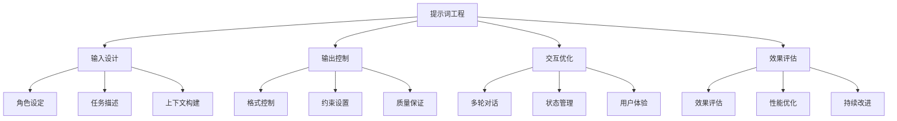

# 提示词工程概念理解

## 🎯 核心定义

### 什么是提示词工程？
提示词工程（Prompt Engineering）是通过精心设计和优化输入文本来引导AI模型产生期望输出的技术和方法论。

### 核心要素
- **输入设计**：如何构造有效的输入文本
- **输出控制**：如何引导模型产生期望输出
- **交互优化**：如何提升人机交互效果
- **效果评估**：如何评估和优化提示词效果

## 📊 概念框架

## 🔍 核心概念解析

### 1. 提示词（Prompt）
**定义**：向AI模型输入的文本指令，用于引导模型产生特定输出。

**特征**：
- 结构化：包含角色、任务、上下文等要素
- 目标性：明确期望的输出结果
- 可优化：可根据效果进行调整

### 2. 提示词工程（Prompt Engineering）
**定义**：系统化地设计、优化和管理提示词的技术和方法。

**核心活动**：
- 需求分析
- 提示词设计
- 效果测试
- 持续优化

### 3. 提示词优化（Prompt Optimization）
**定义**：通过迭代改进提升提示词效果的过程。

**优化维度**：
- 准确性提升
- 效率改善
- 成本降低
- 用户体验优化

## 💡 价值与意义

### 对用户的价值
| 价值维度 | 具体体现 | 实际收益 |
|----------|----------|----------|
| **效率提升** | 减少无效交互 | 节省时间成本 |
| **质量改善** | 提高输出质量 | 获得更好结果 |
| **成本降低** | 减少重复尝试 | 降低使用成本 |
| **体验优化** | 提升交互体验 | 增强用户满意度 |

### 对开发者的价值
| 价值维度 | 具体体现 | 实际收益 |
|----------|----------|----------|
| **开发效率** | 快速原型开发 | 缩短开发周期 |
| **系统稳定** | 减少异常输出 | 提高系统可靠性 |
| **维护成本** | 简化系统维护 | 降低运维成本 |
| **扩展性** | 支持功能扩展 | 增强系统灵活性 |

### 对企业的价值
| 价值维度 | 具体体现 | 实际收益 |
|----------|----------|----------|
| **业务效率** | 自动化业务流程 | 提升业务效率 |
| **创新能力** | 支持业务创新 | 增强竞争优势 |
| **成本控制** | 降低人力成本 | 提高盈利能力 |
| **客户体验** | 改善客户服务 | 提升客户满意度 |

## 🌐 应用场景

### 通用场景
| 场景类别 | 具体应用 | 核心价值 |
|----------|----------|----------|
| **内容创作** | 文章写作、创意设计 | 提升创作效率 |
| **信息处理** | 数据分析、文档总结 | 提高处理效率 |
| **问题解决** | 技术支持、咨询服务 | 改善服务质量 |
| **学习辅助** | 教育辅导、知识问答 | 增强学习效果 |

### 专业场景
| 场景类别 | 具体应用 | 核心价值 |
|----------|----------|----------|
| **软件开发** | 代码生成、调试辅助 | 提升开发效率 |
| **商业分析** | 市场分析、决策支持 | 改善决策质量 |
| **医疗健康** | 诊断辅助、健康咨询 | 提高医疗效率 |
| **金融服务** | 风险评估、投资建议 | 优化金融服务 |

## 🔧 技术特点

### 技术优势
- **灵活性**：适应多种应用场景
- **可扩展性**：支持功能扩展和定制
- **易用性**：降低技术使用门槛
- **成本效益**：高性价比的解决方案

### 技术挑战
- **一致性**：保证输出结果的一致性
- **可控性**：控制模型输出行为
- **可解释性**：理解模型决策过程
- **安全性**：防范潜在风险

## 📈 发展趋势

### 技术趋势
1. **智能化**：自动优化提示词设计
2. **个性化**：适应不同用户需求
3. **多模态**：支持多种输入输出类型
4. **标准化**：建立行业标准和规范

### 应用趋势
1. **垂直化**：深入特定行业应用
2. **平台化**：构建提示词服务平台
3. **生态化**：形成完整的技术生态
4. **商业化**：推动商业模式创新

## 🎓 学习要点

### 核心理解
- 提示词工程是AI应用的关键技术
- 需要系统化的设计方法和优化策略
- 注重用户体验和效果评估
- 持续学习和实践是提升的关键

### 实践建议
- 从简单场景开始练习
- 注重效果评估和优化
- 积累经验和最佳实践
- 关注技术发展趋势

## 🔗 相关链接
- [[01-2-基本原理]] - 了解技术原理
- [[01-3-发展历程]] - 掌握发展脉络
- [[02-1-1-清晰性原则]] - 学习设计原则
- [[基础模板集合]] - 实践模板资源
