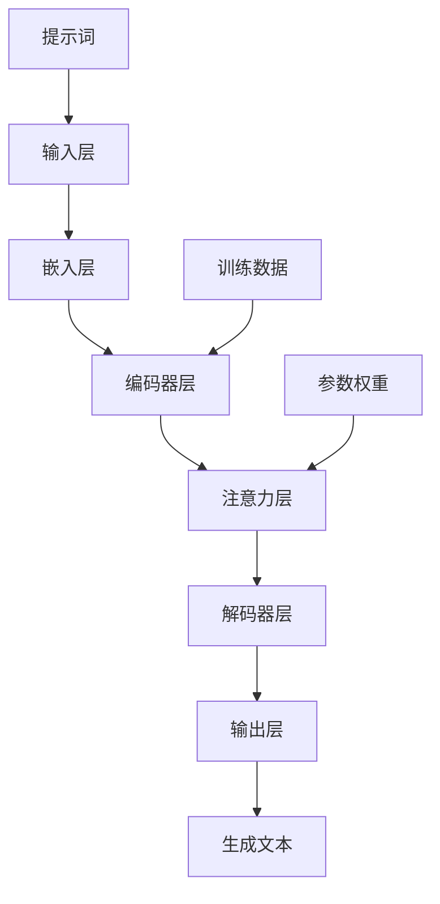
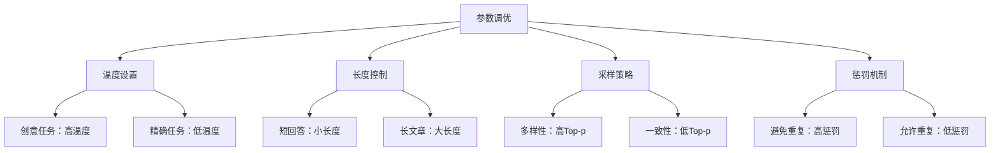
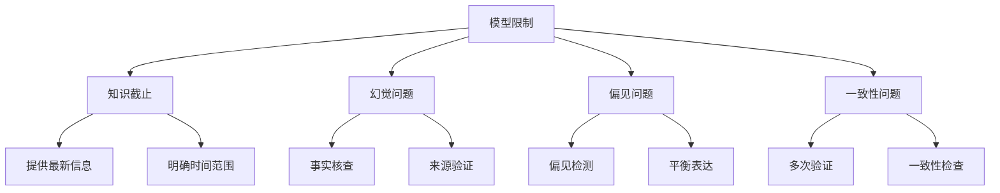

# 提示词工程基本原理

## 🧠 AI模型工作机制

### 语言模型基础
语言模型是基于大量文本数据训练的人工智能系统，能够理解和生成人类语言。

#### 核心机制


### 工作原理详解

#### 1. 文本理解过程
| 处理阶段 | 核心功能 | 技术实现 | 输出结果 |
|----------|----------|----------|----------|
| **分词** | 将文本分解为基本单元 | Tokenization | 词汇序列 |
| **编码** | 转换为数值表示 | Embedding | 向量矩阵 |
| **理解** | 提取语义信息 | Transformer | 上下文表示 |
| **推理** | 基于上下文推理 | Attention机制 | 逻辑关系 |

#### 2. 文本生成过程
| 生成阶段 | 核心功能 | 技术实现 | 输出结果 |
|----------|----------|----------|----------|
| **预测** | 预测下一个词汇 | 概率分布 | 候选词汇 |
| **选择** | 选择最优词汇 | 采样策略 | 选定词汇 |
| **组合** | 组合生成文本 | 序列生成 | 完整文本 |
| **优化** | 优化输出质量 | 后处理 | 最终结果 |

## 🔄 提示词作用机制

### 提示词如何影响模型行为

#### 1. 上下文引导
```
输入：你是一位资深的数据分析师
模型理解：需要以数据分析师的身份和专业知识来回答问题
输出：专业的数据分析建议
```

#### 2. 任务约束
```
输入：请分析以下数据，字数限制在200字以内
模型理解：需要分析数据，同时控制输出长度
输出：简洁的数据分析结果
```

#### 3. 格式控制
```
输入：请以表格形式输出结果
模型理解：需要按照表格格式组织信息
输出：结构化的表格内容
```

### 提示词设计原理

#### 核心原理
| 原理类别 | 核心内容 | 实现方法 | 效果体现 |
|----------|----------|----------|----------|
| **角色设定** | 定义AI身份 | 明确角色描述 | 专业输出 |
| **任务明确** | 指定具体任务 | 清晰任务描述 | 准确执行 |
| **上下文提供** | 补充背景信息 | 相关信息输入 | 相关输出 |
| **格式约束** | 控制输出格式 | 格式要求说明 | 结构化输出 |
| **质量保证** | 确保输出质量 | 质量标准设定 | 高质量结果 |

## 📊 技术架构分析

### 模型架构层次


### 关键组件功能

#### 1. 嵌入层（Embedding Layer）
- **功能**：将文本转换为数值向量
- **特点**：保持语义相似性
- **影响**：决定模型对输入的理解

#### 2. 注意力机制（Attention Mechanism）
- **功能**：关注输入中的关键信息
- **特点**：动态权重分配
- **影响**：影响模型对上下文的关注

#### 3. 解码器（Decoder）
- **功能**：生成输出文本
- **特点**：基于上下文预测
- **影响**：决定输出质量和风格

## ⚙️ 参数与配置

### 关键参数说明
| 参数类型 | 参数名称 | 作用机制 | 调优建议 |
|----------|----------|----------|----------|
| **温度** | Temperature | 控制随机性 | 0.1-0.9 |
| **最大长度** | Max Length | 限制输出长度 | 根据需求设定 |
| **Top-p** | Top-p | 控制词汇选择 | 0.8-0.95 |
| **重复惩罚** | Repetition Penalty | 避免重复 | 1.0-1.2 |

### 参数调优策略


## 🎯 提示词设计原则

### 基于原理的设计原则

#### 1. 清晰性原则
**原理基础**：模型需要明确指令才能准确执行
**设计方法**：
- 使用简洁明了的语言
- 避免歧义表达
- 结构化组织信息

#### 2. 具体性原则
**原理基础**：具体信息有助于模型理解
**设计方法**：
- 提供详细的任务描述
- 包含具体的示例
- 明确输出要求

#### 3. 上下文原则
**原理基础**：上下文信息影响模型理解
**设计方法**：
- 提供充分的背景信息
- 保持上下文一致性
- 考虑历史对话

## 🔍 模型限制与应对

### 常见限制
| 限制类型 | 具体表现 | 影响程度 | 应对策略 |
|----------|----------|----------|----------|
| **知识截止** | 训练数据时间限制 | 中等 | 提供最新信息 |
| **幻觉问题** | 生成虚假信息 | 高 | 事实核查 |
| **偏见问题** | 输出存在偏见 | 高 | 偏见检测 |
| **一致性** | 输出结果不一致 | 中等 | 多次验证 |

### 应对策略


## 🎓 学习要点

### 核心理解
- AI模型基于概率预测生成文本
- 提示词通过影响模型理解来引导输出
- 参数调优可以控制输出特性
- 了解模型限制有助于设计更好的提示词

### 实践建议
- 理解模型工作原理有助于提示词设计
- 掌握参数调优技巧提升输出质量
- 注意模型限制并制定应对策略
- 持续学习新技术和最佳实践

## 🔗 相关链接
- [[01-1-概念理解]] - 回顾基本概念
- [[01-3-发展历程]] - 了解技术发展
- [[02-1-1-清晰性原则]] - 学习设计原则
- [[04-2-1-效果评估指标]] - 了解评估方法
